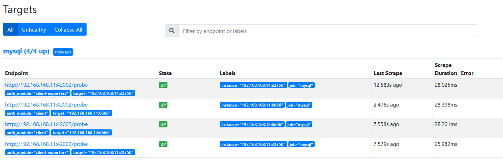

# 技术分享 | mysqld_exporter 收集多个 MySQL 监控避坑

**原文链接**: https://opensource.actionsky.com/20221206-mysql/
**分类**: MySQL 新特性
**发布时间**: 2022-12-05T23:38:15-08:00

---

作者：莫善
某互联网公司高级 DBA。
本文来源：原创投稿
*爱可生开源社区出品，原创内容未经授权不得随意使用，转载请联系小编并注明来源。
#### 一、背景介绍
最近在计划改造mysql监控系统，原因是线上除了MySQL集群外都已经接入到prometheus平台。所以也想将MySQL从zabbix迁移到 prometheus，熟悉pmm的朋友应该都知道，exporter跟MySQL是【1:1】，即每个MySQL实例都需要起一个exporter进程来采集MySQL监控数据，不过最近看github文档关注到mysqld_exporter 已经开始支持【1:n】，即单个mysqld_exporter可以收集多个MySQL实例，不过具体使用过程中会发现一些问题，本文就来分享一下都有哪些问题，以及如何解决，仅供参考。
#### 二、环境准备
###### 1、MySQL集群
| 角色 | ip | 端口 | 版本 |
| --- | --- | --- | --- |
| master | 192.168.168.11 | 6666 | 5.7.26 |
| slave | 192.168.168.12 | 6666 | 5.7.26 |
| master | 192.168.168.14 | 23750 | 5.7.26 |
| slave | 192.168.168.11 | 23750 | 5.7.26 |
> 安装略
部署完以后分别创建两个监控账户。
（1）6666集群
创建exporter，exporter1两个账户。
> 23750集群没有exporter1用户。
CREATE USER 'exporter'@'192.168.%' identified by 'exporter';GRANT PROCESS, REPLICATION CLIENT, SELECT ON *.* TO 'exporter'@'192.168.%';GRANT SELECT ON mysql.* TO 'exporter'@'192.168.%';CREATE USER 'exporter1'@'192.168.%' identified by 'exporter1';GRANT PROCESS, REPLICATION CLIENT, SELECT ON *.* TO 'exporter1'@'192.168.%';GRANT SELECT ON mysql.* TO 'exporter1'@'192.168.%';set global max_connections = 3000;
（2）23750集群
创建exporter，exporter2两个账户。
> 6666集群没有exporter2用户。
CREATE USER 'exporter'@'192.168.%' identified by 'exporter';
GRANT PROCESS, REPLICATION CLIENT, SELECT ON *.* TO 'exporter'@'192.168.%';
GRANT SELECT ON mysql.* TO 'exporter'@'192.168.%';
CREATE USER 'exporter2'@'192.168.%' identified by 'exporter2';
GRANT PROCESS, REPLICATION CLIENT, SELECT ON *.* TO 'exporter2'@'192.168.%';
GRANT SELECT ON mysql.* TO 'exporter2'@'192.168.%';
set global max_connections = 1000;
为了测试方便，密码比较简单
- 另外需要将192.168.168.11:6666的max_connections的值设置为3000，192.168.168.14:23750的max_connections的值设置为1000，目的是加以区分，后面测试需要验证这两个值。
###### 2、mysqld_exporter
| 角色 | ip | 端口 | 版本 |
| --- | --- | --- | --- |
| mysqld_exporter | 192.168.168.11 | 42001 | 0.14.0 |
> 安装略，最新的released版下载地址 https://github.com/prometheus/mysqld_exporter/releases/download/v0.14.0/mysqld_exporter-0.14.0.linux-amd64.tar.gz
###### 3、prometheus
| 角色 | ip | 端口 | 版本 |
| --- | --- | --- | --- |
| prometheus | 192.168.168.11 | 9999 | 2.40.2 |
> 安装略，最新的released版下载地址 https://github.com/prometheus/prometheus/releases/download/v2.40.2/prometheus-2.40.2.linux-amd64.tar.gz
#### 三、测试
###### 1、采集多个MySQL实例
（1）exporter配置
exporter的配置非常简单，只需要将预先创建的exporter用户的账号密码配置进去即可。
# cat my.cnf
[client]
user = exporter
password = exporter
（2）启动exporter
# cd /root/mysqld_exporter-0.14.0.linux-amd64
# ./mysqld_exporter --config.my-cnf=my.cnf --web.listen-address=:42001 >> exporter.log 2>&1 &
（3）验证exporter
可以看到，访问异常，这个语法根本没法去访问MySQL的监控指标，根据报错提示应该是用法不对。
# curl 'http://localhost:42001/probe?target=192.168.168.11:6666'
<html>
<head><title>MySQLd exporter</title></head>
<body>
<h1>MySQLd exporter</h1>

<a href='/metrics'>Metrics</a>

</body>
</html>
# 
> 用法是来源于github的文档 https://github.com/prometheus/mysqld_exporter
- Multi-target support
This exporter supports the multi-target pattern. This allows running a single instance of this exporter for multiple MySQL targets.
To use the multi-target functionality, send an http request to the endpoint /probe?target=foo:5432 where target is set to the DSN of the MySQL instance to scrape metrics from.
To avoid putting sensitive information like username and password in the URL, you can have multiple configurations in config.my-cnf file and match it by adding &auth_module=<section> to the request.
Sample config file for multiple configurations
[client]
user = foo
password = foo123
[client.servers]
user = bar
password = bar123
根据提示换成metrics去访问会发现如下报错，原因也很简单，exporter配置文件没有配置主机名和端口，所以默认去访问127.0.0.1:3306，就是说target参数不生效，这就很郁闷了，明明是根据github的文档进行操作，实际却测试不通。
curl 'http://localhost:42001/metrics?target=192.168.168.11:6666'
ts=2022-11-18T09:35:47.063Z caller=exporter.go:149 level=error msg="Error pinging mysqld" err="dial tcp 127.0.0.1:3306: connect: connection refused"
#### 四、解决问题
通过查exporter的提交记录可以发现，支持多实例采集功能是在2022-07月份左右开始陆续提交更新的代码，而当前最新的releases版本是在2022-01-05号，所以又有了下面的测试流程。
> https://github.com/prometheus/mysqld_exporter/commit/593b0095a5bd0bd852029dd2dfa5f204a15de946
###### 1、解决exporter报错问题
（1）安装
下载最新代码编译安装略，下载地址如下。
https://github.com/prometheus/mysqld_exporter/archive/refs/heads/main.zip
本次测试先是按照github文档使用make进行编译，但是过程比较痛苦，没搞成功，后来直接换成go build，不过也遇到了如下的问题，仅供参考。
- 编译环境不能访问github，会导致依赖包下载失败，建议使用goproxy，即go build 前先配置GOPROXY变量的配置【export GOPROXY=&#8221;https://goproxy.cn&#8221;】
- go版本问题，要求1.17及以上。如果版本太低编译过程中或提示如下信息
/root/golib/pkg/mod/github.com/prometheus/procfs@v0.8.0/internal/util/readfile.go:36:9: undefined: io.ReadAll
note: module requires Go 1.17
# golang.org/x/net/http2
/root/golib/pkg/mod/golang.org/x/net@v0.0.0-20220909164309-bea034e7d591/http2/transport.go:426:45: undefined: os.ErrDeadlineExceeded
note: module requires Go 1.17
> go 1.19下载地址 https://dl.google.com/go/go1.19.3.linux-amd64.tar.gz
###### 2、重新测试
（1）exporter配置
# cat my.cnf
[client]
user = exporter
password = exporter
（2）启动新的exporter
cd mysqld_exporter-main
./mysqld_exporter --config.my-cnf=my.cnf --web.listen-address=:42002 >> exporter.log 2>&1 &
> 新起一个监听端口
（3）验证
# curl 'http://localhost:42002/probe?target=192.168.168.11:6666' 2>/dev/null|grep mysql_global_variables_max_connections
# HELP mysql_global_variables_max_connections Generic gauge metric from SHOW GLOBAL VARIABLES.
# TYPE mysql_global_variables_max_connections gauge
mysql_global_variables_max_connections 3000
# curl 'http://localhost:42002/probe?target=192.168.168.14:23750' 2>/dev/null|grep mysql_global_variables_max_connections
# HELP mysql_global_variables_max_connections Generic gauge metric from SHOW GLOBAL VARIABLES.
# TYPE mysql_global_variables_max_connections gauge
mysql_global_variables_max_connections 1000
# 
可以看到测试192.168.168.11:6666及192.168.168.14:23750，都能正常访问到数据，通过mysql_global_variables_max_connections参数的值能说明target的参数是生效的。
###### 3、解决另一个问题
测试过程中遇到另一个问题，出于安全考虑，我们线上的环境都是单集群一个账号密码，所以监控账户也要求一个集群一个账号。通过查阅文档发现，可以使用auth_module参数实现传递密码的场景。
（1）重新配置exporter
# cat my.cnf 
[client]
user = exporter
password = exporter
[client-exporter1]
user = exporter1
password = exporter1
[client-exporter2]
user = exporter2
password = exporter2
# 
> 必须要有client段，给否则会报错
ts=2022-11-18T10:55:54.807Z caller=mysqld_exporter.go:284 level=info msg="Error parsing my.cnf" file=my.cnf err="no user specified under [client] in my.cnf"
（2）启动exporter
cd mysqld_exporter-main
./mysqld_exporter --config.my-cnf=my.cnf --web.listen-address=:42002 >> exporter.log 2>&1 &
（3）验证
# curl 'http://localhost:42002/probe?target=192.168.168.11:6666&auth_module=client' 2>/dev/null |grep mysql_up
# HELP mysql_up Whether the MySQL server is up.
# TYPE mysql_up gauge
mysql_up 1
# curl 'http://localhost:42002/probe?target=192.168.168.11:6666&auth_module=client-exporter1' 2>/dev/null |grep mysql_up
# HELP mysql_up Whether the MySQL server is up.
# TYPE mysql_up gauge
mysql_up 1
# 
# curl 'http://localhost:42002/probe?target=192.168.168.11:6666&auth_module=client-exporter2' 2>/dev/null |grep mysql_up
# HELP mysql_up Whether the MySQL server is up.
# TYPE mysql_up gauge
mysql_up 0
# curl 'http://localhost:42002/probe?target=192.168.168.11:23750&auth_module=client' 2>/dev/null |grep mysql_up
# HELP mysql_up Whether the MySQL server is up.
# TYPE mysql_up gauge
mysql_up 1
# curl 'http://localhost:42002/probe?target=192.168.168.11:23750&auth_module=client-exporter1' 2>/dev/null |grep mysql_up
# HELP mysql_up Whether the MySQL server is up.
# TYPE mysql_up gauge
mysql_up 0
# curl 'http://localhost:42002/probe?target=192.168.168.11:23750&auth_module=client-exporter2' 2>/dev/null |grep mysql_up
# HELP mysql_up Whether the MySQL server is up.
# TYPE mysql_up gauge
mysql_up 1
# 
可以看到192.168.168.11:6666使用【auth_module=client】和【auth_module=client-exporter1】都能正常采集到数据，但是使用【auth_module=client-exporter2】的时候就不能采集到数据。
同理192.168.168.11:23750使用【auth_module=client】和【auth_module=client-exporter2】都能正常采集到数据，但是使用【auth_module=client-exporter1】的时候就不能采集到数据。
原因是6666和23750两个集群都有exporter用户，而6666集群只有exporter1用户而没有exporter2用户，反之23750集群只有exporter2用户而没有exporter1用户。
- auth_module=client对应 exporter用户
- auth_module=client-exporter1对应 exporter1用户
- auth_module=client-exporter2对应 exporter2用户
虽然exporter支持通过auth_module参数指定密码变量，Prometheus配置也支持这个选项，但是会发现这个变量有些问题。如下是github的配置示例。
- job_name: mysql # To get metrics about the mysql exporter’s targets      params:        # Not required. Will match value to child in config file. Default value is `client`.        auth_module: client.servers      static_configs:        - targets:          # All mysql hostnames to monitor.          - server1:3306          - server2:3306      relabel_configs:        - source_labels: [__address__]          target_label: __param_target        - source_labels: [__param_target]          target_label: instance        - target_label: __address__          # The mysqld_exporter host:port          replacement: localhost:9104
按照环境实际情况采用上面的配置示例启动prometheus会报错，根据报错提示将【params】【auth_module: client.servers】两行配置注释掉就好了，报错如下：
ts=2022-11-21T07:10:04.113Z caller=main.go:468 level=error msg="Error loading config (--config.file=prometheus.yml)" file=/root/prometheus-2.40.2.linux-amd64/prometheus.yml err="parsing YAML file prometheus.yml: yaml: unmarshal errors:\n  line 25: cannot unmarshal !!str `client-...` into []string"
后来通过查阅prometheus文档才发现是使用语法有问题，params的配置要求是一个列表：
# Optional HTTP URL parameters.params:  [ <string>: [<string>, ...] ]
> prometheus配置详情参考 https://prometheus.io/docs/prometheus/latest/configuration/configuration/
下面是一份参考配置文件，仅供参考：
- job_name: 'mysql-6666'    params:        # Not required. Will match value to child in config file. Default value is `client`.      auth_module: [client]    static_configs:      - targets:         - 192.168.168.11:6666         - 192.168.168.12:6666    metrics_path: /probe    relabel_configs:        - source_labels: [__address__]          target_label: __param_target        - source_labels: [__param_target]          target_label: instance        - target_label: __address__          replacement: 192.168.168.11:42002  - job_name: 'mysql-23750'    params:        # Not required. Will match value to child in config file. Default value is `client`.      auth_module: [client-exporter1]    static_configs:      - targets:         - 192.168.168.11:23750         - 192.168.168.14:23750    metrics_path: /probe    relabel_configs:        - source_labels: [__address__]          target_label: __param_target        - source_labels: [__param_target]          target_label: instance        - target_label: __address__          replacement: 192.168.168.11:42002
Prometheus虽然支持【auth_module】，但是会发现这个变量是配置在job段下的，那么问题来了，如果账号密码不一样就需要单独一个job，即一个集群一个job段，这样配置文件很冗余，所以我们是希望配置在targets下面的。
那么是不是不支持将auth_module放在targets下面呢，答案当然是支持的，具体如下配置，可以通过labels去配置，其他配置请参考官方文档。
- job_name: 'mysql'    static_configs:      - targets:         - 192.168.168.11:6666         - 192.168.168.12:6666        labels:           auth_module: client      - targets:         - 192.168.168.11:23750         - 192.168.168.14:23750        labels:           auth_module: client-exporter2    metrics_path: /probe    relabel_configs:      - source_labels: [__address__]        target_label: __param_target      - source_labels: [__param_target]        target_label: instance      - target_label: __address__        replacement: 192.168.168.11:42002      - source_labels: [auth_module]        target_label: __param_auth_module      - action: labeldrop        regex: auth_module
> 这样看起来就比较简洁一些。
（4）prometheus 结果展示
下图就是prometheus的展示图，可以看到能正常采集到两个测试集群的监控数据，至此测试结束。

#### 五、总结
1、mysqld_exporter配置文件必须要有[client]段，否则启动报错。
2、mysqld_exporter支持多实例采集，但是最新releases版本不支持，需要格外注意，想要该功能需要自行编译一个。
3、如果需要传递密码变量，对于github文档的推荐配置的使用语法存在问题，需要关注一下，建议是参考prometheus的官方文档进行编辑配置文件。
4、如果采用单个exporter收集多个MySQL实例的模式，强烈建议给exporter添加监控，且部署多个exporter组成集群，并在prometheus侧使用vip或者域名进行访问。
#### 六、写在最后
本文所有内容仅供参考，因各自环境不同，并非通用方案，且在使用文中操作时可能碰上未知的问题。如有线上环境操作需求，请在测试环境充分测试。