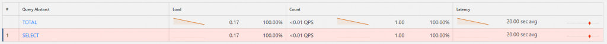
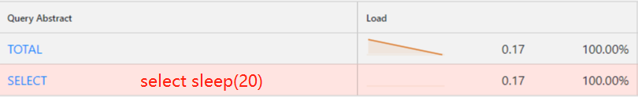
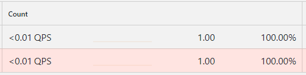
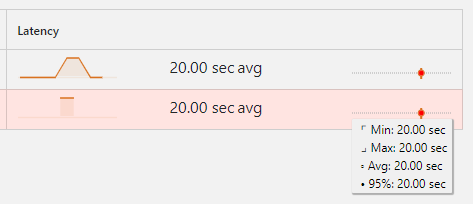
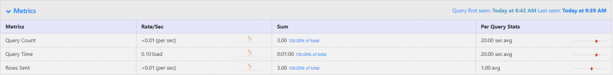

# 技术分享 | percona QAN 介绍

**原文链接**: https://opensource.actionsky.com/20200506-percona/
**分类**: 技术干货
**发布时间**: 2020-05-05T18:51:12-08:00

---

## 作者：孙健
爱可生研发工程师，负责高可用组件相关开发。
本文来源：原创投稿
*爱可生开源社区出品，原创内容未经授权不得随意使用，转载请联系小编并注明来源。
## 一、背景
QAN（Query Analytics）慢查询日志分析工具是 PMM 的一部分，PMM 是 percona 公司提供的一个对于 MySQL 和 MongoDB 的监控和管理平台。官方给出的描述是：The QAN is a special dashboard which enables database administrators and application developers to analyze database queries over periods of time and find performance problems. QAN helps you optimize database performance by making sure that queries are executed as expected and within the shortest time possible. In case of problems, you can see which queries may be the cause and get detailed metrics for them。这是一个慢查询日志的展示工具，能够帮助 DBA 或者开发人员分析数据库的性能问题，给出全面的数据摆脱直接查看 slow-log。那么接下来，给大家介绍下 QAN 和其页面的指标吧。
## 二、QAN（Query Analytics）
PMM 目前有 2 个版本，但是对于 QAN 来说其大致由三部分组成：- QAN-Agent（client）：负责采集 slow-log 的数据并上报到服务端
- QAN-API（server）：负责存储采集的数据，并对外提供查询接口
- QAN-APP：专门用来展示慢查询数据的 grafana 第三方插件
### 1. 数据流转
`slow-log` &#8211;> `QAN-Agent` &#8211;> `QAN-API` <&#8211;> `QAN-APP（grafana）`
### 2. pmm1 架构图
											
### 3. pmm2 架构图
											
## 三、slow-log
MySQL 的慢查询日志是 MySQL 提供的一种日志记录，它用来记录在 MySQL 中响应时间超过阀值的语句，具体指运行时间超过 `long_query_time`（默认 10 秒）的 SQL，则会被记录到慢查询日志中，慢查询日志文件格式如下：
- `...`
- 
- `# Time: 2020-04-25T05:29:35.954373Z`
- `# User@Host: root[root] @ localhost []  Id:     9`
- `# Query_time: 5.000901  Lock_time: 0.000000 Rows_sent: 1  Rows_examined: 0`
- `SET timestamp=1587792575;`
- `select sleep(5);`
- `# Time: 2020-04-25T05:43:07.595615Z`
- `# User@Host: root[root] @ localhost []  Id:     9`
- `# Query_time: 5.000904  Lock_time: 0.000000 Rows_sent: 1  Rows_examined: 0`
- `SET timestamp=1587793387;`
- `select sleep(5);`
- 
- `...`
- Query_time：语句执行时间，以秒为单位
- Lock_time：获取锁的时间，以秒为单位
- Rows_sent：发送给客户端的行数
- Rows_examined：检查的行数（不计算存储引擎内部的处理）
- SET timestamp：写入慢查询日志文件的每个语句之前都有一个 SET 语句，该 SET 语句包括一个时间戳，指示时间戳何时记录慢语句（在该语句完成执行之后发生）
## 四、页面
### 1. Query Analysis
默认展示 top 10 的慢 SQL，表格包含三列指标信息 Load、Count、Latency。
											
下图是测试一条慢 SQL `select sleep(5)` 生成的数据，选定 2 分钟的页面：
											
#### 1.1 Load
											
代表选定时间段内，数据库服务器该 query 查询时间 的时间占比，通过公式计算：query_time/(end_time &#8211; start_time)：20/120 ~= 0.17。
#### 1.2 Count
											
代表选定时间段内，该 query 的请求总数。
#### 1.3 Latency
											
代表选定时间段内，展示该 query 的执行平均时间、最大时间、最小时间、时间 95%（抛弃前 5% 的数据在求平均，目的是为了去除尖峰）；
### 2. Metrics
选中 Query Analysis 中的一列 query 后，即可展示该 query 的详细信息，包括Query_time、Lock_time、Rows_sent、Rows_examined，对应的是 slow-log 的内容 。
											
### 3. 额外信息
选中 Query Analysis 中的一列 query 后，也会额外提供 query 涉及的一些信息，包括：EXPLAIN，SHOW CREATE TABLE，SHOW INDEX 来帮助数据库运维人员快速定位问题。
## 总结
percona QAN 作为一款非常实用的免费开源方案，如此优秀的产品目前也是爱可生数据库管理平台问题诊断全家桶的一部分。## 
> ## 参考链接
- https://www.percona.com/blog/2018/06/08/understanding-pmm-qan-graphs-metrics/
- https://www.percona.com/doc/percona-monitoring-and-management/2.x/qan-top-ten.html