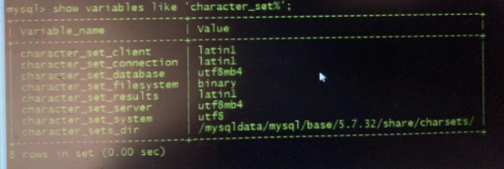
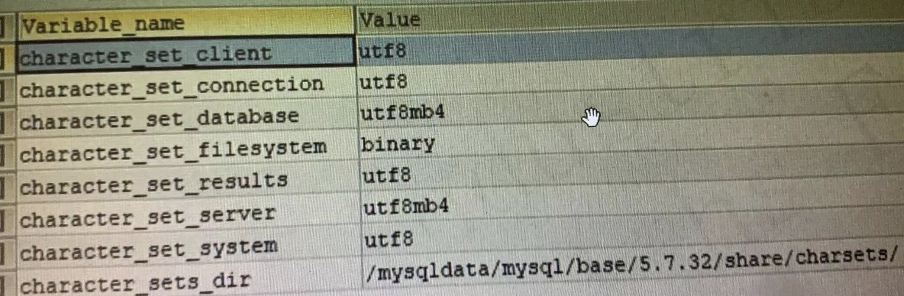
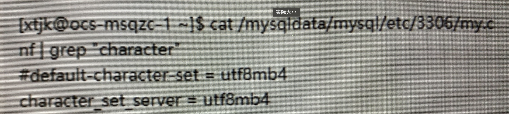
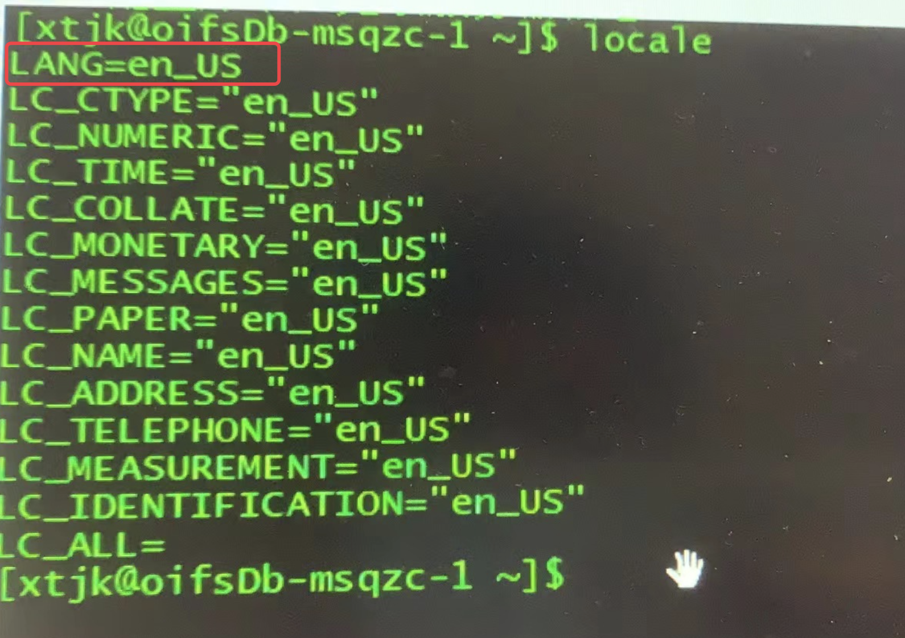
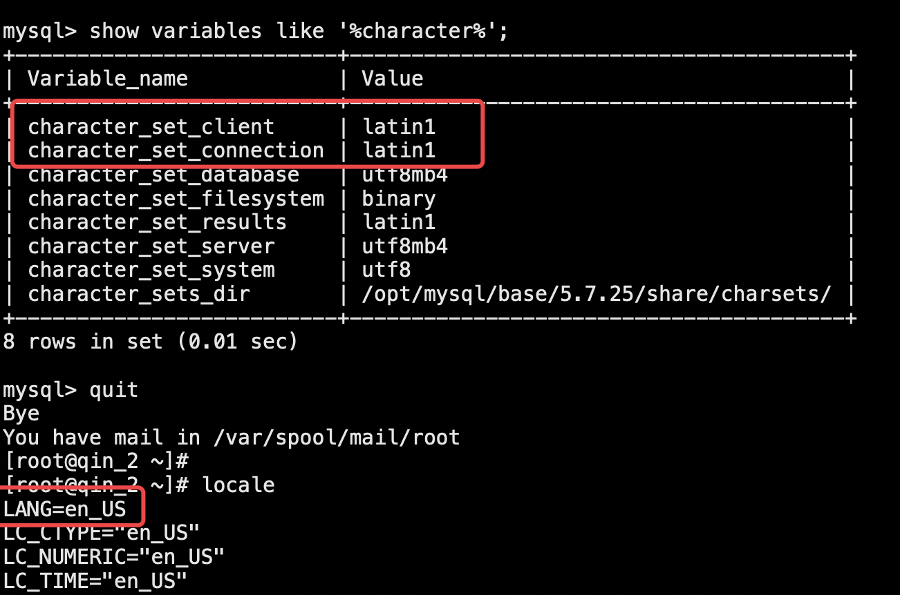
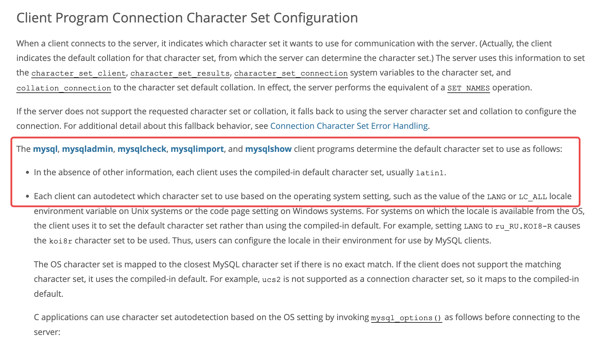
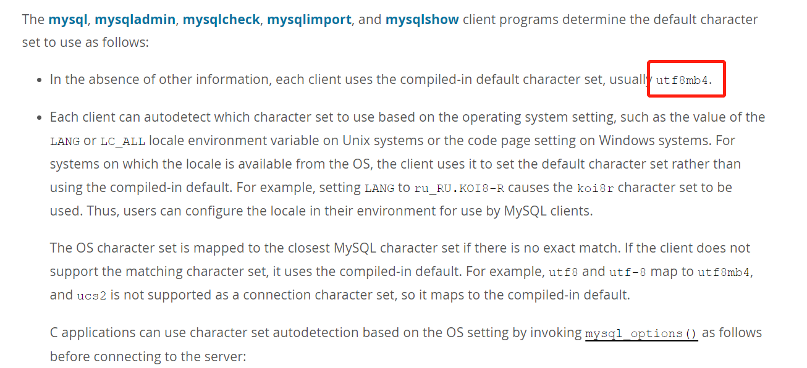
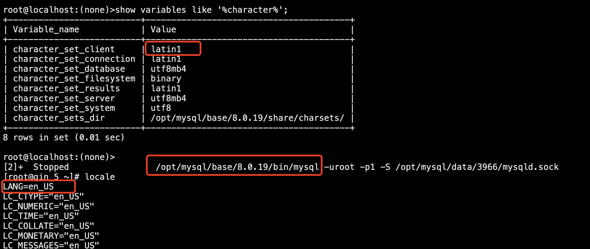

# 技术分享 | 为什么我的 MySQL 客户端字符集为 latin1

**原文链接**: https://opensource.actionsky.com/20220517-mysql/
**分类**: MySQL 新特性
**发布时间**: 2022-05-17T00:46:07-08:00

---

作者：秦广飞
爱可生 DBA 团队成员，负责项目日常问题处理及公司平台问题排查，对数据库有兴趣，对技术有想法。一入 IT 深似海，从此节操是路人。
本文来源：原创投稿
*爱可生开源社区出品，原创内容未经授权不得随意使用，转载请联系小编并注明来源。
## 问题背景
我司某客户最近在检查一批新安装的 MySQL 数据库时，发现了下面的现象：
- 
该批次的 MySQL 客户端字符集全部为 Latin1 ；
- 
而之前使用同样参数模板部署的 MySQL ，客户端字符集却为 utf8 ;
已知 MySQL 版本为 5.7.32 ，服务器操作系统为 Redhat 7 ，那么为什么两次安装的 MySQL 字符集会不一样呢？

## 字符集介绍
首先我们简单回顾下 MySQL 字符集的相关知识，MySQL 字符集大体可以分为下面两个方面：
- 
Server 级别字符集
Server 级别的字符集，即数据存储到数据库时使用的字符集，又可以细化分为库级别、表级别和字段级别；
- 
一般来说，如果建库建表时没有特别指定，那么就会使用 Server 级别的字符集；
- 
Server 级别的字符集可以使用 character_set_server 参数指定；
- 
Client 级别字符集
Client 级别的字符集，即客户端连接进数据库时使用的字符集，分别由下面几个参数控制：
character_set_client：Server认为Client发送过来的请求是用该参数进行编码的，因此在收到请求后会使用该参数进行解码；
- 
character_set_connection：Server内部处理请求字符串时，会从character_set_client转为character_set_connection，因此两个参数要一致；
- 
character_set_results：Server返回查询结果给Client时，会根据character_set_results进行编码，然后再返回，因此也需要和character_set_client保持一致；
- 
也就是说，控制 Client 级别字符集的三个参数需要一致，可以使用下面的方法：
`-- 数据库中直接修改
mysql> set names utf8;
-- 配置文件中修改，客户端重新连接
shell> vi /etc/my.cnf
[mysql]
default-character-set = utf8
shell>
-- mysql客户端使用的my.cnf文件，可以根据mysql --help | grep "my.cnf" 确认
shell> mysql --help | grep "my.cnf"
order of preference, my.cnf, $MYSQL_TCP_PORT,
/etc/my.cnf /etc/mysql/my.cnf /usr/local/mysql/etc/my.cnf ~/.my.cnf
shell>
`
## 排查过程
回到这个问题，我们首先检查了之前安装的 MySQL 的字符集，确实为 utf8

之后，查看服务器上所有的 my.cnf 文件，发现无论是之前安装的还是最近一批安装的，都仅有 MySQL 运行时指定的 my.cnf 文件中有字符集相关参数：character_set_server=utf8mb4

最后，又查看了服务器上操作系统的字符集，发现有问题的为 en_US ，而原先的为 en_US.UTF-8

好像找到了问题出在哪里，测试环境验证下，果然当服务器字符集设置为 en_US 后，MySQL 客户端字符集变为了 Latin1

那么，为什么会这样呢，我们看下官方文档上是怎么说的：https://dev.mysql.com/doc/refman/5.7/en/charset-connection.html#charset-connection-client-configuration

翻译下来，大致有两点含义：
- 
mysql, mysqladmin, mysqlcheck, mysqlimport, and mysqlshow 这些客户端工具都有一个默认的字符集，MySQL 5.7 是 latin1 ，MySQL 8.0为 utf8mb4 ；
- 
每个客户端工具都会检测操作系统的字符集，比如Linux系统LANG环境变量的值，如果MySQL支持操作系统的字符集，就会使用操作系统的（这里支持包括不完全精确匹配时，OS字符集将映射到最接近的MySQL字符集）；如果不支持，就使用客户端默认字符集；
我们知道en_US最接近的字符集就是Latin1，所以回到我们的问题，当服务器的字符集为en_US后，我们看到MySQL客户端字符集为Latin1 ，是不是可以理解了
而使用MySQL 8.0的客户端，能进一步验证当不能精确匹配时，就使用MySQL最接近的字符集：

调整服务器（Redhat 7 或 CentOS 7）的字符集可以参考下面的方式：
`-- 立即生效，但重启后会丢失
shell> export LANG="en_US.UTF-8"
-- 永久生效
shell> vim /etc/locale.conf
LANG="en_US.UTF-8"
shell> source /etc/locale.conf
`
## 总结
- 
本次字符集与之前不一致的原因是，该批次虚拟机镜像的字符集有点问题，一般来说，Redhat 7 和 CentOS 7 都会是 en_US.UTF-8 ；
- 
MySQL Server 级别的字符集，可以用 character_set_server 参数指定；
- 
控制 MySQL Client 级别字符集的三个参数需要保持一致，一般来说为utf8（MySQL 8.0 为 utf8mb4），同时又与 MySQL Client 所在服务器的字符集有关；