# 技术分享 | 基于 MySQL 多通道主主复制的机房容灾方案

**原文链接**: https://opensource.actionsky.com/%e6%8a%80%e6%9c%af%e5%88%86%e4%ba%ab-%e5%9f%ba%e4%ba%8e-mysql-%e5%a4%9a%e9%80%9a%e9%81%93%e4%b8%bb%e4%b8%bb%e5%a4%8d%e5%88%b6%e7%9a%84%e6%9c%ba%e6%88%bf%e5%ae%b9%e7%81%be%e6%96%b9%e6%a1%88/
**分类**: MySQL 新特性
**发布时间**: 2023-10-30T19:29:25-08:00

---

文章中介绍了多种 MySQL 高可用技术，并介绍了根据自身需求选择多通道主主复制技术的过程和注意事项。
> 作者：徐良，现任中国移动智慧家庭运营中心数据库高级经理，多年数据库运维优化经验，历任华为、一线互联网公司高级 DBA。目前主要负责中移智家基于规模的价值运营场景下数据库稳定性、容灾优化、异地多活等相关工作。
爱可生开源社区出品，原创内容未经授权不得随意使用，转载请联系小编并注明来源。
本文约 2800 字，预计阅读需要 7 分钟。
# 背景介绍
在云网融合大数据时代，数据已经成为重要的生产要素。特别是棱镜门、永恒之蓝、汶川大地震这类造成大规模数据丢失和泄漏的人为或自然灾害事件发生后，中国相继出台了一系列的法律法规，对各组织机构的数据安全保护条件进行限定，如 2016 年颁布的《中华人民共和国网络安全法》、 2021 年全国人民代表大会通过的《数据安全法》等。
**当发生灾难时，容灾备份能够确保数据不丢失。**要实现应用的容灾，一个关键就是通过数据库的实时同步和复制，在 A 地出现机房故障和问题的时候可以平滑快速的迁移到 B 地。虽然这种远程数据复制和同步存在一定的延迟，但是基本可以满足业务连续性的需求。
# 容灾的基础概述
## 容灾的定义
容灾是指当数据中心发生各种未知灾难的时候，确保数据不丢失或少丢失，同时 IT 业务系统能够不间断运行或快速切换恢复。
## 灾难的衡量指标
**评估一个灾备系统可靠性的两个重要指标是 RTO 与 RPO。**
**RTO (Recovery Time Objective)** 恢复时间目标。RTO 是指灾难发生后，从系统宕机导致业务停顿之刻开始，到系统恢复至可以支持业务部门运作，业务恢复运营之时，此两点之间的时间。RTO 可简单地描述为企业能容忍的恢复时间。
**RPO (Recovery Point Objective)** 恢复点目标。RPO 是指灾难发生后，容灾系统能把数据恢复到灾难发生前时间点的数据，它是衡量企业在灾难发生后会丢失多少生产数据的指标。RPO可简单地描述为企业能容忍的最大数据丢失量。
RTO 针对的是服务时间的丢失，RPO 针对的是数据的丢失，两者是衡量容灾系统的两个主要指标，但它们没有必然的关联性。
## 容灾的等级分类
2007 年 11 月 1 日开始正式实施的国家标准 (GB/T 20988-2007) 是我国灾难备份与恢复行业的第一个国家标准。
| 等级 | 说明 |
| --- | --- |
| 第 1 级 | 基本级。备份介质场外存，安全保障、 定期验证。 |
| 第 2 级 | 备份场地支持。网络和业务处理系统可在预定时间内调配到备份中心。 |
| 第 3 级 | 电子传输和部分设备支持。灾备中心配备部分业务处理和网络设备，具备部分通讯链路。 |
| 第 4 级 | 电子传输和完整设备支持。数据定时批量传送，网络/系统始终就绪。温备中心模式。 |
| 第 5 级 | 实时数据传输及完整设备支持。采用远程复制技术，实现数据实时复制，网络具备自动或集中切换能力，业务处理系统就绪或运行中。 |
| 第 6 级 | 数据零丢失和远程集群支持。数据实时备份，零丢失，系统 /应用远程集群，可自动切换，用户同时接入主备中心。 |
## 灾难与 RTO、RPO 的关系
| 灾难恢复能力等级 | RTO | RPO |
| --- | --- | --- |
| 1 | 2 天以上 | 1 天至 7 天 |
| 2 | 24 小时以后 | 1 天至 7 天 |
| 3 | 12 小时以上 | 数小时至 1 小时 |
| 4 | 数小时至 2 天 | 数小时至 1 小时 |
| 5 | 数分钟至 2 天 | 0 至 30 分钟 |
| 6 | 数分钟 | 0 |
## 两地三中心容灾
两地三中心能够组合本地高可用，同城灾备中心，异地灾备中心，提高可用性，提升业务连续性，重点业务多采用“两地三中心”（即生产数据中心、同城灾备中心、异地灾备中心）建设方案。这种模式下，多个数据中心是主备关系，针对灾难的响应与切换周期根据异常情况灵活处理，能够实现更优的 RTO 与 RPO 整体目标。
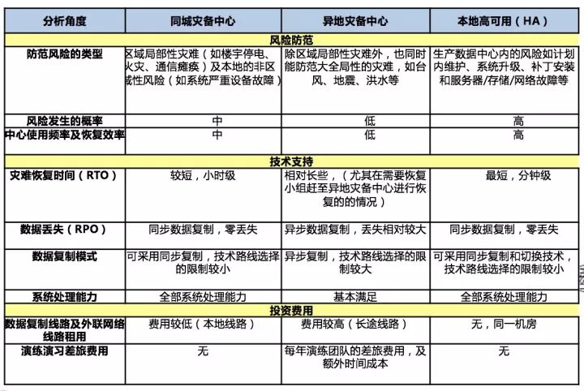 
# MySQL 常见的主从形式
MySQL 本身就自带有主从复制的功能，解决了几个关键的问题：数据一致性、检查点机制、可靠网络传输等，可以帮助我们实现高可用切换和读写分离。
## 一主一从
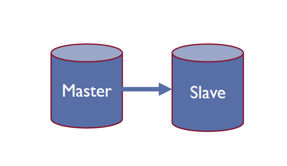
一主一从能够提供备库，主库故障后可以进行故障切换，避免数据丢失。
## 一主多从
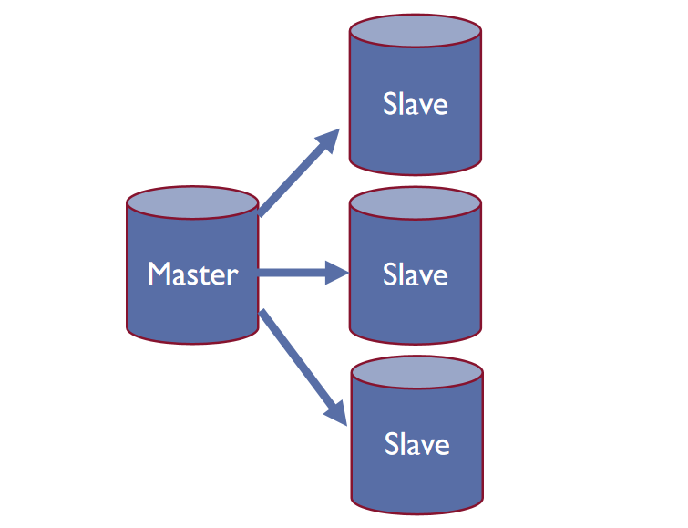         
一主多从常见的主从架构，使用起来简单有效，不仅可以实现 HA，而且还能读写分离，进而提升集群的并发能力。
## 多主一从
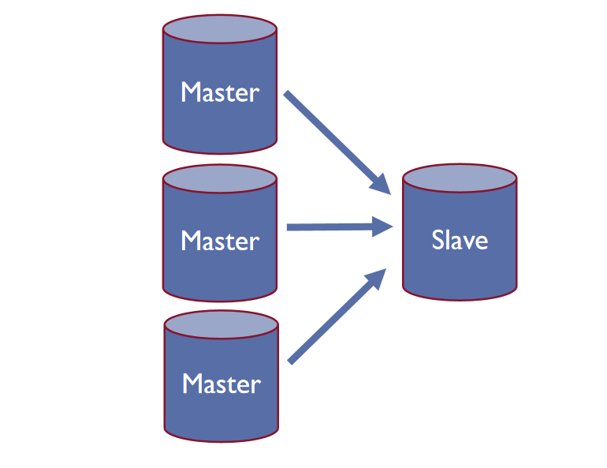       
多主一从可以将多个 MySQL 数据库备份到一台存储性能比较好的服务器上，方便统一分析处理。
## 双主复制
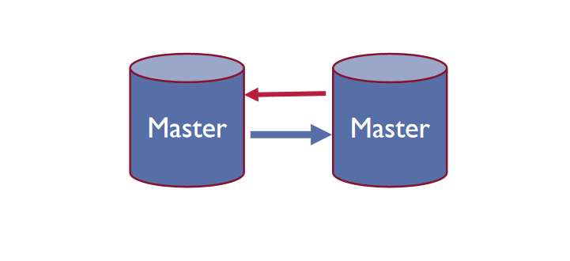       
双主复制，也就是互做主从复制，每个 master 既是 master，又是另外一台服务器的 slave。这样任何一方所做的变更，都会通过复制应用到另外一方的数据库中。同一时刻可以只有一个是主，另外一个是备，实例主动维护进行主从切换的时候无需进行特别的配置，秒级切换方便日常升级维护。
## 级联复制
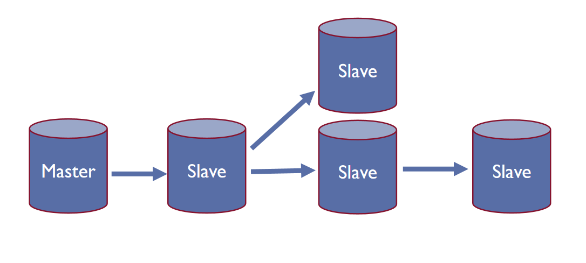      
级联复制模式下，部分 slave 的数据同步不连接主节点，而是连接从节点。主节点有太多的从节点，就会损耗一部分性能用于 replication ，这个时候可以让 3~5 个从节点连接主节点，其它从节点作为二级或者三级与从节点连接，这样不仅可以缓解主节点的压力，并且对数据一致性没有负面影响。
# 两地三中心 MySQL 主从复制
## MySQL 常见高可用方案优劣
对比目前主流的数据库高可用方案，都有各自的优势和劣势，但在支持异地容灾方面都不够简单易用：
| 高可用方案 | 优势 | 劣势 |
| --- | --- | --- |
| 主从 + Keepalived | 部署简单，没有主实例宕机后选主的问题。 | 一主多从在切换之后，其他从实例需要重新配置连接新主。 |
| MHA | 支持一主多从、主服务崩溃时不会导致数据不一致。 | SSH 存在安全隐患，官方不在维护。 |
| 组复制 MGR | 无延迟，数据强一致性 | 强依赖网络，只能用在 GTID 模式下，大事务和 DDL 操作有阻塞风险。 |
| MySQL InnoDB Cluster | 弥补组复制无法提供具有自动化故障转移功能的中间件。 | 组件多，成熟案例少。 |
| Orchestrator | 支持一主多从，解决了管理节点的单点问题，支持命令行和 Web 界面管理复制。 | 功能复杂，不方便集成进自有系统。 |
## MySQL 主从初始化消息
通过抓取消息和分析代码，发现 MySQL 从库和主库建立同步通道过程中，分别进行网络连接建立、授权，实例唯一性、时钟、字符集、binlog 配置校验等工作。其中实例唯一性校验过程从库会获取主库的 server id。
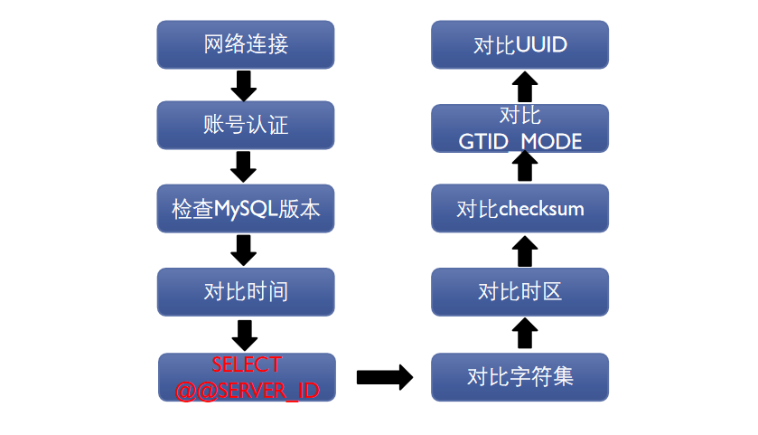   
## MySQL binlog 日志结构
MySQL 的主从复制是基于 binlog 文件，而 binlog 文件是由多个 binlog event 构成，binlog event 的整体结构由 head+data+footer 三部分组成。head 包含产生 event 的数据库实例 server id，在主从复制作为区分 event 是否为自己实例生成的重要依据。
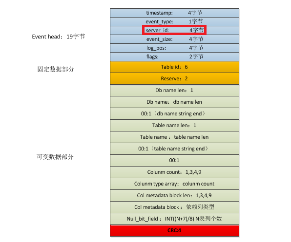 
之前通过主从初始化消息能够获取主从管道对端主库的 server id，此时和从库从管道内接受的 event 的 server id 进行对比，能够识别该 event 是否是当前对端主库产生的。
## 两地三中心 MySQL 主从方案 1
两地三中心建设相对容易，日常的演练和数据回流等配置比较繁琐，容易出错。本方案通过机房内建立 MySQL 主主复制，此时主从切换无需繁琐的命令，只需要设置 read_only；同城机房间也是建立主主复制，方便容灾演练回切，无需复杂的配置。同理，与两地三中心 MySQL 也建立主主复制，方便演练和回切。该方案使用原生的 MySQL 复制，成熟度高；未过多引入第三方组件，具备规模化运维潜力。但原生的 MySQL 主从在多条链路存在主主复制时，会出现复制回路问题，导致数据冲突和不一致。
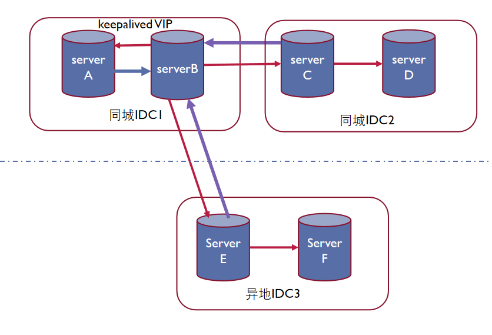
## 两地三中心 MySQL 主从方案 2
为解决复制回路问题，在主机房边界节点实例上，本方案使用上文中根据对端主库 server id 判断是否和 event 的 server id 相同，对 IDC1 边界 MySQL 复制逻辑进行限制，只同步管道内临近主产生的 binlog 日志，级联主日志丢弃，1 个同步管道只同步单台 master 日志，解决回路问题。其他节点无需开启这个功能。
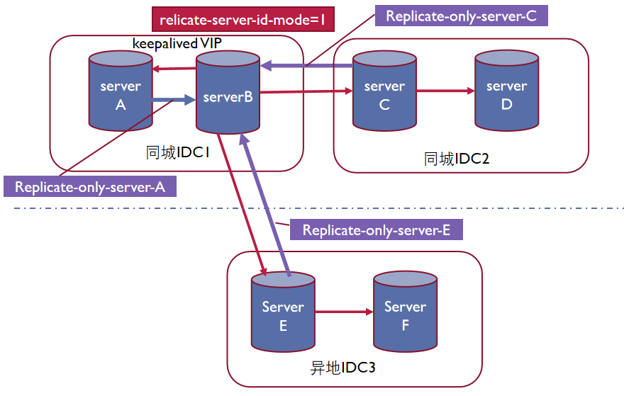
## 边界节点 MySQL 复制逻辑代码补丁
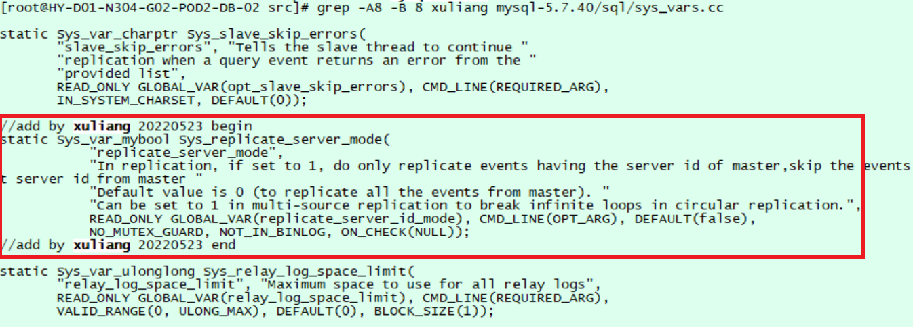
本补丁基于社区版 MySQL 5.7.40 升级，修改 `sys_vars.cc` 文件，增加 replicate_server_mode 配置项（默认为 0），兼容原有复制模式，配置为 1 时主从同步仅同步管道内对端主产生的 binlog event。
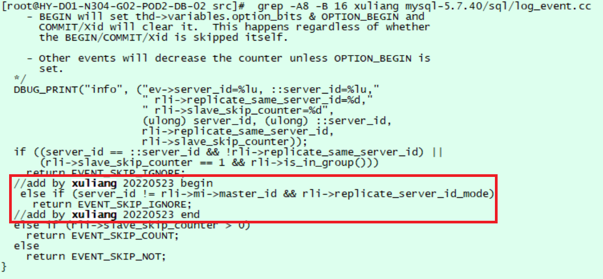
修改 `log_event.cc` 文件的 `Log_event::do_shall_skip` 函数，判断当前 event 的 server_id 和本通道对端主库 master 的 server_id 不相同时忽略，仅同步对端主库产生的 event，避免多通道主主时数据回路的问题。
# 总结
该 MySQL 数据同步方案优化了 MySQL 本身的日志同步机制，引入多通道主主复制技术，降低了机房容灾演练和回切时数据同步关系调整带的复杂性；每个通道仅同步临近主库 binlog event，解决了数据回路问题，支撑重点业务两地三中心容灾；无需引入第三方 HA，同步等组件，减少了相关软硬件和网络要求；补丁代码量 100 行以内，仅需对主机房边界节点升级，风险可控。具备规模实例运维场景下成熟，低成本，简单可靠的特点，能够和公司一键切换平台快速集成。未来也具备支撑三地五中心等更高等级容灾要求的能力。但该方案不支持多层级联复制，同时也不支持列、记录级等更精细化灵活控制的能力。