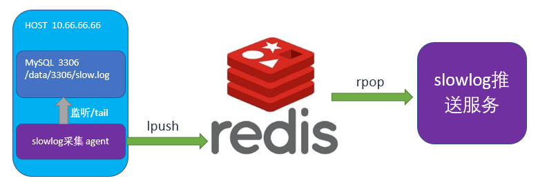
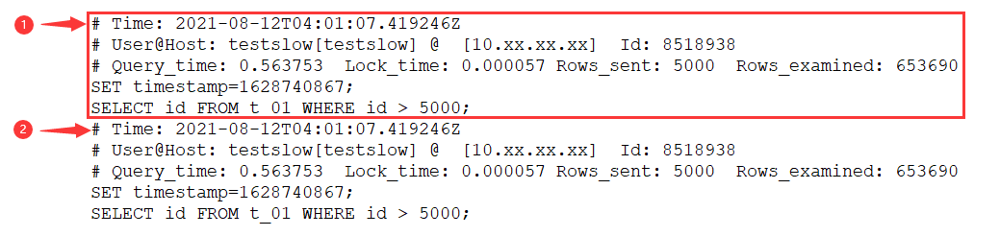
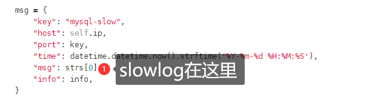
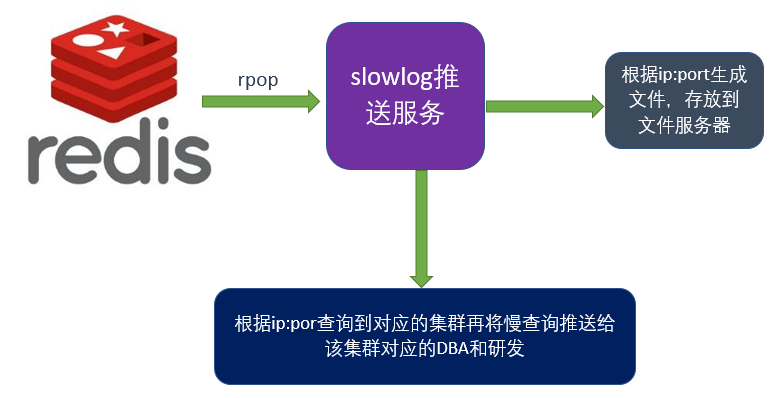
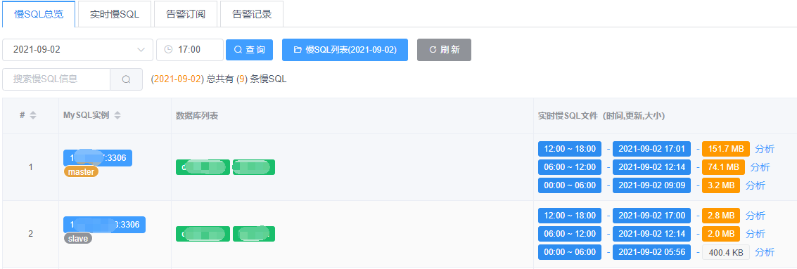
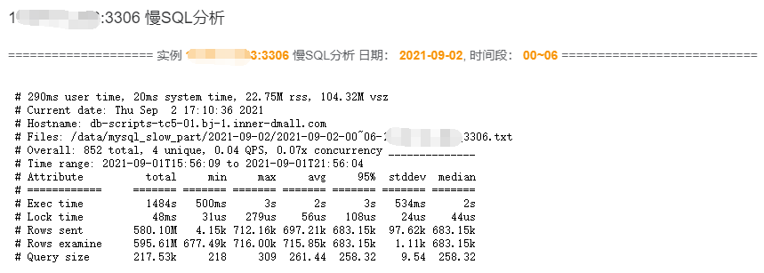
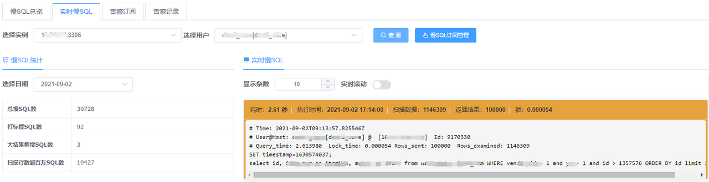

# 技术分享 | 实时慢查询监控系统构建

**原文链接**: https://opensource.actionsky.com/%e6%8a%80%e6%9c%af%e5%88%86%e4%ba%ab-%e5%ae%9e%e6%97%b6%e6%85%a2%e6%9f%a5%e8%af%a2%e7%9b%91%e6%8e%a7%e7%b3%bb%e7%bb%9f%e6%9e%84%e5%bb%ba/
**分类**: 技术干货
**发布时间**: 2021-10-21T22:21:27-08:00

---

> 
作者：王春涛
目前是多点Dmall数据库架构师，更早是聚美数据库团队负责人，擅长高并发下数据库架构，运维保障，数据库平台建设。
本文来源：原创投稿
*爱可生开源社区出品，原创内容未经授权不得随意使用，转载请联系小编并注明来源。
慢查询监控是MySQL运维中非常重要的一项，它可以帮助分析线上数据库性能的抖动或者业务查询响应慢等情况。当集群和实例非常多的情况下，慢查询的收集和存储会变得比较困难，而且不太好做到实时的慢查询告警。
## 常用方案介绍
#### 1、慢日志收集
通常情况下会采用通过定时任务的方式使用 pt-query-digest 将每个实例的慢日志收集写入到 MySQL 数据库。由于是定时任务触发，所以并不是实时的进行收集上报。
#### 2、慢日志统计
通过查询 MySQL 数据库可以根据 host 、port 、user 、指纹、时间范围等条件进行查询统计
#### 3、慢日志告警
从 MySQL 中查询出慢日志然后匹配到对应的 DBA 和研发人员发送告警。但由于 MySQL 中数据是全量存在的只能根据时间范围进行批次查询，告警就无法做到实时。
pt-query-digest 的方法在采集的时候就已经不是实时了，再加上告警任务是按时间范围进行批次查询所以这套架构下的慢查询监控不能做到实时的监控
#### 下面给大家介绍一下多点数据库实时慢查询监控的实现思路。
## 多点实时慢查询监控整体架构

如上图，我们有一个监听 slowlog 的 agent ，这个 agent 主要是持续的对慢查询 log 文件进行 tail ，将每一个 slowlog 段作为一个 list 的 iterm push 到 redis 。每个 agent 可以监听所在机器的所有 MySQL 实例的慢日志，这样就把分散在各个机器上的日志汇集到了一个 redis 中。然后有一个消费端也就是 slowlog 推送服务，从 redis 中 pop 出组装好的慢日志，根据 pop 出的慢日志解析其中的 host ，port ，dbname 以及 user ，匹配到对应的 dba 或研发，将慢日志实时推送给对应的人员。同时按照 host-port 将慢查询存储为文件。这样就形成了一个流式的处理，再加上 redis 的全内存操作，速度极快，完全可以做到实时。
## 采集端实现

我们可以看到慢查询日志一般是一段一段的记录的，所以我们以 # Time 行开始记录，直到遇到下一个 # Time 将中间的一段作为一个整体 push 到 redis ，但这些信息远远不够，还需要额外加入 MySQL  的实例信息，后续才好进行分析，所以最终到 redis 中的数据应该类似下图

## 消费端实现

消费端做两件事情，第一将 pop 出来的消息根据 ip:port 为文件名进行日志归类存放，以便后续使用 pt-query-digest 对日志文件进行进一步统计分析。第二根据 ip:port 查询到对应的集群负责人和 DBA ，将慢查询通过短信或者邮件推送给对应的人员。
## 前端展示
- 
集中存放的慢日志文件

按集群维度 + 实例维度展示某时间段的慢日志大小，点击分析按钮可调用 pt-query-digest 对慢日志文件进行分析，输出结果如下：

- 
实时慢SQL

这个实时信息就是从 redis 中 pop 出来的，可以进行实时的滚动展示，同时可以通过邮件等方式实时推送给订阅者。
## 预告一波
今年10月24日下午14:00-18:00，D+Talks 2021多点技术大会将拉开帷幕，届时将在会上分享多点的数据库运维平台相关的topic，和大家一起探讨数据库运维的标准化、自动化方面的一些方法和思路，欢迎识别下图二维码参加线下活动，与行业大咖共同探讨!
