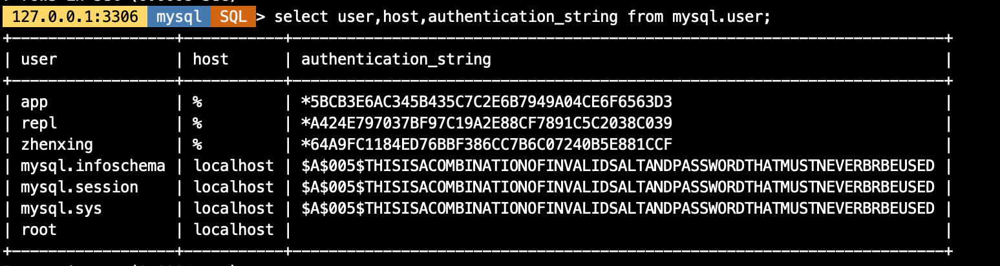

# 技术分享 | 快速掌握 MySQL 授权表运维注意事项

**原文链接**: https://opensource.actionsky.com/%e6%8a%80%e6%9c%af%e5%88%86%e4%ba%ab-%e5%bf%ab%e9%80%9f%e6%8e%8c%e6%8f%a1-mysql-%e6%8e%88%e6%9d%83%e8%a1%a8%e8%bf%90%e7%bb%b4%e6%b3%a8%e6%84%8f%e4%ba%8b%e9%a1%b9/
**分类**: MySQL 新特性
**发布时间**: 2024-03-20T22:30:05-08:00

---

普通用户有MySQL鉴权表的访问权限带来的风险。
> 作者：余振兴，爱可生 DBA 团队成员，热衷技术分享、编写技术文档。
爱可生开源社区出品，原创内容未经授权不得随意使用，转载请联系小编并注明来源。
本文共 1100 字，预计阅读需要 3 分钟。
# 基础背景
我们在做权限授权时需要给到应用用户增删改查权限，比如下面的授权语句。这样的好处是当实例创建多个业务库时，无需再次给新的业务库授权，该权限默认对所有库有增删改查权限，主打一个方便，但实际这种授权方式会带来较大的权限风险，甚至导致数据库被攻击破坏。
`create user 'app'@'%' identified by 'app';
grant select,update,delete,insert on *.* to 'app'@'%';
`
# 演示验证
我们基于以上的授权来做一个业务用户 **提权**（自己给自己增加额外的权限）操作，下面是操作的时序表格（建议 PC 端查看）。
## 场景1
管理用户触发 `flush privileges` 刷新内存授权表触发提权。
| 操作/用户 | root 用户 | app 用户 |
| --- | --- | --- |
| 登录 | mysql -S /data/mysql/3306/data/mysqld.sock | mysql -h127.0.0.1 -uapp -papp -P3306 |
| app 用户给自己提权。这里，`update` 成功了，但由于缺少 reload 或 super 权限，导致刷新到内存中失败了。 |  | mysql> update mysql.user set Select_priv=&#8217;Y&#8217;,Insert_priv=&#8217;Y&#8217;,Update_priv=&#8217;Y&#8217;,Delete_priv=&#8217;Y&#8217;,Create_priv=&#8217;Y&#8217;,Drop_priv=&#8217;Y&#8217;,Reload_priv=&#8217;Y&#8217;,Shutdown_priv=&#8217;Y&#8217;,Process_priv=&#8217;Y&#8217;,File_priv=&#8217;Y&#8217;,Grant_priv=&#8217;Y&#8217;,References_priv=&#8217;Y&#8217;,Index_priv=&#8217;Y&#8217;,Alter_priv=&#8217;Y&#8217;,Show_db_priv=&#8217;Y&#8217;,Super_priv=&#8217;Y&#8217;,Lock_tables_priv=&#8217;Y&#8217; where user=&#8217;app&#8217; and host=&#8217;%&#8217;;
**Query OK, 1 row affected (0.01 sec)**
Rows matched: 1 Changed: 1 Warnings: 0
mysql> flush privileges;
**ERROR 1227 (42000): Access denied; you need (at least one of) the RELOAD privilege(s) for this operation** |
| 重启数据库 | mysql> flush privileges;
Query OK, 0 rows affected (0.00 sec) |  |
| app 用户重新登录数据库查看自己的权限，**提权成功。** |  | mysql> show grants\G
******* 1. row *******
Grants for app@%: GRANT SELECT, INSERT, UPDATE, DELETE, CREATE, DROP, RELOAD, SHUTDOWN, PROCESS, FILE, REFERENCES, INDEX, ALTER, SHOW DATABASES, SUPER, LOCK TABLES ON . TO app@% WITH GRANT OPTION
1 row in set (0.00 sec) |
## 场景2
重启数据库重新加载授权表到内存触发提权。
| 操作/用户 | root 用户 | app 用户 |
| --- | --- | --- |
| 登录 | mysql -S /data/mysql/3306/data/mysqld.sock | mysql -h127.0.0.1 -uapp -papp -P3306 | mysql -h127.0.0.1 -uapp -papp -P3306 |
| app用户给自己提权,这里，update成功了，但由于缺少reload或super权限，导致刷新到内存中失败了。 |  | mysql> update mysql.user set Select_priv=&#8217;Y&#8217;,Insert_priv=&#8217;Y&#8217;,Update_priv=&#8217;Y&#8217;,Delete_priv=&#8217;Y&#8217;,Create_priv=&#8217;Y&#8217;,Drop_priv=&#8217;Y&#8217;,Reload_priv=&#8217;Y&#8217;,Shutdown_priv=&#8217;Y&#8217;,Process_priv=&#8217;Y&#8217;,File_priv=&#8217;Y&#8217;,Grant_priv=&#8217;Y&#8217;,References_priv=&#8217;Y&#8217;,Index_priv=&#8217;Y&#8217;,Alter_priv=&#8217;Y&#8217;,Show_db_priv=&#8217;Y&#8217;,Super_priv=&#8217;Y&#8217;,Lock_tables_priv=&#8217;Y&#8217; where user=&#8217;app&#8217; and host=&#8217;%&#8217;;
**Query OK, 1 row affected (0.01 sec)**
Rows matched: 1 Changed: 1 Warnings: 0
mysql> flush privileges;
**ERROR 1227 (42000): Access denied; you need (at least one of) the RELOAD privilege(s) for this operation** |
| 重启数据库 | mysql> restart;
Query OK, 0 rows affected (0.00 sec) |  |
| app 用户重新登录数据库查看自己的权限，提权成功。 |  | mysql> show grants\G
******* 1. row *******
Grants for app@%: GRANT SELECT, INSERT, UPDATE, DELETE, CREATE, DROP, RELOAD, SHUTDOWN, PROCESS, FILE, REFERENCES, INDEX, ALTER, SHOW DATABASES, SUPER, LOCK TABLES ON . TO app@% WITH GRANT OPTION
1 row in set (0.00 sec) |
# 场景总结
- **给普通用户授予 MySQL 鉴权相关表的权限均会带来风险**
备注：鉴权表除了 `user` 表，还包括 `db`、`columns_priv`、`tables_priv`、`procs_priv`、`proxies_priv` 表。
- 即使只对鉴权表授予只读权限，如 `user` 表，也会被获取到 `authentication_string` 字段的密文串，通过其他方式做密码库匹配破解。
曾经遇到过一个场景，普通用户仅有 `user` 的查询权限，其通过查询该表信息发现 `root@localhost` 用户密码为空，于是直接用 root 用户访问数据库，类似于进行了提权操作。

# 规避方式
- 不要对非管理员用户授予任何鉴权表的访问权限，即使是只读权限。
- 授权遵循最小权限原则。
- MySQL 8.0 增加了回收部分权限的参数 `partial_revokes`，可单独将 `mysql` 库的权限回收。示例如下：
```
-- 创建app用户并授予所有数据库增删改查权限
create user 'app'@'%' identified by 'app';
grant select,update,delete,insert on *.* to 'app'@'%';
-- 开启部分权限回收的参数
set global partial_revokes=on;
-- 单独回收app用户对mysql库的权限
revoke select,update,delete,insert on mysql.* from 'app'@'%';
-- 查看当前app用户的授权信息
-- 这里的权限是以交集的形式存在，必须两者都满足
show grants for app;
+-------------------------------------------------------------------+
| Grants for app@%                                                  |
+-------------------------------------------------------------------+
| GRANT SELECT, INSERT, UPDATE, DELETE ON *.* TO `app`@`%`          |
| REVOKE SELECT, INSERT, UPDATE, DELETE ON `mysql`.* FROM `app`@`%` |
+-------------------------------------------------------------------+
-- 以app用户登录数据库访问mysql.user表，报错无权限
mysql> select user,host from mysql.user;
ERROR 1142 (42000): SELECT command denied to user 'app'@'127.0.0.1' for table 'user'
```