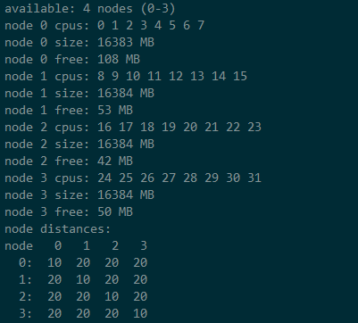
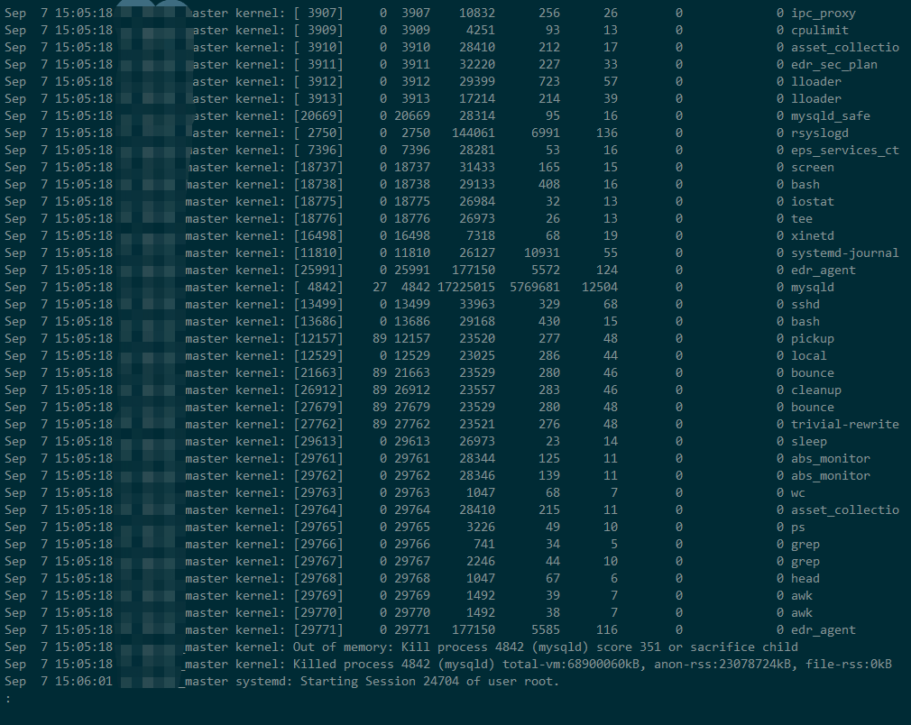
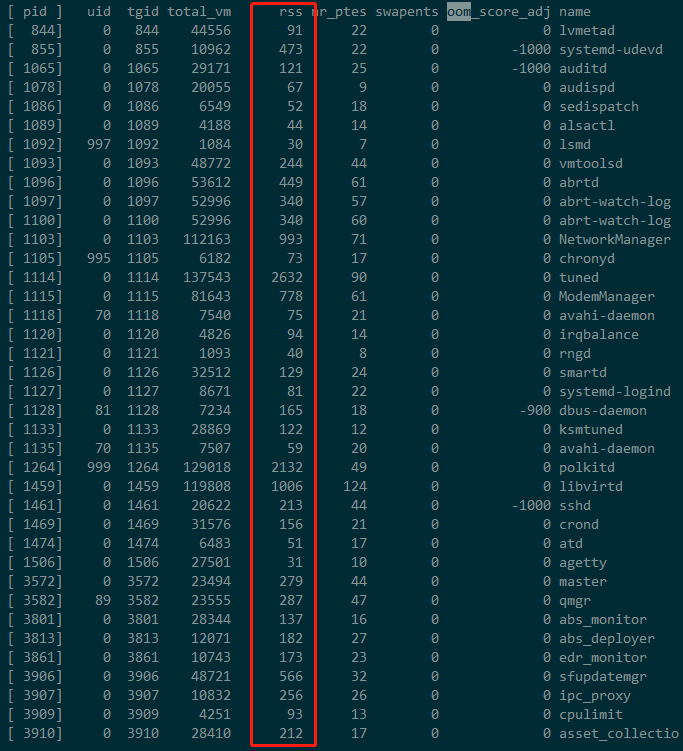
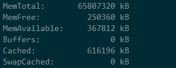
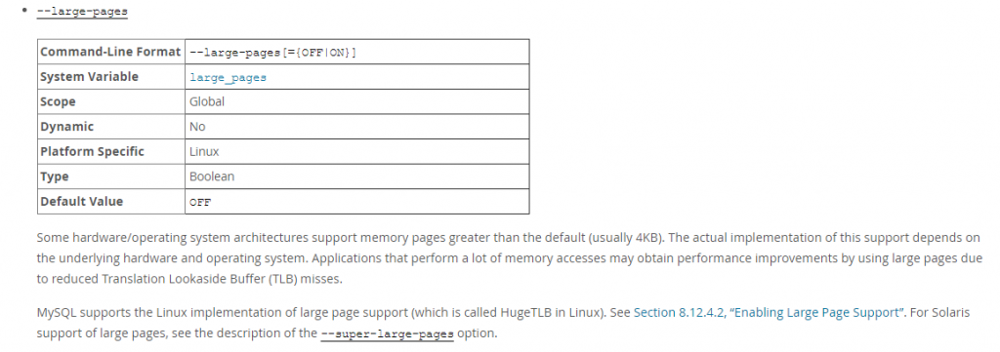
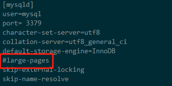

# 技术分享 | 我的内存去哪儿？生产实践

**原文链接**: https://opensource.actionsky.com/20200927-mysql/
**分类**: MySQL 新特性
**发布时间**: 2020-09-27T00:33:20-08:00

---

作者：秦福朗
爱可生 DBA 团队成员，负责项目日常问题处理及公司平台问题排查。热爱 IT，喜欢在互联网里畅游，擅长摄影、厨艺，不会厨艺的 DBA 不是好司机，didi~
本文来源：原创投稿
*爱可生开源社区出品，原创内容未经授权不得随意使用，转载请联系小编并注明来源。
**一、问题背景**
业务反馈，数据库最近总是隔一段时间连接失败，过一会又没事了，一天能发生了 2、3 次，后来发现和主机传统大页的配置有关，具体原因是什么，请继续看。
**二、环境背景：**
MySQL 5.6.25 
vmware 虚拟机 CentOS 7.1
CPU 32C
内存 64G
innodb_buffer_pool_size = 48G
**三、排查过程**
1、首先查看了 mysql uptime 发现时间在今天，说明有过重启。
2、查看当前内存 cpu 的使用：
使用 free 查看系统 64G 内存，used 使用了 61G+，还剩下 200 多 M 的 free，buffer/cache 也不多，使用 top 查看 MySQL RES 占用 20 多 G 左右。
使用 numa 查看当前 numa 分配：
											
发现每个 node 的剩余内存均不多。
3、因为怀疑重启，所以查看下系统日志，发现了重启原因
											
发现 mysqld 发现了 OOM（什么是 OOM，可以在本公众号搜索 OOM），且一天发生了 2、3 次和业务反馈是对的上的。
继续看，
此处可看到在发生 OOM 时，MySQL 占用系统内存 aron-rss 大约为 22G。
计算 rss 的数量（此处为页数），每页为 4K，计算完成近大约为 22.1G。
											
那么问题来了，
主机内存 64G，实际才使用了 22G 多，怎么会发现生 OOM，free used 使用了 61G，那么**我的内存去哪了**？
4、查看 /proc/meminfo
											
看上面发现和我们用 free 和 top 看到的值是一样的
继续看，
在传统大页这里发现了问题，
在这里，传统大页 Total 配置了 20000，FREE 也为 20000，说明配置了大页但没在使用，hugepagesize 为 2M，这一块预留的就是 40G 大页内存。
> Tips：“大内存页”也称传统大页、大页内存等有助于 Linux 进行虚拟内存的管理，标准的内存页为 4KB，这里使用“大内存页”最大可以定义 1GB 的页面大小，在系统启动期间可以使用“大内存页”为应用程序预留一部分内存，这部分内存被占用且永远不会被交换出内存，它会一直保留在那里，直到改变配置。（详细介绍请看下面链接官方解释）
5、那么这 40G 大页内存是分配给谁的呢？
查询一下：
- 
- 
- 
- 
- 
`shell> /proc/sys/vm/hugetlb_shm_group``27``  ``shell> id 27``uid=27(mysql) gid=27(mysql) groups=27(mysql)`
hugetlb_shm_group 文件里填的是指定大页内存使用的用户组 id，这里查看到是 MySQL 组 id，那既然是给 MySQL 的为什么 free 等于 total，并且 mysql 还只有 20 多 G 实际使用内存呢？
原来在 MySQL 中还有专门启用大内存页的参数，在 MySQL 大内存页称为 large page。
											
6、查看 MySQL 配置文件
											
发现配置文件中确实有 large-page 配置，但出于禁用状态。
后与业务确认，很早之前确实启用过 mysql 的 large page，不过后面禁用了。排查到这基本就有了结论。
**四、结论**
这套环境之前开启了 20000 的大内存页，每页大小为 2MB，占用了 40G 内存空间，给 MySQL 使用，并且 MySQL 开启了 large page，但后来不使用的时候，只关闭了 MySQL 端的 large page 参数，但没有实际更改主机的关于大内存页的配置，所以导致，实际上主机上的还存在 20000 的大内存页，并且没在使用，这一部分长期空闲，并且其他程序不能使用。
所以 MySQL 在使用 20G 内存左右，整个主机内存就饱和了，然后在部分条件下，就触发了 OOM，导致 mysqld 被 kill，但主机上又有 mysqld_safe 守护程序，所以又再次给拉起来，就看到了文章初的偶尔连接不上的现象。
**五、后续操作**
经过在本地测试，确实指定大页之后会导致内存占用，如果 MySQL 不配置，会空闲这部分内存，且模拟大业务的情况下会发生 OOM。
所以，在问题环境上：
通过移除 vm 相关参数，使被占用的大内存页释放出来，MySQL 就没再被 oom 过。
**六、建议**
1、MySQL 主机一般不必使用 hugepage，MySQL 自己处理 buffer pool 的分页管理，不需要操作系统的参与；
2、建议在环境上线前，检查一下主机内存的大内存页分配，看是否有没在使用的传统大页的存在，避免影响后续业务的使用。
**附：参考资料**
1、https://docs.oracle.com/database/121/UNXAR/appi_vlm.htm#UNXAR391
2、https://kerneltalks.com/services/what-is-huge-pages-in-linux/
3、https://dev.mysql.com/doc/refman/5.6/en/large-page-support.html