# 技术分享 | 改写 mysqldump 解决 DEFINER 问题

**原文链接**: https://opensource.actionsky.com/20200924-mysql/
**分类**: MySQL 新特性
**发布时间**: 2020-09-24T00:30:27-08:00

---

作者：xuty
本文来源：原创投稿
*爱可生开源社区出品，原创内容未经授权不得随意使用，转载请联系小编并注明来源。
**一、背景**
项目上 MySQL **还原 SQL 备份**经常会碰到一个错误如下，且通常出现在导入视图、函数、存储过程、事件等对象时，其根本原因就是因为**导入时所用账号**并不具有**SUPER 权限**，所以无法创建**其他账号**的所属对象。
**ERROR 1227 (42000) : Access denied; you need (at least one of) the SUPER privilege(s) for this operation**
常见场景：1. 还原 RDS 时经常出现，因为 RDS 不提供 SUPER 权限；2. 由开发库还原到项目现场，账号权限等有所不同。
处理方式：
1. 在原库中批量修改对象所有者为导入账号或修改 **SQL SECURITY** 为 **Invoker**；2. 使用 mysqldump 导出备份，然后将 SQL 文件中的对象所有者替换为导入账号。
**二、问题原因**
我们先来看下为啥会出现这个报错，那就得说下 MySQL 中一个很特别的权限控制机制，像视图、函数、存储过程、触发器等这些数据对象会存在一个 **DEFINER** 和一个 **SQL SECURITY** 的属性，如下所示：- 
- 
- 
- 
- 
- 
- 
- 
- 
- 
- 
- 
- 
- 
`--视图定义``CREATE ALGORITHM = UNDEFINED DEFINER = `root`@`%` SQL SECURITY DEFINER VIEW v_test``
``--函数定义``CREATE DEFINER=`root`@`%` FUNCTION `f_test()` RETURNS varchar(100) SQL SECURITY DEFINER``
``--存储过程定义``CREATE DEFINER=`root`@`%` PROCEDURE `p_test`() SQL SECURITY DEFINER``
``--触发器定义``CREATE DEFINER=`root`@`%` trigger t_test``
``--事件定义``CREATE DEFINER=`root`@`%` EVENT `e_test``
- DEFINER：对象定义者，在创建对象时可以手动指定用户，不指定的话默认为当前连接用户；
- SQL SECURITY：指明以谁的权限来执行该对象，有两个选项，一个为 **DEFINER**，一个为** INVOKER**，默认情况下系统指定为 DEFINER；DEFINER：表示按**定义者**的权限来执行； INVOKER：表示按**调用者**的权限来执行。
如果导入账号具有 SUPER 权限，即使对象的所有者账号不存在，也可以导入成功，但是在查询对象时，如果对象的 **SQL SECURITY** 为 **DEFINER**，则会报账号不存在的报错。
**ERROR 1449 (HY000): The user specified as a definer (&#8216;root&#8217;@&#8217;%&#8217;) does not exist**
**三、改写内容**
上述这个 DEFINER 问题，个人想到最简单的解决方式就是 mysqldump 导出时直接摘除掉相关属性，但是 mysqldump 本身并不提供对应参数，所以比较蛋疼，无论是**原库走脚本变更**或是**备份后修改 SQL 文件**都不是非常方便，尤其是触发器的 DEFINER，只能先 DROP 再 CREATE 才可以变更。只能看下是否可以从 **mysqldump 源码**中去掉 DEFINER 定义。
本次 **mysqldump 改写**主要有 2 个目的：1. 摘取备份中视图、函数、存储过程、触发器等对象的 DEFINER 定义；2. 尝试加上比较简单的备份进度显示（原生 mysqldump 的 **verbose** 参数不是非常清晰，想要实现 navicate 备份时的那种行数显示）。
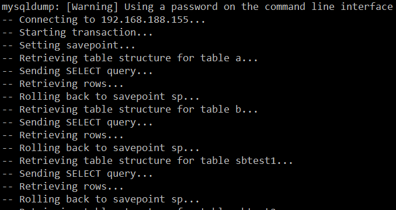											
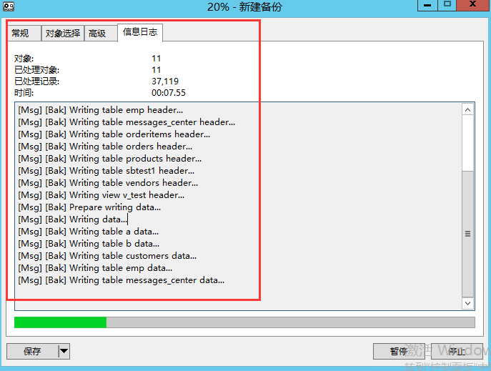											
改写好处：1. 可以避免还原时遇到 DEFINER 报错相关问题；2. 根据输出信息知道备份是否正常进行，防止备份中遇到元数据锁无法获取然后一直卡住的情况。
**四、版本选择**
改之前需要先选个 MySQL 版本，对比了下几个 MySQL 5.7.27 以上的版本，发现其 mysqldump.c 的源码是一样的，而从 MySQL 8.0 之后则完全变了。
因此选择 MySQL 5.7.27 版本的 mysqldump 源文件来改写，所以本次改写**只适用于**MySQL 5.7 版本 。
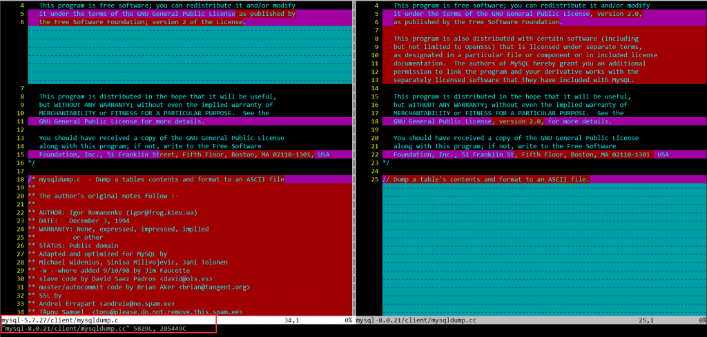											
**五、备份顺序**
如下是 mysqldump 备份对象时的顺序，值得注意的是 mysqldump 在备份表的时候会连带视图也一起备份，但是只是**临时视图（常量别名替换实际列）**，主要是为了防止后续其他视图、函数与存储过程中用到该视图，所以通过临时视图来**解决依赖问题**，在最后才真正备份视图，这招非常精妙！
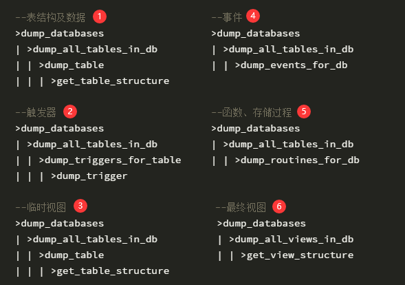											
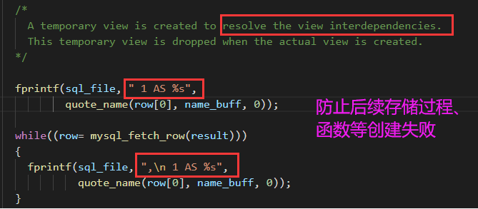											
**六、源码改动**
6.1 打印函数> 因为要在会话窗口下模拟 verbose 一样输出备份信息，所以就照搬了原生的 **verbose_msg()** 函数，新建了个 **print_dump_msg()** 函数用于备份信息输出。
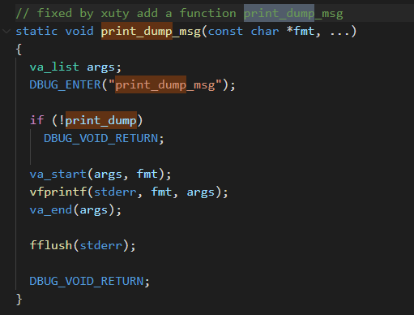											
6.2 行数显示
> **dump_table** 函数中增加备份行数输出，本身源码就是一行一行循环读取的，所以非常方便打印输出。
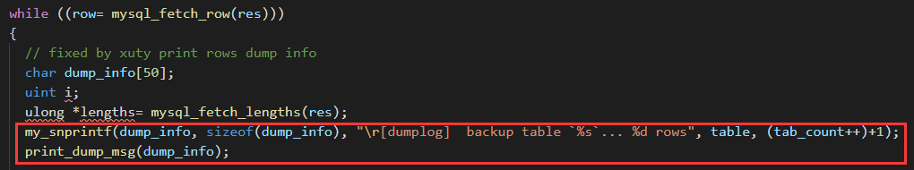											
6.3 DEFINER 摘除
> **trigger** 与 **event** 的 DEFINER 是在 **dump_trigger |dump_events_for_db->cover_definer_clause** 函数中通过 **my_case_str** 方法摘走的。
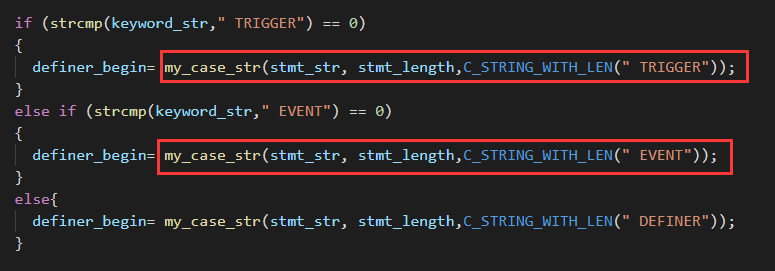											
**routines** 的 DEFINER 是在 **dump_routines_for_db** 函数中通过 **fprint** 方法重新拼接定义摘走的。
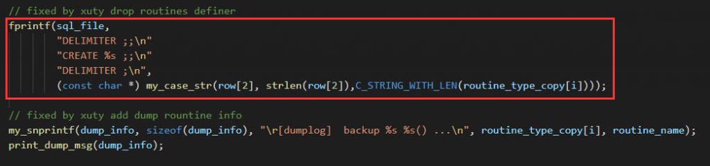											
**views** 的 DEFINER 是在 **get_view_structure** 函数中通过 **my_case_str** 方法摘走的。
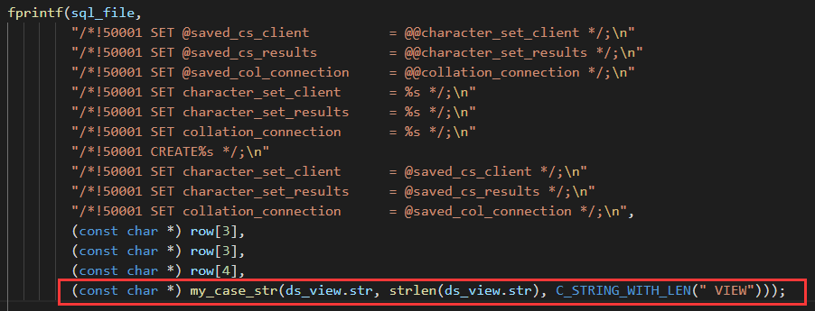											
**七、改写效果**
1. 备份过程中打印具体信息
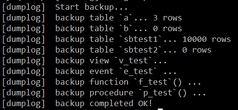											
2. SQL 备份中摘除了 DEFINER 属性
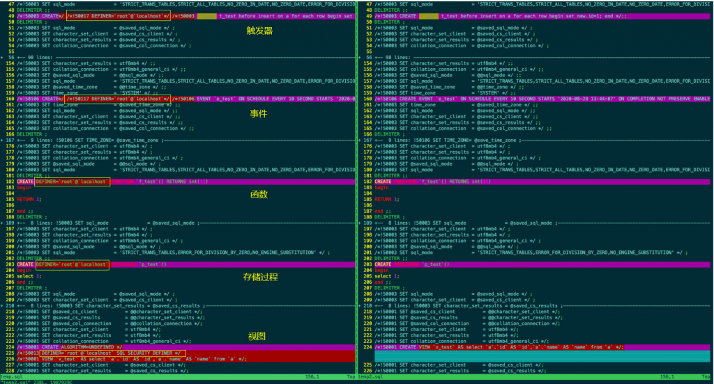											
**八、性能测试**
通过 sysbench 造测试数据后，分别使用改写后的 mysqldump 与原生的 mysqldump 进行多次**远程备份**，查看平均耗时。
这里选择远程备份测试是因为很多实际使用场景也是远程备份，而且远程备份更能体现出频繁打印信息对备份性能的影响。
实际压测发现，如果每一行都打印一次，会严重影响性能，所以改成 **1W 行**打印一次，影响会比较小。
另外踩了个坑，一开始测试的时候是使用**开启 debug 编译**的 mysqldump，所以会执行很多多余的 debug 代码，备份速度非常慢，**关闭 debug 重新编译**后，速度就比较正常了。
											
通过测试，如果是 1W 行打印一次，对于备份的性能损耗是比较低的，在可接受范围之内。
**九、小结**
本次通过直接修改 mysqldump 源码的方式，比较好的解决了 DEFINER 问题，另外将改写后的 mysqldump 源码拿到 Windows 环境下编译后是可以直接使用的，亲测有效，不过 Windows 编译环境搭建繁琐多了。
其实也可以通过类似的方式来实现异构数据库的迁移，比如从 MySQL 迁移到其他数据库时，可以通过修改 mysqldump 源码来完成字段类型映射与语法转换，也是一种思路。
相关推荐：
[故障分析 | MySQL 优化案例 &#8211; select count(*)](https://opensource.actionsky.com/20200707-mysql/)
[故障分析 | MySQL 优化案例 &#8211; 字符集转换](https://opensource.actionsky.com/20200630-mysql/)
[技术分享 | MySQL binlog 日志解析](https://opensource.actionsky.com/20200807-mysql/)