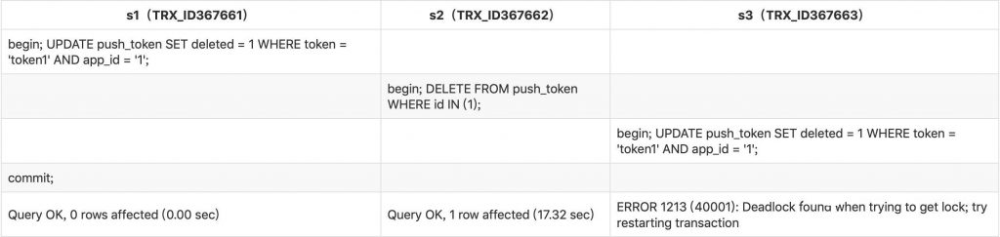
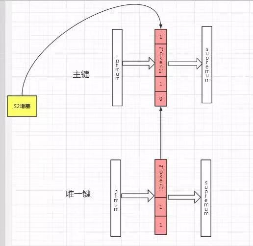
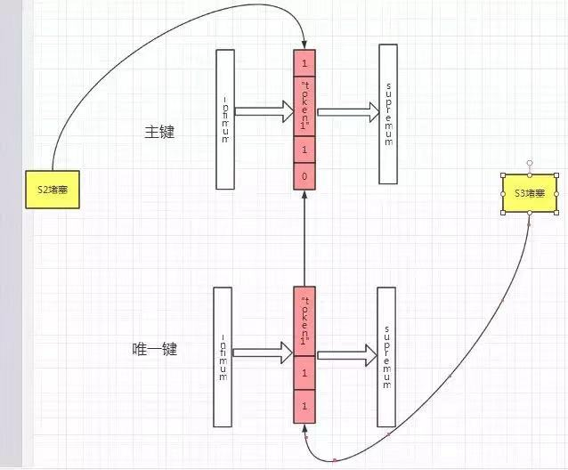

# 技术分享 | 死锁分析案例

**原文链接**: https://opensource.actionsky.com/20190816-percona/
**分类**: 技术干货
**发布时间**: 2019-08-16T01:15:56-08:00

---

作者：高鹏 
文章末尾有他著作的《深入理解MySQL主从原理 32讲》,深入透彻理解MySQL主从，GTID相关技术知识。
### 一、问题由来
这是我同事问我的一个问题，在网上看到了如下案例，本案例RC RR都可以出现，其实这个死锁原因也比较简单，我们来具体看看：
##### 构造数据
- `CREATE database deadlock_test;`
- `use deadlock_test;`
- `CREATE TABLE `push_token` (`
- ``id` bigint(20) NOT NULL AUTO_INCREMENT,`
- ``token` varchar(128) NOT NULL COMMENT 'push token',`
- ``app_id` varchar(128) DEFAULT NULL COMMENT 'appid',`
- ``deleted` tinyint(1) NOT NULL COMMENT '是否已删除 0：否 1：是',`
- `PRIMARY KEY (`id`),`
- `UNIQUE KEY `uk_token_appid` (`token`,`app_id`)`
- `) ENGINE=InnoDB AUTO_INCREMENT=3384 DEFAULT CHARSET=utf8 COMMENT='pushtoken表';`
- 
- `insert into push_token (id, token, app_id, deleted) values(1,"token1",1,0);`
操作数据
											
### 二、分析方法
### 我使用的分析方法是把整个加锁的日志打印出来，当然需要用到我自己做了输出修改的一个版本，如下：
https://github.com/gaopengcarl/percona-server-locks-detail-5.7.22
这个版本我打开了的日志记录参数如下：
- `mysql> show variables like '%gaopeng%';`
- `+--------------------------------+-------+`
- `| Variable_name | Value |`
- `+--------------------------------+-------+`
- `| gaopeng_mdl_detail | OFF |`
- `| innodb_gaopeng_row_lock_detail | ON |`
- `+--------------------------------+-------+`
- `2 rows in set (0.01 sec)`
这样大部分的Innodb加锁记录都会记录到errlog日志了。好了下面我详细分析一下日志：
### 三、分析过程
初始化的情况整个表只有1条记录，本表包含一个主键和一个唯一键。
#### 1. s1（TRX_ID367661）执行语句
- `begin;`
- `UPDATE push_token SET deleted = 1 WHERE token = 'token1' AND app_id = '1';`
日志输出：- `2019-08-18T19:10:05.117317+08:00 6 [Note] InnoDB: TRX ID:(367661) table:deadlock_test/push_token index:uk_token_appid space_id: 449 page_id:4 heap_no:2 row lock mode:LOCK_X|LOCK_NOT_GAP|`
- `PHYSICAL RECORD: n_fields 3; compact format; info bits 0`
- `0: len 6; hex 746f6b656e31; asc token1;;`
- `1: len 1; hex 31; asc 1;;`
- `2: len 8; hex 8000000000000001; asc ;;`
- `2019-08-18T19:10:05.117714+08:00 6 [Note] InnoDB: TRX ID:(367661) table:deadlock_test/push_token index:PRIMARY space_id: 449 page_id:3 heap_no:2 row lock mode:LOCK_X|LOCK_NOT_GAP|`
- `PHYSICAL RECORD: n_fields 6; compact format; info bits 0`
- `0: len 8; hex 8000000000000001; asc ;;`
- `1: len 6; hex 000000059c2c; asc ,;;`
- `2: len 7; hex bf000000420110; asc B ;;`
- `3: len 6; hex 746f6b656e31; asc token1;;`
- `4: len 1; hex 31; asc 1;;`
- `5: len 1; hex 80; asc ;;`
我们看到主键和唯一键都加锁了，模式为LOCKX|LOCKNOT_GAP|如下图：
											
并且这个时候数据实际上是标记删除状态。
#### 2. s2（TRX_ID367662） 执行语句
- `begin;DELETE FROM push_token WHERE id IN (1);`
日志输出：- `2019-08-18T19:10:22.751467+08:00 9 [Note] InnoDB: TRX ID:(367662) table:deadlock_test/push_token index:PRIMARY space_id: 449 page_id:3 heap_no:2 row lock mode:LOCK_X|LOCK_NOT_GAP|`
- `PHYSICAL RECORD: n_fields 6; compact format; info bits 0`
- `0: len 8; hex 8000000000000001; asc ;;`
- `1: len 6; hex 000000059c2d; asc -;;`
- `2: len 7; hex 400000002a1dc8; asc @ * ;;`
- `3: len 6; hex 746f6b656e31; asc token1;;`
- `4: len 1; hex 31; asc 1;;`
- `5: len 1; hex 81; asc ;;`
- `2019-08-18T19:10:22.752753+08:00 9 [Note] InnoDB: Trx(367662) is blocked!!!!!`
这个时候S2需要获取主键上的:LOCKX|LOCKNOT_GAP| 锁，因此被堵塞了如下图：
											
3. s3（TRX_ID367663） 执行语句
- `begin; UPDATE push_token SET deleted = 1 WHERE token = 'token1' AND app_id = '1';`
日志输出：- `2019-08-18T19:10:30.822111+08:00 8 [Note] InnoDB: TRX ID:(367663) table:deadlock_test/push_token index:uk_token_appid space_id: 449 page_id:4 heap_no:2 row lock mode:LOCK_X|LOCK_NOT_GAP|`
- `PHYSICAL RECORD: n_fields 3; compact format; info bits 0`
- `0: len 6; hex 746f6b656e31; asc token1;;`
- `1: len 1; hex 31; asc 1;;`
- `2: len 8; hex 8000000000000001; asc ;;`
- `2019-08-18T19:10:30.918248+08:00 8 [Note] InnoDB: Trx(367663) is blocked!!!!!`
这个时候S3需要获取唯一键上的LOCKX|LOCKNOT_GAP 锁，因此被堵塞了如下图：
											
#### 4. s1（TRX_ID367661） 执行语句
这一步完成后死锁出现。- `commit;`
日志输出如下：- `367663和367662各自获取需要的锁`
- 
- `2019-08-18T19:10:36.566733+08:00 8 [Note] InnoDB: TRX ID:(367663) table:deadlock_test/push_token index:uk_token_appid space_id: 449 page_id:4 heap_no:2 row lock mode:LOCK_X|LOCK_NOT_GAP|`
- `PHYSICAL RECORD: n_fields 3; compact format; info bits 0`
- `0: len 6; hex 746f6b656e31; asc token1;;`
- `1: len 1; hex 31; asc 1;;`
- `2: len 8; hex 8000000000000001; asc ;;`
- `2019-08-18T19:10:36.568711+08:00 9 [Note] InnoDB: TRX ID:(367662) table:deadlock_test/push_token index:PRIMARY space_id: 449 page_id:3 heap_no:2 row lock mode:LOCK_X|LOCK_NOT_GAP|`
- `PHYSICAL RECORD: n_fields 6; compact format; info bits 0`
- `0: len 8; hex 8000000000000001; asc ;;`
- `1: len 6; hex 000000059c2d; asc -;;`
- `2: len 7; hex 400000002a1dc8; asc @ * ;;`
- `3: len 6; hex 746f6b656e31; asc token1;;`
- `4: len 1; hex 31; asc 1;;`
- `5: len 1; hex 81; asc ;;`
- 
- `367663获取主键锁堵塞、367662获取唯一键锁堵塞，死锁形成`
- `2019-08-18T19:10:36.570313+08:00 8 [Note] InnoDB: TRX ID:(367663) table:deadlock_test/push_token index:PRIMARY space_id: 449 page_id:3 heap_no:2 row lock mode:LOCK_X|LOCK_NOT_GAP|`
- `PHYSICAL RECORD: n_fields 6; compact format; info bits 0`
- `0: len 8; hex 8000000000000001; asc ;;`
- `1: len 6; hex 000000059c2d; asc -;;`
- `2: len 7; hex 400000002a1dc8; asc @ * ;;`
- `3: len 6; hex 746f6b656e31; asc token1;;`
- `4: len 1; hex 31; asc 1;;`
- `5: len 1; hex 81; asc ;;`
- `2019-08-18T19:10:36.571199+08:00 8 [Note] InnoDB: Trx(367663) is blocked!!!!!`
- `2019-08-18T19:10:36.572481+08:00 9 [Note] InnoDB: TRX ID:(367662) table:deadlock_test/push_token index:uk_token_appid space_id: 449 page_id:4 heap_no:2 row lock mode:LOCK_X|LOCK_NOT_GAP|`
- `PHYSICAL RECORD: n_fields 3; compact format; info bits 0`
- `0: len 6; hex 746f6b656e31; asc token1;;`
- `1: len 1; hex 31; asc 1;;`
- `2: len 8; hex 8000000000000001; asc ;;`
- `2019-08-18T19:10:36.573073+08:00 9 [Note] InnoDB: Transactions deadlock detected, dumping detailed information.`
完成这一步 s1实际上释放了锁， 然后我们首先看到s2获取了主键上的LOCKX|LOCKNOTGAP锁，s3获取了唯一键上的LOCKX|LOCKNOTGAP 锁。但是随后s3获取主键上的LOCKX|LOCKNOTGAP锁堵塞，s2获取唯一键上的LOCKX|LOCKNOTGAP锁堵塞。因此死锁形成，如下图：
											
好了我们看到了死锁就这样出现。整个分析过程我们只要看到加锁的日志实际上很容易就分析得出来。
**近期社区动态**
