# 技术分享 | 物理备份到远程 MySQL 服务器

**原文链接**: https://opensource.actionsky.com/20210425-mysql/
**分类**: MySQL 新特性
**发布时间**: 2021-04-25T00:56:18-08:00

---

作者：秦广飞爱可生 DBA 团队成员，负责项目日常问题处理及公司平台问题排查，对数据库有兴趣，对技术有想法。一入 IT 深似海，从此节操是路人。本文来源：原创投稿*爱可生开源社区出品，原创内容未经授权不得随意使用，转载请联系小编并注明来源。
> **本文目录**前言测试目的环境信息测试场景- mysqlbackup 工具
- XtraBckup 工具
总结参考链接
## 前言
前两天，分享了[《mysqlbackup 可以远程备份吗》](https://opensource.actionsky.com/20210423-mysql/)一文，今天再给大家分享一篇备份相关的文章。
我们已经知道了，物理备份无法备份远程的 MySQL，那么，反过来呢，是否可以直接备份到远程 MySQL 服务器？
答案自然也是肯定的。
## 测试目的
为什么我们要备份到远程服务器呢，通常有下面几种原因：
- 灾备，将备份放在远端服务器。
- 减少本地磁盘占用，假如本地已经没有多余的磁盘空间了，这时就可以直接备份到远端，而不必在本地保留备份文件。
- 验证备份文件可用性，通常，我们需要定期检验下备份文件可用性，那么就可以采用这种方式，直接备份到远程 MySQL 服务器并恢复。
- 添加从实例，直接备份到远程并恢复出一个实例，与主库建立复制。
接下来，是测试过程。
## 环境信息
老规矩，先介绍下环境信息，本文我会从两种常用的物理备份工具 mysqlbackup 和 XtraBackup 来讲。
每种工具，都会挑选一个场景，将备份文件恢复出数据，并建立复制。
其实，还是之前的环境，这里我就直接摘抄了。
| 主机名 | 主机 IP | 实例 | 版本 | 端口 | 备份用户 | mysqlbackup版本 | XtraBackup版本 |
| --- | --- | --- | --- | --- | --- | --- | --- |
| qin_2 | 10.186.64.13 | MySQL A | 5.7.25 | 3306 | user_A | 4.1.4 | 2.4.5 |
| qin_4 | 10.186.64.16 | MySQL B | 5.7.25 | 3306 | 无 | 4.1.4 | 2.4.5 |
## 测试场景
#### 1. mysqlbackup 工具
**介绍：**
mysqlbackup 可以将备份数据通过流式传输到远程服务器，也可以传输到远程后直接恢复出数据。
流式传输到远程，需要借助管道和 ssh 等命令。
为了将备份文件传到标准输出，需要使用 backup-to-image 选项，并且令 &#8211;backup-image=-
**测试过程：**
**场景一 将备份文件流式传输到远程主机**
备份命令
`-- 备份命令
shell> mysqlbackup --defaults-file=/opt/mysql/etc/3306/my.cnf --user=user_A --password=password_A --socket=/opt/mysql/data/3306/mysqld.sock --backup-image=- --backup-dir=/tmp/backup1 backup-to-image | ssh root@10.186.64.16 'cat > /root/backups/my_backup.img'
-- 备份参数
   backup-image=- ：将备份数据发送到stdout
   backup-dir=/tmp/backup1 ：指定用于存储临时文件的目录（需要是不存在的目录）
   远程主机上需要提前创建/root/backups目录`
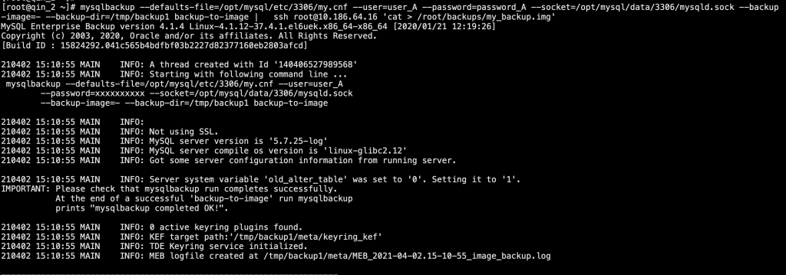											
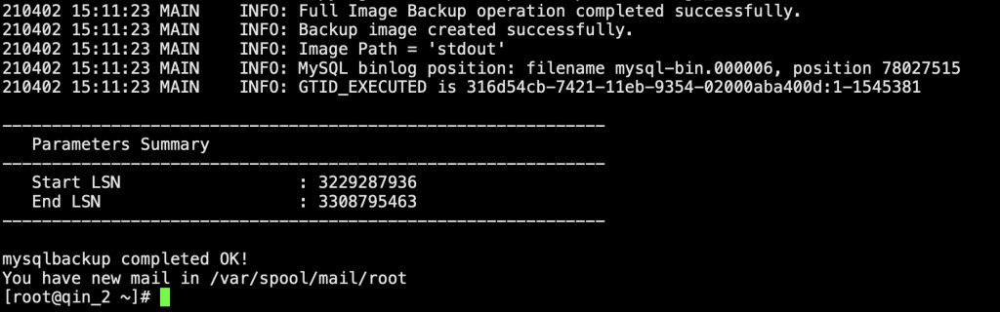											
查看远端（qin_4）备份数据
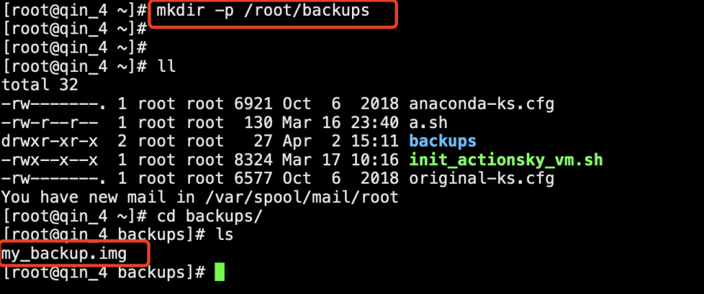											
恢复数据
`-- 删除远端服务器（qin_4）上原有的实例数据
shell> systemctl stop mysqld_3306 && rm -rf /opt/mysql/data/3306/* && rm -rf /opt/mysql/log/binlog/3306/* && rm -rf /opt/mysql/log/relaylog/3306/* && rm -rf /opt/mysql/log/redolog/3306/*
-- 恢复备份数据到数据目录
shell> mysqlbackup --defaults-file=/opt/mysql/etc/3306/my.cnf --backup-dir=/root/backups --backup-image=/root/backups/my_backup.img --datadir=/opt/mysql/data/3306 copy-back-and-apply-log
-- 修改属组属主
shell> chown -R actiontech-mysql:actiontech-mysql /opt/mysql/data/3306 && chown -R actiontech-mysql:actiontech-mysql /opt/mysql/log/binlog/3306/ && chown -R actiontech-mysql:actiontech-mysql /opt/mysql/log/redolog/3306/ && chown -R actiontech-mysql:actiontech-mysql /opt/mysql/log/relaylog/3306/
-- 启动实例
shell> systemctl start mysqld_3306`
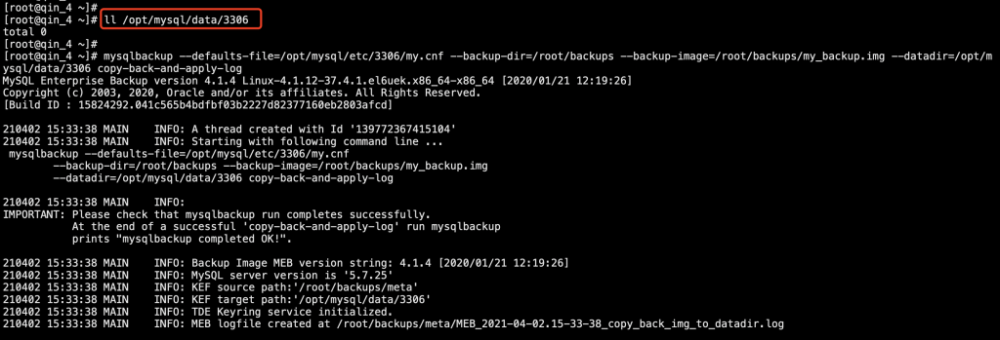											
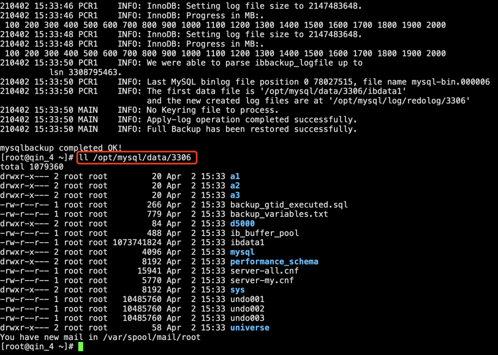											
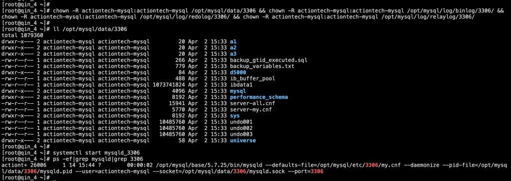											
建立复制
`mysql> CHANGE MASTER TO MASTER_HOST='10.186.64.13',
            MASTER_USER='universe_op',
            MASTER_PASSWORD='_Uq0%+58vv617$6N',
            MASTER_PORT=3306,
            MASTER_AUTO_POSITION=1;
mysql> start slave;`
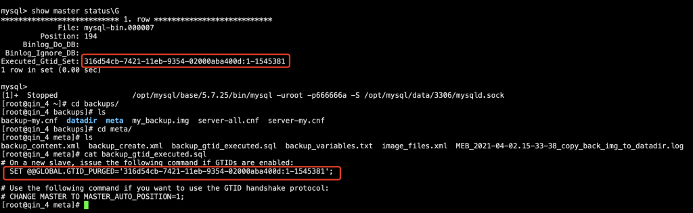											
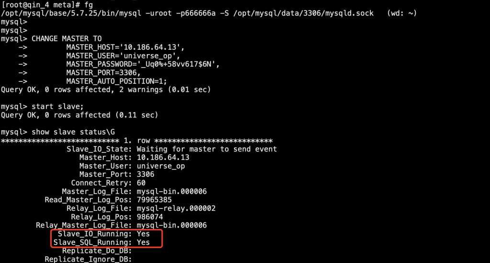											
**场景二 将备份文件流式传输到远程主机，并恢复**
备份命令
`-- 在qin_4上清除上个测试场景恢复的数据
shell> systemctl stop mysqld_3306 && rm -rf /opt/mysql/data/3306/* && rm -rf /opt/mysql/log/binlog/3306/* && rm -rf /opt/mysql/log/relaylog/3306/* && rm -rf /opt/mysql/log/redolog/3306/*
-- 在qin_2执行备份命令
shell> mysqlbackup  --defaults-file=/opt/mysql/etc/3306/my.cnf --user=user_A --password=password_A --socket=/opt/mysql/data/3306/mysqld.sock --backup-dir=/tmp/backup2 --backup-image=-  --compress backup-to-image | ssh root@10.186.64.16 'mysqlbackup --backup-dir=/root/backup_tmp --datadir=/opt/mysql/data/3306 --uncompress --backup-image=- copy-back-and-apply-log'`
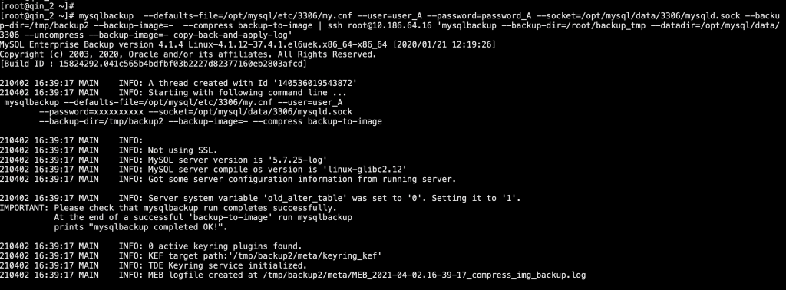											
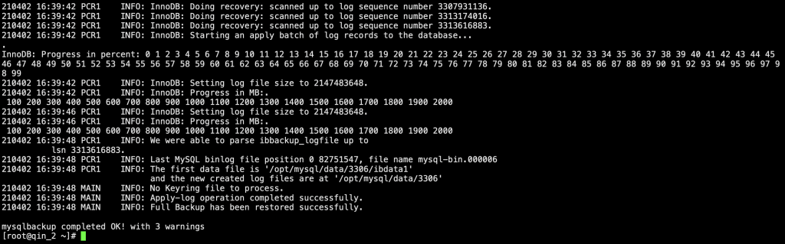											
查看远程服务器 qin_4 上恢复出来的数据
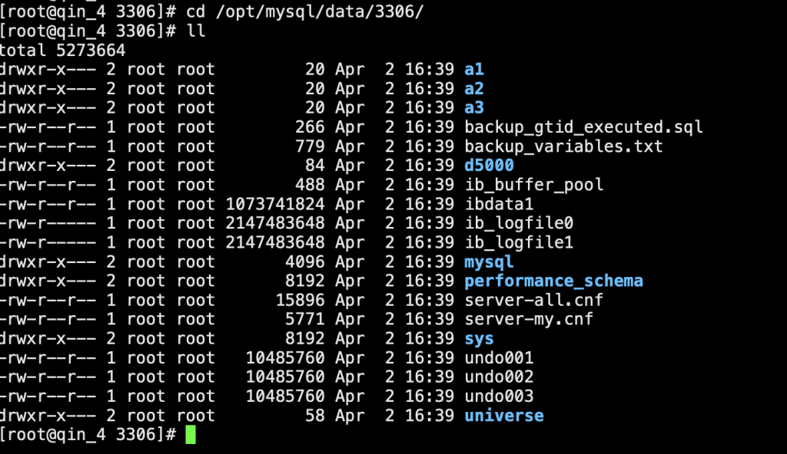											
**测试结果：**
mysqlbackup 既可以直接将备份文件流式传输到远程服务器，还可以选择在传输到远端后直接恢复出数据。
使用 mysqlbackup 备份到远程服务器时，可以提前给服务器之间配置 SSH 密钥认证，实现免密登录，也可以在备份中途输入密码完成备份，两者皆可。
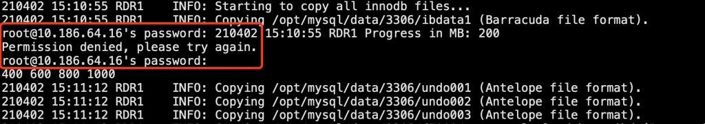											
#### 2. XtraBackup 工具
#### 介绍：Percona XtraBackup 工具也能通过流式将备份文件直接传到远端服务器。它支持以 tar 或者 xbstream 两种方式传输到标准输出，再通过管道和 ssh 传到远端。XtraBackup 工具集成了 innobackupex，且依赖于 xbstream 和 qpress 工具解流和解压缩。备份到远端服务器时，需要提前配置免密登录，否则会备份失败，XtraBackup 不支持在备份过程中输入密码（不过该问题可以通过使用 sshpass -p 解决）。测试过程：场景一 tar 方式流式到远端备份命令-- 在qin_2上配置免密登录到远端（qin_4）shell> ssh-keygenshell> ssh-copy-id root@10.186.64.16-- 备份命令shell> innobackupex --defaults-file=/opt/mysql/etc/3306/my.cnf --user=user_A --password=password_A --socket=/opt/mysql/data/3306/mysqld.sock --no-timestamp --stream=tar /tmp/backup_xtrabackup | ssh root@10.186.64.16 \ "cat - > /root/xtrabackup_`date "+%Y%m%d"`.tar"-- 备份参数    --stream=tar ：指定流式方式为tar或xbstream    /tmp/backup_xtrabackup ：指定临时备份目录
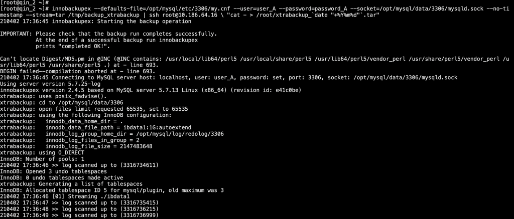											
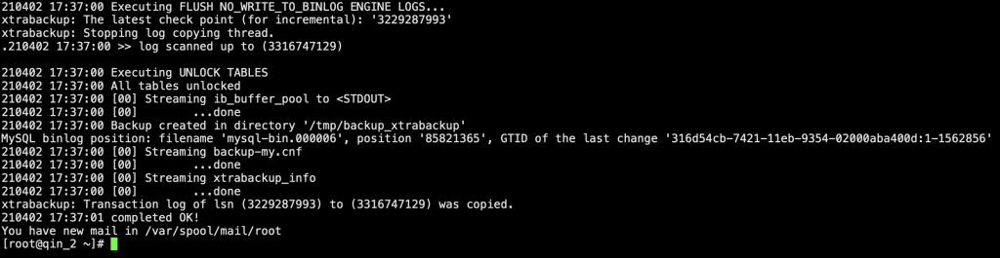											
查看远端备份数据
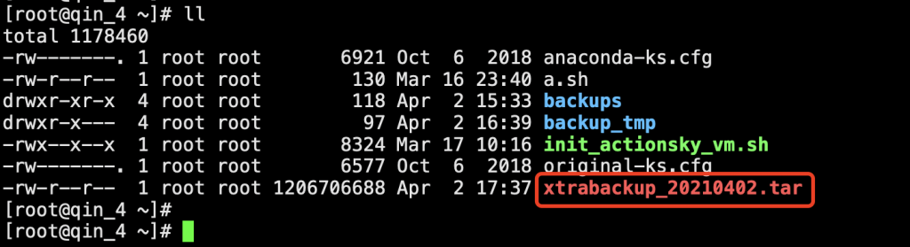											
解压缩恢复数据
`-- 在远程服务器上解压缩
shell> mkdir -p /root/xtrabackup_20210402
shell> tar -xf xtrabackup_20210402.tar -C /root/xtrabackup_20210402
    
-- 恢复备份数据到数据目录
shell> innobackupex --apply-log /root/xtrabackup_20210402
shell> innobackupex --defaults-file=/opt/mysql/etc/3306/my.cnf --move-back /root/xtrabackup_20210402
-- 修改属组属主
shell> chown -R actiontech-mysql:actiontech-mysql /opt/mysql/data/3306 && chown -R actiontech-mysql:actiontech-mysql /opt/mysql/log/binlog/3306/ && chown -R actiontech-mysql:actiontech-mysql /opt/mysql/log/redolog/3306/ && chown -R actiontech-mysql:actiontech-mysql /opt/mysql/log/relaylog/3306/
-- 启动实例
shell> systemctl start mysqld_3306`
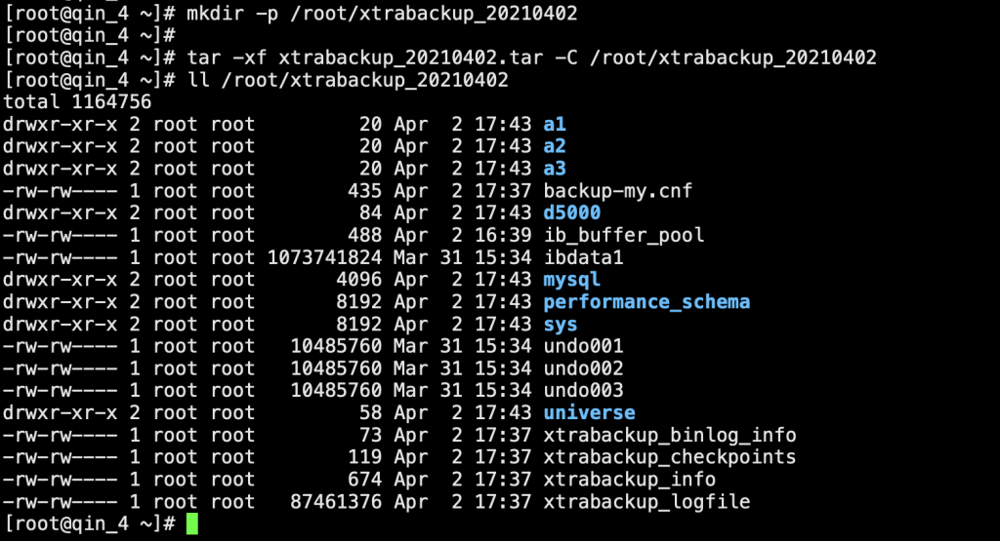											
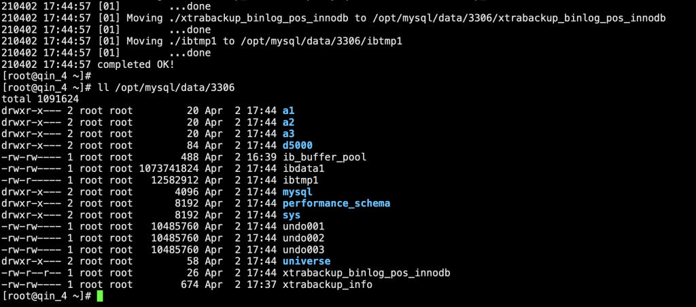											
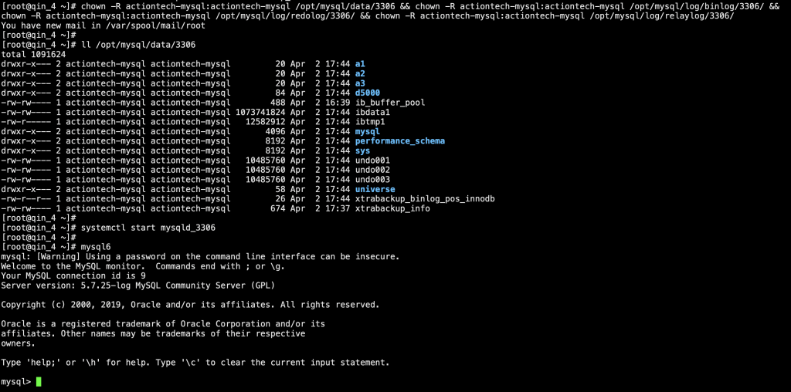											
**场景二 xbstream方式流式到远端**
备份命令
`-- 远程服务器上创建备份文件目录
shell> mkdir -p /root/xtrabackup_20210402
-- 备份文件以xbstream的方式传到远程服务器并解流
shell> innobackupex --defaults-file=/opt/mysql/etc/3306/my.cnf --user=user_A --password=password_A --socket=/opt/mysql/data/3306/mysqld.sock --no-timestamp --compress --stream=xbstream /tmp/backup_xtrabackup | ssh root@10.186.64.16 "xbstream -x -C /root/xtrabackup_20210402"`
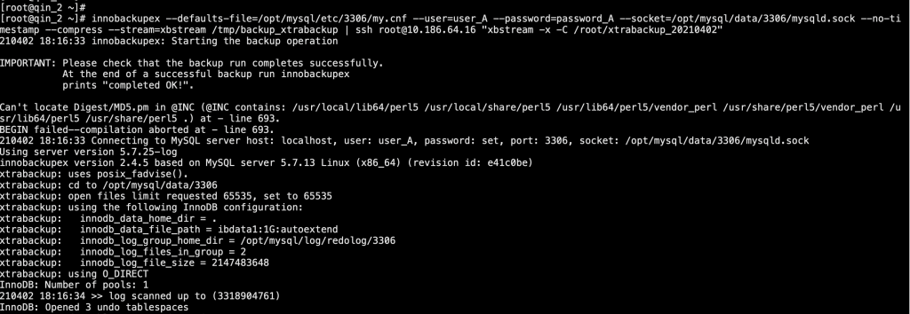											
查看远端备份数据
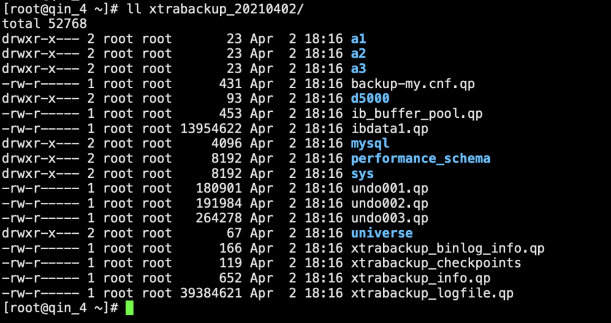											
将备份数据解压缩，并恢复到数据目录
`-- 解压缩,应用redo
shell> innobackupex --decompress /root/xtrabackup_20210402
shell> innobackupex --apply-log /root/xtrabackup_20210402
-- 删除"qp"文件，并将数据恢复到数据目录
shell> find /root/xtrabackup_20210402 -name "*.qp" | xargs rm -f
shell> innobackupex --defaults-file=/opt/mysql/etc/3306/my.cnf --move-back /root/xtrabackup_20210402`
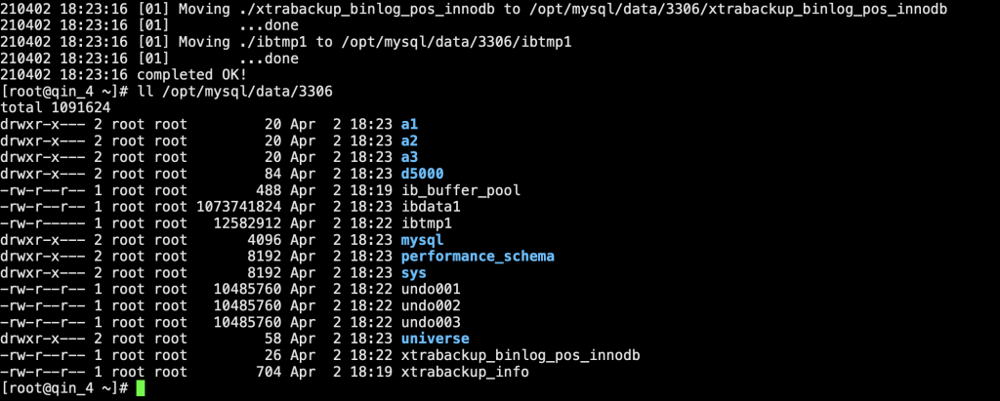											
修改属组属主，启动实例
`-- 修改属组属主
shell> chown -R actiontech-mysql:actiontech-mysql /opt/mysql/data/3306 && chown -R actiontech-mysql:actiontech-mysql /opt/mysql/log/binlog/3306/ && chown -R actiontech-mysql:actiontech-mysql /opt/mysql/log/redolog/3306/ && chown -R actiontech-mysql:actiontech-mysql /opt/mysql/log/relaylog/3306/
-- 启动实例
shell> systemctl start mysqld_3306`
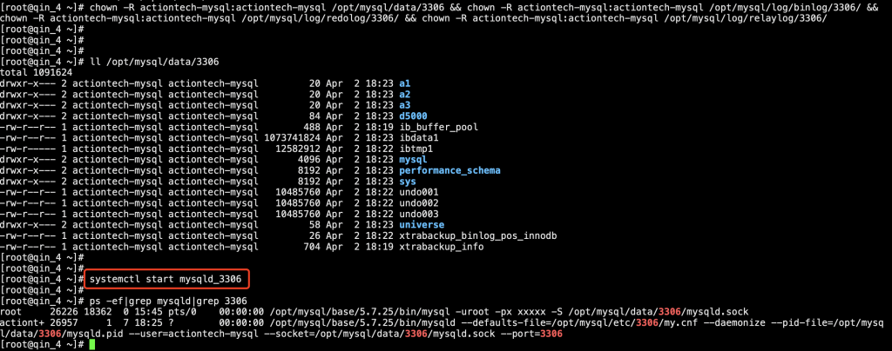											
**测试结果：**
测试过程表明，XtraBackup 工具也可以通过流式备份传到远端 MySQL 服务器。
不过，由于需要依赖第三方工具，所以，解流和解压缩的过程显得有些复杂，如果想要将备份文件传到远端之后，直接恢复出来，可以参考下面的方式：
`shell> innobackupex --defaults-file=/opt/mysql/etc/3306/my.cnf --user=user_A --password=password_A --socket=/opt/mysql/data/3306/mysqld.sock --no-timestamp --compress --stream=xbstream /tmp/backup_xtrabackup | sshpass -p '666666a' ssh root@10.186.64.16 "mkdir -p /root/xtrabackup_20210402 && xbstream -x -C /root/xtrabackup_20210402 && innobackupex --decompress /root/xtrabackup_20210402 && innobackupex --apply-log /root/xtrabackup_20210402 && find /root/xtrabackup_20210402 -name "*.qp" | xargs rm -f && innobackupex --defaults-file=/opt/mysql/etc/3306/my.cnf --move-back /root/xtrabackup_20210402"`
## 总结
mysqlbackup 和 Percona XtraBackup 工具都支持流式传输备份文件到远端服务器，甚至是直接在远端服务器上恢复数据。
相比 mysqlbackup 工具，Percona XtraBackup 需要解压解流等操作，恢复数据没有 mysqlbackup 简单快捷。
配置服务器之间 SSH 密钥认证，或使用 sshpass -p 可以解决中途输入密码的窘境。
## 参考链接
> https://dev.mysql.com/doc/mysql-enterprise-backup/4.1/en/meb-backup-streaming.htmlhttps://www.percona.com/doc/percona-xtrabackup/2.4/innobackupex/streaming_backups_innobackupex.html
**文章推荐：**
[技术分享 | mysqlbackup 可以远程备份吗？](https://opensource.actionsky.com/20210423-mysql/)****
[技术分享 | MariaDB 10.1.9 迁移到 MySQL 5.7.25](https://opensource.actionsky.com/20200608-mysql/)