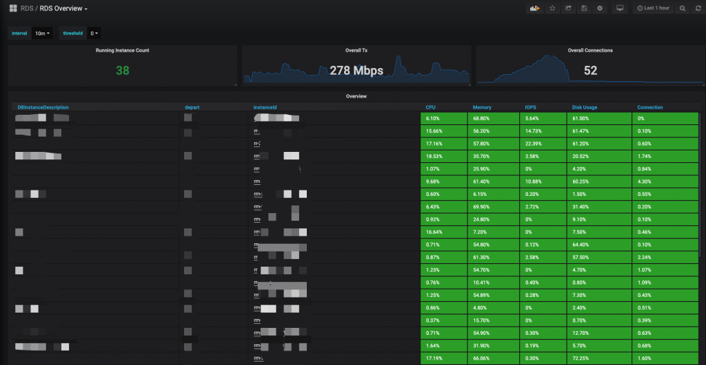
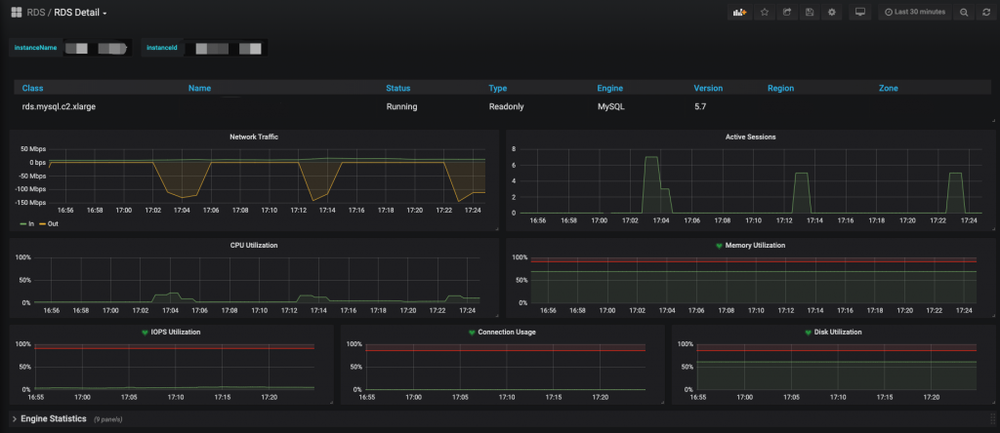
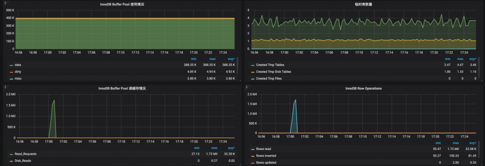
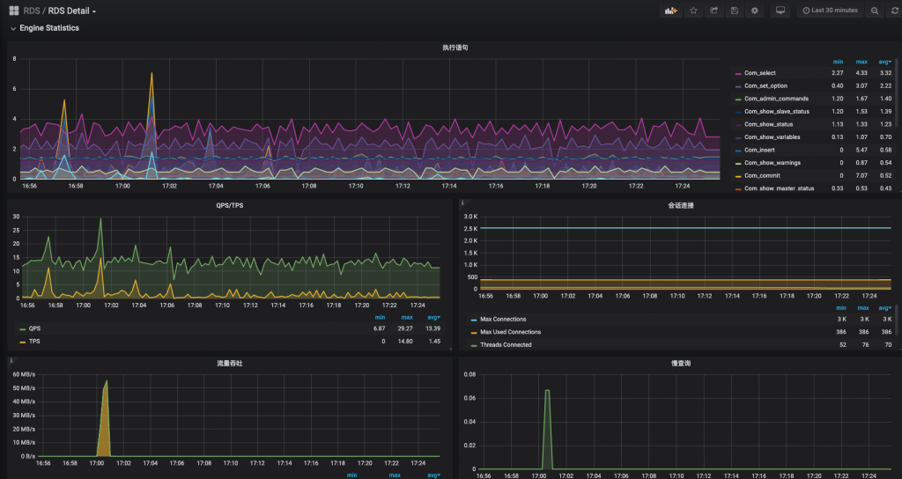

# 技术分享 | 阿里云 RDS 监控可以不那么“难看”

**原文链接**: https://opensource.actionsky.com/20190102-rds/
**分类**: 技术干货
**发布时间**: 2020-01-02T00:39:06-08:00

---

云厂商可以帮助我们解决 8-90% 的“脏乱臭”的活，方便得不要不要的，当然也是有得有失吧。但个人觉得 **RDS 监控** 用起来确实有点不是太方便，自然要想办法改善使用。Prometheus+Grafana，这套万金流自然首当其冲（有的人喜欢 zabbix，都可以，仁者见仁）
**1. 工具收集阶段**
**1.1 Prometheus+Grafana 环境部署**此处不做过多赘述，网上文章很多。> 推荐电子书：prometheus-book
https://yunlzheng.gitbook.io/prometheus-book/
**1.2 阿里云 RDS（mysqld）相关监控**
MySQL 数据采集工具：mysqld_exporter> https://github.com/prometheus/mysqld_exporter
此工具也是 prometheus 官方工具> 下载地址：https://github.com/prometheus/mysqld_exporter/releases
- `export DATA_SOURCE_NAME='user:password@(hostname:3306)/'`
- `./mysqld_exporter <flags>`
**1.3 资源监控**除了 RDS（MySQL）本身的一些监控，还需要关注资源的一些信息。如果是自建 IDC，肯定是使用 node_exporter> https://github.com/prometheus/node_exporter
谁让我们使用的是云产品呢，哎～
幸运的是 PingCAP 的工程师 Aylei> https://github.com/aylei
写了一套 aliyun-exporter> https://github.com/aylei/aliyun-exporter
` 阿里云API `收集监控数据（可以监控 ECS、SLB、Redis、Mongodb、RDS 等），以 prometheus 格式存储，同时非常 nice 的做了非常漂亮的 Grafana 图。**但是**，由于“年久失修”，在使用的时候遇到不少问题，再加上个人代码能力青铜三段，重写有点难，那就硬修吧。以下是在使用时遇到的问题。
1.3.1 重新打包 Dockerfile
原因是 `pip3 install aliyun-exporter` 拉的镜像没有 `SLB` 的模块（其实这个跟 RDS 监控没什么关系，另一位同事在搞 SLB 的监控，顺道都修了），人肉了很久，发现 github 中最新的代码有这个功能。尴尬～想用也只能自己动手了，替换最新的代码文件 `info_provider.py`，重新打包。脚本如下：- `$ cat docker.file`
- `FROM aylei/aliyun-exporter:0.3.0`
- `RUN pip3 install -U aliyun-exporter==0.3.1PyYAML==5.1.2`
- `RUN pip3 install  aliyun-python-sdk-slb aliyun-python-sdk-dds`
- `COPY info_provider.py /usr/local/lib/python3.7/site-packages/aliyun_exporter/info_provider.py`
- `# 注意：作者没有把最新的代码打包进docker中，没办法只能我们先去下载代码，然后替换`
- 
- 
- `$ docker build -f docker.file -t aliyun-exporter:0.3.1.`
- 
1.3.2 修改 bug 配置
这个地方应该是一个 bug。首先说明 `aliyun_exporter` 本身是可以获取所有监控信息，也就是说 **1.2 **中的 `mysqld_exporter` 完全可以不需要**，但是**，在实际使用中又发现，如果增加 `rds_performance` 的监控项，服务无法启动。所以无奈，对于 RDS 仅限于做资源监控。幸运的是有 mysqld_exporter 作为补充。
1.3.3 启动 docker
- `$ docker run -d  -p 9526:9525 -e "ALIYUN_ACCESS_ID=XXXX" -e "ALIYUN_ACCESS_SECRET=XXXX" -e "ALIYUN_REGION=cn-XXXX" -v $(pwd)/aliyun-exporter-test.yml:/aliyun-exporter.yml  aliyun-exporter:0.3.1  -p 9525 -c  /aliyun-exporter.yml`
- 
1.3.4 Grafana 配置图
这部分的大小改动也不少：数据源的配置啊、怎么划分部门啊、加标签啊、Alter 怎么解决不能给模版加告警啊 等等等等，就不赘述了。具体问题具体分析吧。
**2. 工具组合**
**2.1 架构图**- `+----+`
- `|RDS1+-------+`
- `+----+       |        ECS`
- `             >+-------------------+    +-------------+`
- `.             |  mysqld_exporter  |    | Prometheus |`
- `.   +-------->+         +         +---->      +      |`
- `.             |  aliyun_exporter  |    |   Grafana  |`
- `.            >+-------------------+    +-------------+`
`             |`
- `+----+       |`
- `|RDSn+------+`
- `+----+`
如上图，需要一台 ECS 部署 `mysqld_exporter` 和 `aliyun_exporter` 进行信息采集，再将采集的信息丢给 `Prometheus`。
**2.2 supervisor+mysqld_exporter**
`mysqld_exporter` 裸跑有点慌。所以使用进程管理工具 `supervisor` 协助管理。- `# 脚本模版`
- `$  cat mysqld_exporter.xxxx.conf`
- `[program:xxxx]`
- `directory = /opt/mysqld_exporter`
- `command = /bin/nohup /opt/mysqld_exporter/mysqld_exporter --web.listen-address=[IP]:[PORT] --collect.global_status --collect.global_variables --collect.slave_status --collect.binlog_size --collect.engine_innodb_status --collect.info_schema.innodb_metrics --collect.info_schema.innodb_tablespaces --collect.info_schema.processlist --collect.info_schema.tablestats --collect.perf_schema.eventsstatements --collect.perf_schema.eventswaits --collect.perf_schema.file_events`
- `autostart = true`
- `startsecs = 5`
- `autorestart = true`
- `startretries = 3`
- `user = root`
- `redirect_stderr = true`
- `stdout_logfile_maxbytes = 20MB`
- `stdout_logfile_backups = 20`
- `stdout_logfile = /var/log/supervisor/xxxx.log`
- `environment=DATA_SOURCE_NAME='user:password@(hostname:3306)/'`
查看服务- `$ supervisorctl status`
- `mysql_xxx_01                  RUNNING   pid 13935, uptime 4:15:15`
- `mysql_xxx_02                  RUNNING   pid 14053, uptime 4:15:15`
- `mysql_xxx_03                  RUNNING   pid 13866, uptime 4:15:15`
- `...`
**2.3 prometheus 服务发现**
- `# 主配置文件`
- `$ cat prometheus.yml`
- `...`
- `  - job_name: 'mysqld_exporter'`
- `    file_sd_configs:`
- `    - files:`
- `      - '/usr/local/prometheus/sd_cfg/mysqld_exporter.yml'`
- `      refresh_interval: 15s`
- `...`
- 
- `# 服务发现配置文件`
- `$ cat /usr/local/prometheus/sd_cfg/mysqld_exporter.yml`
- `- labels:`
- `    alias : test`
- `    depart : "TEST"`
- `  targets:`
- `  - [ECS_IP]:[PORT_TEST]`
- 
- `- labels:`
- `    alias : qa`
- `    depart : "QA"`
- `  targets:`
- `  - [ECS_IP]:[PORT_QA]`
- 
- `- labels:`
- `    alias : pro1`
- `    depart : "PRO"`
- `  targets:`
- `  - [ECS_IP]:[PORT_PRO1]`
- 
- `- labels:`
- `    alias : pro2`
- `    depart : "PRO"`
- `  targets:`
- `  - [ECS_IP]:[PORT_PRO2]`
- `...`
服务发现好处不言而喻，自动加载新增 RDS
**2.4 最后一哆嗦**
目前已经完成了阿里云 RDS 所有层面的监控，难道每次新增一套 RDS 都要人肉一遍这个流程？显然有点二了。只描述思路，就不贴脚本了：1. 通过阿里云 API，获取所有 RDS 信息；2. 根据获取的信息为每个 RDS 生成 `mysqld_exporter` 启动脚本，并通过 `supervisor` 控制自启动；3. 根据获取的信息更新 `sd_cfg/mysqld_exporter.yml`，实现服务自发现；4. 最后，计划任务定期去扫阿里云 API，判断是否有新的 RDS 创建/删除至此，再也不用人肉去加监控了，脚本不死，一切自动。
**3. 简单效果展示**
Alien_exporter 采集的数据
											
Detail 的数据源是两部分- 资源监控
											
- 
mysql 监控
											
											
**4. 遗憾**
一个 `mysqld_exporter` 进程只能监控一个 RDS 实例，所以 N 多 RDS 实例，就要对应启动 N 个 `mysqld_exporter`，同时要分配 N 个不同端口（后续可以通过修改 `mysqld_exporter` 源码优化只启动一个 `mysqld_exporter` 服务）水平有限，一个监控搞的那么碎，东拼西凑的，如哪位大佬有更优的解决方案求指导。另外，调用阿里云API每个月是有上限的，超出要付费的，还好一个月 50 块钱的足够用。另外，会有 API 获取不到数据的情况。出现断图也是很常见，但 `mysqld_exporter` 还是很 ok 的。
**社区近期动态**
**No.1**
**Mycat 问题免费诊断**
诊断范围支持：
Mycat 的故障诊断、源码分析、性能优化
服务支持渠道：
技术交流群，进群后可提问
QQ群（669663113）
社区通道，邮件&电话
osc@actionsky.com
现场拜访，线下实地，1天免费拜访
关注“爱可生开源社区”公众号，回复关键字“Mycat”，获取活动详情。
**No.2**
**社区技术内容征稿**
征稿内容：
格式：.md/.doc/.txt
主题：MySQL、分布式中间件DBLE、数据传输组件DTLE相关技术内容
要求：原创且未发布过
奖励：作者署名；200元京东E卡+社区周边
投稿方式：
邮箱：osc@actionsky.com
格式：[投稿]姓名+文章标题
以附件形式发送，正文需注明姓名、手机号、微信号，以便小编及时联系