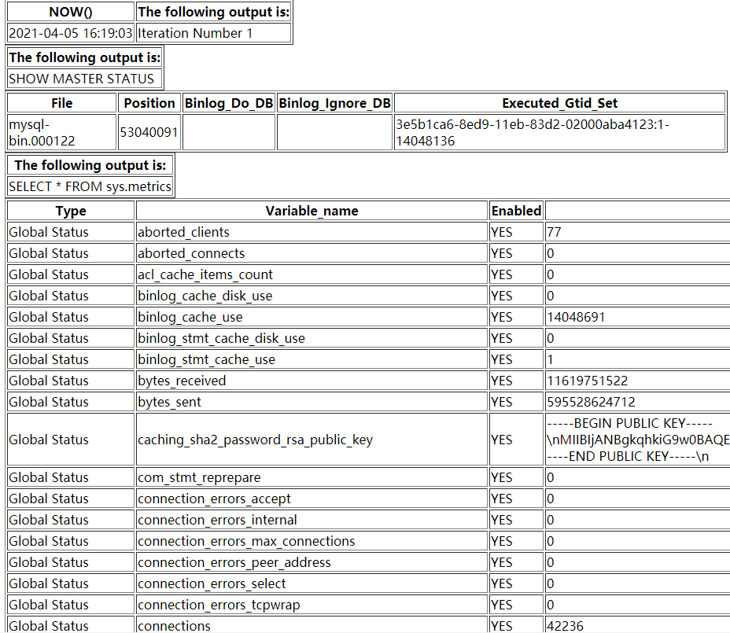

# 技术分享| MySQL 的 AWR Report？— MySQL 状态诊断报告

**原文链接**: https://opensource.actionsky.com/20210507-mysql/
**分类**: MySQL 新特性
**发布时间**: 2021-05-07T00:34:15-08:00

---

作者：秦福朗爱可生 DBA 团队成员，负责项目日常问题处理及公司平台问题排查。热爱 IT，喜欢在互联网里畅游，擅长摄影、厨艺，不会厨艺的 DBA 不是好司机，didi~本文来源：原创投稿*爱可生开源社区出品，原创内容未经授权不得随意使用，转载请联系小编并注明来源。
## 引言
用过 Oracle 数据库的同学都知道，在 Oracle 有个功能：AWR（全称为 Automatic Workload Repository），自动负载信息库。它收集关于特定数据库的操作统计信息和其他统计信息，Oracle 以固定的时间间隔（默认为 1 个小时）为其所有重要的统计信息和负载信息执行一次快照，并将快照存放入 AWR 中，为 DBA 们分析数据库提供了非常好的便利条件。虽然 MySQL 没有这么强的功能，但 MySQL 有一个类似的，名叫 diagnostics 的存储过程，提供了相类似的功能。
diagnostics() 存储过程是利用 MySQL 自身的 information_schema，performance_schema、sys 等元数据信息及性能数据信息的库表函数等，对当前服务器状态进行诊断，提供给 DBA 一份可以用于分析数据库状态的报告。
## 基本包含信息
diagnostics() 收集的数据主要包含以下信息：
- 来自 metrics 视图的信息；
- 来自其他相关的 sys schema 视图的信息，比如检测第 95 百分位数的查询视图；
- 如果是 NDB Cluster 的 MySQL 服务器，则还会有 ndbinfo schema 的信息；
- 主从复制状态信息
一些 sys schema 的视图被计算为初始（可选）、overall 和 delta：
- 初始视图是 diagnostics() 过程开始时的视图内容。这个输出与用于 delta 视图的起始值相同。如果 diagnostics.include_raw 配置选项为 ON，则初始视图会被包含在报告中。
- overall 视图是 diagnostics() 过程结束时的视图内容。这个输出与用于 delta 视图的结束值相同。overall 视图总是被包含在报告内。
- delta 视图是 procedure 执行开始到结束的差异。最小值和最大值分别是结束视图的最小值和最大值。它们不一定反映监控期间的最小值和最大值。除了 metrics 视图外，Delta 仅计算第一个和最后一个输出之间的差值。
> **注意：**
这个存储过程通过操作 sql_log_bin 系统变量的会话值，在执行过程中禁用二进制日志。这是一个受限制的操作，所以这个存储过程需要有足够的权限来设置受限制的会话变量。
## 命令示例
#### 方式 1：
创建一个诊断报告，使用 current  Performance Schema 设置，每 30 秒启动一次迭代，最多运行 120 秒：
`mysql> CALL sys.diagnostics(120, 30, 'current')；
`要在 diagnostics() 过程运行时将其输出内容捕获到文件中，可使用 MySQL 客户端 “tee 文件名”和 notee 命令：
`mysql> tee diag.out;
mysql> CALL sys.diagnostics(120, 30, 'current');
mysql> notee;
`此方式生成表格样式如下：
											
											
#### 方式 2：
`shell> mysql -uroot -p -S /opt/mysql/data/6666/mysqld.sock -H -e "CALL sys.diagnostics(120, 30, 'current');" >report.html
`此方式生成网页样式如下：
											
											
## 参数
`CALL sys.diagnostics( in_max_runtime, in_interval, 'current')；
`- in_max_runtime （INT UNSIGNED）：最大数据采集时间，单位为秒。默认值为 60 秒，自定义需使用大于 0 的值。
- in_interval （INT UNSIGNED）：数据采集之间的休眠时间，单位为秒。默认值为 30 秒，自定义需使用大于 0 的值。
- in_auto_config ENUM(&#8216;current&#8217;, &#8216;medium&#8217;, &#8216;full&#8217;): 要使用的 Performance Schema 配置。允许的值有：
- current：使用当前的 instrumen 和 consumers 设置。
- medium：启用部分 instrumen 和 consumers。
- full：启用所有 instrumen 和 consumers。
> **注意：**
有关 Performance Schema 模式下的 instrumen 和 consumer 的概念与基本使用原理可自行查阅资料，本文不再赘述。
启用的 instrumen 和 consumer 越多，对 MySQL 服务器性能影响越大。要小心使用 medium 设置，尤其是 full 设置，对性能影响较大。没特殊要求使用 current 即可。
使用 medium 或 full 设置需要 super 权限，如果选择了 current 以外的设置，则会在程序结束时恢复当前设置。
## 配置选项
diagnostics() 操作可以使用下面的配置选项或者其对应的用户定义变量：
以下参数需新增或修改 sys.sys_config，具体用法可了解 MySQL 官方文档 sys_config 一节。
- debug, @sys.debug
如果该选项为 ON，则产生调试输出。默认值为 OFF。
`UPDATE `sys`.`sys_config` SET `value` = 'ON' WHERE `variable` = 'debug';`
											
- diagnostics.allow_i_s_tables, @sys.diagnostics.allow_i_s_tables
如果这个选项为 ON，那么 diagnostics() 过程就被允许在 INFORMATION_SCHEMA.TABLES 表上执行表扫描。如果有很多表，这可能会有较高的代价。默认值是 OFF。
`UPDATE `sys`.`sys_config` SET `value` = 'ON' WHERE `variable` = 'diagnostics.allow_i_s_tables';`
											
- diagnostics.include_raw, @sys.diagnostics.include_raw 如果这个选项为 ON，则 diagnostics() 过程的输出包括查询 metrics 视图的原始输出。默认值是 OFF。
```
UPDATE `sys`.`sys_config` SET `value` = 'ON' WHERE `variable` = 'diagnostics.include_raw';
```
											
- statement_truncate_len, @sys.statement_truncate_len
format_statement() 函数返回的语句的最大长度。较长的语句会被截断到这个长度。默认值是 64。
`UPDATE `sys`.`sys_config` SET `value` = '32' WHERE `variable` = 'statement_truncate_len';`
## 报告信息
**（1）MySQL 服务器基本信息**
											
**（2）基本配置信息**
- 参数配置
											
- Performance Schema 下的 instrumen 与 consumer 配置情况
											
**（3）sys schema初始状态**
											
**（4）每次迭代的信息**
和命令给定的迭代周期与次数有关
											
**（5）Schema 信息**
											
**（6）Overall 状态信息**
											
**（7）Delta 状态信息**
											
因篇幅长度，以上只是列出部分信息，具体信息可以自行实践了解，文档末尾附上一份报告链接，可下载审阅。
## 结语
diagnostics() 包含的信息很多，可实现“一键”数据库性能信息状态诊断并输出报告，帮助 DBA 在实际工作中便捷地分析数据库状态。
> **附链接：**
sys_config:https://dev.mysql.com/doc/refman/8.0/en/sys-sys-config.html
**诊断报告示例：**
链接：https://pan.baidu.com/s/1XEV2Jf9qe9-dpi-8IN_6UQ  提取码：3306
**文章推荐：**
[技术分享 | 我的内存去哪儿？生产实践](https://opensource.actionsky.com/20200927-mysql/)