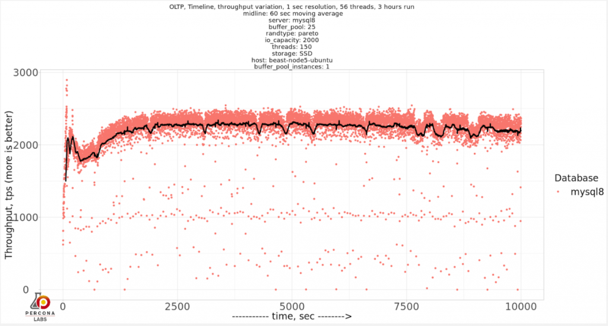
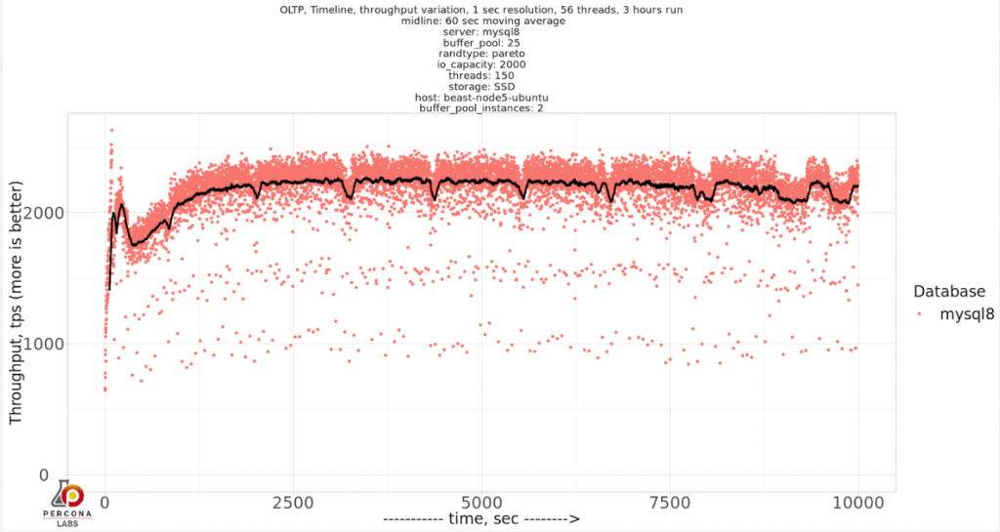
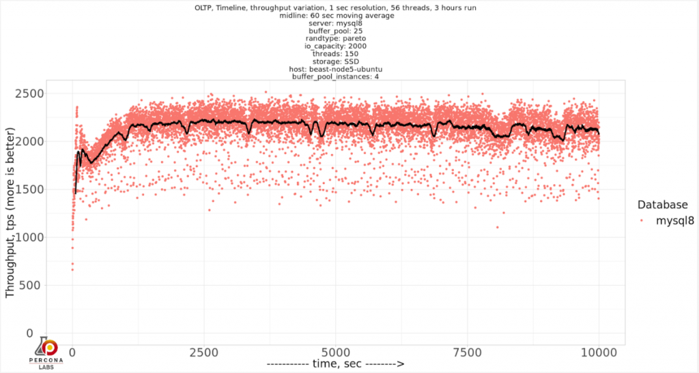
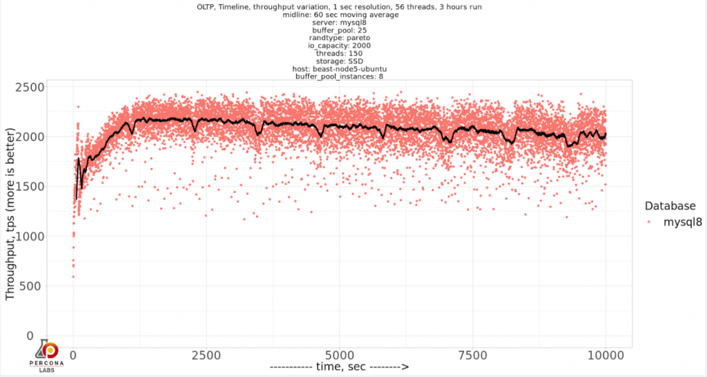
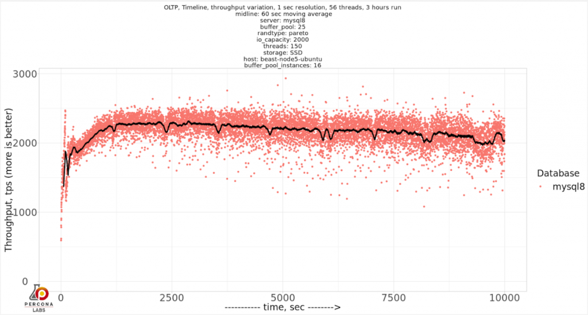
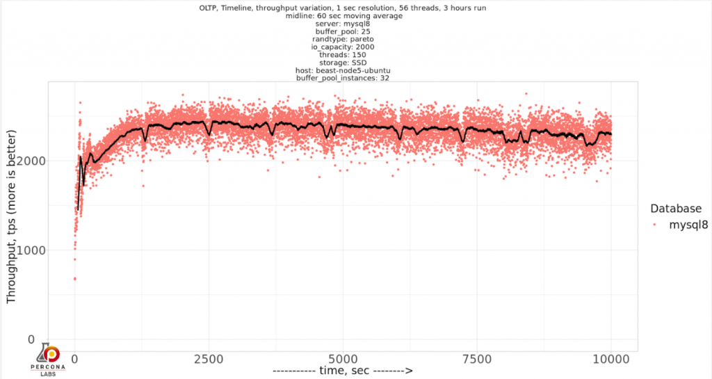
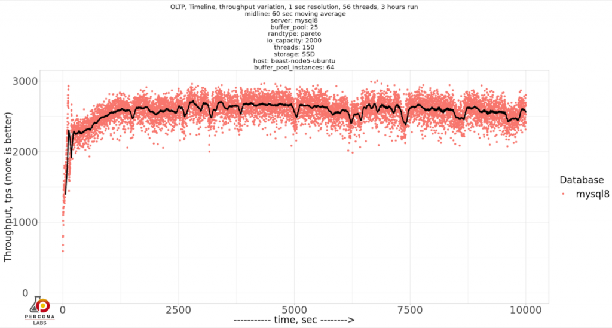
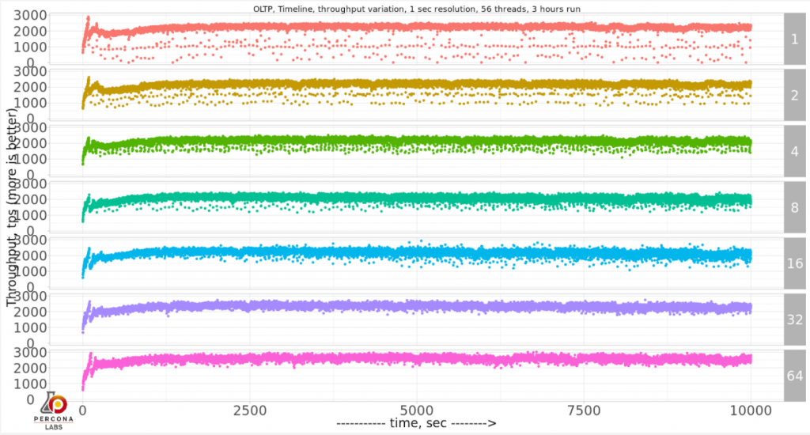
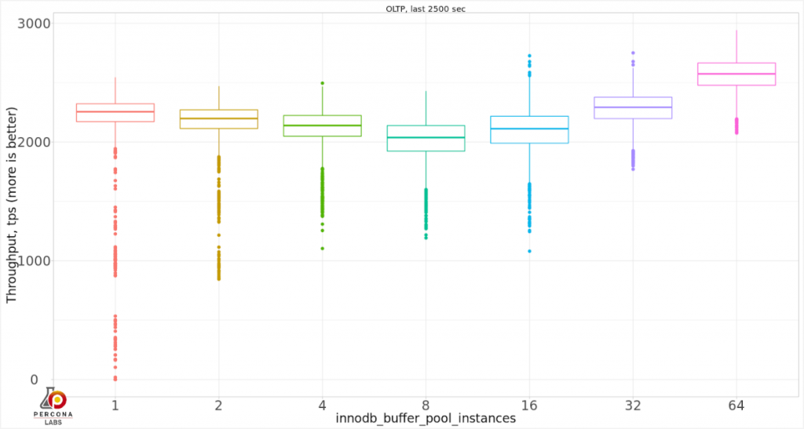

# 技术译文 | MySQL 8 需要多大的 innodb_buffer_pool_instances 值（上）

**原文链接**: https://opensource.actionsky.com/20200817-mysql/
**分类**: MySQL 新特性
**发布时间**: 2020-08-17T16:31:45-08:00

---

作者：Vadim Tkachenko
翻译：管长龙
本文来源：https://www.percona.com/blog/2020/08/13/how-many-innodb_buffer_pool_instances-do-you-need-in-mysql-8/ 
我曾经在文章《MySQL 5.7 安装后的性能调优》（文末链接）和《MySQL 101：调整 MySQL 性能的参数》（文末链接）中谈到过 innodb_buffer_pool_instances  这个参数 ，建议使用值为“8”，但我不能说这个值是否足够好。因此，让我们看看在以下情况下，使用不同的 innodb_buffer_pool_instances 值将获得什么结果。
我将使用 sysbench oltp_read_write 基准测试显示为帕累托图。我将为大小为 100 GB 的数据库设置 innodb_buffer_pool_size = 25GB，**因此在 buffer_pool 空间上会有竞争，这将是 IO 密集型情景情况。**
**基准测试**
硬件配置列表：
`System | Supermicro; SYS-F619P2-RTN; v0123456789 (Other)
Platform | Linux
Release | Ubuntu 18.04.4 LTS (bionic)
Kernel | 5.3.0-42-generic
Architecture | CPU = 64-bit, OS = 64-bit
Threading | NPTL 2.27
SELinux | No SELinux detected
Virtualized | No virtualization detected
# Processor ##################################################
Processors | physical = 2, cores = 40, virtual = 80, hyperthreading = yes
Models | 80xIntel(R) Xeon(R) Gold 6230 CPU @ 2.10GHz
Caches | 80x28160 KB
# Memory #####################################################
Total | 187.6G`通过 SATA SSD INTEL SSDSC2KB960G8（英特尔企业级 SSD D3-S4510）上的存储。
简短的设置概述：- 数据无法存储到内存中（数据大小为〜100GB，服务器上的内存为 188GB，我们使用 O_DIRECT 为 MySQL innodb_buffer_pool_size 分配了 25GB，因此即使服务器上有很多内存，也不会超过指定的 25GB 使用）。
- 存储上工作主要为读写密集型（将从存储中进行读取），并且在 MySQL 中进行了完全的 ACID 兼容和数据安全设置。
- 对于 SATA SSD 存储，innodb_io_capacity 将设置为 2000，而 innodb_io_capacity_max 为 4000。
- 将 innodb_buffer_pool_instances 测试以下值：1、2、4、8、16、32、64。
- innodb_buffer_pool_instances = 64，也是 MySQL 允许的最大值。
测试命令：`sysbench oltp_read_write --threads=150 --time=10000 \
--tables=40 --table_size=10000000 --mysql-host=127.0.0.1 \
--mysql-user=sbtest --mysql-password=sbtest \
--max-requests=0 --report-interval=1 --mysql-db=sbtest \
--mysql-ssl=off --create_table_options=DEFAULT CHARSET=utf8mb4 \
--report_csv=yes --rand-type=pareto run`基准测试将运行三个小时，每 1 秒报告一次吞吐量。
**SATA SSD 上的结果**
让我们看看每个 innodb_buffer_pool_instances 分别有什么结果：
innodb_buffer_pool_instances=1
											
innodb_buffer_pool_instances=2
											
innodb_buffer_pool_instances=4
											
innodb_buffer_pool_instances=8
											
innodb_buffer_pool_instances=16
											
innodb_buffer_pool_instances=32
											
innodb_buffer_pool_instances=64
											
似乎显而易见的是，随着我们增加 innodb_buffer_pool_instances 的值，它对吞吐量的变化产生了积极的影响。我们可以将结果压缩到一个图表中，以便仔细查看：
											
如果要比较吞吐量和偏差，请比较最近 2500 秒的结果：
											
因此，实际上 innodb_buffer_pool_instances = 64 显示出最佳的吞吐量和较小的可变性。从可变性的角度来看，建议的 innodb_buffer_pool_instances = 8 似乎比 1-4 的值更好，但不会产生最佳的吞吐量。
**最后的想法**
对于这种特殊情况，innodb_buffer_pool_instances = 64 是最佳选择，但我仍然不建议一种可靠的方法来找到最佳值。较小的 1-4 似乎会产生很大的可变性甚至停滞，因此从 8 开始是一个不错的选择。
**相关链接：**
1. 《MySQL 5.7 安装后的性能调优》
https://www.percona.com/blog/2016/10/12/mysql-5-7-performance-tuning-immediately-after-installation/
2. 《MySQL 101：调整 MySQL 性能的参数》
https://www.percona.com/blog/2020/06/30/mysql-101-parameters-to-tune-for-mysql-performance/