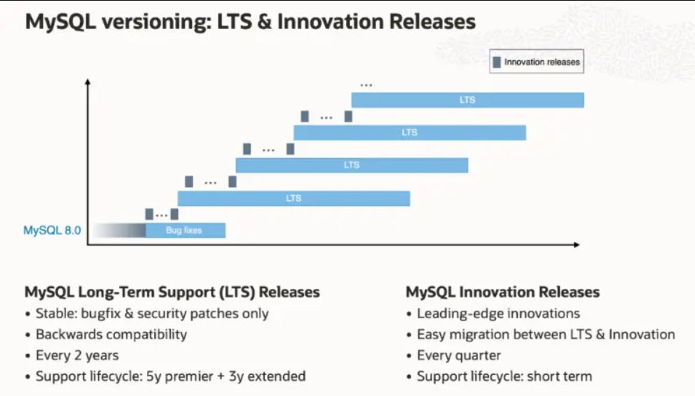
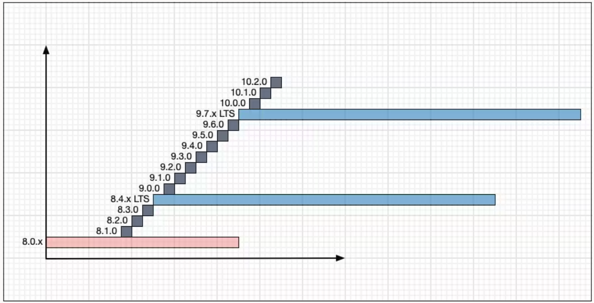

# 技术译文 | 一文了解 MySQL 全新版本模型

**原文链接**: https://opensource.actionsky.com/%e6%8a%80%e6%9c%af%e8%af%91%e6%96%87-%e4%b8%80%e6%96%87%e4%ba%86%e8%a7%a3-mysql-%e5%85%a8%e6%96%b0%e7%89%88%e6%9c%ac%e6%a8%a1%e5%9e%8b/
**分类**: MySQL 新特性
**发布时间**: 2023-07-24T00:44:47-08:00

---

MySQL 8.1 已经发布了，也宣布 MySQL 开始使用新的版本模型。
> 作者：Kenny Gryp / Airton Lastori
MySQL 产品团队。
原文：[https://blogs.oracle.com/mysql/post/introducing-mysql-innovation-and-longterm-support-lts-versions](https://blogs.oracle.com/mysql/post/introducing-mysql-innovation-and-longterm-support-lts-versions)
# 引子
在 Oracle，我们不断寻找方法来改进产品，以更好地满足您的需求。我们很高兴地推出 MySQL 创新版（Innovation）和长期支持版（LTS，Long-Term Support），这是 MySQL 版本模型中的一个重要改进。
MySQL 5.7 及之前版本的补丁版本主要致力于错误修复和安全补丁。这在 MySQL 8.0 的持续交付模型中发生了变化，补丁版本也包含了新特性。这使得 MySQL 能够更频繁地向用户发布新特性，而不仅仅是每隔几年才能发布一次特性。但是，我们理解这种方法可能会给那些只需要关键补丁和较少行为变更的项目和应用带来挑战。我们倾听了您的反馈并观察了行业趋势，现在我们正在过渡到一个版本模型，您可以在创新版（Innovation）和长期支持版（LTS）之间进行选择。

创新版和 LTS 版的质量都是生产级的。如果您渴望访问最新的功能和改进，并喜欢与最新技术保持同步，那么 MySQL 创新版本可能最适合您。该版本非常适合在快节奏的开发环境中工作的开发人员和 DBA，其中有高水平的自动化测试和现代的持续集成技术，可以实现更快的升级周期。另一方面，如果您的环境需要继续保持已经固定的行为，那么 LTS 版本就是您的不二之选。这些版本仅包含必要的修复，因此可以减少数据库软件行为变更带来的风险。
通过新的 MySQL 版本模型，您可以灵活地选择适合您特定应用和环境需求的选项。我们的目标是确保您在创新版和 LTS 版中都能获得卓越的用户体验。您可以在下面了解有关新版本模型和过渡过程的更多信息。
# 新的 MySQL 版本模型
## 过渡到创新版和 LTS 版
我们即将推出的新版本将过渡到新的 MySQL 版本模型。MySQL 8.1.0 将是我们的第一个创新版本，8.0.34+ 将只进行错误修复，直到 8.0 生命周期结束（EOL，定于 2026 年 4 月）。大约一年后，MySQL 8.x 版本最终将成为 LTS，这将为用户从 8.0.x 迁移到 8.x LTS 版本提供充足的时间。
在实践中，在这段过渡期间，如果您想要 MySQL 数据库的最新功能、改进和所有错误修复，请使用创新版本（例如 8.1.x、8.2.x、8.3.x 等)。如果您的 MySQL 只需要错误修复，请使用 8.0.x 版本（例如 8.0.35、8.0.36、8.0.37 等)。在这两种情况下，建议您都根据 Oracle 关键补丁更新（CPU）日历每季度更新 MySQL 数据库。当 8.x 成为 LTS 时，您可以从修复版本（例如 8.0.37）规划、测试和迁移到 LTS 版本（例如 8.4.1）。
## MySQL HeatWave 服务
MySQL HeatWave 服务由 Oracle 的 MySQL 团队进行全面管理、开发和支持。我们通过最新版本的 MySQL 提供最新改进和安全补丁。MySQL HeatWave 用户能从第 1 天开始访问错误修复，以及最新的功能，包括 OLTP、OLAP、机器学习和 Lakehouse。
MySQL HeatWave 用户现在可以选择创新版本，从 8.1.0 开始，以及错误修复版本，从 8.0.34 开始。该服务为每个数据库系统选择 MySQL 版本提供了灵活性，使用户可以根据应用程序要求混合匹配版本。使用 8.1+ 创新版本的用户可以充分利用该服务的潜力，访问最新功能和错误修复。另一方面,那些只需要关键错误修复且不需要最新功能的用户可以为其 MySQL 数据库选择 8.0.x 版本。
## MySQL 产品组合和支持生命周期
LTS 版本将遵循 [Oracle 终身支持政策](https://www.oracle.com/support/lifetime-support/resources.html)，包括 5 年的首要支持和 3 年的延长支持。创新版本将支持到下一个主要和次要版本。
MySQL 产品组合中的大多数产品将具有创新版和 LTS 版：
- MySQL Server、MySQL Shell、MySQL Router、MySQL NDB 集群将具有创新版和 LTS 版。
- 用于 Kubernetes 的 MySQL Operator，带有 InnoDB ReplicaSet、Cluster和 ClusterSet 将具有创新版和 LTS 版。
- MySQL 连接器将使用最新版本，但将被视为通用可用，并与所有支持的 MySQL 服务器版本兼容。
- MySQL Workbench 将保留在 8.0.x，通常可用并与所有支持的 MySQL 服务器版本兼容。
## MySQL 版本发布节奏
- 8.0.34+ 仅为错误修复版本（红色）
- 创新版本（灰色）可能每季度发布一次
- 大约每 2 年发布一个新的 LTS 版本（蓝色）。8.x LTS 版本的发布是一个例外，它将远早于 8.0 的 EOL。
在未来几年，MySQL 版本将类似于下图所示：

> 注意：这仅是一个示例，没有承诺版本编号将严格按照该呈现的方式。
## 创新版本
创新版本类似于 MySQL 8.0 持续开发模型（< 8.0.34），包括错误修复、安全补丁和新功能。
对创新版本的支持限于下一个次要版本（创新或 LTS）。当前的周期目标是每季度发布一个创新版本，递增次要版本号（例如 8.2、8.3 等)。创新版本内的补丁版本是可能的，但不太可能发生。
创新版本也将是通常可用的，建议用于生产环境中。错误修复和安全补丁通常会包含在下一个创新版本或 LTS 版本中，而不是作为该创新版本内补丁版本的一部分。在使用创新版本时，定期升级到最新的创新版本以跟上最新的错误修复和安全补丁是必要的。
除了错误修复、安全补丁和新功能，创新版本还将引入新的弃用功能、删除功能甚至行为更改。为了减少在引入这些更改时升级的风险和复杂性，将制定策略和最佳实践来规定何时以及如何进行。
### 弃用和删除的功能
在 MySQL 的以前版本中，一个版本中的弃用功能（例如 5.7）意味着该功能可能会在下一个 主要/次要 版本中被删除（例如 8.0）。随着创新版本的引入，将会有更多的 主要/次要 版本，因此弃用和删除功能何时发生将会改变。
当一个版本中弃用一个功能或行为时（例如 9.2 创新版本），该功能至少不能在一年内被删除（直到 9.6 创新版本)。这是为了给使用创新版本的用户修改数据库部署时间。
> 注意：LTS 版本中不会有任何删除。只有在第一个 LTS 版本（例如 8.4.0 LTS）中才能添加和删除功能，之后不能再删除。
在我们过渡到新模型并迈向第一个 8.x LTS 版本的过程中，预计会增加弃用和删除的数量。
### 行为更改
除了创新版本中的新功能，随着代码被重构或 MySQL 被修改以更符合 SQL 标准的行为（这在 LTS 版本中不会发生），也期望会有行为更改。
行为更改可能会产生很大影响，特别是在处理任何与应用程序相关的事项时，比如 SQL 语法、新增保留字、查询执行甚至查询性能。行为更改可能需要应用程序更改，这对我们的用户来说可能需要相当大的努力才能迁移。
除了记录每个行为更改外，重要的是我们的用户能够使用必要的工具和配置设置，以便于版本之间的升级和降级。根据行为更改的类型，将使用不同的方法。随着我们引入此类更改,将提供更多细节。
## 长期支持版本
大约每 2 年，一个次要版本将被指定为长期支持版本。这个版本将拥有 5 年的首要支持和 3 年的延长支持，与以前支持的版本相同。这类似于 MySQL 5.7 及更早版本。
LTS 也将是该主要版本的最后一个版本。下一个创新版本将增加主要版本号。例如，如果 MySQL 8.4.0 是 8.x LTS 版本，那么 MySQL 9.0 将是下一个创新版本。
## 升级和降级
随着主要和次要创新版本的频率增加，以及每 2 年的 LTS 版本，用户将有更多受支持的版本可供选择。成为创新系列的采用者将需要频繁的更新以跟上错误修复和安全补丁，这需要升级和降级策略。
让我们更深入地看看各种支持的升级和降级方案。
### LTS 版本内的升级和降级
在 LTS 版本内，功能保持不变，数据格式也不会改变。
因此：
- 就地升级和降级是可能的。与 MySQL 8.0.x 版本（< 8.0.34）相比，这是一个改进，因为降级是不可能的，并且不建议跳过版本进行升级。
- InnoDB CLONE 在 LTS 版本内都支持升级和降级。
完全过渡到这一点还需要一些工作，这将在 8.0.34 之后的版本中完成。
### 两个 LTS 版本之间的升级和降级
- 可以从一个 LTS 版本迁移到下一个 LTS 版本，而无需执行多个中间创新版本的升级步骤。
- 可以通过就地升级、MySQL Shell 导出和导入以及 MySQL 异步复制进行升级。
- 仅为了回滚正在进行的升级，可以通过 MySQL Shell 导出和导入以及 MySQL 复制进行降级，详见下文。
### 创新版本之间的升级和降级
- 支持从一个创新版本或 LTS 版本就地升级到未来的创新版本，直到下一个 LTS 版本。复制和导出导入也可以实现。
- 降级将需要逻辑导出和导入。这与 MySQL 8.0.x（< 8.0.34）类似。
### 使用MySQL异步复制进行升级和降级
在业务关键环境中，升级通常使用 MySQL 异步复制完成，其中新版本环境被设置为当前版本的从库。这允许近零停机时间的升级。
可以从 LTS 版本或创新版本异步复制到：
- 下一个 LTS 版本。
- 任何未来的创新版本，直到下一个 LTS 版本（LTS 8.4 → LTS 9.7，但不是 LTS 8.4 → LTS 10.7）。
如果在提升新版本后出现任何问题，支持回到前一个版本非常重要。因此，MySQL 异步复制将能够复制到前一个版本。此支持仅用于回滚目的，其中尚未使用新功能，不应视为持续生产部署的一部分。
## 升级和降级的支持
以下是各种支持的升级和降级方法的概述：
### 升级
|  | 就地 | 克隆 | 异步复制 | 导出/导入 |
| --- | --- | --- | --- | --- |
| LTS 8.4 → LTS 9.7 | ✓ | ✗ | ✓ | ✓ |
| LTS 8.4.11 → LTS 8.4.20 | ✓ | ✓ | ✓ | ✓ |
| Innovation 8.1 → 8.2 | ✓ | ✗ | ✓ | ✓ |
| Innovation 8.1 → 8.3 | ✓ | ✗ | ✓ | ✓ |
| Innovation 9.1 → LTS 9.7 | ✓ | ✗ | ✓ | ✓ |
| LTS 8.4 → LTS 10.7 | ✗ | ✗ | ✗ | ✗ |
### 降级
|  | 就地 | 克隆 | 异步复制 | 导出/导入 |
| --- | --- | --- | --- | --- |
| LTS 8.4.20 → 8.4.11 | ✓ | ✓ | ✓ | ✓ |
| LTS 9.7 → LTS 8.4 | ✗ | ✗ | ✓✮ | ✓✮ |
| LTS 9.7 → Innovation 9.6 | ✗ | ✗ | ✓✮ | ✓✮ |
| LTS 9.7 → Innovation 9.5 | ✗ | ✗ | ✓✮ | ✓✮ |
(✮) 表示支持仅限于回滚目的。
# 总结
在我们过渡到这个新模型的过程中，欢迎你通过我们的[社区渠道](http://mysqlcommunity.slack.com/)和[支持团队](https://support.oracle.com/)进行交流。
你可以在 [mysql.com/downloads](https://www.mysql.com/downloads/) 上下载最新的 MySQL 版本，或者在[http://edelivery.oracle.com/](http://edelivery.oracle.com/)上的 Oracle 软件交付云下载 MySQL 企业版二进制文件。
有关每个版本的详细信息，包括新功能、改进、错误修复和可能的重大更改，请查看 [MySQL 版本说明](https://dev.mysql.com/doc/)。
我们对这个新版本模型带来的机会感到激动，并热切期待您的反馈。让我们一起努力使 MySQL 变得更好。