# 故障分析 | Federated 存储引擎表导致监控线程处于 Opening table 状态

**原文链接**: https://opensource.actionsky.com/20220418-federated/
**分类**: 技术干货
**发布时间**: 2022-04-20T23:00:53-08:00

---

作者：李鹏博
爱可生 DBA 团队成员，主要负责 MySQL 故障处理和 SQL 审核优化。对技术执着，为客户负责。
本文来源：原创投稿
*爱可生开源社区出品，原创内容未经授权不得随意使用，转载请联系小编并注明来源。
&#8212;
最近发现客户的一台 MySQL 5.7.32 实例的监控线程状态一直处于 Opening table 状态，且都是在对 information_schema.tables 表做相关查询，如图：
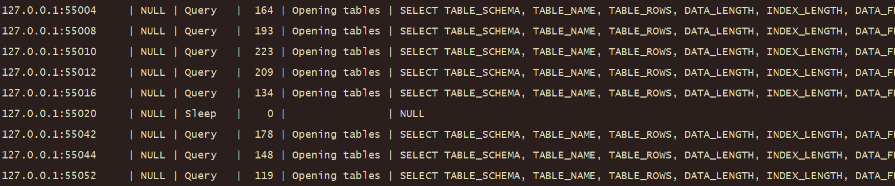
通过 show open tables ;语句发现 opened tables 并不算太多：
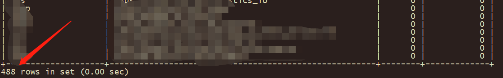
相关参数也没有太大的不合理性：
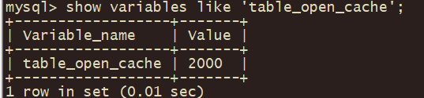
虽然 ulimit 设置不是很大，但是也不会对此产生什么影响

查看 MySQL Error 日志也没有发现与此相关的异常。
因此只能使用 pstack 工具对 MySQL 打堆栈来进行分析，堆栈日志如下：
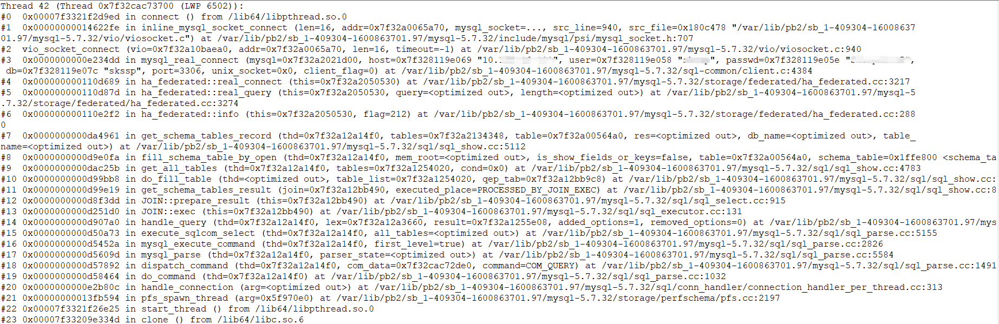
通过分析堆栈日志发现，问题出现在进行查询时会使用 Federated 存储引擎表对远程实例进行查询。
查看数据库使用 Federated 存储引擎的表，发现有两张表使用了 Federated 存储引擎：
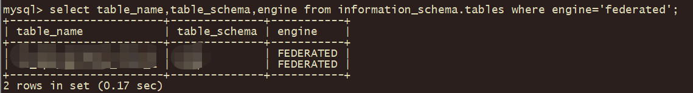
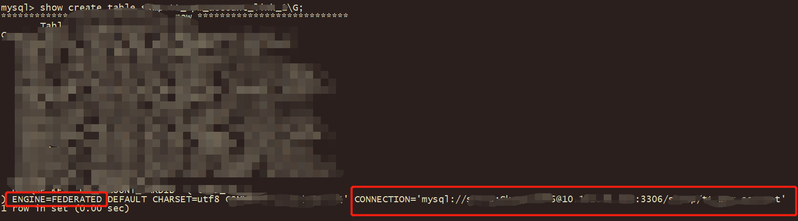
通过在实例服务器上 Telnet Feferated 服务端的实例IP和端口发现是不通的：

所以推测问题原因为：监控线程在查询 information_schema.tables 表时，当需要获取 Federated 存储引擎表的信息时需要连接远端 Server ，而由于网络或其他原因无法连接时，就会导致本地监控线程处于 Opening table 状态。
接下来设计实验验证我们的想法：
- 
启用 Federated 存储引擎
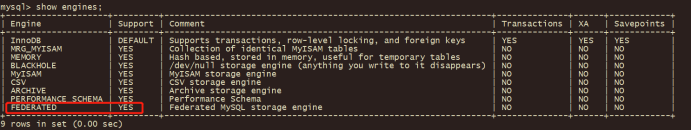
- 
创建一张 Federated 存储引擎的表，连接的 server 不存在
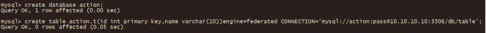
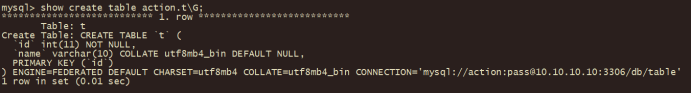
- 
查询 information_schema.tables 表，线程卡住
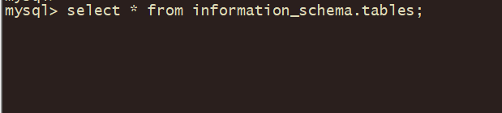
- 
线程状态处于 Opening table 状态
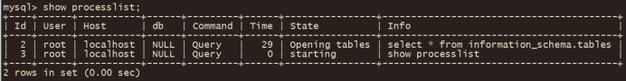
这刚好验证了我们的想法是正确的。