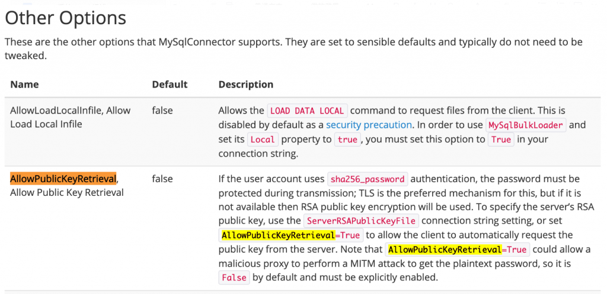
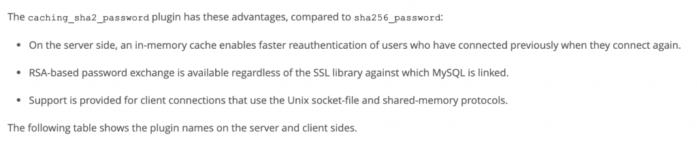
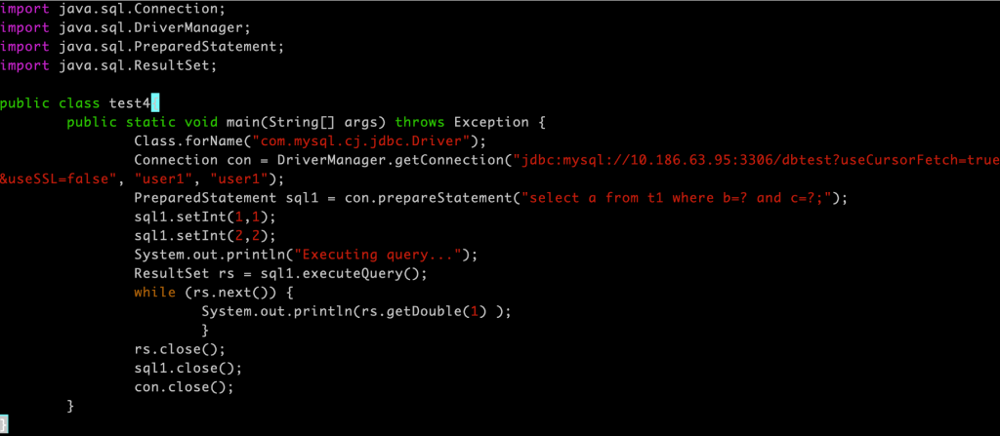
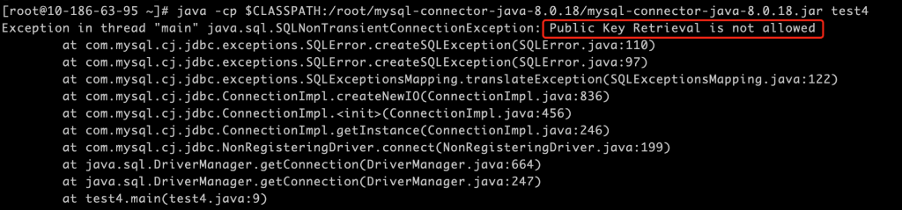
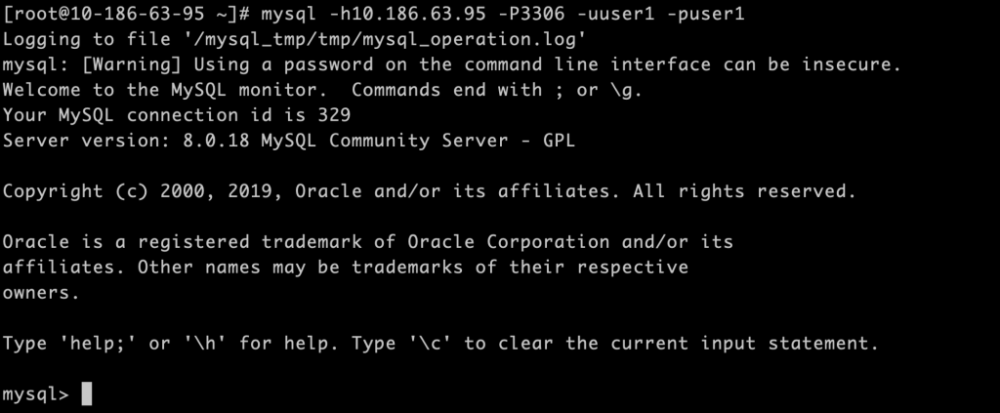
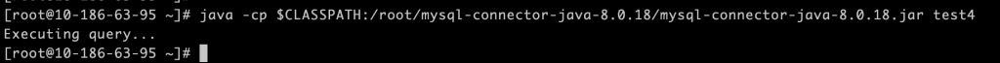
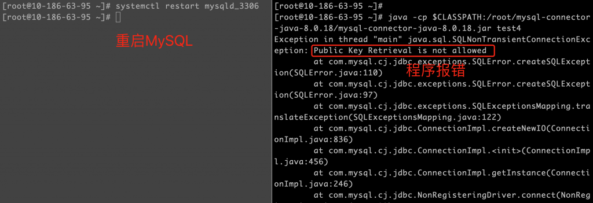
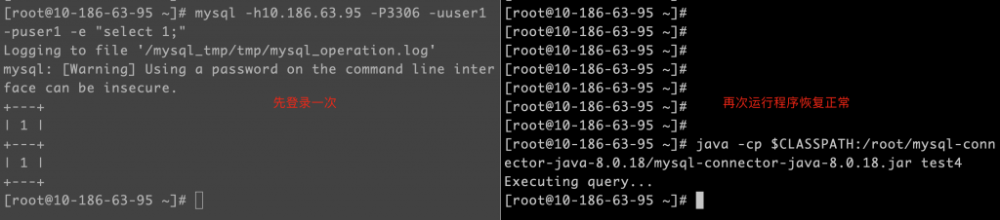
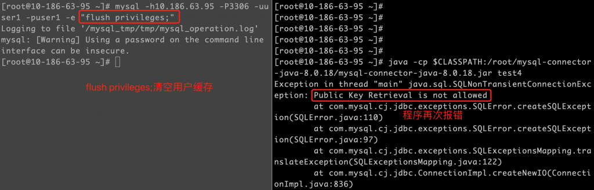

# 故障分析 | Java 连接 MySQL 8.0 排错案例

**原文链接**: https://opensource.actionsky.com/20210309-mysql/
**分类**: MySQL 新特性
**发布时间**: 2021-03-08T22:41:54-08:00

---

作者：胡呈清
爱可生 DBA 团队成员，擅长故障分析、性能优化，个人博客：https://www.jianshu.com/u/a95ec11f67a8，欢迎讨论。
本文来源：原创投稿*爱可生开源社区出品，原创内容未经授权不得随意使用，转载请联系小编并注明来源。
在客户那边遇见过几次这样的问题，Java 连接 MySQL8.0 **偶尔**会报错：`java.sql.SQLNonTransientConnectionException: Public Key Retrieval is not allowed`。网上一搜这个报错，早有人踩过这个坑：
如果用户使用了 sha256_password 认证，密码在传输过程中必须使用 TLS 协议保护，但是如果 RSA 公钥不可用，可以使用服务器提供的公钥；可以在连接中通过 ServerRSAPublicKeyFile 指定服务器的 RSA 公钥，或者 AllowPublicKeyRetrieval=True 参数以允许客户端从服务器获取公钥；但是需要注意的是 AllowPublicKeyRetrieval=True 可能会导致恶意的代理通过中间人攻击（MITM）获取到明文密码，所以默认是关闭的，必须显式开启。
原始文档如下：
											
JDBC 添加参数 AllowPublicKeyRetrieval=True 后确实解决了问题，但是注意前边说的“偶尔”两字，我遇见了大概三种情况，在这之前一点问题都没有，但一发生就会报错：
1.MySQL Server 重启了；
2.MySQL MGR 发生切换了；
3.DBA 对 MySQL Server 做了某些变更后。
那前面的解释就显得有点不够了，尤其是第 3 点，开发一定会觉得这是 MySQL 层面的问题或者 DBA 的问题，而不是他们对 MySQL 驱动了解不够。下面就为大家揭晓答案。
#### caching_sha2_password
MySQL8.0 默认使用密码加密插件为：caching_sha2_password，使用 sha256 算法对密码加密。而且在使用此插件时，MySQL Server 会在内存中缓存用户的认证信息，使已连接的用户的身份验证速度更快，文档描述：
											
这个缓存的说法就很暧昧了，当然由于文档上没有更多描述，我们只能先做假设：`Java 程序通过驱动连接到 MySQL 时，如果 MySQl Server 有用户的验证缓存，则不需要额外配置 RSA 公钥即可连接成功；如果没有缓存也没有指定 RSA 公钥，则连接报错：Public Key Retrieval is not allowed`。
有了假设，我们就要去论证，实际上论证的方法就是测试。
## 测试过程
测试代码：
											
编译后运行，直接复现报错：
											
接下来手工使用 mysql 客户端，用代码中的 user1 用户连接 MySQL 服务器，使其产生缓存（这个操作就是管理员创建了应用用户后，手工验证了应用用户是否可登录）：
											
然后再次运行 java 程序，将不再报错：
											
然后重启数据库，再次运行程序触发报错：
											
再次手工连接，虽然程序恢复正常：
											
执行 `flush privileges;`；操作清空用户缓存，随后运行程序再次报错：
											
MGR发生切换的场景就很容易解释了，因为之前一直没有使用应用用户连接过新的 Primary 节点，所以也就没有产生过缓存，所以应用程序连接新的 Primary 节点会发生报错。
## 结论
一开始，在 MySQL Server 上创建应用用户后，手工使用 mysql 客户端对应用用户进行了验证，MySQL Server 缓存了应用用户的验证信息。应用程序的 JDBC 参数设置在没有指定 RSA 公钥和设置 AllowPublicKeyRetrieval=True 的情况下，连接 MySQL Server，因为 MySQL Server 有用户缓存，所以可以正常连接。
之后如果发生以下几种情况：
1.MySQL Server 重启了；
2.MySQL MGR 发生切换了；
3.DBA 对 MySQL Server 做了 `flush privileges;`。
会导致 MySQL Server 的用户缓存失效，应用程序连接 MySQL 异常：Public Key Retrieval is not allowed。
## 解决方案
以下方案选择一种即可：
1.应用程序指定 RSA 公钥；
2.应用程序设置 AllowPublicKeyRetrieval=True；
3.MySQL Server 层修改用户的密码加密插件为 mysql_native_password。
**相关推荐：**
[技术分享 | explain format=json 详解](https://opensource.actionsky.com/20210301-explain/)
[技术分享 | EXPLAIN 执行计划详解（2）&#8211;Extra](https://opensource.actionsky.com/20210208-explain/)
[技术分享 | EXPLAIN 执行计划详解（1）](https://opensource.actionsky.com/20210202-explain/)