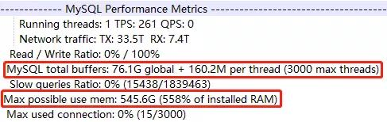

# 故障分析 | MySQL OOM 故障应如何下手

**原文链接**: https://opensource.actionsky.com/20200426-mysql/
**分类**: MySQL 新特性
**发布时间**: 2020-04-26T00:33:33-08:00

---

作者：孙祚龙
爱可生南区分公司交付服务部成员，实习工程师。负责公司产品问题排查及日常运维工作。
本文来源：原创投稿
*爱可生开源社区出品，原创内容未经授权不得随意使用，转载请联系小编并注明来源。
**引言**
前阵子处理这样一个案例，某客户的实例 mysqld 进程内存经常持续增加导致最终被 OOM killer。作为 DBA 肯定想知道有哪些原因可能会导致 OOM（内存溢出）。
此篇文章叙述个人的一些拙见~
**先介绍下这位朋友：OOM-killer**
OOM Killer(Out of Memory Killer) 是当系统内存严重不足时 linux 内核采用的杀掉进程，释放内存的机制。
OOM Killer 通过检查所有正在运行的进程，然后根据自己的算法给每个进程一个 badness 分数，拥有最高 badness 分数的进程将会在内存不足时被杀掉。
它打分的算法如下:
- 某一个进程和它所有的子进程都占用了很多内存的将会打一个高分。
- 为了释放足够的内存来解决这种情况，将杀死最少数量的进程（最好是一个进程）。
- 内核进程和其他较重要的进程会被打成相对较低的分。
上面打分的标准意味着，当 OOM killer 选择杀死的进程时，将选择一个使用大量内存，有很多子进程且不是系统进程的进程。
简单来讲，oom-killer 的原则就是损失最小、收益最大，因此它会让杀死的进程数尽可能小、释放的内存尽可能大。在数据库服务器上，MySQL 被分配的内存一般不会小，因此容易成为 oom-killer 选择的对象。
**“既然发生了 OOM，那必然是内存不足，内存不足这个问题产生原因很多。**
**首先第一个就是 MySQL 自身内存的规划有问题，这就涉及到 mysql 相应的配置参数。**
**另一个可以想到的原因就是一般部署 MySQL 的服务器，都会部署很多的监控和定时任务脚本，而这些脚本往往缺少必要的内存限制，导致在高峰期的时候占用大量的内存，导致触发 Linux 的 oom-killer 机制，最终 MySQL 无辜躺枪牺牲。”**
**all-important：MySQL 自身内存规划**
说到 MySQL 自身的内存规划，最先想到的就是 MySQL 中各种 buffer 的大小，innodb buffer pool 就是最鹤立鸡群的那个。innodb_buffer_pool_size 参数的大小究竟如何设置，才能保证 MySQL 的性能呢？
在官网文档中可以找到这个参数的一些描述：
> A larger buffer pool requires less disk I/O to access the same table data more than once. On a dedicated database server, you might set the buffer pool size to 80% of the machine&#8217;s physical memory size.
意思是在专用数据库服务器上，可以将 innodb_buffer_pool_size 设置为计算机物理内存大小的 80％。在许许多多前辈的的经验中了解到，此参数的值设置为物理内存的 50%~80% 颇为合理。
举个栗子：
											
innodb buffer pool 分配 76G，每个连接线程最大可用 160M，最大有 3000 连接数，最大可能使用内存总量 545G，但是这台实例所在服务器的物理内存仅仅有 97G，远超物理内存总量。结果可想而知，这个实例在运行中经常被 oom-killer 杀死，想必原因之一即是因为一开始 MySQL 自身的内存规划欠妥。
> innodb buffer pool 缓存数据的作用相信大家都懂，比如这个 case 中，可以发现该实例为写密集，读请求很少，innodb buffer 对性能改善作用不大，80% 的内存没必要，完全可以降低到物理内存的50%。
**“ 以上是对 OOM 发生原因的一些见解，那思考一下还有没有其他的原因会导致内存溢出的情况呢？不知道大家对内存泄漏是否了解，有没有可能 MySQL 因为内存泄漏堆积演变为内存溢出，最终 oom-killer &#8230; ”**
**知识补给站：内存泄漏**
内存泄漏（Memory Leak）是指程序中己动态分配的堆内存由于某种原因程序未释放或无法释放，造成系统内存的浪费，导致程序运行速度减慢甚至系统崩溃等严重后果。
内存泄漏缺陷具有隐蔽性、积累性的特征，比其他内存非法访问错误更难检测。因为内存泄漏的产生原因是内存块未被释放，属于遗漏型缺陷而不是过错型缺陷。此外，内存泄漏通常不会直接产生可观察的错误症状，而是逐渐积累，降低系统整体性能，极端的情况下可能使系统崩溃。
上文说到内存泄漏具有隐蔽性，就是不容易被发现呗&#8230;&#8230;为之奈何？
那咱们就去找一个可以检测内存泄漏的工具：valgrind
**关于 valgrind 工具**
Valgrind 是一个用于构建动态分析工具的工具框架。它提供了一组工具，每个工具都执行某种调试、分析或类似的任务，以帮助您改进程序。Valgrind 的体系结构是模块化的，因此可以轻松地创建新工具，而不会影响现有的结构。
标配了许多有用的工具：- **Memcheck** 是内存错误检测器。
- **Cachegrind** 是一个缓存和分支预测探查器。
- **Callgrind** 是一个生成调用图的缓存分析器。
- **Helgrind** 是线程错误检测器。
- **DRD** 还是线程错误检测器。
- **Massif** 是堆分析器。
- **DHAT** 是另一种堆分析器。
- **SGcheck** 是一种实验性工具，可以检测堆栈和全局阵列的溢出。
- **BBV** 是一个实验性 SimPoint 基本块矢量生成器。
**关于内存泄漏，我们需要使用 valgrind 的默认工具，也就是 memcheck 工具。**
Memcheck 是内存错误检测器。它可以检测以下和内存相关的问题：- 使用未初始化的内存
- 读取/写入已释放的内存
- 读取/写入 malloc 块的末端
- 内存泄漏
- 对 malloc/new/new[]与free/delete/delete[] 的不匹配使用
- 双重释放内存
Valgrind Memcheck 工具的用法如下：- `valgrind --tool=memcheck ./a.out`
从上面的命令可以清楚地看到，主要的命令是“ Valgrind”，而我们要使用的工具由选项“ &#8211;tool”指定。上面的“ a.out ” 表示我们要在其上运行 memcheck 的可执行文件。此外还可以使用其他的命令行选项，以满足我们的需要。运行的程序结束后，会生成这个进程的内存分析报告。
**“ OK，工具有了，这就如同摸金校尉拿到了洛阳铲，宝藏还会远吗~ 还不快找几块地挖掘试试？”**
**搞个测试找找感觉**
1. 使用 valgrind 的 memcheck 工具启动 mysql：
- `valgrind --tool=memcheck --leak-check=full --show-reachable=yes --log-file=/tmp/valgrind-mysql.log /usr/local/mysql/bin/mysqld --defaults-file=/etc/my.cnf --user=root`
2. 利用 sysbench 模拟负载；
3. 进程结束后查看检测报告：
- `==29326== LEAK SUMMARY:`
- `==29326==    definitely lost: 0 bytes in 0 blocks`
- `==29326==    indirectly lost: 0 bytes in 0 blocks`
- `==29326==      possibly lost: 549,072 bytes in 1,727 blocks`
- `==29326==    still reachable: 446,492,944 bytes in 54 blocks`
- `==29326==         suppressed: 0 bytes in 0 blocks`
- `==29326==`
- `==29326== For counts of detected and suppressed errors, rerun with: -v`
- `==29326== ERROR SUMMARY: 339 errors from 339 contexts (suppressed: 0 from 0)`
在报告的最后的总结中发现程序退出时有部分内存未释放，而且存在潜在的内存泄漏。通过向上查看具体的信息，分析后发现主要集中在 **performance_schema**，偶然发现了一个疑点，那我们完全禁用掉**performance_schema** 呢？
- `==9954== LEAK SUMMARY:`
- `==9954==    definitely lost: 0 bytes in 0 blocks`
- `==9954==    indirectly lost: 0 bytes in 0 blocks`
- `==9954==    possibly lost: 0 bytes in 0 blocks`
- `==9954==    still reachable: 32 bytes in 1 blocks`
- `==9954==         suppressed: 0 bytes in 0 blocks`
- `==9954==`
- `==9954== For counts of detected and suppressed errors, rerun with: -v`
- `==9954== ERROR SUMMARY: 0 errors from 0 contexts (suppressed: 0 from 0)`
发现程序退出时几乎没有内存未释放，也不存在潜在的内存泄漏。三次测试过后，发现结果是一致的。这是什么原因？
**“ 大家都知道 MySQL 的 performance schema 用于监控 MySQL server 在一个较低级别的运行过程中的资源消耗、资源等待等情况，但它为什么可能会导致内存泄漏呢，看来关于 ps 还有不少待挖掘的宝藏哦~ ”**
**最后一个小总结**
1. 注意 MySQL 自身的内存规划，为保证 MySQL 的性能，innodb buffer pool 大小设置要合理，可以根据实例读写负载的情况适当调整 buffer pool 的大小。并且 innodb buffer 与连接会话内存的总和尽量不要超过系统物理内存。
2. 调整 oom_score_adj 参数（/proc/<pid>/oom_score_adj），将 MySQL 被 oom-killer 锁定的优先级降低。这个参数值越小，越不容易被锁定。
3. 加强内存的监控和报警，一旦报警，DBA 应该迅速介入，选择性 Kill 掉一些占用较多内存的连接。
4. 在开启 performance_schema 时，会有额外的内存开销，通过 valgrind-memcheck 内存分析工具发现，较大概率发生内存泄漏。它有可能也会导致 OOM，在场景中若不需要 performance_schema 可以完全禁用，或需要尽量只开启必要的 instrument。