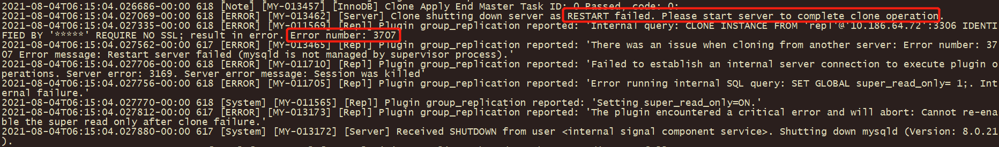
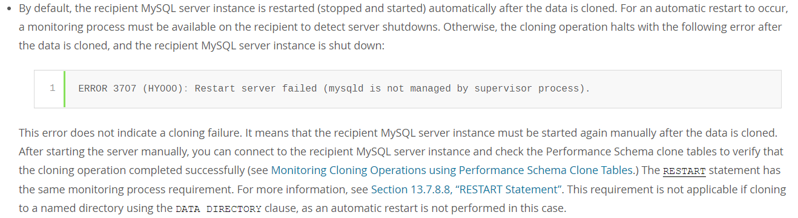
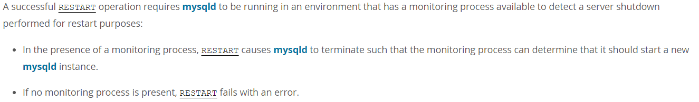
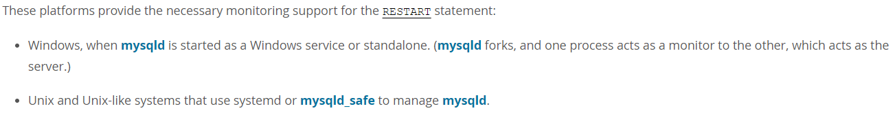
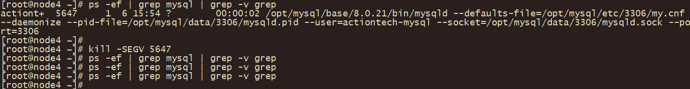
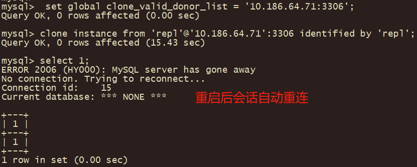
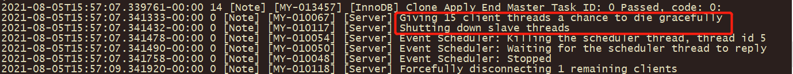
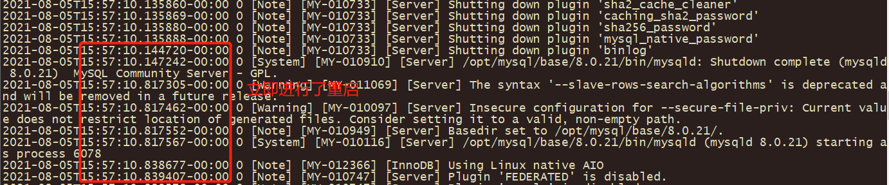

# 故障分析 | MySQL clone 自动重启失败的解决方式

**原文链接**: https://opensource.actionsky.com/20210817-mysql/
**分类**: MySQL 新特性
**发布时间**: 2021-08-16T23:32:22-08:00

---

作者：李鹏博
爱可生 DBA 团队成员，主要负责 MySQL 故障处理和 SQL 审核优化。对技术执着，为客户负责。
本文来源：原创投稿
*爱可生开源社区出品，原创内容未经授权不得随意使用，转载请联系小编并注明来源。

作者自画像
MySQL 8 添加了新的 clone 插件，被用于 MGR 的分布式恢复当中，也可以用来进行物理备份恢复。
但是在进行 clone 操作的过程中，当拉取数据完成并进行自动重启 server 时，总是会出现重启失败的现象，如：

日志报错提示 RESTART 失败，需要在后面手动重启，错误代码3707，即：`ERROR 3707 (HY000): Restart server failed (mysqld is not managed by supervisor process)。`
而在关于 clone 的官方文档相关链接：https://dev.mysql.com/doc/refman/8.0/en/clone-plugin-remote.html中，也特别说明了这个报错：

意思说是当 recipient server 在 clone 数据拉取完成后会进行重启操作，前提是监控进程可用。而当出现相关报错时也不用担心，并不能说明 clone 失败了，随后只需要手动重启就可以了。
通过上面的日志和官方文档我们得到了出现重启失败的两个线索：RESTART 、监控进程。
先看关于 RESTART 的相关官方文档说明（https://dev.mysql.com/doc/refman/8.0/en/restart.html）：

通过这段文档我们可以知道，如果想要成功执行“RESTART”命令，需要有一个监控进程，所以“RESTART”执行成功与否的关键就在于这个监控进程，而这个监控进程到底是什么文档在后面也进行了说明：

这时候我们就知道在类 Unix 系统中使用 systemd 或 mysqld_safe 来实现这个监控进程。
但是有时当我们使用自建的 systemd 的 MySQL service 服务时，依旧不能实现自动重启，而问题的关键还是在于没有配置好相关的监控进程，我们可以参考官方 rpm 包安装 MySQL Server 时生成的 systemd 的 service 文件的“[Service]”区域：
`Restart=on-failure
RestartPreventExitStatus=1
# Set enviroment variable MYSQLD_PARENT_PID. This is required for restart.
Environment=MYSQLD_PARENT_PID=1
`
官方的 systemd 的 service 文件已经指出了如果想要实现自动重启，最重要的就是要设置“Environment=MYSQLD_PARENT_PID=1”，PID为1的进程就是 systemd 的进程。
而官方设置的重启时机是“on-failure” ， 即数据库当遇到异常宕机、进程中断信号或监控超时时就会进行重启，但是当数据库异常宕机时，有时我们并不想让数据库立刻自动重启，而是需要在运维和开发人员确认过问题之后进行手动重启，这时候我们就需要调整自动重启的策略。
在“RESTART”相关的官方文档中，明确指出了“RESTART”命令执行时数据库关闭时的退出状态码：16。这时我们就可以设置只有当数据库退出状态码为16时才进行自动重启，而在其余情况下不会进行自动重启，MySQL 的 systemd 的 service 的“[Service]”区域进行如下配置：
`RestartForceExitStatus=16
RestartPreventExitStatus=1
# Set enviroment variable MYSQLD_PARENT_PID. This is required for restart.
Environment=MYSQLD_PARENT_PID=1
`
“RestartForceExitStatus=16”的意思就是说不管是否配置了“Restart=”，当服务的退出状态码为16时都会进行自动重启，这样就解决了 clone 自动重启失败的问题，同时也保证了数据库在其他异常情况下不会进行自动重启。
如给 MySQL 发送中断信号时不会自动重启：

当执行 clone 操作时可以自动重启

没有了之前的报错，进行自动重启

