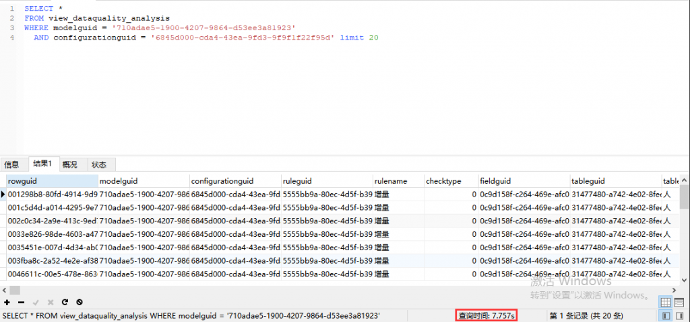
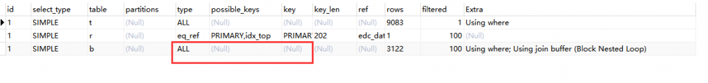
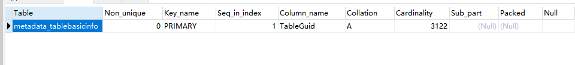
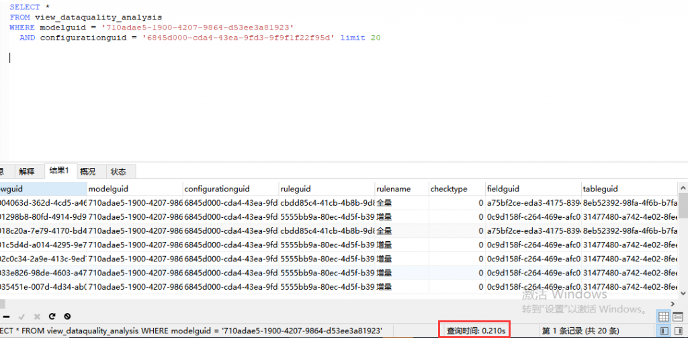
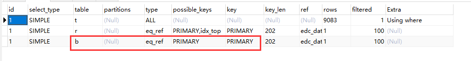

# 故障分析 | MySQL 优化案例 &#8211; 字符集转换

**原文链接**: https://opensource.actionsky.com/20200630-mysql/
**分类**: MySQL 新特性
**发布时间**: 2020-06-30T00:45:31-08:00

---

作者：xuty
本文来源：原创投稿
*爱可生开源社区出品，原创内容未经授权不得随意使用，转载请联系小编并注明来源。
本文关键字：SQL 优化、字符集
相关文章推荐：
[故障分析 | MySQL 派生表优化](https://opensource.actionsky.com/20200303-mysql/)
[故障分析 | 有效解决 MySQL 行锁等待超时问题【建议收藏】](https://opensource.actionsky.com/20200421-mysql/)
**一、背景**
开发联系我，说是开发库上有一张视图查询速度很慢，9000 条数据要查 10s，要求我这边协助排查优化。
**二、问题 SQL**
> **Server version: 5.7.24-log MySQL Community Server (GPL)**
这个 SQL 非常简单，定义如下，其中就引用了 **view_dataquality_analysis** 这张视图，后面跟了两个 where 条件，并且做了分页。
- 
- 
- 
- 
`  SELECT *``  FROM view_dataquality_analysis``  WHERE modelguid = '710adae5-1900-4207-9864-d53ee3a81923'``    AND configurationguid = '6845d000-cda4-43ea-9fd3-9f9f1f22f95d' limit 20;`
我们先去开发库上运行一下这条 SQL，下图中可以看到确实运行很慢，要 8s 左右。
											
**三、执行计划**
**分析一条慢 SQL，最有效的方法便是分析它的执行计划，看是否存在问题。**
下面我们看下这条 SQL 的执行计划，主要由三张表（t、r、b）组成，从 **t** 开始嵌套连接 **r**，再嵌套连接 **b**。整个执行逻辑很简单，至于 t、r、b 肯定是视图中定义的表别名。
从执行计划中可以看出 **t** 嵌套连接 **r** 的时候走的是**主键索引**，但是继续嵌套连接 **b** 的时候，却是走的**全表扫描**！那么可能很有可能问题就出在这个地方，为什么 **b** 表没有走索引，是因为缺失了索引吗？
											
**四、视图分析**
带着上面执行计划中的疑问，我们去看下 **view_dataquality_analysis** 这张视图的定义，如下所示。- 
- 
- 
- 
- 
- 
`  SELECT *``  FROM (``      (``      `dataquality_taskconfigurationhistory` `t` LEFT JOIN `dataquality_rule` `r` ON ((`t`.`RuleGuid` = `r`.`RuleGuid`))``      ) LEFT JOIN `metadata_tablebasicinfo` `b` ON ((convert(`b`.`TableGuid` using utf8mb4) = `r`.`Tableguid`))``    )`
视图由 **dataquality_taskconfigurationhistory**、 **dataquality_rule** 和**metadata_tablebasicinfo** 表连接组成，分别用了t、r、b 别名表示。因为都是用的 **LEFT JOIN**，所以表连接顺序应该是 t&#8211;>r&#8211;>b，和之前执行计划中显示的一致。
不知道各位有没有注意到- 
`(convert(`b`.`TableGuid` using utf8mb4) = `r`.`Tableguid`))`
这一段内容！表连接上居然存在一个**字符集**的转换。那么问题可能就是出在这里。
起先我以为这一段字符集转换是开发在定义视图的时候自己加上去的，后来询问后发现开发并未如此做。尝试将视图定义去掉这一段内容，但是发现保存后，这个转换却会自动生成！！！
**五、表定义查看**
带着上面的疑问，我们去看下表定义，首先是 **b** 表 **metadata_tablebasicinfo**，然后是 **r** 表**dataquality_rule**，最后是 **t** 表 **dataquality_taskconfigurationhistory**- 
- 
- 
- 
- 
- 
- 
- 
- 
- 
- 
- 
- 
- 
- 
- 
- 
- 
- 
- 
- 
`  CREATE TABLE `metadata_tablebasicinfo` (``    `TableGuid` varchar(50) NOT NULL,``    `SqlTableName` varchar(50) DEFAULT NULL,``    .......``    PRIMARY KEY (`TableGuid`)``  ) ENGINE=InnoDB DEFAULT CHARSET=utf8``  ``  CREATE TABLE `dataquality_rule` (``    `RuleGuid` varchar(50) NOT NULL,``    `ModelGuid` varchar(50) DEFAULT NULL,``    .......``    PRIMARY KEY (`RuleGuid`),``    KEY `idx_top` (`RuleGuid`,`Tableguid`)``  ) ENGINE=InnoDB DEFAULT CHARSET=utf8mb4``  ``  CREATE TABLE `dataquality_taskconfigurationhistory` (``    `RowGuid` varchar(50) NOT NULL,``    `ModelGuid` varchar(50) DEFAULT NULL,``    .......``    PRIMARY KEY (`RowGuid`)``  ) ENGINE=InnoDB DEFAULT CHARSET=utf8mb4`
通过查看表定义后，可以看到 **b** 表字符集为 utf8，而 **t** 表与 **r** 表字符集都为 utf8mb4！！！那么基本可以验证我的猜想，当 MySQL 创建视图时，如果发现表连接字段字符集不相同时，会自动添加字符集转换。
另外之前我们有个**为什么 ****b**** 表没有走索引，是因为缺失了索引吗？**的疑问。从上面 **b** 表的表结构定义就可以看出， **b** 表的连接字段为 **TableGuid**，是 **b** 表的主键，那么肯定存在主键索引，就更不可能不走索引而选择全表扫描了。
											
**六、修改字符集**
为了验证因为字符集问题而导致表连接没有走索引，我们选择将 **b** 表 **metadata_tablebasicinfo** 的字符集修改为 utf8mb4。
过程如下：- 
- 
`  --修改表的默认字符集和所有列的字符集为utf8mb4``  ALTER TABLE metadata_tablebasicinfo CONVERT TO CHARACTER SET utf8mb4;`通过上述操作后，目前 **b** 表为 utf8mb4 字符集。
**七、视图重建**
将 **b** 表字符集修改为 utf8mb4 后，去查看 **view_dataquality_analysis** 视图定义，发现还是存在字符集转换，所以猜测这类自动添加转换的机制不会因为表结构更改而自动去掉。
我们再次将视图中字符集转换的内容去掉后，保存视图，发现这次不会自动添加字符集转换。那么这次应该就应该会走索引啦~
我们再次执行问题 SQL，执行时间为 0.2s，速度明显就正常了。
											
再来看一波执行计划，可以看到 **b** 表上走的是**主键索引**，这下舒服了~
											
**八、问题总结**
通过这次问题排查，发现了字符集不同原来也会导致索引失效。其实这个问题有点类似于 **int=varchar**隐式转换问题，等号左边为 int 类型，右边为 varchar 类型，那么 MySQL 会自动转换类型为一致，因而无法走索引。
下次如果再出现类似的问题，可以先查看下视图定义，如果存在字符集转换的内容，那么就可以检查是否是类似的问题！
另外还有一个注意的点就是，列的字符集也有可能与表的字符集不同！