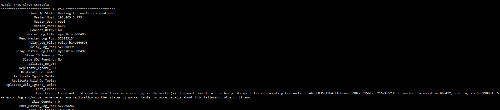
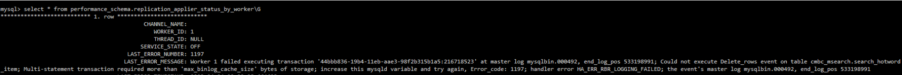
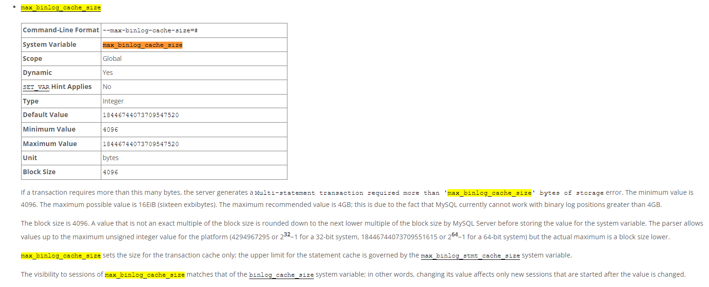

# 故障分析 | MySQL 参数设置不当导致复制中断

**原文链接**: https://opensource.actionsky.com/%e6%95%85%e9%9a%9c%e5%88%86%e6%9e%90-mysql-%e5%8f%82%e6%95%b0%e8%ae%be%e7%bd%ae%e4%b8%8d%e5%bd%93%e5%af%bc%e8%87%b4%e5%a4%8d%e5%88%b6%e4%b8%ad%e6%96%ad/
**分类**: MySQL 新特性
**发布时间**: 2023-07-18T00:52:56-08:00

---

本文分享了一个数据库参数错误配置导致复制中断的问题，以及对参数配置的建议。
> 作者：秦福朗
爱可生 DBA 团队成员，负责项目日常问题处理及公司平台问题排查。热爱互联网，会摄影、懂厨艺，不会厨艺的 DBA 不是好司机，didi~
本文来源：原创投稿
- 爱可生开源社区出品，原创内容未经授权不得随意使用，转载请联系小编并注明来源。
# 前言
在日常的运维工作中，偶尔会遇到一些意想不到的线上问题，多数因为设置不当导致故障。前段时间，[DMP 数据库运维平台](https://www.actionsky.com/cloudTreeDMP) 报错主从复制 SQL 线程断开，就是因为一个参数设置异常导致的。本文分享一下当时的情况。
# 故障描述
DMP 收到告警 MySQL 从库的 SQL 线程停止了工作，去从库后台执行 `show slave status\G`：

可以看到 SQL 线程确实停止工作了，根据提示查看 ：
`select * from performance_schema.replication_applier_status_by_worker;`

报错为：
> Worker 1 failed executing transaction &#8217;44bbb836-19b4-11eb-aae3-98f2b315b1a5:216718523&#8242; at master log mysqlbin.000492, end_log_pos 533198991; Could not execute Delete_rows event on table cmbc_msearch.search_hotword_item; Multi-statement transaction required more than &#8216;max_binlog_cache_size&#8217; bytes of storage; increase this mysqld variable and try again, Error_code: 1197; handler error HA_ERR_RBR_LOGGING_FAILED; the event&#8217;s master log mysqlbin.000492, end_log_pos 533198991
我们可以看到报错信息比较明显，是 `max_binlog_cache_size` 参数设置出现了问题。
查看主从的 `max_binlog_cache_size` 的大小，主库为 10G，从库为 10M。
# 原理描述
[官方文档](https://dev.mysql.com/doc/mysql-replication-excerpt/8.0/en/replication-options-binary-log.html)了解 `max_binlog_cache_size` 参数：

binlog 是 MySQL 用来记录所有修改数据库数据的操作的二进制日志。在主从复制中，主库会把自己的 binlog 传输给从库，供从库执行相同的操作，以保证数据的一致性。而 `max_binlog_cache_size` 则是 MySQL 设置的最大 binlog 缓存大小。当事务过于复杂，多语句事务执行，需要写入 binlog 的数据量超过了这个值时，就会出现上述错误。
此时还要注意另一个参数 `binlog_cache_size`，这个参数给每个客户端分配用来存储二进制日志的缓存，而 `max_binlog_cache_size` 则表示所有客户端缓存使用的最大值。
# 问题解决
从库为 10M 的历史原因也追溯不到，但主从设置参数不一致，且一个很大一个很小，是不合理的，也是导致本文中报错的主要因素。
`max_binlog_cache_size` 参数是可以通过在线动态修改的，现场解决方案，将从库的该值调大：
`mysql> set global max_binlog_cache_size=10240000000;
Query OK, 0 rows affected (0.00 sec)
`
然后再开启主从复制，就正常了。
# 总结
在运维过程中，合理配置和及时调整参数是确保系统稳定性和性能优化的重要环节，在修改一些参数的时候要充分了解相关知识概念，并且要掌握复制集群中相同参数的配置情况，确保合理合规修改，减少生产故障。