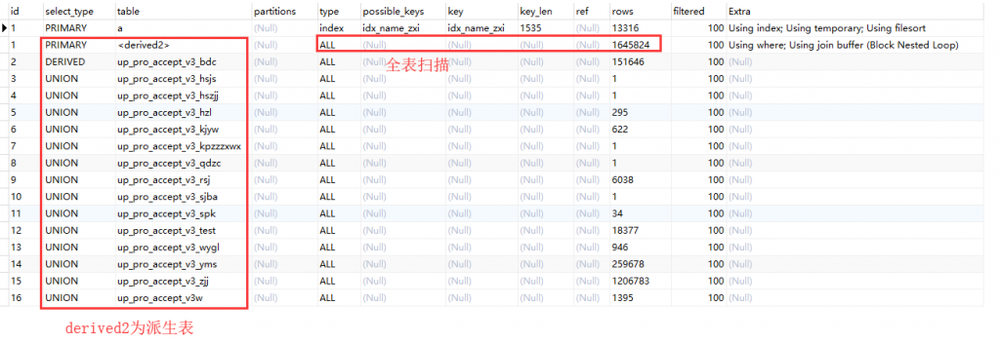
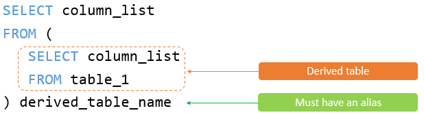
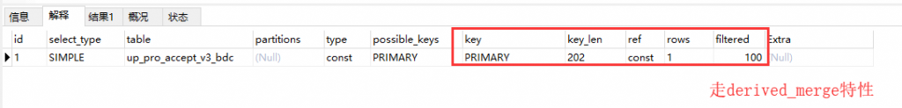
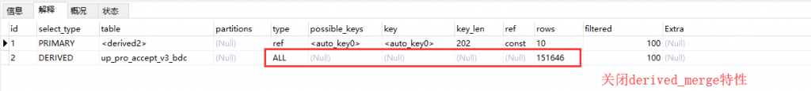
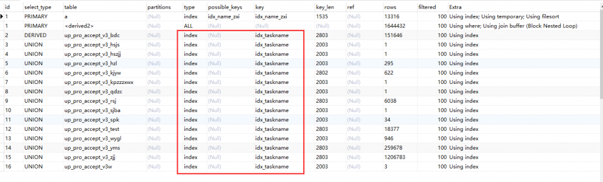
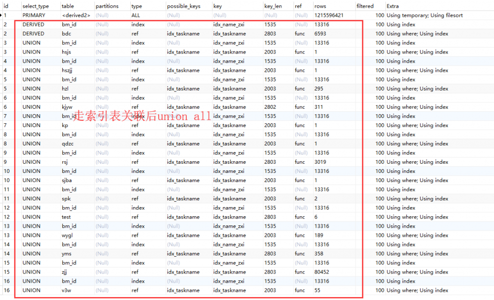
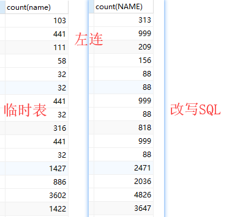
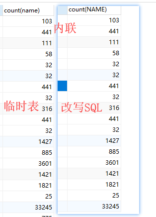

# 故障分析 | MySQL 派生表优化

**原文链接**: https://opensource.actionsky.com/20200303-mysql/
**分类**: MySQL 新特性
**发布时间**: 2020-03-03T00:53:27-08:00

---

**一、问题 SQL**
原 SQL 如下：- `select name,count(name) from bm_id a left JOIN`
- `    (select TaskName from up_pro_accept_v3_bdc`
- `        union all select TaskName from up_pro_accept_v3_hsjs`
- `        union all select TaskName from up_pro_accept_v3_hszjj`
- `        union all select TaskName from up_pro_accept_v3_hzl`
- `        union all select TaskName from up_pro_accept_v3_kjyw`
- `        union all select TaskName from up_pro_accept_v3_kpzzzxwx`
- `        union all select TaskName from up_pro_accept_v3_qdzc`
- `        union all select TaskName from up_pro_accept_v3_rsj`
- `        union all select TaskName from up_pro_accept_v3_sjba`
- `        union all select TaskName from up_pro_accept_v3_spk`
- `        union all select TaskName from up_pro_accept_v3_test`
- `        union all select TaskName from up_pro_accept_v3_wygl`
- `        union all select TaskName from up_pro_accept_v3_yms`
- `        union all select TaskName from up_pro_accept_v3_zjj`
- `        union all select TaskName from up_pro_accept_v3w) t`
- `    on  a.zxi = t.TaskName  group by name`
这是一个统计类的 SQL，直接执行跑了好几个小时都没有结束，所以暂时不知道实际耗时，因为实在是太久了~
**二、执行计划**
老步骤，我们先看下执行计划，如下图：
											
这里 SQL 执行主要分为 2 个步骤：
1. 顺序扫描每个 `up_pro_accept` 开头的子表数据，最终组成 `t 表(派生表)`。- 扫描 `t 表(派生表)` 相关的所有子表，可以看到这里每张子表走的都是 `全表扫描`，有些表较大，有 100 多 w，检索较慢。
2. `a 表(bm_id)` 与  `t表(派生表)` 进行关联查询，得到最后的结果。- `t 表 (派生表)` 作为 `被驱动表` 大约 `164W 行` 左右，与 `a` 表做关联查询时走的是 `全表扫描(ALL)`， `a 表(bm_id)` 作为 `驱动表` 大约 `1.3W 行` 左右，也就是说，表关联需要全表扫描 `t 表(派生表) 1.3W` 次，而每次都需要扫描 `164W 行` 数据，显然 SQL 的绝大部分时间其实都花在这一步上。
那么其实 SQL 优化也分为了 2 步，首先是多张子表的全表扫描，是否可以用索引扫描替换，加快数据检索。
而后是主要的环节，这个派生表作为被驱动表时，是否可以走索引？如果不能走索引，有没有其他方式减少 SQL 开销？
**三、派生表**
> 既然这个 SQL 优化涉及到了派生表，那么我们先看下何谓派生表，派生表有什么特性？
`Derivedtable(派生表)` 实际上是一种特殊的 `subquery(子查询)`，它位于 SQL 语句中 `FROM 子句` 里面，可以看做是一个单独的表。
											
MySQL 5.7 之前的处理都是对 `Derived table(派生表)` 进行 `Materialize(物化)`，生成一个 `临时表` 用于保存 `Derived table(派生表)` 的结果，然后利用 `临时表` 来协助完成其他父查询的操作，比如 JOIN 等操作。
MySQL 5.7 中对 `Derived table(派生表)` 做了一个新特性，该特性允许将符合条件的 `Derived table(派生表)` 中的子表与父查询的表合并进行直接 JOIN，类似于 Oracle 中的 `子查询展开`，由优化器参数 `optimizer_switch='derived_merge=ON'` 来控制，默认为 `打开`。
但是 `derived_merge` 特性存在很多限制，当派生子查询存在以下操作时，该特性无法生效。`DISTINCT`、 `GROUP BY`、 `UNION/UNION ALL` 、 `HAVING`、 `关联子查询`、 `LIMIT/OFFSET` 以及 `聚合操作` 等。
**举个简单例子：**
其中 a 表就是一个派生表1. 如果走 derived_merge 特性，那么可以走主键索引，速度非常快。2. 如果关闭 derived_merge 特性，那么就会走全表扫描，速度非常慢。- `select * from (select * from up_pro_accept_v3_bdc) a`
- `where a.rowguid = '185c44aa-c23f-4e6f-bcd2-a38df16e2cc3'`
											
											
**四、SQL 优化**
简单介绍了下派生表，下面我们开始尝试优化这个 SQL，步骤分 2 步：1. 解决多张派生子表 `union all` 时全表扫描的问题。2. 解决派生表在关联过程中无法使用索引的问题。
我们先解决问题 1，这个问题比较简单。
因为所有派生子表的查询都是 `select TaskName from up_pro_accept_v3_xxx` 类似这样，且外部关联字段也是 `taskname`，所以我们只要在对应表上建立 taskname 的索引即可。
											
建好索引后，我们再看下执行计划，所有的派生子表都走了 index 扫描，那么问题 1 基本解决了，但是由于 `t 表(派生表)` 在关联时还是走的全表扫描，并没有用到 `derived_merge` 特性，所以 SQL 还是非常非常慢（上万 s）。
接着我们来解决问题 2，这里主要解决派生表无法走索引的问题。
从之前介绍派生表的内容来看，想要派生表走索引，就需要用到 `derived_merge` 特性，将外部条件推入进子查询，但是这个特性的限制条件也很多，就比如我们这个 SQL，因为子查询里包括了 `union all`，那么该 SQL 是无法利用到 `derived_merge` 特性的，因此无法直接走索引过滤。既然无法在原有 SQL 的基础上优化，那么我们只能考虑改写 SQL，通过 SQL 改写来达到优化的目的。这里 SQL 其实是因为 `驱动表 bm_id` 最终是和派生表作表关联，导致无法利用索引，我们可以尝试将 `驱动表 bm_id` 也放到子查询中，只要前后语义是一致的，那么改写就没问题。这样就可以在子查询里就走完表关联，剩下的就是外部的分组排序，我们尝试下。- `/* 改写后 SQL */`
- `SELECT NAME`
- `    ,count(NAME)`
- `FROM (`
- `    SELECT NAME FROM bm_id LEFT JOIN up_pro_accept_v3_bdc bdc ON bm_id.zxi = bdc.TaskName`
- `    UNION ALL`
- `    SELECT NAME FROM bm_id LEFT JOIN up_pro_accept_v3_hsjs hsjs ON bm_id.zxi = hsjs.TaskName`
- `    UNION ALL`
- `    SELECT NAME FROM bm_id LEFT JOIN up_pro_accept_v3_hszjj hszjj ON bm_id.zxi = hszjj.TaskName`
- `    UNION ALL`
- `    SELECT NAME FROM bm_id LEFT JOIN up_pro_accept_v3_hzl hzl ON bm_id.zxi = hzl.TaskName`
- `    UNION ALL`
- `    SELECT NAME FROM bm_id LEFT JOIN up_pro_accept_v3_kjyw kjyw ON bm_id.zxi = kjyw.TaskName`
- `    UNION ALL`
- `    SELECT NAME FROM bm_id LEFT JOIN up_pro_accept_v3_kpzzzxwx kp ON bm_id.zxi = kp.TaskName`
- `    UNION ALL`
- `    SELECT NAME FROM bm_id LEFT JOIN up_pro_accept_v3_qdzc qdzc ON bm_id.zxi = qdzc.TaskName`
- `    UNION ALL`
- `    SELECT NAME FROM bm_id LEFT JOIN up_pro_accept_v3_rsj rsj ON bm_id.zxi = rsj.TaskName`
- `    UNION ALL`
- `    SELECT NAME FROM bm_id LEFT JOIN up_pro_accept_v3_sjba sjba ON bm_id.zxi = sjba.TaskName`
- `    UNION ALL`
- `    SELECT NAME FROM bm_id LEFT JOIN up_pro_accept_v3_spk spk ON bm_id.zxi = spk.TaskName`
- `    UNION ALL`
- `    SELECT NAME FROM bm_id LEFT JOIN up_pro_accept_v3_test test ON bm_id.zxi = test.TaskName`
- `    UNION ALL`
- `    SELECT NAME FROM bm_id LEFT JOIN up_pro_accept_v3_wygl wygl ON bm_id.zxi = wygl.TaskName`
- `    UNION ALL`
- `    SELECT NAME FROM bm_id LEFT JOIN up_pro_accept_v3_yms yms ON bm_id.zxi = yms.TaskName`
- `    UNION ALL`
- `    SELECT NAME FROM bm_id LEFT JOIN up_pro_accept_v3_zjj zjj ON bm_id.zxi = zjj.TaskName`
- `    UNION ALL`
- `    SELECT NAME FROM bm_id LEFT JOIN up_pro_accept_v3w v3w ON bm_id.zxi = v3w.TaskName`
- `    ) t`
- `GROUP BY t.name`
再来看下改写后的 SQL 执行计划，发现确实如我们预想的，在子查询中可以通过索引来进行表关联（ `被驱动表 type 为 ref`），然后 `union all` 汇聚数据，形成派生表，最后扫描派生表进行分组排序。这里分组排序时只需要 `全表扫描一次派生表` 就可以得到结果，效率比之前快太多了！
											
改写后的 SQL 运行耗时为 `13s` 左右，速度快很多！
											
**五、测试验证**
为了严谨性，我们需要验证改写后的 SQL 结果集是否与原始 SQL 一致，也就是证明下这样改写 SQL 是否会产生语义上的变化，如果为了优化 SQL，连结果集都不准了，那就没意义了~
这里因为原始 SQL 执行太久，没法直接得到结果集对比，那么我们只能通过手动创建临时表来记录子查询结果集，然后再与 `bm_id 表` 关联查询，由于我们可以在临时表上创建索引，就不会出现原始 SQL 那种全表扫描的问题啦。
具体操作如下：1. 创建临时表（带索引）- `CREATE TABLE `tmp_up` (`
- `  `taskname` varchar(500) DEFAULT NULL,`
- `  KEY `idx_taskname` (`taskname`));`
2. 将子查询结果插入至临时表- `insert into tmp_up`
- `select taskname from up_pro_accept_v3_bdc`
- `union all select taskname up_pro_accept_v3_hsjs`
- `......`
3. 使用临时表代替子查询
- `select name,count(name) from bm_id a left JOIN`
- `            (select TaskName from tmp_up )t`
- `    on  a.zxi = t.TaskName  group by name`
4. 对比下查询结果是否一致
惊讶的发现改写 SQL 的结果集会多出来很多？这里可以确认走临时表的结果集是肯定没问题的，那么问题肯定出在改写 SQL 上！
											
回头再仔细想一下，结合小测试，发现这样改写 SQL 确实会改变语义，问题主要是出在 `LEFT JOIN`，原本 bm_id 只做了 `一次表关联`，而改写 SQL 后，要做 `多次表关联`，导致最后的结果集会多出来一部分因为 `LEFT JOIN` 而产生的重复数据。
如果是 `INNER JOIN`，其实就不会产生重复数据，我们也测试下，结果确实如所想，内联是没问题的~
											
**六、个人总结**
这次 SQL 优化案例个人感觉是比较有难度的，很多点自己一开始也没有想到。就比如 SQL 改写，一开始以为是没有语义上的区别，直到做了测试才知道，所以啊，很多时候不能盲目自信啊。针对这个 SQL 来说，想要直接通过改写 SQL 优化还是比较难的，当然这里说的是不改变语义的情况下，我暂时没有想到好的改写方式，也许是火候还不够。
**解决方式总结有 2 个：**
1. 用 `内联` 替代 `左联`，然后使用上述的改写 SQL，优点是 `比较方便且查询速度较快`，但是 `结果集会变化`。2. 通过 `临时表` 代替 `子查询`，缺点是 `比较繁琐，需要多个步骤实现`，优点是 `速度也较快` 且 `结果集不会变化`。
> **附录：**http://mysql.taobao.org/monthly/2017/03/05/https://blog.csdn.net/sun_ashe/article/details/89522394https://imysql.com/node/103https://dev.mysql.com/doc/refman/5.7/en/derived-table-optimization.html