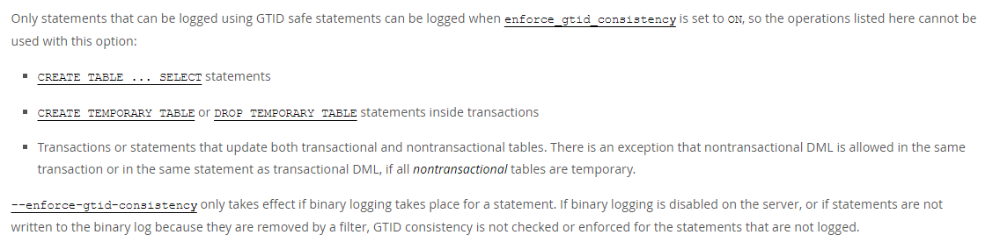

# 故障分析 | MySQL 迁移完不能快速导数据了？

**原文链接**: https://opensource.actionsky.com/%e6%95%85%e9%9a%9c%e5%88%86%e6%9e%90-mysql-%e8%bf%81%e7%a7%bb%e5%ae%8c%e4%b8%8d%e8%83%bd%e5%bf%ab%e9%80%9f%e5%af%bc%e6%95%b0%e6%8d%ae%e4%ba%86%ef%bc%9f/
**分类**: MySQL 新特性
**发布时间**: 2023-10-16T23:59:09-08:00

---

关于 5.6 升级到 5.7 之后，GTID 的相关功能的注意事项。
> 作者：秦福朗，爱可生 DBA 团队成员，负责项目日常问题处理及公司平台问题排查。热爱互联网，会摄影、懂厨艺，不会厨艺的 DBA 不是好司机，didi~
爱可生开源社区出品，原创内容未经授权不得随意使用，转载请联系小编并注明来源。
本文共 400 字，预计阅读需要 2 分钟。
# 背景
某金融公司有套系统最近刚迁移完，从 5.6 迁移到 5.7.30，并且在迁移前未开启 GTID，迁移后开启了 GTID 相关功能。业务按照以往的方式使用 `CREATE TABLE ... SELECT ...` 导数据的时候出现报错：`Error Code:1786 (HY000): Mysql Statement violates GTID consistency: CREATE TABLE ... SELECT`。
# 问题原理
这个问题比较简单，原因就是迁移后的 MySQL5.7 使用了 GTID，开启了 `enforce_gtid_consistency` 参数（GTID 强一致性）。
为保证分布式事务的一致性，MySQL 使用 GTID 来唯一标识一个事务。在 GTID 模式下，DDL 和 DML 语句会自动产生不同的 GTID 来标识不同的事务操作。但是 `CREATE TABLE ... SELECT ...` 只生成了一个 GTID，将 DDL 和 DML 操作合并为一个事务执行，这在语句执行失败时，会造成主从数据不一致。开启 `enforce_gtid_consistency` 参数就是为了 GTID 事务的原子性。
官方文档也有对 `CREATE TABLE ... SELECT ...` 这一操作的说明：

# 解决方案
**为了安全，不建议关闭这个参数。**
在 MySQL5.7 上可以用拆分成两句 SQL 的方式，解决这个问题，比如：
`#先创建表
CREATE TABLE ... LIKE...
#再插入数据
INSERT INTO ... SELECT ...
`
虽然之前的单条 SQL 能简单快速的导数到另一张表，但为了安全可以适当麻烦一点。
# MySQL 8.0
好消息是从 MySQL8.0.21 开始，支持原子 DDL 的存储引擎允许使用 `CREATE TABLE ... SELECT ...` 语句了。
