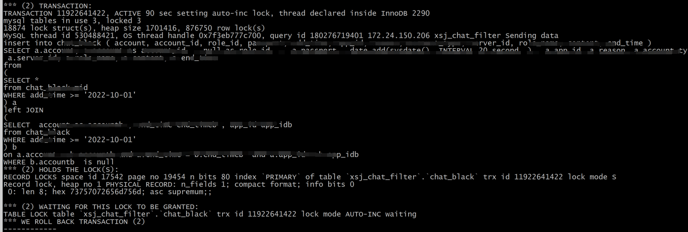

# 故障分析 | MySQL锁等待超时一例分析

**原文链接**: https://opensource.actionsky.com/20221116-suo/
**分类**: 技术干货
**发布时间**: 2022-11-15T22:13:01-08:00

---

作者：付祥
现居珠海，主要负责 Oracle、MySQL、mongoDB 和 Redis 维护工作。
本文来源：原创投稿
*爱可生开源社区出品，原创内容未经授权不得随意使用，转载请联系小编并注明来源。
#### 1、问题现象
开发反馈某业务持续性报锁等待超时，相关错误信息如下：
Lock wait timeout exceeded; try restarting transaction
为了能精确定位问题，继续询问开发有没有锁等待超时相关SQL，开发又给了相关报错SQL：
INSERT INTO <TABLE_NAME> VALUES(...)
#### 2、分析诊断
根据错误信息得知，单条insert语句锁等待超时，如果都是单条insert插入，不应该频繁报锁超时，似乎有点不寻常，当前数据库版本为5.6，锁等待超时参数设置时长30秒：
root@ (none)> show variables like 'innodb_lock_wait_timeout';
+--------------------------+-------+
| Variable_name | Value |
+--------------------------+-------+
| innodb_lock_wait_timeout | 30 |
+--------------------------+-------+
查看慢日志及 show engine innodb status\G ，发现有批量插入动作，由于自增锁竞争产生死锁：

询问开发，批量插入SQL为定时作业，查看当前innodb_autoinc_lock_mode参数设置：
+--------------------------+-------+
| Variable_name | Value |
+--------------------------+-------+
| innodb_autoinc_lock_mode | 1 |
+--------------------------+-------+
innodb_autoinc_lock_mode=1，对于批量插入语句，需要等到语句执行结束才释放自增锁，故要解决锁等待超时，可以将参数值设置为2，但该参数为静态参数需要重启MySQL才能生效，不能重启情况下只能优化SQL执行时间，查看慢日志得知SQL执行一次需要100+秒，扫描行数86w，结果集却为0，说明SQL有优化空间：
Query_time: 108.527499 Lock_time: 0.000342 Rows_sent: 0 Rows_examined: 862584
分析SQL执行计划：
SELECT *
from ( SELECT * from aa WHERE add_time >= '2022-10-01' ) a
left JOIN ( SELECT * from bb WHERE add_time >= '2022-10-01' ) b
on a.account = b.accountb and a.end_time = b.end_timeb and a.app_id = b.app_idb WHERE
b.accountb is null;
+----+-------------+----------------+-------+---------------+--------------+---------
+------+--------+----------------------------------------------------+
| id | select_type | table | type | possible_keys | key | key_len |
ref | rows | Extra |
+----+-------------+----------------+-------+---------------+--------------+---------
+------+--------+----------------------------------------------------+
| 1 | PRIMARY | <derived2> | ALL | NULL | NULL | NULL |
NULL | 2722 | NULL |
| 1 | PRIMARY | <derived3> | ALL | NULL | NULL | NULL |
NULL | 595248 | Using where; Using join buffer (Block Nested Loop) |
| 3 | DERIVED | bb | ALL | NULL | NULL | NULL |
NULL | 595248 | Using where |
| 2 | DERIVED | aa | range | idx_add_time | idx_add_time | 6 |
NULL | 2722 | Using index condition |
+----+-------------+----------------+-------+---------------+--------------+---------
+------+--------+----------------------------------------------------+
4 rows in set (0.00 sec)
SQL有子查询，使用到了派生表，首先执行子查询
( SELECT * from aa WHERE add_time >= '2022-10-01' )
将结果集存入临时表derived2 ，然后执行子查询
( SELECT **** from bb WHERE add_time >= '2022-10-01' )
将结果集存入临时表derived3，最后derived2和derived3根据关联条件做表关联，使用Block Nested Loop算法，即使表chat_black（`account` , `app_id` , `end_time`）列有复合索引也使用不到。
如果mysql版本是5.7的话，optimizer_switch 参数会增加一个选项：derived_merge=on ，满足一定条件，即子查询中没有如下条件：
- Aggregate functions ( `SUM()` ,  `MIN()` ,  `MAX() `,  `COUNT() ` , and so forth)
- `DISTINCT`
- `GROUP BY`
- `HAVING`
- `LIMIT`
- `UNION` or `UNION ALL`
- Subqueries in the select list
- Assignments to user variables
- Refererences only to literal values (in this case, there is no underlying table)
子查询将被合并到外层查询。
#### 3、问题解决
知道SQL慢的原因后，对SQL进行改写，执行计划如下：
SELECT * FROM (
select * from aa where add_time >= '2022-10-01') a
left join bb b
on ( b.add_time >= '2022-10-01' and a.account = b.account and a.end_time =
b.end_time and a.app_id = b.app_id)
where b.account is null;
+----+-------------+----------------+-------+------------------------+----------------
--------+---------+-------------------------------+------+-----------------------+
| id | select_type | table | type | possible_keys | key
| key_len | ref | rows | Extra |
+----+-------------+----------------+-------+------------------------+----------------
--------+---------+-------------------------------+------+-----------------------+
| 1 | PRIMARY | <derived2> | ALL | NULL | NULL
| NULL | NULL | 3096 | NULL |
| 1 | PRIMARY | b | ref | idx_ac_app_id_end_time |
idx_ac_app_id_end_time | 1542 | a.account,a.app_id,a.end_time | 1 | Using where
|
| 2 | DERIVED | aa | range | idx_add_time | idx_add_time
| 6 | NULL | 3096 | Using index condition |
+----+-------------+----------------+-------+------------------------+----------------
--------+---------+-------------------------------+------+---------------------
执行时间从原来的100+秒降低不到1秒：
root@ xsj_chat_filter> SELECT count(*) FROM (
-> select * from aa where add_time >= '2022-10-01') a
-> left join bb b
-> on ( b.add_time >= '2022-10-01' and a.account = b.account and a.end_time
= b.end_time and a.app_id = b.app_id)
-> where b.account is null;
+----------+
| count(*) |
+----------+
| 23       |
+----------+
1 row in set (0.65 sec)
执行时间短了，自然就不存在自增锁等待超时了。