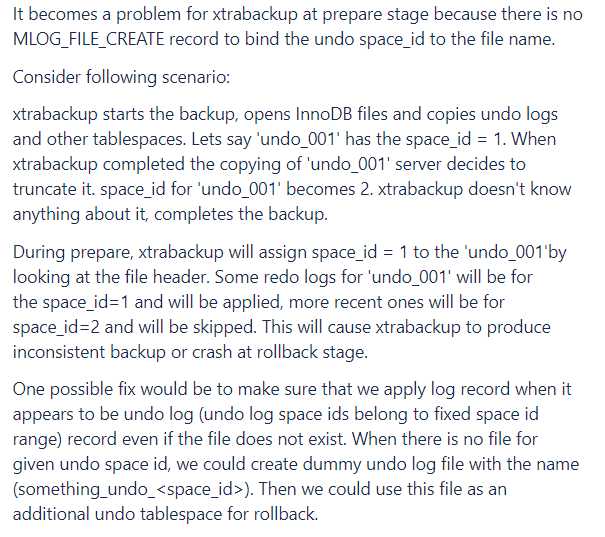
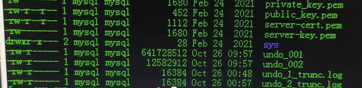

# 故障分析 | undo log 长时间处于清理状态导致备份失败

**原文链接**: https://opensource.actionsky.com/20211111-undolog/
**分类**: 技术干货
**发布时间**: 2021-11-10T22:42:51-08:00

---

作者：王祥
爱可生 DBA 团队成员，主要负责 MySQL 故障处理和性能优化。对技术执着，为客户负责。
本文来源：原创投稿
*爱可生开源社区出品，原创内容未经授权不得随意使用，转载请联系小编并注明来源。
有客户反映有 3 套 MGR 环境全备失败，MySQL 版本为 8.0.18 ，xtrabackup 版本为 8.0.9 。报错信息如下：
`xtrabackup: Generating a list of tablespaces
Directories to scan '.;./;.'
Scanning './'
Completed space ID check of 2 files.
Allocated tablespace ID 12 for zxc/a, old maximum was 0
Undo tablespace number 1 was being truncated when mysqld quit.
Cannot recover a truncated undo tablespace in read-only mode
xtrabackup: error: xb_load_tablespaces() failed with error code 57
`
根据报错到 percona 官方搜索。找下如下 xtrabackup issue(https://jira.percona.com/browse/PXB-1787)：

报错原因： undo log 清理会导致 undo log 的 space_id 变化，进而导致 xtrabackup 备份失败。处理方法也很简单重启一下备份的从节点 undo log 恢复正常，重新备份成功。
虽然已经暂时已经解决了备份的问题，但不能总是重启来解决。接下来重点看看 undo log 清理的问题。
查看 error log 信息,发现在 00:48 已经开始清理 undo log ，备份是在凌晨1点开始，参数 innodb_max_undo_log_size 设置为 1G ，正常的话应该也能清理完。
`2021-10-26T00:48:41.543308+08:00 0 [Note] [MY-012994] [InnoDB] Truncating UNDO tablespace 'innodb_undo_001'.
2021-10-26T00:57:25.369852+08:00 0 [Note] [MY-012994] [InnoDB] Truncating UNDO tablespace 'innodb_undo_002'.
2021-10-26T01:02:01.994594+08:00 11751 [Warning] [MY-012111] [InnoDB] Trying to access missing tablespace 4294967152
2021-10-26T01:02:01.994645+08:00 11751 [Warning] [MY-012111] [InnoDB] Trying to access missing tablespace 4294967151
`
查看 undo log 空间，发现 undo_1_trunc.log、undo_2_trunc.log 还在说明 undo log 过了10个小时依然没有清理完。

在测试环境复现以上问题：
`#将mgr主节点与从节点参数innodb_max_undo_log_size同时修改成10M
mysql>set global innodb_max_undo_log_size=10485760;
#使用sysbench发压
sysbench oltp_read_write --mysql-host=10.186.63.54 --mysql-port=3306 --mysql-user=root --mysql-password=123456 --mysql-db=sysbench --tables=6 --table-size=1000000 --report-interval=1 --threads=1 --time=300 run
`
过几秒就可以看到从节点会生成 undo_1_trunc.log与undo_2_trunc.log ，停止 sysbench 发压。等了半小时 undo_1_trunc.log 与 undo_2_trunc.log 依然存在。但主节点 undo log 清理的很快。
## 执行全备：
`xtrabackup --defaults-file=/etc/my.cnf \
--target-dir=/opt/xtrabackup/full \
--user=root \
--password=123456 \
--socket=/mysqldata/mysql_3306/tmp/mysql.sock \
--backup
`
## 得到报错：
`xtrabackup: Generating a list of tablespaces
Directories to scan '.;./;.'
Scanning './'
Completed space ID check of 2 files.
Allocated tablespace ID 12 for ccc/a, old maximum was 0
Undo tablespace number 1 was being truncated when mysqld quit.
Cannot recover a truncated undo tablespace in read-only mode
xtrabackup: error: xb_load_tablespaces() failed with error code 57
`
首先查看是不是由于有大事务占用导致 undo log 无法被清理使用命令：show engine innodb status\G ，未发现有事务占用 undo log 。难道是 bug 导致的？带着问题去 bug 库搜了一下，果真是一个 bug ：https://bugs.mysql.com/bug.php?id=104573。

undo log 长时间处于清理状态，该问题是由参数 super_read_only 触发的 bug。可以将super_read_only设置成0临时解决。这也解释了为什么在主节点上undo log清理的很快。
那有什么办法减少触发这个 bug 呢？我们可以将 innodb_max_undo_log_size  调大。在InnoDB 存储引擎中，undo 在完成事务回滚和 MVCC 之后，就可以 purge 掉了，purge 掉文件虽然大小不会变，但是可以被重新分配使用。在 innodb_max_undo_log_size 设置较大的情况下，undo log 大小达到阈值前，被 purge 掉了，这样空间可以重用，很难达到阈值，所以不会触发 undo log truncate，所以也就不会触发这个 bug 。