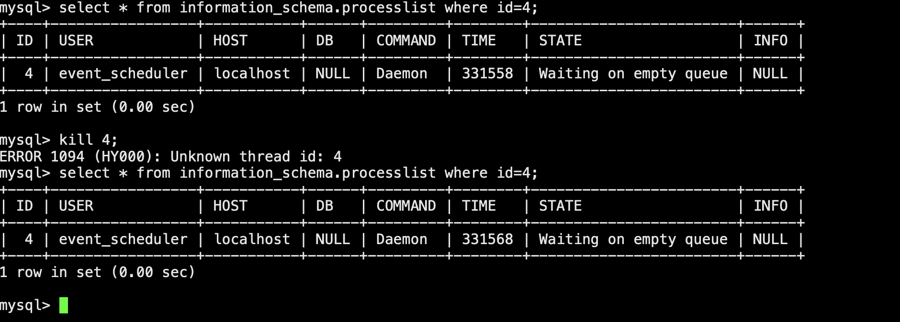
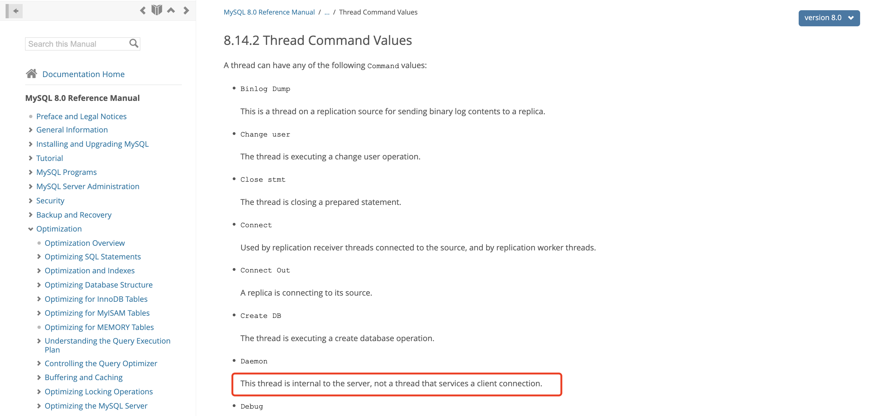
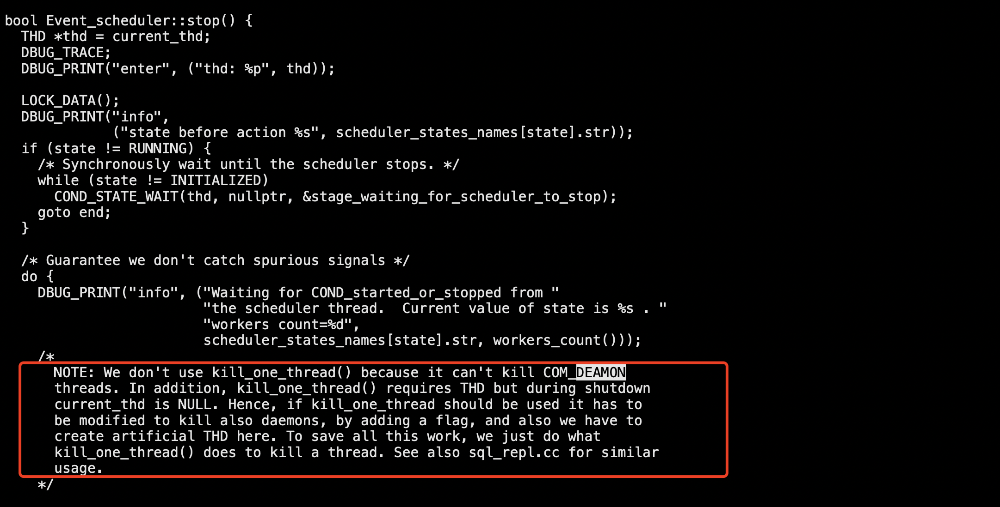
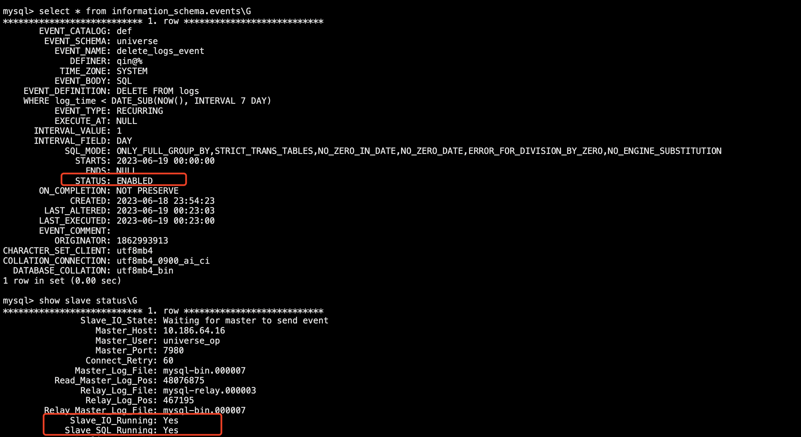
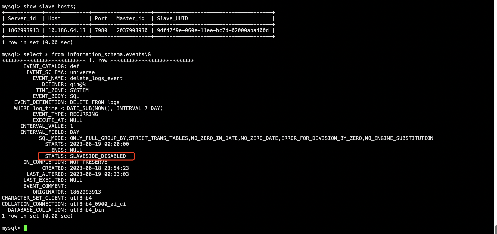

# 故障分析 | 一个 Kill 不掉的 MySQL 会话

**原文链接**: https://opensource.actionsky.com/%e6%95%85%e9%9a%9c%e5%88%86%e6%9e%90-%e4%b8%80%e4%b8%aa-kill-%e4%b8%8d%e6%8e%89%e7%9a%84-mysql-%e4%bc%9a%e8%af%9d/
**分类**: MySQL 新特性
**发布时间**: 2023-07-05T02:49:19-08:00

---

究竟是什么原因，导致主从切换过程中存在一个无法 kill 的会话？
> 作者：秦广飞
爱可生 DBA 团队成员，负责项目日常问题处理及公司平台问题排查，对数据库有兴趣，对技术有想法。一入 IT 深似海，从此节操是路人。
本文来源：原创投稿
- 爱可生开源社区出品，原创内容未经授权不得随意使用，转载请联系小编并注明来源。
# 背景
照例要先讲下本文档背景的，不过在介绍背景之前，先简单说下 MySQL 主从切换的过程。
正常来说，当要发生主从切换时，主库要做下面几个动作：
- 断开流量入口（解绑 VIP）
- 设置只读
- Kill 掉数据库残留连接
而从库，要做下面几个动作：
- 补全与主库差异的 binlog 日志
- 关闭只读
- 清除复制信息
- 开启流量入口（绑定 VIP）
我们公司自研的数据库集群管理平台 [云树® DMP](https://www.actionsky.com/cloudTreeDMP) 大概也是这么个切换过程，而这个切换过程跟本文的关联点，就在主库 Kill 掉残留连接上。
偶然间发现，DMP 在切换过程中 Kill 残留连接时，日志中有时会出现 `warn` 信息：`[warn] kill process warning：Error 1094：Unknown thread id：4`
后来观察到，MySQL 5.7 的主从切换时，就不会出现这个 `warning` 信息，而 MySQL 8.0 就会稳定复现。进一步测试验证后，终于发现了这个 `Unknown thread id` 的真面目，就是 USER 为 **event_scheduler** 的这个&#8221;连接&#8221;。

# 什么是 event_scheduler？
`event_scheduler` 到底是什么呢？毕竟从 `processlist` 信息中可以看到，它与普通的会话似乎不太一样。
其实它是 MySQL 中的一个特殊线程，主要负责执行 MySQL 事件调度器所创建的事件。我们知道 MySQL 是有 event 的，可以像 Linux 中 `crontab` 一样，定时执行一些任务。
*The MySQL Event Scheduler manages the scheduling and execution of events, that is, tasks that run according to a schedule*
当 MySQL 事件调度器启用时 `event_scheduler=ON`，MySQL 就会在后台启动一个 event_scheduler 线程，并且 **event_scheduler** 线程将一直运行，直到 MySQL 服务停止。该线程会负责检查当前时间和已定义的事件，如果事件需要执行，则 **event_scheduler** 线程将启动一个新的会话来执行事件。
需要注意的是，在 MySQL 5.7中，**event_scheduler** 默认是关闭的，而 MySQL 8.0 中则默认打开了，而这也就是为什么在 MySQL 5.7 的切换过程中没有发现 `warning` 信息的原因。
# 为什么 Kill 不掉？
了解 **event_scheduler** 大概是什么之后，我们再来看看，为什么 Kill 时，会报 `Unknown thread id`。
注意看 `processlist` 信息，我们发现 **event_scheduler** 的 COMMAND 值为 `Daemon`。从字面意思上看，`Daemon` 为后台守护的意思，其实在 MySQL 中，当在后台运行一些特殊的功能时，会话 COMMAND 可能被标记为 `Daemon`（实际工作场景中，只注意到过 **event_scheduler**）。
**因为这类会话并不是由用户直接发起的连接，而是 MySQL 内部的线程，所以无法像普通会话一样被 Kill 掉。**

官方文档中，给出的信息较少，大家有兴趣的可以自己翻下代码。

# 如何使用定时任务？
具体如何使用定时任务，其实网上也有很多资料，如果真有需要使用的，建议最好参考官方文档。下面我们简单使用下 `event` 看看效果。
## 启用/关闭/禁用
`-- 修改变量 event_scheduler 来动态启用或者关闭 event
mysql> show variables like '%event_scheduler%';
+-----------------+-------+
| Variable_name   | Value |
+-----------------+-------+
| event_scheduler | ON    |
+-----------------+-------+
1 row in set (0.00 sec)
mysql> 
-- 关闭
mysql> SET GLOBAL event_scheduler = 0;
-- 启用
mysql> SET GLOBAL event_scheduler = 1;
-- 禁用 event_scheduler，只能在配置文件中设置 event_scheduler 为 disable 并重启服务，而不能动态修改
[mysqld]
event_scheduler=DISABLED
`
## 创建
```
-- 准备测试表和数据
mysql> CREATE TABLE logs(id INT(11) primary key AUTO_INCREMENT,log_message VARCHAR(255) NOT NULL,log_time TIMESTAMP NOT NULL);
Query OK, 0 rows affected, 1 warning (0.02 sec)
mysql> INSERT INTO logs (log_message, log_time) VALUES
-> ('君不见黄河之水天上来，奔流到海不复回', '2023-06-07 09:01:00'),
-> ('君不见高堂明镜悲白发，朝如青丝暮成雪', '2023-06-07 23:02:00'),
-> ('人生得意须尽欢，莫使金樽空对月', '2023-06-08 01:03:00'),
-> ('天生我材必有用，千金散尽还复来', '2023-06-08 18:04:00'),
-> ('烹羊宰牛且为乐，会须一饮三百杯', '2023-06-09 23:05:00'),
-> ('钟鼓馔玉不足贵，但愿长醉不复醒', '2023-06-09 11:06:00'),
-> ('古来圣贤皆寂寞，惟有饮者留其名', '2023-06-10 23:02:00'),
-> ('陈王昔时宴平乐，斗酒十千恣欢谑', '2023-06-11 01:03:00'),
-> ('主人何为言少钱，径须沽取对君酌', '2023-06-12 18:04:00'),
-> ('五花马、千金裘', '2023-06-13 23:05:00'),
-> ('呼儿将出换美酒，与尔同销万古愁', '2023-06-14 11:06:00');
Query OK, 11 rows affected (0.01 sec)
Records: 11  Duplicates: 0  Warnings: 0
mysql> 
-- 创建event，实现定时将该日志表中 7 天之前的数据删除
-- 为了快速看到效果，我们每分钟执行一次，一次删除 1 行
mysql> CREATE EVENT delete_logs_event
->   ON SCHEDULE EVERY 1 MINUTE STARTS '2023-06-19 00:00:00'
->   DO
->     DELETE FROM logs
->     WHERE log_time < DATE_SUB(NOW(), INTERVAL 7 DAY) limit 1;
Query OK, 0 rows affected (0.01 sec)
```
## 查看
```
-- 执行 show events 查看，需要先进到 event 所在的 schema
mysql> use universe
mysql> show events\G
*************************** 1. row ***************************
Db: universe
Name: delete_logs_event
Definer: root@localhost
Time zone: SYSTEM
Type: RECURRING
Execute at: NULL
Interval value: 1
Interval field: MINUTE
Starts: 2023-06-19 00:00:00
Ends: NULL
Status: ENABLED
Originator: 1862993913
character_set_client: utf8mb4
collation_connection: utf8mb4_0900_ai_ci
Database Collation: utf8mb4_bin
1 row in set (0.00 sec)
mysql>
-- 通过 information_schema.events 可以看到更详细的信息
mysql> select * from information_schema.events\G
*************************** 1. row ***************************
EVENT_CATALOG: def
EVENT_SCHEMA: universe
EVENT_NAME: delete_logs_event
DEFINER: root@localhost
TIME_ZONE: SYSTEM
EVENT_BODY: SQL
EVENT_DEFINITION: DELETE FROM logs
WHERE log_time < DATE_SUB(NOW(), INTERVAL 7 DAY) limit 1
EVENT_TYPE: RECURRING
EXECUTE_AT: NULL
INTERVAL_VALUE: 1
INTERVAL_FIELD: MINUTE
SQL_MODE: ONLY_FULL_GROUP_BY,STRICT_TRANS_TABLES,NO_ZERO_IN_DATE,NO_ZERO_DATE,ERROR_FOR_DIVISION_BY_ZERO,NO_ENGINE_SUBSTITUTION
STARTS: 2023-06-19 00:00:00
ENDS: NULL
STATUS: ENABLED
ON_COMPLETION: NOT PRESERVE
CREATED: 2023-06-18 23:54:23
LAST_ALTERED: 2023-06-18 23:54:23
LAST_EXECUTED: 2023-06-19 00:00:00
EVENT_COMMENT: 
ORIGINATOR: 1862993913
CHARACTER_SET_CLIENT: utf8mb4
COLLATION_CONNECTION: utf8mb4_0900_ai_ci
DATABASE_COLLATION: utf8mb4_bin
1 row in set (0.00 sec)
mysql> 
-- 查看表中是否被定时删除
mysql> select * from logs;
+----+--------------------------------------------------------+---------------------+
| id | log_message                                            | log_time            |
+----+--------------------------------------------------------+---------------------+
|  2 | 君不见高堂明镜悲白发，朝如青丝暮成雪                   | 2023-06-07 23:02:00 |
|  3 | 人生得意须尽欢，莫使金樽空对月                         | 2023-06-08 01:03:00 |
|  4 | 天生我材必有用，千金散尽还复来                         | 2023-06-08 18:04:00 |
|  5 | 烹羊宰牛且为乐，会须一饮三百杯                         | 2023-06-09 23:05:00 |
|  6 | 钟鼓馔玉不足贵，但愿长醉不复醒                         | 2023-06-09 11:06:00 |
|  7 | 古来圣贤皆寂寞，惟有饮者留其名                         | 2023-06-10 23:02:00 |
|  8 | 陈王昔时宴平乐，斗酒十千恣欢谑                         | 2023-06-11 01:03:00 |
|  9 | 主人何为言少钱，径须沽取对君酌                         | 2023-06-12 18:04:00 |
| 10 | 五花马、千金裘                                         | 2023-06-13 23:05:00 |
| 11 | 呼儿将出换美酒，与尔同销万古愁                         | 2023-06-14 11:06:00 |
+----+--------------------------------------------------------+---------------------+
10 rows in set (0.00 sec)
mysql> 
-- 查看 show processlist 中 event_scheduler 的信息，可以看到 stats 为 Waiting for next activation
mysql> select * from information_schema.processlist where user='event_scheduler';
+-------+-----------------+-----------+------+---------+------+-----------------------------+------+
| ID    | USER            | HOST      | DB   | COMMAND | TIME | STATE                       | INFO |
+-------+-----------------+-----------+------+---------+------+-----------------------------+------+
| 12869 | event_scheduler | localhost | NULL | Daemon  |   58 | Waiting for next activation | NULL |
+-------+-----------------+-----------+------+---------+------+-----------------------------+------+
1 row in set (0.00 sec)
mysql>
-- 我们在从库上看下 event 的信息，可以看到 STATUS 为 SLAVESIDE_DISABLED，因此不用担心从库重复执行 event
mysql> select * from information_schema.events\G
*************************** 1. row ***************************
EVENT_CATALOG: def
EVENT_SCHEMA: universe
EVENT_NAME: delete_logs_event
DEFINER: root@localhost
TIME_ZONE: SYSTEM
EVENT_BODY: SQL
EVENT_DEFINITION: DELETE FROM logs
WHERE log_time < DATE_SUB(NOW(), INTERVAL 7 DAY) limit 1
EVENT_TYPE: RECURRING
EXECUTE_AT: NULL
INTERVAL_VALUE: 1
INTERVAL_FIELD: MINUTE
SQL_MODE: ONLY_FULL_GROUP_BY,STRICT_TRANS_TABLES,NO_ZERO_IN_DATE,NO_ZERO_DATE,ERROR_FOR_DIVISION_BY_ZERO,NO_ENGINE_SUBSTITUTION
STARTS: 2023-06-19 00:00:00
ENDS: NULL
STATUS: SLAVESIDE_DISABLED
ON_COMPLETION: NOT PRESERVE
CREATED: 2023-06-18 23:54:23
LAST_ALTERED: 2023-06-18 23:54:23
LAST_EXECUTED: NULL
EVENT_COMMENT: 
ORIGINATOR: 1862993913
CHARACTER_SET_CLIENT: utf8mb4
COLLATION_CONNECTION: utf8mb4_0900_ai_ci
DATABASE_COLLATION: utf8mb4_bin
1 row in set (0.00 sec)
```
## 修改
```
-- 使用 ALTER 语句修改，其他高权限用户也可以执行，且 event 的用户会变成最后一个 ALTER 的用户
mysql> ALTER EVENT delete_logs_event
->   ON SCHEDULE EVERY 1 DAY STARTS '2023-06-19 00:00:00'
->   DO
->     DELETE FROM logs
->     WHERE log_time < DATE_SUB(NOW(), INTERVAL 7 DAY);
Query OK, 0 rows affected (0.01 sec)
mysql>
-- 可以看到 DEFINER 已经变成了修改的用户，且时间间隔也修改为了 1 天，DELETE 语句也去掉了 LIMIT
mysql> select * from information_schema.events\G
*************************** 1. row ***************************
EVENT_CATALOG: def
EVENT_SCHEMA: universe
EVENT_NAME: delete_logs_event
DEFINER: qin@%
TIME_ZONE: SYSTEM
EVENT_BODY: SQL
EVENT_DEFINITION: DELETE FROM logs
WHERE log_time < DATE_SUB(NOW(), INTERVAL 7 DAY)
EVENT_TYPE: RECURRING
EXECUTE_AT: NULL
INTERVAL_VALUE: 1
INTERVAL_FIELD: DAY
SQL_MODE: ONLY_FULL_GROUP_BY,STRICT_TRANS_TABLES,NO_ZERO_IN_DATE,NO_ZERO_DATE,ERROR_FOR_DIVISION_BY_ZERO,NO_ENGINE_SUBSTITUTION
STARTS: 2023-06-19 00:00:00
ENDS: NULL
STATUS: ENABLED
ON_COMPLETION: NOT PRESERVE
CREATED: 2023-06-18 23:54:23
LAST_ALTERED: 2023-06-19 00:23:03
LAST_EXECUTED: 2023-06-19 00:23:00
EVENT_COMMENT: 
ORIGINATOR: 1862993913
CHARACTER_SET_CLIENT: utf8mb4
COLLATION_CONNECTION: utf8mb4_0900_ai_ci
DATABASE_COLLATION: utf8mb4_bin
1 row in set (0.00 sec)
```
## 删除
```
mysql> drop event delete_logs_event;
Query OK, 0 rows affected (0.01 sec)
mysql> show events\G
Empty set (0.00 sec)
```
## 切换时注意
- 当在主库上创建了 `event`，之后发生了主从切换。此时 `event` 并不会随着切换而变成在新主上执行，且状态也不会发生改变。
- 即原主 `event` 的状态还是 `ENABLED`，而新主 `event` 的状态还是 `DISABLED`。


# 总结
- `show processlist` 中看到的 User 为 **event_scheduler** 的会话为 MySQL 内部线程，无法被 Kill 掉。
- 在主库上创建的 `event`，定时执行的 SQL 语句，在从库上会正常随着复制回放，但不会被重复执行。
- 主从切换后，原主上的 `event` 不会在新主上执行。