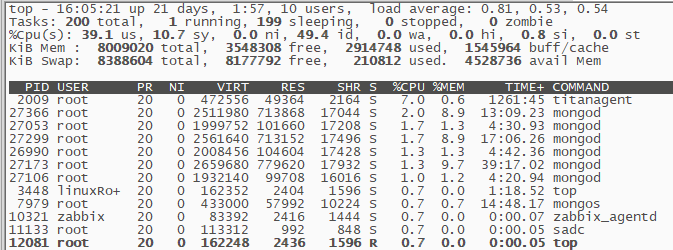
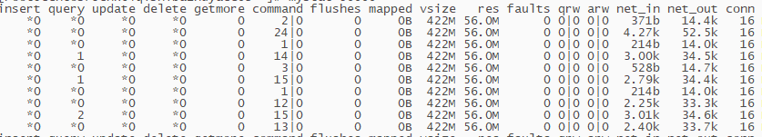
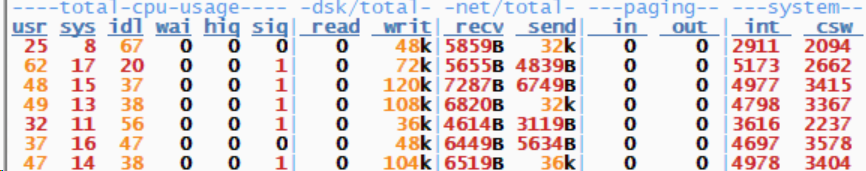
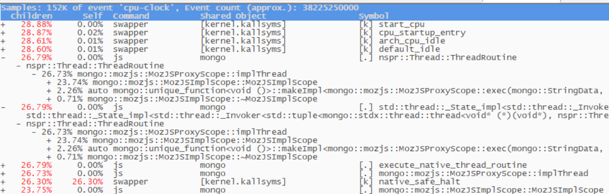
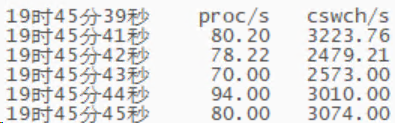
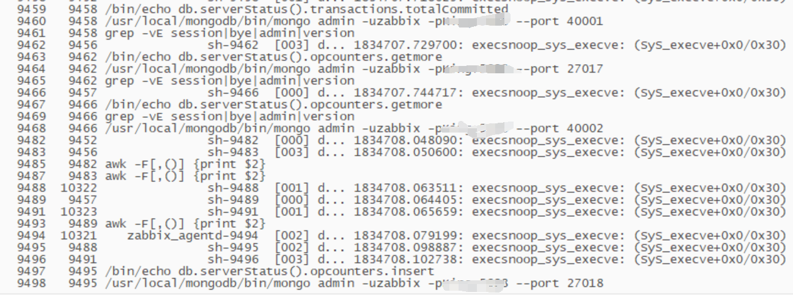

# 故障分析 | 大量短时进程导致 cpu 负载过高案例一则

**原文链接**: https://opensource.actionsky.com/20220525-cpu/
**分类**: 技术干货
**发布时间**: 2022-05-24T23:48:23-08:00

---

作者：任坤
现居珠海，先后担任专职 Oracle 和 MySQL DBA，现在主要负责 MySQL、mongoDB 和 Redis 维护工作。
本文来源：原创投稿
*爱可生开源社区出品，原创内容未经授权不得随意使用，转载请联系小编并注明来源。
## 1、背景
某项目的开发环境，单台虚拟机装了1套mongo集群用于测试，1个mongos + 3节点config + 1shard * 3副本，总计7个mongo实例。 mongo版本4.2.19，OS为centos 7.9。
测试结束后cpu负载一直维持在50%左右，而此时mongo的qps已经下降为0。
这台机器上只安装了mongo，将所有mongo实例关闭，cpu负载立即恢复正常，再将mongo实例开启，过了一会cpu负载又开始飙升。场景能复现，且确认是跟mongo实例有关系。
## 2、诊断
执行top命令，cpu的usr已经达到了40%，但是前几个进程的%cpu加起来远远凑不够数。

查看mongos的qps，确实没有执行用户命令了。

dstat查看整体负载(vmstat格式化做的不好，最后几列总是对不齐整)。

除了cpu负载不正常，其余指标均正常，中断和上下文切换也不算高，不太可能是这两个引发的。
perf record -ag &#8212; sleep 10 && perf report 查看cpu执行情况。

确实有大量mongo调用，但是API命名不直观，无法猜测对应的执行逻辑。
至此，确认是mongo实例引发的问题，但是mongo的应用连接为0，看调用API栈也找不到有用信息。
回到本文开头，top进程的cpu利用率加起来远远小于cpu总体负载，大概率是有频繁短时进程偷走了这部分CPU资源，导致top命令来不及捕获统计。
sar -w 1 查看每秒生成的进程数，平均每秒新建80多个进程，应该就是它了。

要抓出频繁建立短时进程的应用，可以采用execsnoop，该工具通过 ftrace 实时监控进程的 exec() 行为，并输出短时进程的基本信息， 包括进程 PID/PPID、命令行参数。
#下载execsnoop#
cd /usr/bin
wget https://raw.githubusercontent.com/brendangregg/perf‐tools/master/execsnoop
chmod 755 execsnoop 
以下是输出内容，全是监控系统在执行，不停的连接mongo并对输出结果执行grep过滤，每个操作都会衍生一个新线程/进程，10s捕获 了400多条记录。

将zabixx进程关闭，cpu马上恢复正常，找到了元凶。
我们其他环境也采用了zabbix监控，但是都没有遇到类似问题。
该节点部署了7个mongo实例，zabbix默认对每个mongo实例都进行监控，相当于执行损耗放大了7倍，而该机器是一台只有4核CPU的虚拟机。
这些因素凑齐了就会爆发问题。 这是个开发环境，暂时关闭了zabbix监控，后续要对监控逻辑进行优化，尽量减少连接db的次数以及grep调用链的长度。
## 3、小结
当机器cpu负载持续高涨却抓取不到top进程时，可以采用execsnoop抓取短时进程，类似工具还有iosnoop、opensnoop。