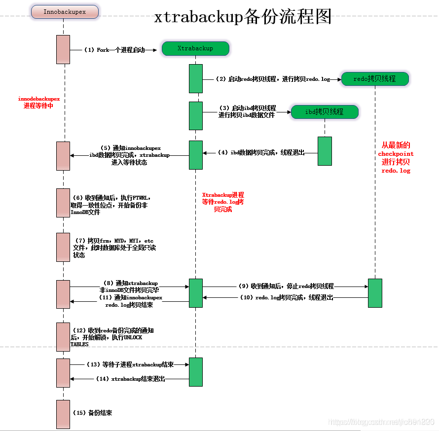
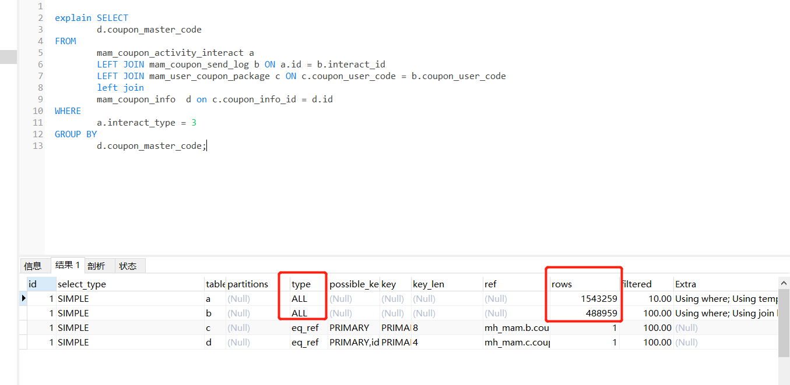

# 故障分析 | 血的教训-由慢查询引发的备份等待导致数据库连接打满

**原文链接**: https://opensource.actionsky.com/20220506-slow/
**分类**: 技术干货
**发布时间**: 2022-05-05T18:14:47-08:00

---

作者：马文斌
MySQL爱好者,任职于蓝月亮(中国)有限公司。
本文来源：原创投稿
*爱可生开源社区出品，原创内容未经授权不得随意使用，转载请联系小编并注明来源。
## 背景
早上一大早被拉去开早会，感觉事情不妙，得知是某中台(发券)数据库 不能正常提供访问。出现大量的下面情况 ：
`| 55279262 | xxx_app | 192.168.50.143:44623 | xxx_mam | Query | 206 | Waiting for table flush | SELECT count(*) FROM mam_user_coupon_package AS a LEFT JOIN mam_coupon_apply_scope as d on a.coupon_info_id = d.coupon_info_id WHERE 1=1 AND a.usable_flag = 1 AND a.user_id = 102101100050614656 and a.coupon_status in (1) and d.business_code = 30006 AND a.end_time >= '2022-04-25 08:56:49.683'
|
| 55278572 | xxx_app | 192.168.50.144:40013 | xxx_mam | Query | 315 | Waiting for table flush | SELECT coupon_user_code,last_update_time,operator_name,operator_id,create_time,creator_name,creator_id,del_flag,user_id,coupon_status,coupon_info_id,start_time,end_time,use_time,activate_time,activate_end_time,coupon_type,coupon_info_type,act_id,usable_flag FROM mam_user_coupon_package WHERE ( ( end_time <= '2022-04-25 08:55:00.638' and usable_flag = 1 and del_flag = 0 and coupon_status = 1 ) ) limit 0,1000
| 55165820 | root | localhost | NULL | Query | 28956 | Waiting for table flush | FLUSH NO_WRITE_TO_BINLOG TABLES |
`
字面意思是等待表刷新，但是这只是个查询，为啥要刷新表呢，而且是几百上千个全局连接进来，一时半会找不到解决方案，只要先救火后分析，那就先把查询干掉再说
`select concat('kill ', id , ';') from PROCESSLIST where USER='xxx_app' and STATE='Waiting for table flush' ;
`
后面发现不行啊，早上不断有连接请求连接进来，这是指标不治本，没办法只能用重启大法，重启完之后数据库终于又恢复了往日的静宁了。
# 事后分析：
有SQL 与 备份操作冲突导致卡死出现。
`220425 01:01:48 [01] Streaming ./xx_ums/ums_channal_authorized.ibd
220425 01:01:48 [01] ...done
220425 01:01:48 >> log scanned up to (425114657787)
220425 01:01:48 Executing FLUSH NO_WRITE_TO_BINLOG TABLES...
220425 01:01:49 >> log scanned up to (425114657787)
……
220425 09:05:52 >> log scanned up to (425114692507)
Error: failed to execute query 'FLUSH NO_WRITE_TO_BINLOG TABLES': 2013 (HY000) Lost connection to MySQL server during query
`
这里是部分备份时产生的日志文件，关键信息就在这里，flush table 操作的不记录到 binlog 里 ，避免从库也执行同样的操作。
于是带着疑问，1、要么有长事务没有提交，2、要么有大的慢查询阻塞
# 备份原理:
备份流程图大致如下：

`1、根据链接信息做数据库的连通性和版本检测
2、读取数据库相关的配置信息（数据和日志文件位置等信息）
3、开启redo日志拷贝线程，从最新的checkpoint开始顺序拷贝redolog到xtrabackup_logfile中
4、开始备份 .ibd ibdata1 undo 等innodb文件
5、执行FLUSH NO_WRITE_TO_BINLOG TABLES 和  FLUSH TABLES WITH READ LOCK
1）关闭所有打开的表，强制关闭所有正在使用的表,不写入binlog
2）关闭所有打开的表，强制关闭所有正在使用的表，并给所有表增加全局read lock
6、拷贝非innodb表相关文件信息
7、读取binlog pos信息并写入xtrabackup_binlog_info文件
8、执行 FLUSH NO_WRITE_TO_BINLOG ENGINE LOGS
1)刷新redo log buffer中的日志到磁盘文件，确保redo log copy线程拷贝这最后的redolog日志数据（为什么说是最后的
redolog日志数据，因为在FLUSH TABLES WITH READ LOCK加锁之后，使用UNLOCK TABLES释放全局读锁之前，不会再有新
的请求进来）
2）为什么确保所有redo日志拷贝完整（因为没有拷贝binlog，如果最后一组提交的事物redo的commit标志没有落盘恢复时
会丢失最后一组事物)
9、停止redolog日志拷贝线程
10、执行UNLOCK TABLES释放表锁
11、收尾生成backup-my.cnf和xtrabackup_info等文件，备份完成。
`
可以看到我们备份的时候是卡在这一步：
FLUSH NO_WRITE_TO_BINLOG TABLES
1）关闭所有打开的表，强制关闭所有正在使用的表,不写入binlog
ok，非常清晰，我们从2个方面入手，写 |  读
# 场景1:模拟未提交的写事务是否阻塞备份
| 序号-时间线 | trx1 | backup |
| --- | --- | --- |
| 1 | begin; |  |
| 2 | update tb1 set id =10 where id =1; |  |
| 3 |  | /usr/bin/innobackupex &#8211;defaults-file=/etc/my.cnf &#8211;user=bigdata_admin &#8211;password=123456 &#8211;socket=/mysqlData/data/mysql.sock &#8211;port=3306 /data/backup/ |
| 4 |  | 220425 15:13:09 completed OK! |
备份输出的日志：
`220425 15:13:08 [01] Copying ./db1/db.opt to /data/backup//2022-04-25_15-12-25/db1/db.opt
220425 15:13:08 [01]        ...done
220425 15:13:08 [01] Copying ./db1/tb1.frm to /data/backup//2022-04-25_15-12-25/db1/tb1.frm
220425 15:13:08 [01]        ...done
220425 15:13:08 Finished backing up non-InnoDB tables and files
220425 15:13:08 [00] Writing xtrabackup_binlog_info
220425 15:13:08 [00]        ...done
220425 15:13:08 Executing FLUSH NO_WRITE_TO_BINLOG ENGINE LOGS...
xtrabackup: The latest check point (for incremental): '2447317'
xtrabackup: Stopping log copying thread.
.220425 15:13:08 >> log scanned up to (2447326)
220425 15:13:08 Executing UNLOCK TABLES
220425 15:13:08 All tables unlocked
220425 15:13:08 [00] Copying ib_buffer_pool to /data/backup//2022-04-25_15-12-25/ib_buffer_pool
220425 15:13:08 [00]        ...done
220425 15:13:08 Backup created in directory '/data/backup//2022-04-25_15-12-25'
MySQL binlog position: filename 'mysql-bin.000003', position '1032', GTID of the last change '74fd0ba9-c45b-11ec-97a4-525400abe2c0:1-8'
220425 15:13:08 [00] Writing backup-my.cnf
220425 15:13:08 [00]        ...done
220425 15:13:08 [00] Writing xtrabackup_info
220425 15:13:08 [00]        ...done
xtrabackup: Transaction log of lsn (2447317) to (2447326) was copied.
220425 15:13:09 completed OK!
`
结论：这个没提交的写事务是不会阻塞备份
# 场景2:模拟事务中的慢查询是否阻塞备份
| 序号-时间线 | trx1 | backup |
| --- | --- | --- |
| 1 | begin; |  |
| 2 | select id,sleep(1000) from tb1; |  |
| 3 |  | /usr/bin/innobackupex &#8211;defaults-file=/etc/my.cnf &#8211;user=bigdata_admin &#8211;password=123456 &#8211;socket=/mysqlData/data/mysql.sock &#8211;port=3306 /data/backup/ |
| 4 |  | 220425 15:20:58 [01] Copying ./db1/tb1.ibd to /data/backup//2022-04-25_15-20-21/db1/tb1.ibd220425 15:20:58 [01]        &#8230;done220425 15:20:58 >> log scanned up to (2447326)220425 15:20:59 Executing FLUSH NO_WRITE_TO_BINLOG TABLES&#8230;220425 15:20:59 >> log scanned up to (2447326)220425 15:21:00 >> log scanned up to (2447326)220425 15:21:01 >> log scanned up to (2447326)220425 15:21:02 >> log scanned up to (2447326)220425 15:21:03 >> log scanned up to (2447326)220425 15:21:04 >> log scanned up to (2447326)220425 15:21:05 >> log scanned up to (2447326)220425 15:21:06 >> log scanned up to (2447326)220425 15:21:07 >> log scanned up to (2447326)220425 15:21:08 >> log scanned up to (2447326)220425 15:21:09 >> log scanned up to (2447326)220425 15:21:10 >> log scanned up to (2447326)220425 15:21:11 >> log scanned up to (2447326)220425 15:21:12 >> log scanned up to (2447326)220425 15:21:13 >> log scanned up to (2447326)220425 15:21:14 >> log scanned up to (2447326)220425 15:21:15 >> log scanned up to (2447326) |
| 5 | localhost 15:12:19 [db1]> select id,sleep(1000) from tb1;ERROR 3024 (HY000): Query execution was interrupted, maximum statement execution time exceeded |  |
| 6 |  | 220425 15:22:18 [00] Writing xtrabackup_binlog_info220425 15:22:18 [00]        &#8230;done220425 15:22:18 Executing FLUSH NO_WRITE_TO_BINLOG ENGINE LOGS&#8230;xtrabackup: The latest check point (for incremental): &#8216;2447317&#8217;xtrabackup: Stopping log copying thread..220425 15:22:18 >> log scanned up to (2447326)
220425 15:22:18 Executing UNLOCK TABLES220425 15:22:18 All tables unlocked220425 15:22:18 [00] Copying ib_buffer_pool to /data/backup//2022-04-25_15-20-21/ib_buffer_pool220425 15:22:18 [00]        &#8230;done220425 15:22:18 Backup created in directory &#8216;/data/backup//2022-04-25_15-20-21&#8217;MySQL binlog position: filename &#8216;mysql-bin.000003&#8217;, position &#8216;1032&#8217;, GTID of the last change &#8217;74fd0ba9-c45b-11ec-97a4-525400abe2c0:1-8&#8242;220425 15:22:18 [00] Writing backup-my.cnf220425 15:22:18 [00]        &#8230;done220425 15:22:18 [00] Writing xtrabackup_info220425 15:22:18 [00]        &#8230;donextrabackup: Transaction log of lsn (2447317) to (2447326) was copied.220425 15:22:18 completed OK! |
我们可以看到，直到sql执行超时，也就是意味着表关闭了，备份才成功。
结论：事务中的慢查询会阻塞备份
# 场景3：模拟不带事务慢查询是否阻塞备份
| 序号-时间线 | trx-1 | backup |
| --- | --- | --- |
| 1 | select id,sleep(1000) from tb1; |  |
| 2 |  | /usr/bin/innobackupex &#8211;defaults-file=/etc/my.cnf &#8211;user=bigdata_admin &#8211;password=123456 &#8211;socket=/mysqlData/data/mysql.sock &#8211;port=3306 /data/backup/ |
| 3 |  | 220425 15:26:03 [01]        &#8230;done220425 15:26:03 [01] Copying ./db1/tb1.ibd to /data/backup//2022-04-25_15-25-27/db1/tb1.ibd220425 15:26:03 [01]        &#8230;done220425 15:26:03 Executing FLUSH NO_WRITE_TO_BINLOG TABLES&#8230;220425 15:26:04 >> log scanned up to (2447326)220425 15:26:05 >> log scanned up to (2447326)220425 15:26:06 >> log scanned up to (2447326)220425 15:26:07 >> log scanned up to (2447326)220425 15:26:08 >> log scanned up to (2447326)220425 15:26:09 >> log scanned up to (2447326) |
| 4 | localhost 15:22:17 [db1]> select id,sleep(1000) from tb1;ERROR 3024 (HY000): Query execution was interrupted, maximum statement execution time exceeded |  |
| 5 |  | 220425 15:27:23 [00]        &#8230;done220425 15:27:23 Executing FLUSH NO_WRITE_TO_BINLOG ENGINE LOGS&#8230;xtrabackup: The latest check point (for incremental): &#8216;2447317&#8217;xtrabackup: Stopping log copying thread..220425 15:27:23 >> log scanned up to (2447326)
220425 15:27:23 Executing UNLOCK TABLES220425 15:27:23 All tables unlocked220425 15:27:23 [00] Copying ib_buffer_pool to /data/backup//2022-04-25_15-25-27/ib_buffer_pool220425 15:27:23 [00]        &#8230;done220425 15:27:23 Backup created in directory &#8216;/data/backup//2022-04-25_15-25-27&#8217;MySQL binlog position: filename &#8216;mysql-bin.000003&#8217;, position &#8216;1032&#8217;, GTID of the last change &#8217;74fd0ba9-c45b-11ec-97a4-525400abe2c0:1-8&#8242;220425 15:27:23 [00] Writing backup-my.cnf220425 15:27:23 [00]        &#8230;done220425 15:27:23 [00] Writing xtrabackup_info220425 15:27:23 [00]        &#8230;donextrabackup: Transaction log of lsn (2447317) to (2447326) was copied.220425 15:27:23 completed OK! |
| 6 |  |  |
我们可以看到，直到sql执行超时，也就是意味着表关闭了，备份拿到了备份锁，备份才成功。关于备份锁的资料请查看这里:https://www.percona.com/doc/percona-server/5.6/management/backup_locks.html#backup-locks
结论：不带事务的慢查询也会阻塞备份
# FLUSH TABLES
FLUSH NO_WRITE_TO_BINLOG TABLES = FLUSH TABLES ，只不过这种flush tables 的动作是不会写入到binlog文件中，而flush tables 是需要获取锁。官方文件这样描述flush tables
`The FLUSH statement has several variant forms that clear or reload various internal caches, flush tables, or acquire locks.
By default, the server writes FLUSH statements to the binary log so that they replicate to replicas. To suppress logging, specify the optional NO_WRITE_TO_BINLOG keyword or its alias LOCAL.
FLUSH TABLES flushes tables, and, depending on the variant used, acquires locks. Any TABLES variant used in a FLUSH statement must be the only option used. FLUSH TABLE is a synonym for FLUSH TABLES.
Closes all open tables, forces all tables in use to be closed, and flushes the query cache and prepared statement cache. FLUSH TABLES also removes all query results from the query cache, like the RESET QUERY CACHE statement. For information about query caching and prepared statement caching
`
大概意思就是：关闭所有打开的表，强制关闭所有正在使用的表，并刷新查询缓存和准备好的语句缓存。[`FLUSH TABLES`](https://dev.mysql.com/doc/refman/5.7/en/flush.html#flush-tables)还会从查询缓存中删除所有查询结果，例如 `RESET QUERY CACHE`语句。有关查询缓存和准备好的语句缓存的信息
# 反推生产环境
## 检查慢查询
Oh my god，在32.197服务器的慢查询中搜索到一个执行了10几个小时的慢查询
`# Time: 2022-04-25T09:12:53.416049+08:00
# User@Host: BlueMoon[BlueMoon] @  [192.168.50.144]  Id: 55128898
# Query_time: 38910.325000  Lock_time: 0.000328 Rows_sent: 0  Rows_examined: 14637241
SET timestamp=1650849173;
SELECT
d.coupon_master_code
FROM
mam_coupon_activity_interact a
LEFT JOIN mam_coupon_send_log b ON a.id = b.interact_id
LEFT JOIN mam_user_coupon_package c ON c.coupon_user_code = b.coupon_user_code
left join
mam_coupon_info  d on c.coupon_info_id = d.id
WHERE
a.interact_type = 3
GROUP BY
d.coupon_master_code;
`
38910秒=10.8 小时，快11个钟了， Time: 2022-04-25T09:12:53 ，往前推38910秒，也就是 2022-04-24 22:24:23 开始执行这个sql。
为什么会这么慢，我们看下执行计

表结构如下：
`mysql> show create table mam_coupon_send_log \G
*************************** 1. row ***************************
Table: mam_coupon_send_log
Create Table: CREATE TABLE `mam_coupon_send_log` (
`id` int(10) NOT NULL AUTO_INCREMENT COMMENT '主键',
`last_update_time` datetime DEFAULT CURRENT_TIMESTAMP ON UPDATE CURRENT_TIMESTAMP COMMENT '最后更新时间',
`operator_name` varchar(32) COLLATE utf8mb4_unicode_ci DEFAULT NULL COMMENT '操作人名称',
`operator_id` int(11) DEFAULT NULL COMMENT '操作人编号',
`create_time` datetime DEFAULT CURRENT_TIMESTAMP COMMENT '创建时间',
`creator_name` varchar(32) COLLATE utf8mb4_unicode_ci DEFAULT NULL COMMENT '创建人名称',
`creator_id` int(11) DEFAULT NULL COMMENT '创建人编号',
`del_flag` tinyint(1) DEFAULT '0' COMMENT '是否删除（0：否，1：是）',
`shop_order_id` bigint(20) DEFAULT NULL COMMENT '订单编号',
`activity_code` bigint(20) DEFAULT NULL COMMENT '活动编号',
`coupon_user_code` bigint(20) DEFAULT NULL COMMENT '用户券编号',
`user_id` bigint(20) DEFAULT NULL COMMENT '领券人id',
`mensend_id` int(11) DEFAULT NULL COMMENT '人工发券id',
`interact_id` bigint(20) DEFAULT NULL COMMENT '互动赠券id',
`send_type` tinyint(1) DEFAULT NULL COMMENT '发券类型(1人工发券2积分兑券3买单赠券4数据迁移5券转增6券转换7营销互动)',
`act_id` int(11) DEFAULT NULL COMMENT '活动id',
`integral_record_id` bigint(20) DEFAULT NULL COMMENT '积分兑换记录表id',
`interact_detail_id` bigint(20) DEFAULT NULL COMMENT '互动赠券明细id',
PRIMARY KEY (`id`) USING BTREE,
KEY `idx_coupon_use_code` (`coupon_user_code`) USING BTREE COMMENT '卡券包编码索引',
KEY `idx_shop_order_id_send_type` (`shop_order_id`,`send_type`) USING BTREE
) ENGINE=InnoDB AUTO_INCREMENT=551413 DEFAULT CHARSET=utf8mb4 COLLATE=utf8mb4_unicode_ci ROW_FORMAT=DYNAMIC COMMENT='用户券发送日志表'
`
建议对interact_id 字段加索引
`alter table mam_coupon_send_log add index idx_interact_id(interact_id);
`
而我们那点备份是从晚上1点开始备份，也就是说这个备份一直在等待这个查询结束,符合场景3:
## 检查数据库的sql超时是否设置
`mysql> show variables like '%exec%';
+----------------------------------+--------+
| Variable_name                    | Value  |
+----------------------------------+--------+
| gtid_executed_compression_period | 1000   |
| max_execution_time               | 0      |
| rbr_exec_mode                    | STRICT |
| slave_exec_mode                  | STRICT |
+----------------------------------+--------+
`
。。。。。居然没有设置sql查询超时时间
建议设置sql超时时间
`set global max_execution_time = 120000;
120秒超时
`
# 反推备份优化
## 设置超时时间
https://www.percona.com/doc/percona-xtrabackup/2.4/innobackupex/innobackupex_option_reference.html
`--ftwrl-wait-timeout=SECONDS
This option specifies time in seconds that innobackupex should wait for queries that would block FLUSH TABLES WITH READ LOCK before running it. If there are still such queries when the timeout expires, innobackupex terminates with an error. Default is 0, in which case innobackupex does not wait for queries to complete and starts FLUSH TABLES WITH READ LOCK immediately. Where supported (Percona Server 5.6+) xtrabackup will automatically use Backup Locks as a lightweight alternative to FLUSH TABLES WITH READ LOCK to copy non-InnoDB data to avoid blocking DML queries that modify InnoDB tables.
--kill-long-queries-timeout=SECONDS
This option specifies the number of seconds innobackupex waits between starting FLUSH TABLES WITH READ LOCK and killing those queries that block it. Default is 0 seconds, which means innobackupex will not attempt to kill any queries. In order to use this option xtrabackup user should have PROCESS and SUPER privileges. Where supported (Percona Server 5.6+) xtrabackup will automatically use Backup Locks as a lightweight alternative to FLUSH TABLES WITH READ LOCK to copy non-InnoDB data to avoid blocking DML queries that modify InnoDB tables.
`
`/usr/bin/innobackupex --defaults-file=/etc/my.cnf --user=bigdata_admin --password=123456 --socket=/mysqlData/data/mysql.sock --port=3306 --ftwrl-wait-timeout=5 --kill-long-queries-timeout=5 /data/backup/
`
# 总结
1.业务层面：需要定期优化慢查询，业务库的增删改查操作尽量优化到<0.2秒
2.数据库层面：设置慢查询执行超时时间，超过了一定时间强制kill掉，比如查过20分钟，对于OLTP业务，如果一个 sql 20分钟没有执行完，那就不是 OLTP ，而是 OLAP 业务 ,应该放在大数据层处理或优化代码或sql
set global max_execution_time = 1200000;
3.备份层面:增加锁等待的超时时间
&#8211;ftwrl-wait-timeout=5 &#8211;kill-long-queries-timeout=5
由于时间仓促，可能有很多细节没有考虑到，后续再优化。