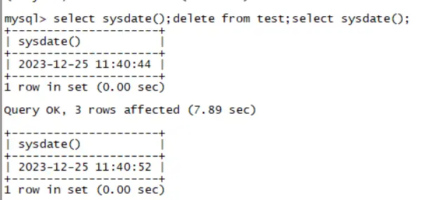
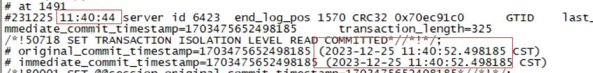
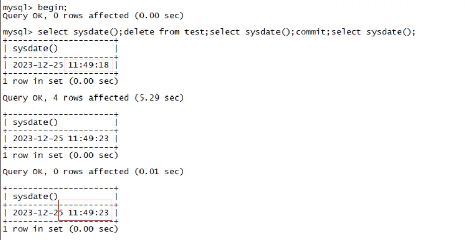
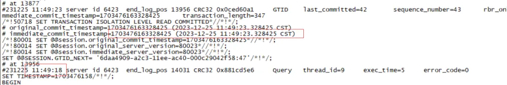
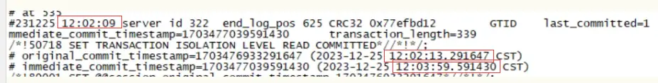

# 新特性 | 八怪：再谈 MySQL 8 这两个精准的时间戳

**原文链接**: https://opensource.actionsky.com/%e6%96%b0%e7%89%b9%e6%80%a7-%e5%85%ab%e6%80%aa%ef%bc%9a%e5%86%8d%e8%b0%88-mysql-8-%e8%bf%99%e4%b8%a4%e4%b8%aa%e7%b2%be%e5%87%86%e7%9a%84%e6%97%b6%e9%97%b4%e6%88%b3/
**分类**: MySQL 新特性
**发布时间**: 2023-12-26T18:10:57-08:00

---

MySQL 8.0 的 binlog 中多了 *immediate_commit_timestamp* 和 *original_commit_timestamp* 的信息，网上也有很多文章进行解释，最近也刚好遇到相关问题，刚好稍微学习一下。
> 
作者：高鹏（八怪），《MySQL 主从原理》作者，深入透彻理解 MySQL 主从，GTID 相关技术知识。
爱可生开源社区出品，原创内容未经授权不得随意使用，转载请联系小编并注明来源。
本文共约 1700 字，预计阅读需要 6 分钟。
# 相关解释
- **immediate_commit_timestamp：**代表是当前数据库提交的时间，从库/主库都分别代表其提交的时间。
- **original_commit_timestamp：**代表主库提交的时间，不管有多少级联的从库这个时间永远是主库提交事务时候的时间。当然在主库上其就等于 immediate_commit_timestamp 的时间。
它们的生成时间都是在从 binlog cache 写入到 binlog 文件的时候，生成 GTID event 的时候，也就是 commit 的 flush 阶段，我们简称这个为 **提交时间**。
但是需要注意的是 MGR 中主库的 *original_commit_timestamp* 和 *immediate_commit_timestamp* 生成稍有提前（*group_replication_trans_before_commit*），并不是这里说的提交时间。
# 生成流程
## 2.1 关于 thd->variables.original_commit_timestamp
因为 *original_commit_timestamp* 来自这个值，一般情况下其值都是 `UNDEFINED_COMMIT_TIMESTAMP`，但是从库上这个值会在应用 GTID event 的时候更改为主库带过来的 *original_commit_timestamp*，因为主库 *original_commit_timestamp* 就是提交时间，因此从库的 `thd->variables.original_commit_timestamp` 也就设置为了主库的提交时间。
但是有一个例外，就是 5.7 向 8.0 同步的时候，因为没有这个值因此会被设置为 0。如下：
`# original_commit_timestamp=0 (1970-01-01 08:00:00.000000 CST)
# immediate_commit_timestamp=1703237689977004 (2023-12-22 17:34:49.977004 CST)
`
## 2.2 生成方式
这个其实比较简单，就是在函数 `MYSQL_BIN_LOG::write_transaction` 中生成的，大概为：
`immediate_commit_timestamp = 获取的当前时间
original_commit_timestamp = thd->variables.original_commit_timestamp
（前面描述了thd->variables.original_commit_timestamp主库不会设置为特定的值，其为 UNDEFINED_COMMIT_TIMESTAMP）
如果 original_commit_timestamp 等于 UNDEFINED_COMMIT_TIMESTAMP，那么它就是主库，应该将设置
original_commit_timestamp = immediate_commit_timestamp，这样主库的 original_commit_timestamp 
和 immediate_commit_timestamp 就相同了
否则 original_commit_timestamp 有特定的值，那么就是从库，因为这个值来自 
thd->variables.original_commit_timestamp，前面说了他是应用 GTID event 的值。
`
## 2.3 相关警告
当发现从库的提交时间还比主库的提交时间更慢的时候，显然这是不合适的，就会出现这个警告如下：
`if (original_commit_timestamp > immediate_commit_timestamp &&
!thd->rli_slave->get_c_rli()->gtid_timestamps_warning_logged) { //如果原始时间 还在于了当前服务器的提交时间，这是常见的警告
LogErr(WARNING_LEVEL, ER_INVALID_REPLICATION_TIMESTAMPS);         //则报警
`
这就是大家经常遇到的警告。
`Invalid replication timestamps: original commit timestamp is more recent than the 
immediate commit timestamp. This may be an issue if delayed replication is active.
Make sure that servers have their clocks set to the correct time. No further 
message will be emitted until after timestamps become valid again."
`
# 其运维中的意义
## 3.1 在延时从库中的应用
如果配置了延迟从库，则使用的是 *immediate_commit_timestamp* 作为延迟从库应用 event 的计算标准，因为这里 event 来自 `relay log`，因此 *immediate_commit_timestamp* 是 IO 线程连接库（A->B->C，C 为延迟从库，则这里为B库提交事务的时间）的事务提交时间，在函数 `sql_delay_event` 中有如下计算方式：
`sql_delay_end = ceil((static_cast<Gtid_log_event *>(ev)
->immediate_commit_timestamp) /
1000000.00) +
sql_delay;
`
而对于不支持的延时从库则计算为：
`sql_delay_end = ev->common_header->when.tv_sec +
rli->mi->clock_diff_with_master + sql_delay;
`
对于 *immediate_commit_timestamp* 和 *ev->common_header->when.tv_sec* 是有很大区别的，后者为 binlog header 中 timestamp 的时间，其在整个复制链路中并不会改变，其几乎为命令发起的时间，而不是事务提交的时间。我们以 A->B->C 为列，其中 C 为一个延迟从库。
- 支持 *immediate_commit_timestamp* 的情况：C 的延迟计算是以B库提交时刻的时间为计算标准的。也就是其延迟是 B 库提交后多久 C 库应用。
- 不支持 *immediate_commit_timestamp* 的情况：C 的延迟计算是以 A 库命令发起的时间为计算标准的。也就是其延迟是 A 库命令发起后多久 C 库应用。
很显然前者的计算方式更为靠谱。在延迟从库在等待的时候其线程的状态为：
`Waiting until MASTER_DELAY seconds after master executed event
`
## 3.2 主库判定事务的提交时刻和语句发起时间
某些时候我们可能需要知道语句什么时候发起执行的，什么时候提交完成的，这个时候我们考虑使用 *immediate_commit_timestamp* 和 event header 的 *timestamp* 进行对比。
- 对于自动提交的 DML 语句，则 GTID event header 的 timestamp 为语句发起的时间，而 GTID event 的 *immediate_commit_timestamp* 为事务提交的时间，如果差值太大，可能是遇到了锁（MDL LOCK 或 row lock）之类的问题。如下图：

- 对于非自动提交的事务，则 GTID event 的 *immediate_commit_timestamp* 为事务提交的时间，但是语句开始执行的时间需要查看具体语句的 event 才可以，不能查看 GTID event header 的 timestamp，这是 commit 命令发起的时间，如下图：

当然类似，还可以获取从库的 binlog 信息来比对主库是什么时候发起语句的，什么时候提交事务的，从库又是什么时候提交事务的。类似如下图，这是我的一个从库，我这里是一个**自动提交的 DML 语句**：

很明显，主库发起语句时间和主库提交时间以及从库提交时间都有一定的差值。
- 主库发起语句时间：12:02:09
- 主库提交事务时间：12:02:13
- 从库提交事务时间：12:03:59
## 3.3 更加精确的延迟
这部分你在官方文档有说明，其中主要包含 3 个视图：
- **ps.replication_applier_status_by_worker：** SQL 线程或者 WORKER 执行相关
- **ps.replication_connection_status：** IO 线程相关
- **ps.replication_applier_status_by_coordinator：** 协调线程相关
其中大部分和 *timestamp* 相关的字段的都是自解释的，而在 *ps.replication_applier_status_by_coordinator* 和 *ps.replication_applier_status_by_worker* 中有两类字段类似 `XXX_BUFFER_TIMESTAMP`，`XXX_APPLY_TIMESTAMP` 比如：
- **LAST_PROCESSED_TRANSACTION_END_BUFFER_TIMESTAMP：** 表示协调线程将事务分发给 WORKER 线程的时间
- **LAST_APPLIED_TRANSACTION_END_APPLY_TIMESTAMP：** 表示应用完事务的时间
具体代码中可以断点在：
- Relay_log_info::finished_processing
- Relay_log_info::started_processing
上进行观察，实际上是 `Relay_log_info` 中多了如下信息：
`  /**
Stores information on the last processed transaction or the transaction
that is currently being processed.
STS:
- timestamps of the currently applying/last applied transaction
MTS:
- coordinator thread: timestamps of the currently scheduling/last scheduled
transaction in a worker's queue
- worker thread: timestamps of the currently applying/last applied
transaction
*/
Gtid_monitoring_info *gtid_monitoring_info;
`
每个 WORKER 和协调线程都包含了这样一个事务的监控信息，因此可以在视图中打印出来。
显然我们就可以通过各种从库中执行的  *timestamp* 的时间和主库提交时间也就是 *ORIGINAL_COMMIT_TIMESTAMP* 计算出来精确的延迟。