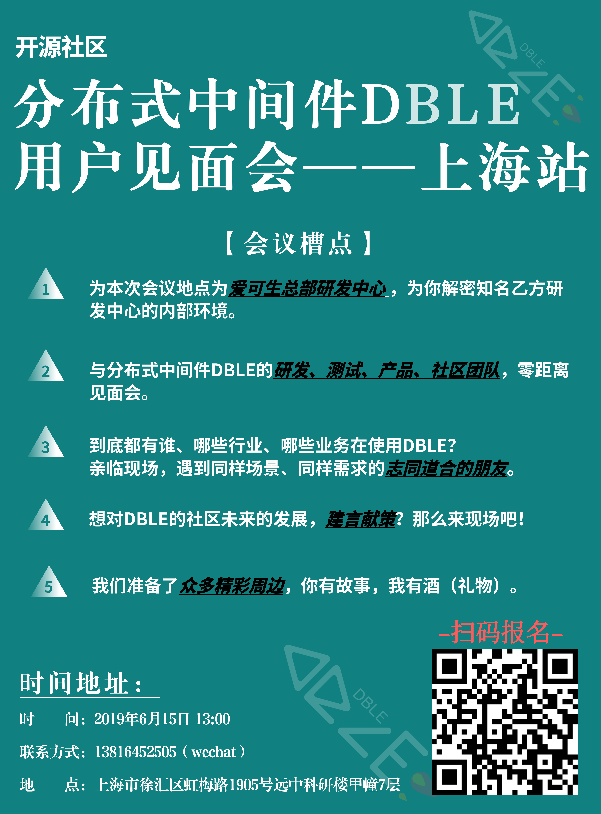

# 新特性解读 | MySQL 8.0 索引特性1-函数索引

**原文链接**: https://opensource.actionsky.com/20190505-mysql8/
**分类**: MySQL 新特性
**发布时间**: 2019-05-05T01:13:08-08:00

---

函数索引顾名思义就是加给字段加了函数的索引，这里的函数也可以是表达式。所以也叫表达式索引。
MySQL 5.7 推出了虚拟列的功能，**MySQL8.0的函数索引内部其实也是依据虚拟列来实现的。**
#### 我们考虑以下几种场景：
**1.对比日期部分的过滤条件。**
`SELECT ...
FROM tb1
WHERE date(time_field1) = current_date;
`
**2.两字段做计算。**
`SELECT ...
FROM tb1
WHERE field2 + field3 = 5;
`
**3.求某个字段中间某子串。**
`SELECT ...
FROM tb1
WHERE substr(field4, 5, 9) = 'actionsky';
`
**4.求某个字段末尾某子串。**
`SELECT ...
FROM tb1
WHERE RIGHT(field4, 9) = 'actionsky';
`
**5.求JSON格式的VALUE。**
`SELECT ...
FROM tb1
WHERE CAST(field4 ->> '$.name' AS CHAR(30)) = 'actionsky';
`
以上五个场景如果不用函数索引，改写起来难易不同。不过都要做相关修改，不是过滤条件修正就是表结构变更添加冗余字段加额外索引。
**比如第1个场景改写为，**
`SELECT ...
FROM tb1
WHERE time_field1 >= concat(current_date, ' 00:00:00')
AND time_field1 <= concat(current_date, '23:59:59');
`
**再比如第4个场景的改写，**
由于是求最末尾的子串，只能添加一个新的冗余字段，并且做相关的计划任务来一定频率的异步更新或者添加触发器来实时更新此字段值。
`SELECT ...
FROM tb1
WHERE field4_suffix = 'actionsky';
`
那我们看到，改写也可以实现，不过这样的SQL就没有标准化而言，后期不能平滑的迁移了。
**MySQL 8.0 推出来了函数索引让这些变得相对容易许多。**
不过函数索引也有自己的缺陷，**就是写法很固定，必须要严格按照定义的函数来写，不然优化器不知所措。**
我们来把上面那些场景**实例化。**
**示例表结构，**

**总记录数**
`mysql> SELECT COUNT(*)
FROM t_func;
+----------+
| count(*) |
+----------+
|    16384 |
+----------+
1 row in set (0.01 sec)
`
**我们把上面几个场景的索引全加上。**
`mysql > ALTER TABLE t_func ADD INDEX idx_log_time ( ( date( log_time ) ) ),
ADD INDEX idx_u1 ( ( rank1 + rank2 ) ),
ADD INDEX idx_suffix_str3 ( ( RIGHT ( str3, 9 ) ) ),
ADD INDEX idx_substr_str1 ( ( substr( str1, 5, 9 ) ) ),
ADD INDEX idx_str2 ( ( CAST( str2 ->> '$.name' AS CHAR ( 9 ) ) ) );
QUERY OK,
0 rows affected ( 1.13 sec ) Records : 0 Duplicates : 0 WARNINGS : 0
`
**我们再看下表结构， 发现好几个已经被转换为系统自己的写法了。**

MySQL 8.0 还有一个特性，就是可以把系统隐藏的列显示出来。
**我们用show extened 列出函数索引创建的虚拟列，**

上面5个随机字符串列名为函数索引隐式创建的虚拟COLUMNS。
**我们先来看看场景2，两个整形字段的相加，**
`mysql> SELECT COUNT(*)
FROM t_func
WHERE rank1 + rank2 = 121;
+----------+
| count(*) |
+----------+
|      878 |
+----------+
1 row in set (0.00 sec)
`
**看下执行计划，用到了idx_u1函数索引，**
`mysql> explain SELECT COUNT(*)
FROM t_func
WHERE rank1 + rank2 = 121\G
*************************** 1. row ***************************
id: 1
select_type: SIMPLE
table: t_func
partitions: NULL
type: ref
possible_keys: idx_u1
key: idx_u1
key_len: 9
ref: const
rows: 878
filtered: 100.00
Extra: NULL
1 row in set, 1 warning (0.00 sec)
`
**那如果我们稍微改下这个SQL的执行计划，发现此时不能用到函数索引，变为全表扫描了，所以要严格按照函数索引的定义来写SQL。**
`mysql> explain SELECT COUNT(*)
FROM t_func
WHERE rank1 = 121 - rank2\G
*************************** 1. row ***************************
id: 1
select_type: SIMPLE
table: t_func
partitions: NULL
type: ALL
possible_keys: NULL
key: NULL
key_len: NULL
ref: NULL
rows: 16089
filtered: 10.00
Extra: Using where
1 row in set, 1 warning (0.00 sec)
`
**再来看看场景1的的改写和不改写的性能简单对比。**
`mysql> SELECT *
FROM t_func
WHERE date(log_time) = '2019-04-18'
LIMIT 1\G
*************************** 1. row ***************************
id: 2
rank1: 1
str1: test-actionsky-test
str2: {"age": 30, "name": "dell"}
rank2: 120
str3: test-actionsky
log_time: 2019-04-18 10:04:53
1 row in set (0.01 sec)
`
**我们把普通的索引加上。**
`mysql > ALTER TABLE t_func ADD INDEX idx_log_time_normal ( log_time );
QUERY OK,
0 rows affected ( 0.36 sec ) Records : 0 Duplicates : 0 WARNINGS : 0
`
**然后改写下SQL看下。**
`mysql> SELECT *
FROM t_func
WHERE date(log_time) >= '2019-04-18 00:00:00'
AND log_time < '2019-04-19 00:00:00'
*************************** 1. row ***************************
id: 2
rank1: 1
str1: test-actionsky-test
str2: {"age": 30, "name": "dell"}
rank2: 120
str3: test-actionsky
log_time: 2019-04-18 10:04:53
1 row in set (0.01 sec)
`
两个看起来没啥差别，我们仔细看下**两个的执行计划**
&#8211; **普通索引**
`mysql> explain format=json SELECT *
FROM t_func
WHERE log_time >= '2019-04-18 00:00:00'
AND log_time < '2019-04-19 00:00:00'
LIMIT 1\G
*************************** 1. row ***************************
EXPLAIN: {
"query_block": {
"select_id": 1,
"cost_info": {
"query_cost": "630.71"
},
"table": {
"table_name": "t_func",
"access_type": "range",
"possible_keys": [
"idx_log_time_normal"
],
"key": "idx_log_time_normal",
"used_key_parts": [
"log_time"
],
"key_length": "6",
"rows_examined_per_scan": 1401,
"rows_produced_per_join": 1401,
"filtered": "100.00",
"index_condition": "((`ytt`.`t_func`.`log_time` >= '2019-04-18 00:00:00') and (`ytt`.`t_func`.`log_time` < '2019-04-19 00:00:00'))",
"cost_info": {
"read_cost": "490.61",
"eval_cost": "140.10",
"prefix_cost": "630.71",
"data_read_per_join": "437K"
},
"used_columns": [
"id",
"rank1",
"str1",
"str2",
"rank2",
"str3",
"log_time",
"cast(`log_time` as date)",
"(`rank1` + `rank2`)",
"right(`str3`,9)",
"substr(`str1`,5,9)",
"cast(json_unquote(json_extract(`str2`,_utf8mb4'$.name')) as char(9) charset utf8mb4)"
]
}
}
}
1 row in set, 1 warning (0.00 sec)
`
- **函数索引**
```
mysql> explain format=json SELECT COUNT(*)
FROM t_func
WHERE date(log_time) = '2019-04-18'
LIMIT 1\G
*************************** 1. row ***************************
EXPLAIN: {
"query_block": {
"select_id": 1,
"cost_info": {
"query_cost": "308.85"
},
"table": {
"table_name": "t_func",
"access_type": "ref",
"possible_keys": [
"idx_log_time"
],
"key": "idx_log_time",
"used_key_parts": [
"cast(`log_time` as date)"
],
"key_length": "4",
"ref": [
"const"
],
"rows_examined_per_scan": 1401,
"rows_produced_per_join": 1401,
"filtered": "100.00",
"cost_info": {
"read_cost": "168.75",
"eval_cost": "140.10",
"prefix_cost": "308.85",
"data_read_per_join": "437K"
},
"used_columns": [
"log_time",
"cast(`log_time` as date)"
]
}
}
}
1 row in set, 1 warning (0.00 sec)
mysql>
```
从上面的执行计划看起来区别不是很大，唯一不同的是，普通索引在CPU的计算上消耗稍微大点，见红色字体。
当然，有兴趣的可以大并发的测试下，我这仅仅作为功能性进行一番演示。
**开源分布式中间件DBLE**
社区官网：https://opensource.actionsky.com/
GitHub主页：https://github.com/actiontech/dble
技术交流群：669663113
**开源数据传输中间件DTLE**
社区官网：https://opensource.actionsky.com/
GitHub主页：https://github.com/actiontech/dtle
技术交流群：852990221
[](https://i.loli.net/2019/05/05/5ccea5f158eb0.png)