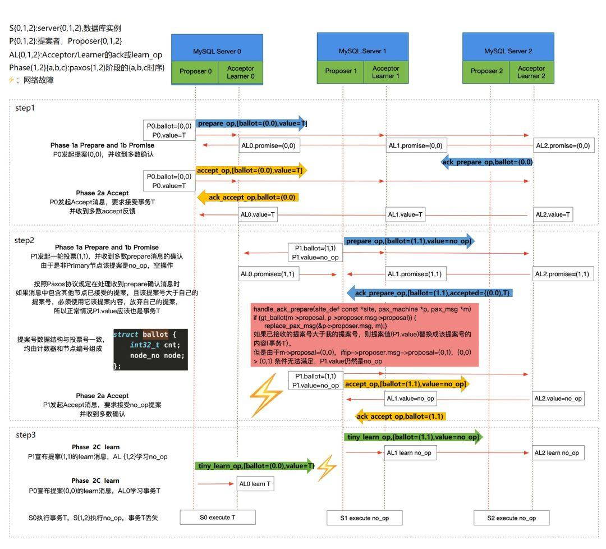

# 深度分析 | MGR相同GTID产生不同transaction故障分析

**原文链接**: https://opensource.actionsky.com/20190320-mgr/
**分类**: 技术干货
**发布时间**: 2019-03-20T00:00:50-08:00

---

前  言
本文是由爱可生运维团队出品的「MySQL专栏」系列文章，内容来自于运维团队一线实战经验，涵盖MySQL各种特性的实践，优化案例，数据库架构，HA，监控等，有扫雷功效。
爱可生开源社区持续运营维护的小目标：
- 
每周至少推送一篇高质量技术文章
- 
每月研发团队发布开源组件新版
- 
每年1024开源一款企业级组件
- 
2019年至少25场社区活动
欢迎大家持续关注～
MGR作为MySQL原生的高可用方案，它的基于共识协议的同步和决策机制，看起来也更为先进。吸引了一票用户积极尝试，希望通过MGR架构解决RPO=0的高可用切换。在实际使用中经常会遇到因为网络抖动的问题造成集群故障，最近我们某客户就遇到了这类问题，导致数据不一致。
**问题现象**
这是在生产环境中一组MGR集群，单主架构，我们可以看到在相同的GTID86afb16f-1b8c-11e8-812f-0050568912a4:57305280下，本应执行相同的事务，但binlog日志显示不同事务信息。
- 
**Primary节点binlog：**
`SET @@SESSION.GTID_NEXT= '86afb16f-1b8c-11e8-812f-0050568912a4:57305280'/*!*/;
# at 637087357
#190125 15:02:55 server id 3136842491 end_log_pos 637087441 Query
thread_id=19132957 exec_time=0 error_code=0
SET TIMESTAMP=1548399775/*!*/;
BEGIN
/*!*/;
# at 637087441
#190125 15:02:55 server id 3136842491 end_log_pos 637087514 Table_map:
`world`.`IC_WB_RELEASE` mapped to number 398
# at 637087514
#190125 15:02:55 server id 3136842491 end_log_pos 637087597 Write_rows: table id 398
flags: STMT_END_F
BINLOG '
n7RKXBP7avi6SQAAABov+SUAAI4BAAAAAAEAB2ljZW50ZXIAFUlDX1FVRVJZX1VTRVJDQVJEX0xP
'/*!*/;
### INSERT INTO `world`.`IC_WB_RELEASE`
### SET`
- 
**Secondary节点binlog：**
****
****
`SET @@SESSION.GTID_NEXT= '86afb16f-1b8c-11e8-812f-0050568912a4:57305280'/*!*/;
# at 543772830
#190125 15:02:52 server id 3136842491 end_log_pos 543772894 Query
thread_id=19162514 exec_time=318 error_code=0
SET TIMESTAMP=1548399772/*!*/;
BEGIN
/*!*/;
# at 543772894
#190125 15:02:52 server id 3136842491 end_log_pos 543772979 Table_map:
`world`.`IC_QUERY_USERCARD_LOG` mapped to number 113
# at 543772979
#190125 15:02:52 server id 3136842491 end_log_pos 543773612 Delete_rows: table id
113 flags: STMT_END_F
BINLOG '
nLRKXBP7avi6VQAAADNRaSAAAHEAAAAAAAEAB2ljZW50ZXIADUlDX1dCX1JFTEVBU0UACw8PEg8
'/*!*/;
### DELETE FROM `world`.`IC_QUERY_USERCARD_LOG`
### WHERE`
从以上信息可以推测，primary节点在这个GTID下对`world`.`IC_WB_RELEASE`表执行了insert操作事件没有同步到secondary节点，secondary节点收到主节点的其他事件，造成了数据是不一致的。当在表`IC_WB_RELEASE`发生delete操作时，引发了下面的故障，导致从节点脱离集群。
`2019-01-28T11:59:30.919880Z 6 [ERROR] Slave SQL for channel 'group_replication_applier': Could not execute Delete_rows event on table `world`.`IC_WB_RELEASE`; Can't find record in 'IC_WB_RELEASE', Error_code: 1032; handler error HA_ERR_KEY_NOT_FOUND, Error_code: 1032
2019-01-28T11:59:30.919926Z 6 [Warning] Slave: Can't find record in 'IC_WB_RELEASE' Error_code: 1032
2019-01-28T11:59:30.920095Z 6 [ERROR] Plugin group_replication reported: 'The applier thread execution was aborted. Unable to process more transactions, this member will now leave the group.'
2019-01-28T11:59:30.920165Z 6 [ERROR] Error running query, slave SQL thread aborted. Fix the problem, and restart the slave SQL thread with "SLAVE START". We stopped at log 'FIRST' position 271.
2019-01-28T11:59:30.920220Z 3 [ERROR] Plugin group_replication reported: 'Fatal error during execution on the Applier process of Group Replication. The server will now leave the group.'
2019-01-28T11:59:30.920298Z 3 [ERROR] Plugin group_replication reported: 'The server was automatically set into read only mode after an error was detected.'`
**问题分析**
- 
1. 主节点在向从节点同步事务时，至少有一个GTID为86afb16f-1b8c-11e8-812f-0050568912a4:57305280（执行的是insert操作）的事务没有同步到从节点，此时从实例还不存在这个GTID；于是主实例GTID高于从实例。数据就已经不一致了。
- 
2. 集群业务正常进行，GTID持续上涨，新上涨的GTID同步到了从实例，占用了86afb16f-1b8c-11e8-812f-0050568912a4:57305280这个GTID，所以从实例没有执行insert操作，少了一部分数据。
- 
3. 主节点对GTID为86afb16f-1b8c-11e8-812f-0050568912a4:57305280执行的insert数据进行delete，而从节点由于没有同步到原本的insert操作；没有这部分数据就不能delete，于是脱离了集群。
**对于该故障的分析，我们要从主从实例GTID相同，但是事务不同的原因入手**，该问题猜测与bug（https://bugs.mysql.com/bug.php?id=92690）相关，我们针对MGR同步事务的时序做如下分析。
**相关知识背景**
MGR全组同步数据的Xcom组件是基于paxos算法的实现；每当提交新生事务时，主实例会将新生事务发送到从实例进行协商，组内协商通过后全组成员一起提交该事务；每一个节点都以同样的顺序，接收到了同样的事务日志，所以每一个节点以同样的顺序回放了这些事务，最终组内保持了一致的状态。
**paxos包括两个角色：**
- 
**提议者（Proposer）**：主动发起投票选主，允许发起提议。
- 
**接受者（Acceptor）**：被动接收提议者（Proposer）的提议，并记录和反馈，或学习达成共识的提议。
**paxos达成共识的过程包括两个阶段：**
- 
**第一阶段（prepare）**
- 
**a：**提议者（Proposer）发送prepare请求，附带自己的提案标识（ballot，由数值编号加节点编号组成）以及value值。组成员接收prepare请求；
- 
**b：**如果自身已经有了确认的值，则将该值以ack_prepare形式反馈；在这个阶段中，Proposer收到ack回复后会对比ballot值，数值大的ballot会取代数值小的ballot。如果收到大多数应答之后进入下一个阶段。
- 
**第二阶段（accept）**
- 
**a：**提议者（Proposer）发送accept请求
- 
b：接收者（Acceptor）收到请求后对比自身之前的bollat是否相同以及是否接收过value值。如果未接受过value值 以及ballot相同，则返回ack_accept，如果接收过value值，则选取最大的ballot返回ack_accept。
- 
**c：**之后接受相同value值的Proposer节点发送learn_op，收到learn_op节点的实例表示确认了数据修改，传递给上层应用。
针对本文案例我们**需要强调几个关键点：**
**
**
- 
1. 该案例最根本的异常对比发生在第二次提案的prepare阶段。
- 
2. prepare阶段的提案标识由数值编号和节点编号两部分组成；其中数值编号类似自增长数值，而节点编号不变。
**分析过程**
结合paxos时序，我们对案例过程进行推测：

**
**
**Tips：以下分析过程请结合时序图操作步骤观看**
**建议点开放大，效果更清晰 ^ ^**
1. 【step1】primary节点要执行对表`world`.`IC_WB_RELEASE`的insert操作，向组内发送假设将ballot设置为（0.0）以及将value值`world`.`IC_WB_RELEASE`的prepare请求，并收到大多数成员的ack_prepare返回，于是开始发送accept请求。primary节点将ballot（0.0）的提案信息发送至组内，仍收到了大多数成员ack_accept（ballot=0.0value=`world`.`IC_WB_RELEASE`）返回。然后发送learn_op信息【step3】。
2. 同时其他从节点由于网络原因没有收到主实例的的learn_op信息【step3】，而其中一台从实例开始新的prepare请求【step2】，请求value值为no_op（空操作）ballot=1.1（此编号中节点编号是关键，该secondary节点编号大于primary节点编号，导致了后续的问题，数值编号无论谁大谁小都要被初始化）。
其他的从实例由于收到过主节点的value值；所以将主节点的（ballot=0.0，value=`world`.`IC_WB_RELEASE`）返回；而收到的ack_prepare的ballot值的数值符号全组内被初始化为0，整个ballot的大小完全由节点编号决定，于是从节点选取了ballot较大的该实例value值作为新的提案，覆盖了主实例的value值并收到大多数成员的ack_accept【step2】。并在组成员之间发送了learn_op信息【step3】，跳过了主实例提议的事务。
从源码中可以看到关于handle_ack_prepare的逻辑。
`handle_ack_prepare has the following code:
if (gt_ballot(m->proposal,p->proposer.msg->proposal))
{
replace_pax_msg(&p->proposer.msg, m);
...
}`
3. 此时，主节点在accept阶段收到了组内大多数成员的ack_accept并收到了 自己所发送的learn_op信息，于是把自己的提案（也就是binlog中对表的insert操作）提交【step3】，该事务GTID为86afb16f-1b8c-11e8-812f-0050568912a4:57305280。而其他节点的提案为no_op【step3】，所以不会提交任何事务。此时主实例GTID大于其他从实例的。
4. 主节点新生GTID继续上涨；同步到从实例，占用了从实例的86afb16f-1b8c-11e8-812f-0050568912a4:57305280这个GTID，于是产生了主节点与从节点binlog中GTID相同但是事务不同的现象。
5. 当业务执行到对表`world`.`IC_WB_RELEASE`的delete操作时，主实例能进行操作，而其他实例由于没有insert过数据，不能操作，就脱离了集群。
**▽过程总结：**
**
**
- 
1. 旧主发送prepare请求，收到大多数ack，进入accept阶段，收到大多数ack。
- 
2. 从实例由于网络原因没有收到learn_op信息。
- 
3. 其中一台从实例发送新的prepare请求，value为no_op。
- 
4. 新一轮的prepare请求中，提案标识的数值编号被初始化，新的提案者大于主实例，从实例选取新提案，执行空操作，不写入relay-log。代替了主实例的事务，使主实例GTID大于从实例。
- 
5. 集群网络状态恢复，新生事物正常同步到从实例，占用了本该正常同步的GTID，使集群中主节点与从节点相同GTID对应的事务时不同的。
**结论**
针对此问题我们也向官方提交SR，官方已经反馈社区版MySQL 5.7.26和MySQL 8.0.16 中会修复，如果是企业版客户可以申请最新的hotfix版本。
**在未升级 MySQL 版本前，若再发生此类故障，在修复时需要人工检查，检查切换时binlog中 GTID 信息与新主节点对应 GTID 的信息是否一致**。如果不一致需要人工修复至一致状态，如果一致才可以将被踢出的原主节点加回集群。
**所以正****在使用了MGR 5.7.26之前社区版的DBA同学请注意避坑**。
使用指南系列
**| DBLE系列公开课**
[DBLE核心研发主讲：MySQL分布式中间件公开课开课啦](http://mp.weixin.qq.com/s?__biz=MzU2NzgwMTg0MA==&#038;mid=2247483982&#038;idx=2&#038;sn=db357b92832b370fff641ec9df096de0&#038;chksm=fc96e0d1cbe169c7361a72827412d1e7a9be2edbc4795f0b20641f72a396436eb26ec4d69bd6&#038;scene=21#wechat_redirect)
[技术分享 | MyCat的坑如何在分布式中间件DBLE上改善（内含视频链接）](http://mp.weixin.qq.com/s?__biz=MzU2NzgwMTg0MA==&#038;mid=2247484080&#038;idx=1&#038;sn=db508378b9f5b232754bdf3baccb8b80&#038;chksm=fc96e02fcbe16939b226c990302b0ef4a2af561fc26aaae43c8b55fac6fcf9f2431d0436b6ea&#038;scene=21#wechat_redirect)
**| 使用指南**
[深度分析 | MyCat与DBLE的对比性能调](http://mp.weixin.qq.com/s?__biz=MzU2NzgwMTg0MA==&#038;mid=2247483939&#038;idx=1&#038;sn=9fae6eb26565b4de2c6c01b778369254&#038;chksm=fc96e0bccbe169aa9d38cbe4cb137137425d81982f3901b611a1621f002b4f0e543a0d87b5a4&#038;scene=21#wechat_redirect)优
[开源分布式中间件 DBLE 快速入门指南](http://mp.weixin.qq.com/s?__biz=MzU2NzgwMTg0MA==&#038;mid=2247483801&#038;idx=1&#038;sn=850eb0b8837ffaa904fd952c8d64895a&#038;chksm=fc96e306cbe16a101513930d388011dbfdcc6aba2347fc6c5954c57425e5a55257b8fb4f8c0e&#038;scene=21#wechat_redirect)
[DBLE 自定义拆分算法](http://mp.weixin.qq.com/s?__biz=MzU2NzgwMTg0MA==&#038;mid=2247483889&#038;idx=1&#038;sn=a15bc961c77ca93476d9ddba06f12c3b&#038;chksm=fc96e36ecbe16a7811fc70f8619a5ff89e2d2d8f0bd16573ad5a73b9fd2683fe0e05850edc8e&#038;scene=21#wechat_redirect)
[DBLE Server.xml 配置解析](http://mp.weixin.qq.com/s?__biz=MzU2NzgwMTg0MA==&#038;mid=2247483905&#038;idx=1&#038;sn=45cb37beb33876f28a4cd9a72b3558e6&#038;chksm=fc96e09ecbe169884356ea61a211ba355f27474ba8bd6954468835605a12dfc22d79ffab713b&#038;scene=21#wechat_redirect)
[DBLE Schema.xml 配置解析](http://mp.weixin.qq.com/s?__biz=MzU2NzgwMTg0MA==&#038;mid=2247483828&#038;idx=1&#038;sn=279340398ab44106bea22db6a2d1aff7&#038;chksm=fc96e32bcbe16a3dfb9c5b4970f101c4ec006757c7d21d9f3800d9fe264fb793c3e610dfdfa4&#038;scene=21#wechat_redirect)
[DBLE rule.xml 配置解析](http://mp.weixin.qq.com/s?__biz=MzU2NzgwMTg0MA==&#038;mid=2247483873&#038;idx=1&#038;sn=5a9c314bc4f31c9d279158c5cd04672f&#038;chksm=fc96e37ecbe16a68753b5dd6b668189ff320027ef342826dd9513be1e6b1f3794611355e499d&#038;scene=21#wechat_redirect)
**| 深度分析**
[DBLE和Mycat跨分片查询结果不一致案例分析](http://mp.weixin.qq.com/s?__biz=MzU2NzgwMTg0MA==&#038;mid=2247483856&#038;idx=1&#038;sn=1cce9aa9b3f9bdfab00da8cc967f5e93&#038;chksm=fc96e34fcbe16a59405251700f96de098cae50a23b4fcc92c5c2dc8e20135bd29b9aaf01c920&#038;scene=21#wechat_redirect)
[基于Xtrabackup及可传输表空间实现多源数据恢复](http://mp.weixin.qq.com/s?__biz=MzU2NzgwMTg0MA==&#038;mid=2247483969&#038;idx=1&#038;sn=1d75cd926a9bd78fb03cb316dbee70cb&#038;chksm=fc96e0decbe169c80b194a73edeed79bc735ee9484580b4cbe04389c537402e0ea16accfbe0f&#038;scene=21#wechat_redirect)
[[缺陷分析] Table cache 导致 MySQL 崩溃](http://mp.weixin.qq.com/s?__biz=MzU2NzgwMTg0MA==&#038;mid=2247483988&#038;idx=1&#038;sn=e8fb7b73eec6cb787cdcf09dcee3ff2b&#038;chksm=fc96e0cbcbe169ddf83e45ded7217f9bef8dea76a94ecf31ade77968549d2647752f9c486276&#038;scene=21#wechat_redirect)

> 
**开源分布式中间件DBLE**
社区官网：https://opensource.actionsky.com/
GitHub主页：https://github.com/actiontech/dble
技术交流群：669663113
> 
**开源数据传输中间件DTLE**
社区官网：https://opensource.actionsky.com/
GitHub主页：https://github.com/actiontech/dtle
技术交流群：852990221

**喜欢点****“****分享”，不行就****“****好看”**

**多喝热水，重启试试**