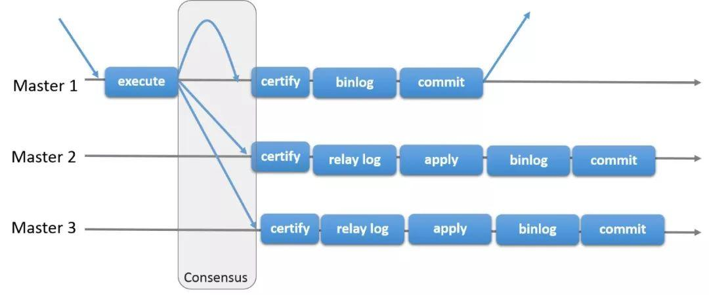
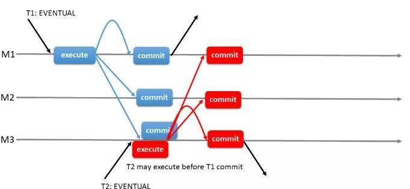
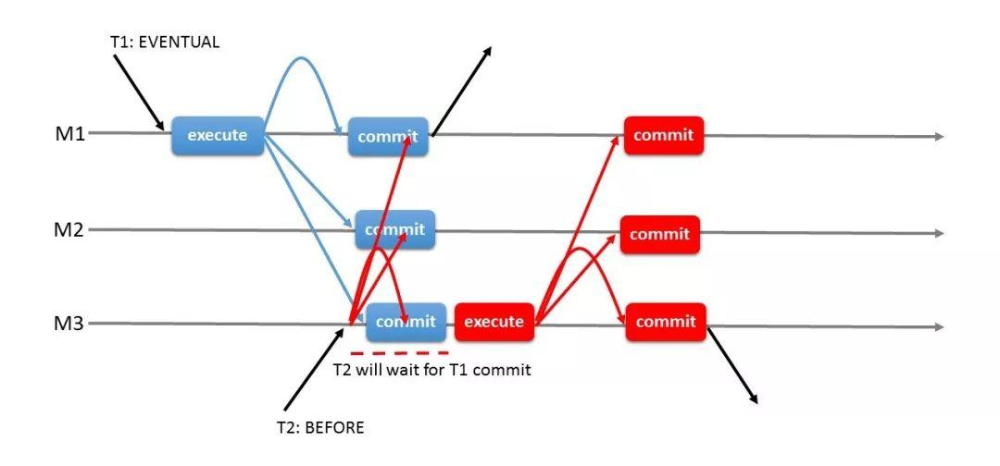
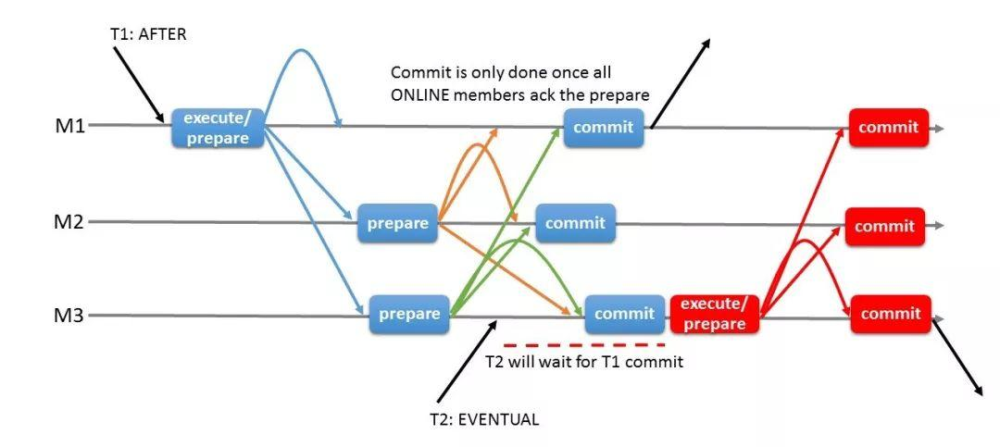
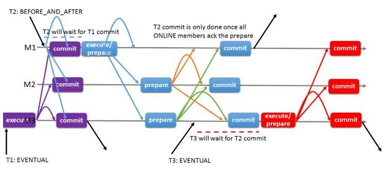

# 社区投稿 | MySQL MGR&#8221;一致性读写&#8221;特性解读

**原文链接**: https://opensource.actionsky.com/20190419-mgr/
**分类**: 技术干货
**发布时间**: 2019-04-10T00:00:50-08:00

---

MySQL 8.0.14版本增加了一个新特性：MGR读写一致性；有了此特性，“妈妈”再也不用担心读MGR非写节点数据会产生不一致啦。
有同学会疑问：“MGR不是&#8217;全同步&#8217;么，也会产生读写不一致？”，在此肯定的告诉大家MGR会产生读写不一致，原因如下：

MGR相对于半同步复制，在relay log前增加了冲突检查协调，但是binlog回放仍然可能延时，也就是跟我们熟悉的半同步复制存在io线程的回放延迟情况类似。当然关于IO线程回放慢的原因，跟半同步也类似，比如大事务！！
所以MGR并不是全同步方案，关于如何处理一致性读写的问题，MySQL 在8.0.14版本中加入了“读写一致性”特性，并引入了参数：**group_replication_consistenc，**下面将对读写一致性的相关参数及不同应用场景进行详细说明。
**参数group_replication_consistenc的说明**
**可选配置值**
- 
**EVENTUAL** 默认值，开启该级别的事务（T2），事务执行前不会等待先序事务（T1）的回放完成，也不会影响后序事务等待该事务回放完成。

- 
**BEFORE **开启了该级别的事务（T2），在开始前首先要等待先序事务（T1）的回放完成，确保此事务将在最新的数据上执行。

- 
**AFTER，**开启该级别的事务（T1），只有等该事务回放完成。其他后序事务（T2）才开始执行，这样所有后序事务都会读取包含其更改的数据库状态，而不管它们在哪个成员上执行。

- 
**BEFORE_AND_AFTER **开启该级别等事务（T2），需要等待前序事务的回放完成（T1）；同时后序事务（T3）等待该事务的回放完成；

- 
**BEFORE_ON_PRIMARY_FAILOVER，**在发生切换时，连到新主的事务会被阻塞，等待先序提交的事务回放完成；这样确保在故障切换时客户端都能读取到主服务器上的最新数据，保证了一致性
> 
group_replication_consistency 参数可以用法SESSION，GLOBAL去进行更改。
官方说明请参考：
https://dev.mysql.com/doc/refman/8.0/en/group-replication-options.html
**MGR读写一致性的优缺点**
官方引入的MGR读写一致性既有它自身的天然优势，也不可避免的存在相应的不足，其优缺点如下：
- 
**优点**：MGR配合中间件，比如DBLE这类有读写分离功能的中间件，在MGR单主模式下，可以根据业务场景进行读写分离，不用担心会产生延迟，充分利用了MGR主节点以外的节点。
- 
**缺点**：使用读写一致性会对性能有极大影响，尤其是网络环境不稳定的场景下。
在实际应用中需要大家因地制宜，根据实际情况选择最适配的方案。
**MGR读写一致性的方案**
针对不同应用场景应当如何选择MGR读写一致性的相关方式，官方提供了几个参数以及与其相对应的应用场景：
**AFTER**
**适用场景1：**写少读多的场景进行读写分离，担心读取到过期事务，可选择AFTER。
**适用场景2：**只读为主的集群，有RW的事务需要保证提交的事务能被其他后序事务读到最新读数据，可选择AFTER。
**BEFORE**
**适用场景1：**应用大量写入数据，*偶尔进行读取一致性数据*，应当选择BEFORE。
**适用场景2：**有特定事务需要读写一致性，以便对敏感数据操作时，始终读取最新的数据；应当选择BEFORE。
**BEFORE_AND_AFTER**
**适用场景：**有一个读为主的集群，有RW的事务既要保证读到最新的数据，又要保证这个事务提交后，被其他后序事务读到；在这种情况下可选择BEFORE_AND_AFTER。
**在特定会话上设置一致性**
**举例1：**某一事务语句，需要其他节点的数据强一致性。可以使用SET@@SESSION.group_replication_consistency= ‘AFTER’进行设置。
**举例2：**跟例1相似，在每天执行分析语句事务并且需要获得读取新数据的情况下。
可以使用SET @@SESSION.group_replication_consistency= ‘BEFORE’ 进行设置
> 
**参考文档：**
https://dev.mysql.com/doc/refman/8.0/en/group-replication-configuring-consistency-guarantees.html#group-replication-choose-consistency-level
精选系列
**| MySQL分布式中间件使用指南**
[DBLE系列公开课第一课 DBLE概述](http://mp.weixin.qq.com/s?__biz=MzU2NzgwMTg0MA==&#038;mid=2247483982&#038;idx=2&#038;sn=db357b92832b370fff641ec9df096de0&#038;chksm=fc96e0d1cbe169c7361a72827412d1e7a9be2edbc4795f0b20641f72a396436eb26ec4d69bd6&#038;scene=21#wechat_redirect)
[DBLE系列公开课第二课 DBLE的配置及使用](http://mp.weixin.qq.com/s?__biz=MzU2NzgwMTg0MA==&#038;mid=2247484037&#038;idx=1&#038;sn=31f412ea48c0d39a4a037c6f8a067a93&#038;chksm=fc96e01acbe1690cc392af460459f888c7afdb8965e5d7b1d6ff8a37b4e8f2fcf8aea34fd31a&#038;scene=21#wechat_redirect)
[DBLE系列公开课第三课 DBLE的管理端口](http://mp.weixin.qq.com/s?__biz=MzU2NzgwMTg0MA==&#038;mid=2247484097&#038;idx=1&#038;sn=0bc93b692a54ae95b9946ac094217472&#038;chksm=fc96e05ecbe16948936bdd1928b51d0225dbfd0e1b33c7238a7554dcb3f386467bd497f23e65&#038;scene=21#wechat_redirect)
[DBLE系列公开课第四课 DBLE的分布式特性](http://mp.weixin.qq.com/s?__biz=MzU2NzgwMTg0MA==&#038;mid=2247484154&#038;idx=1&#038;sn=fb400602e9582130ce80f6f69287d24b&#038;chksm=fc96e065cbe169731a336bae875ef912bab8fafb4718af98f2fb56a51f82e8aab6881fffe41c&#038;scene=21#wechat_redirect)
[MyCat的坑如何在分布式中间件DBLE上改善](http://mp.weixin.qq.com/s?__biz=MzU2NzgwMTg0MA==&#038;mid=2247484080&#038;idx=1&#038;sn=db508378b9f5b232754bdf3baccb8b80&#038;chksm=fc96e02fcbe16939b226c990302b0ef4a2af561fc26aaae43c8b55fac6fcf9f2431d0436b6ea&#038;scene=21#wechat_redirect)
**| DBLE 快速入门**
[深度分析 | MyCat与DBLE的对比性能调](http://mp.weixin.qq.com/s?__biz=MzU2NzgwMTg0MA==&#038;mid=2247483939&#038;idx=1&#038;sn=9fae6eb26565b4de2c6c01b778369254&#038;chksm=fc96e0bccbe169aa9d38cbe4cb137137425d81982f3901b611a1621f002b4f0e543a0d87b5a4&#038;scene=21#wechat_redirect)优
[开源分布式中间件 DBLE 快速入门指南](http://mp.weixin.qq.com/s?__biz=MzU2NzgwMTg0MA==&#038;mid=2247483801&#038;idx=1&#038;sn=850eb0b8837ffaa904fd952c8d64895a&#038;chksm=fc96e306cbe16a101513930d388011dbfdcc6aba2347fc6c5954c57425e5a55257b8fb4f8c0e&#038;scene=21#wechat_redirect)
[DBLE Server.xml 配置解析](http://mp.weixin.qq.com/s?__biz=MzU2NzgwMTg0MA==&#038;mid=2247483905&#038;idx=1&#038;sn=45cb37beb33876f28a4cd9a72b3558e6&#038;chksm=fc96e09ecbe169884356ea61a211ba355f27474ba8bd6954468835605a12dfc22d79ffab713b&#038;scene=21#wechat_redirect)
[DBLE Schema.xml 配置解析](http://mp.weixin.qq.com/s?__biz=MzU2NzgwMTg0MA==&#038;mid=2247483828&#038;idx=1&#038;sn=279340398ab44106bea22db6a2d1aff7&#038;chksm=fc96e32bcbe16a3dfb9c5b4970f101c4ec006757c7d21d9f3800d9fe264fb793c3e610dfdfa4&#038;scene=21#wechat_redirect)
[DBLE rule.xml 配置解析](http://mp.weixin.qq.com/s?__biz=MzU2NzgwMTg0MA==&#038;mid=2247483873&#038;idx=1&#038;sn=5a9c314bc4f31c9d279158c5cd04672f&#038;chksm=fc96e37ecbe16a68753b5dd6b668189ff320027ef342826dd9513be1e6b1f3794611355e499d&#038;scene=21#wechat_redirect)
**| MySQL深度分析**
[GDB定位MySQL5.7特定版本hang死的故障分析#92108](http://mp.weixin.qq.com/s?__biz=MzU2NzgwMTg0MA==&#038;mid=2247484150&#038;idx=1&#038;sn=538f034b76c792383e08be8f2a80c272&#038;chksm=fc96e069cbe1697fb7695e57de65abf3be59a10735258c983e532b3ea15df5f93bf79410eeaa&#038;scene=21#wechat_redirect)
[MGR相同GTID产生不同transaction故障分析](http://mp.weixin.qq.com/s?__biz=MzU2NzgwMTg0MA==&#038;mid=2247484085&#038;idx=1&#038;sn=b4ac557d8dafaba7bb04caec9d9a9040&#038;chksm=fc96e02acbe1693c0563d837853be0bbfae6909c5eafdac3181f12216a888785000e8061ff0e&#038;scene=21#wechat_redirect)
[基于Xtrabackup及可传输表空间实现多源数据恢复](http://mp.weixin.qq.com/s?__biz=MzU2NzgwMTg0MA==&#038;mid=2247483969&#038;idx=1&#038;sn=1d75cd926a9bd78fb03cb316dbee70cb&#038;chksm=fc96e0decbe169c80b194a73edeed79bc735ee9484580b4cbe04389c537402e0ea16accfbe0f&#038;scene=21#wechat_redirect)

> 
**开源分布式中间件DBLE**
社区官网：https://opensource.actionsky.com/
GitHub主页：https://github.com/actiontech/dble
技术交流群：669663113
> 
**开源数据传输中间件DTLE**
社区官网：https://opensource.actionsky.com/
GitHub主页：https://github.com/actiontech/dtle
技术交流群：852990221

**喜欢点****“****分享”，不行就****“****在****看”**

**多喝热水，重启试试**