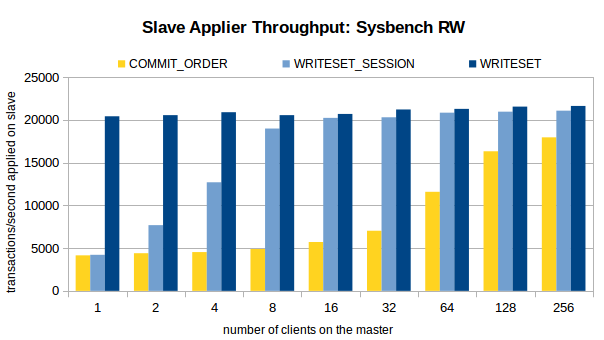
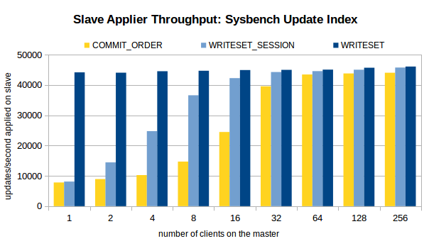
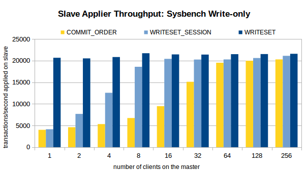

# 社区投稿 | MySQL 主从复制延时常见场景及分析改善

**原文链接**: https://opensource.actionsky.com/20190415-replication/
**分类**: 技术干货
**发布时间**: 2019-04-15T21:12:45-08:00

---

### 作者简介
杨奇龙，网名“北在南方”，7年DBA老兵，目前任职于杭州有赞科技DBA，主要负责数据库架构设计和运维平台开发工作，擅长数据库性能调优、故障诊断。
### 一  序言
在运维MySQL数据库时,DBA会接收到比较多关于主备延时的报警:
> 
check&#95;ins&#95;slave&#95;lag (err&#95;cnt:1)critical-slavelag on ins:3306=39438
相信 slave 延迟是MySQL dba 遇到的一个老生长谈的问题了。我们先来分析一下slave延迟带来的风险
- 异常情况下,主从HA无法切换。HA 软件需要检查数据的一致性，延迟时，主备不一致。
- 备库复制hang会导致备份失败(flush tables with read lock会900s超时）
- 以 slave 为基准进行的备份，数据不是最新的,而是延迟。
本文主要探讨如何解决 ，如何规避 slave 延迟的问题，接下来我们要分析一下导致备库延迟的几种原因。
### 二  slave延迟的场景以及解决方法
#### 1 无主键、无索引或索引区分度不高
有如下特征
`a. show slave status 显示position一直没有变
b. show open tables 显示某个表一直是 in_use 为 1
c. show create table 查看表结构可以看到无主键，或者无任何索引，或者索引区分度很差。
`
**解决方法**:
`a. 找到表区分度比较高的几个字段, 可以使用这个方法判断：
select count(*) from xx; 
select count(*) from (select distinct xx from xxx) t;
如果2个查询count(*)的结果差不多，说明可以对这些字段加索引
b. 备库stop slave;
可能会执行比较久，因为需要回滚事务。
c. 备库
set global slave_rows_search_algorithms='TABLE_SCAN,INDEX_SCAN,HASH_SCAN';
或者
set sql_log_bin=0;
alter table xx add key xx(xx);
d. 备库start slave
如果是innodb,可以通过show innodb status来查看 rows_inserted,updated,deleted,selected这几个指标来判断。
如果每秒修改的记录数比较多，说明复制正在以比较快的速度执行。
`
其实针对无索引的表 可以直接调整从库上的参数 **slave&#95;rows&#95;search&#95;algorithms**,
#### 2 主库上有大事务,导致从库延时
现象解析binlog 发现类似于下图的情况看：

**解决方法**
`事前防范，与开发沟通,增加缓存,异步写入数据库,减少业务直接对db的大事务写入。
事中补救，调整数据库中io相关的参数比如innodb_flush_log_at_trx_commit和sync_binlog  或者打开并行复制功能。  
`
#### 3 主库写入频繁,从库压力跟不上导致延时
此类原因的主要现象是数据库的 IUD 操作非常多，slave由于sql_thread单线程的原因追不上主库。
**解决方法**:
`a 升级从库的硬件配置,比如ssd,fio.
b 使用@丁奇的预热工具-relay fetch
在备库sql线程执行更新之前，预先将相应的数据加载到内存中,并不能提高sql_thread线程执行sql的能力，
也不能加快io_thread线程读取日志的速度。
c 使用多线程复制 阿里MySQL团队实现的方案--基于行的并行复制。
该方案允许对同一张表进行修改的两个事务并行执行，只要这两个事务修改了表中的不同的行。
这个方案可以达到事务间更高的并发度，但是局限是必须使用Row格式的binlog。
因为只有使用Row格式的binlog才可以知道一个事务所修改的行的范围，而使用Statement格式的binlog只能知道修改的表对象。
`
#### 4 大量myisam表，在备份的时候导致slave延迟
由于xtrabackup 工具备份到最后会执行flash tables with read lock ，对数据库进行锁表以便进行一致性备份，然后对于myisam表 锁，会阻碍salve&#95;sql&#95;thread 停滞运行进而导致hang
该问题目前的比较好的解决方式是修改表结构为innodb存储引擎的表。
### 三 MySQL的改进
为了解决复制延迟的问题，MySQL也在不遗余力的解决主从复制的性能瓶颈，研发高效的复制算法。
#### 1 基于组提交的并行复制
MySQL的复制机制大致原理是:slave 通过io&#95;thread 将主库的binlog拉到从库并写入relay log，由SQL THREAD 读出来relay log并进行重放。当主库写入并发写入压力很大，也即N:1的情形，slave 就可能会出现延迟。MySQL 5.6 版本提供并行复制功能,slave复制相关的线程由io&#95;thread,coordinator&#95;thread,worker构成，其中:
- **coordinator&#95;thread**负责读取 relay log，将读取的binlog event以事务为单位分发到各个 worker thread 进行执行，并在必要时执行binlog event，比如是DDL 或者跨库事务的时候。
- 
**worker&#95;thread**:执行分配到的binlog event，各个线程之间互不影响，具体worker&#95;thread 的个数由slave&#95;parallel&#95;workers决定。
需要注意的是 dbname 与 worker 线程的绑定信息在一个hash表中进行维护，hash表以entry为单位，entry中记录当前entry所代表的数据库名，有多少个事务相关的已被分发，执行这些事务的worker thread等信息。
分配线程是以数据库名进行分发的，当一个实例中只有一个数据库的时候，不会对性能有提高，相反，由于增加额外的操作，性能还会有一点回退。
MySQL 5.7 版本提供基于组提交的并行复制,通过设置如下参数来启用并行复制。
> 
slave&#95;parallel&#95;workers>0
global.slave&#95;parallel&#95;type＝&#8217;LOGICAL_CLOCK&#8217;
即主库在ordered_commit中的第二阶段，**将同一批commit的 binlog打上一个相同的last_committed标签，同一last_committed的事务在备库是可以同时执行的，因此大大简化了并行复制的逻辑**，并打破了相同DB不能并行执行的限制。备库在执行时，具有同一last_committed的事务在备库可以并行的执行，互不干扰，也不需要绑定信息，后一批last_committed的事务需要等待前一批相同last_committed的事务执行完后才可以执行。这样的实现方式大大提高了slave应用relaylog的速度。
`mysql> show variables like 'slave_parallel%';
+------------------------+----------+
| Variable_name | Value |
+------------------------+----------+
| slave_parallel_type | DATABASE |#默认是DATABASE 模式的，需要调整或者在my.cnf中配置
| slave_parallel_workers | 4 |
+------------------------+----------+
2 rows in set (0.00 sec)
mysql> STOP SLAVE SQL_THREAD;
Query OK, 0 rows affected (0.00 sec)
mysql> set global slave_parallel_type='LOGICAL_CLOCK';
Query OK, 0 rows affected (0.00 sec)
mysql> START SLAVE SQL_THREAD;
Query OK, 0 rows affected (0.01 sec)
`
启用并行复制之后查看processlist，系统多了四个线程Waiting for an event from Coordinator(手机用户推荐横屏查看)
`mysql> show processlist;
+----+-------------+-----------------+------+---------+------+--------------------------------------------------------+------------------+
| Id | User | Host | db | Command | Time | State | Info |
+----+-------------+-----------------+------+---------+------+--------------------------------------------------------+------------------+
| 9 | root | localhost:40270 | NULL | Query | 0 | starting | show processlist |
| 10 | system user | | NULL | Connect | 1697 | Waiting for master to send event | NULL |
| 31 | system user | | NULL | Connect | 5 | Slave has read all relay log; waiting for more updates | NULL |
| 32 | system user | | NULL | Connect | 5 | Waiting for an event from Coordinator | NULL |
| 33 | system user | | NULL | Connect | 5 | Waiting for an event from Coordinator | NULL |
| 34 | system user | | NULL | Connect | 5 | Waiting for an event from Coordinator | NULL |
| 35 | system user | | NULL | Connect | 5 | Waiting for an event from Coordinator | NULL |
+----+-------------+-----------------+------+---------+------+--------------------------------------------------------+------------------+
7 rows in set (0.00 sec)
`
**核心参数**:
`binlog_group_commit_sync_no_delay_count:一组里面有多少事物才提交,单位 (ms)
binlog_group_commit_sync_delay:等待多少时间后才进行组提交
`
#### 3.2 基于写集合的并行复制
其实从 MySQL5.7.22就提供基于**write set**的复制优化策略。WriteSet并行复制的思想是:**不同事务的不同记录不重叠，则都可在从机上并行回放，可以看到并行的力度从组提交细化为记录级**。不想看官方文档的话，大家可以看看姜老师的文章 https://mp.weixin.qq.com/s/oj-DzpR-hZRMMziq2_0rYg
废话不多说，直接上性能压测图：

### 四 总结
slave延迟的原因可以归结为slave apply binlog的速度跟不上主库写入的速度，如何解决复制延迟呢？其实也是如何提高MySQL写速度的问题。从目前的硬件和软件的发展来看，硬件存储由之前的HDD机械硬盘发展到现在的SSD,PCI-E SSD,再到NVM Express(NVMe),IO性能一直在提升。MySQL的主从复制也从单线程复制到不同算法的并行复制(基于库，事务，行)，应用binlog的速度也越来越快。
本文归纳从几个常见的复制延迟场景，有可能还不完整，也欢迎大家留言讨论。
### 五 拓展阅读
[1] 一种MySQL主从同步加速方案－改进
`https://dinglin.iteye.com/blog/1187154
`
[2] MySQL多线程同步MySQL-Transfer介绍(已经不在维护)
`https://dinglin.iteye.com/blog/1581877
`
[3] MySQL 并行复制演进及 MySQL 8.0 中基于 WriteSet 的优化
`https://www.cnblogs.com/DataArt/p/10240093.html
`
[4] 速度提升5~10倍，基于WRITESET的MySQL并行复制 https://mp.weixin.qq.com/s/oj-DzpR-hZRMMziq2_0rYg
[5] https://mysqlhighavailability.com/improving-the-parallel-applier-with-writeset-based-dependency-tracking/
**额外福利**
推荐杨奇龙老师的宝藏公众号，日常分享技术干货，yangyidba（点击可直接跳转），欢迎大家关注！3/27 &#8211; 4/27社区征稿活动倒计时 12 天，如果你也积累了素材不妨整理成文，价值3200RMB的DTCC门票等你拿～
**近期社区动态**
- 
社区活动
[成都 | 4.18·MySQL 技术交流大会·成都站](https://opensource.actionsky.com/mysql%E6%8A%80%E6%9C%AF%E4%BA%A4%E6%B5%81%E5%A4%A7%E4%BC%9A/)
[征稿 | 价值3200RMB的DTCC门票免费送！](https://opensource.actionsky.com/%E6%8A%95%E7%A8%BF%E9%80%81dtcc%E9%97%A8%E7%A5%A8/)
[社区投稿 | MySQL MGR](https://opensource.actionsky.com/%E8%A7%A3%E8%AF%BBmysql%E6%9C%80%E6%96%B0%E7%89%B9%E6%80%A7%E4%B9%8Bmgr%E4%B8%80%E8%87%B4%E6%80%A7%E8%AF%BB%E5%86%99/)
[社区投稿 | 谈谈分布式事务基础概念](https://opensource.actionsky.com/%E5%88%86%E5%B8%83%E5%BC%8F%E4%BA%8B%E5%8A%A1%E6%A6%82%E5%BF%B5%E8%AE%B2%E8%A7%A3/)
- 
故障分析
[MySQL Insert 加锁与死锁分析](https://opensource.actionsky.com/%E6%95%85%E9%9A%9C%E5%88%86%E6%9E%90-mysql-insert-%E5%8A%A0%E9%94%81%E4%B8%8E%E6%AD%BB%E9%94%81%E5%88%86%E6%9E%90/)
[GDB定位MySQL5.7特定版本hang死的故障分析#92108](https://opensource.actionsky.com/percona-mysql5-7%E7%89%B9%E5%AE%9A%E7%89%88%E6%9C%AC%E6%AD%BB%E9%94%81hang%E6%AD%BB%E7%9A%84%E6%95%85%E9%9A%9C%E5%88%86%E6%9E%90/http://)
[MGR相同GTID产生不同transaction故障分析](https://opensource.actionsky.com/mgr%E7%9B%B8%E5%90%8Cgtid%E4%BA%A7%E7%94%9F%E4%B8%8D%E5%90%8Ctransaction%E6%95%85%E9%9A%9C%E5%88%86%E6%9E%90/)
- 
图解MySQL原理
[[原理解析] MySQL使用固定的server_id导致数据丢失](https://opensource.actionsky.com/mysql-sever_id%E7%9A%84%E6%AD%A3%E7%A1%AE%E4%BD%BF%E7%94%A8/)
[[原理解析] MySQL组提交(group commit)](https://opensource.actionsky.com/mysql%E7%BB%84%E6%8F%90%E4%BA%A4%E5%8E%9F%E7%90%86%E8%A7%A3%E6%9E%90/)
[[原理解析] 设置字符集的参数控制了哪些行为](https://opensource.actionsky.com/mysql%E5%AD%97%E7%AC%A6%E9%9B%86%E5%8F%82%E6%95%B0%E8%A7%A3%E6%9E%90/)