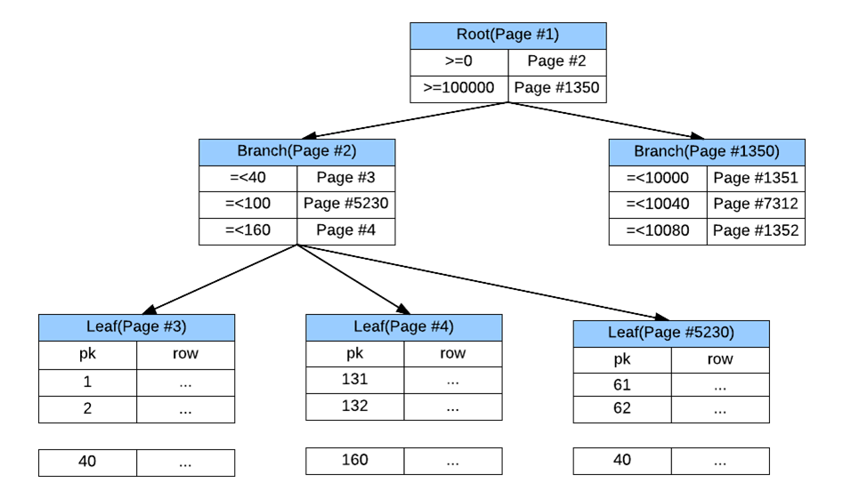

# MySQL · 引擎特性 · InnoDB index lock前世今生

**Date:** 2015/07
**Source:** http://mysql.taobao.org/monthly/2015/07/05/
**Images:** 2 images downloaded

---

数据库内核月报

 [
 # 数据库内核月报 － 2015 / 07
 ](/monthly/2015/07)

 * 当期文章

 MySQL · 引擎特性 · Innodb change buffer介绍
* MySQL · TokuDB · TokuDB Checkpoint机制
* PgSQL · 特性分析 · 时间线解析
* PgSQL · 功能分析 · PostGIS 在 O2O应用中的优势
* MySQL · 引擎特性 · InnoDB index lock前世今生
* MySQL · 社区动态 · MySQL内存分配支持NUMA
* MySQL · 答疑解惑 · 外键删除bug分析
* MySQL · 引擎特性 · MySQL logical read-ahead
* MySQL · 功能介绍 · binlog拉取速度的控制
* MySQL · 答疑解惑 · 浮点型的显示问题

 ## MySQL · 引擎特性 · InnoDB index lock前世今生 
 Author: 冷香 

 ## 前言
InnoDB并发过程中使用两类锁进行同步。

**1. 事务锁**
维护在不同的Isolation level下数据库的Atomicity和Consistency两大基本特性。

InnoDB定义了如下的lock mode:

`/* Basic lock modes */
enum lock_mode {
LOCK_IS = 0, /* intention shared */
LOCK_IX, /* intention exclusive */
LOCK_S, /* shared */
LOCK_X, /* exclusive */
LOCK_AUTO_INC, /* locks the auto-inc counter of a table
in an exclusive mode */
LOCK_NONE, /* this is used elsewhere to note consistent read */
LOCK_NUM = LOCK_NONE, /* number of lock modes */
LOCK_NONE_UNSET = 255
};
`

**2. 内存锁**
为了维护内存结构的一致性，比如Dictionary cache、sync array、trx system等结构。
InnoDB并没有直接使用glibc提供的库，而是自己封装了两类：

1. 一类是mutex，实现内存结构的串行化访问
2. 一类是rw lock，实现读写阻塞，读读并发的访问的读写锁

读者如果有兴趣，可以直接翻阅InnoDB的代码，这里我们主要介绍index lock所使用的rw lock。

## InnoDB index lock
InnoDB默认使用B-Tree结构来保存数据，如下图所示的B-Tree结构：

这个B-Tree一共有两类节点，一类是node(branch) block，一类是leaf block，对于内存中的每一个block，都有一个rw lock与之相对应，用于保护block内部结构的一致性，阻塞并发修改。每一个index在内存中保持着一个index字典对象，即`dict_index_t`，并对应着一个index lock，同样属于rw lock类型，用于保护B-Tree的平衡树结构。

所以，InnoDB为每一个index，维护两种rw lock:

1. index级别的，用于保护B-Tree结构不被破坏
2. block级别的，用于保护block内部结构不被破坏

很明显，rw lock 锁保护的对象的级别越高，冲突的可能性就越大，并发的瓶颈也就越容易出现。

## InnoDB index lock的处理场景分析

1. 我们先来看rw lock的模型，rw lock一共使用两类lock mode，即S锁和X锁，其相容性矩阵是：

` | S| X|
--+--+--+
S | o| x|
--+--+--+
X | x| x|
--+--+--+
`
按照lock mode，数据库对B-Tree操作区分几种类型:

`btr_search_leaf
btr_modify_leaf
btr_modify_tree
btr_search_prev
btr_modify_prev
`
根据这些不同的操作类型，我们下面来分析一下加锁的过程。

## 场景分析

### 场景1. 索引扫描查询

如果sql通过索引进行扫描，其latch mode为`btr_search_leaf`:

首先是hold住index lock的RW_S_LATCH，然后通过`btr_cur_search_to_nth_level`进行B-Tree查询leaf节点的过程。当cursor定位到leaf节点上之后，在leaf page节点上，添加RW_S_LATCH锁，即S锁，然后通过save_point的mtr释放index lock的S锁。在扫描的过程中，因为持有index的RW_S_LATCH，所以节点的扫描比如root、branch这样的node block，并不持有任何mode的rw lock。直到latch住leaf节点后，就释放掉 index 的锁，这样尽可能的减少阻塞，剩下就是leaf节点的扫描过程，只持有leaf page的锁。 扫描完数据，就释放leaf page的S锁。

### 场景2. 升序和降序查询

场景2和场景1在持有index lock的过程中，是相同的，都是在search的过程中，持有RW_S_LATCH，一旦定位到leaf page，就释放掉index 的S锁，升序和降序的扫描过程中，会沿着leaf page之间的双链表进行扫描，因为是双向链表，所以可以完成asc和desc的扫描。但这里要注意的是，InnoDB先持有下一个page的lock，然后再释放当前持有page的lock，这样就有可能造成死锁，所以InnoDB不管当前是asc还是desc的扫描，都会先持有左leaf page的lock，然后再持有下一个leaf page的锁，最后释放prev page的lock，这样做到加锁的顺序一致，避免死锁。

### 场景3. 乐观插入记录

InnoDB在插入记录的过程中，分了两个步骤，乐观插入和悲观插入：

1. 乐观，就是当前leaf page的剩余空间满足记录的插入需要；
2. 悲观，就是需要split B-Tree，增加leaf page来完成新记录的插入。

先看乐观插入:
场景1和场景2都持有leaf page的RW_S_LATCH，但在插入的过程中，操作类型是btr_modify_leaf，需要持有leaf page的RW_X_LATCH， 在search的过程中，和场景1、2相同，都是持有index的RW_S_LATCH lock，一旦定位结束，释放index lock。

### 场景4. 悲观插入记录

悲观插入，需要split B-Tree，所以首先会持有index lock，mode为RW_X_LATCH，并X lock三个leaf page，即prev，current，next三个leaf page，然后修改branch节点的记录，指向leaf节点，修改完成后，才能释放index lock。
在split的过程中，无法进行search操作(因为正在修改branch节点)，但如果其他线程已经在读取leaf page，并不会受影响。

### 场景5. online DDL

在online DDL的过程中，比如add index，因为是新添加的index，并不会产生并发访问的问题。

### 场景6. DDL

比如加字段的过程，其并发问题，由server层的MDL锁和InnoDB层的事务锁来完成其同步。

## 问题：
我们来看上面提到的6个场景，对我们日常使用InnoDB的过程中，影响最大的就是场景4，即split的过程中，会严重的影响并发，因为index 的X lock，导致任何的B-Tree扫描都产生了阻塞。有解吗？

通常我们碰到lock导致的并发问题的时候，第一个想到的就是降低锁对象的粒度，粒度越小，共享区域也就越小，冲突的几率也就越小，并发就能够提高。

根据这个原则，我们回过头来看这个问题，因为index lock 保护了整个B-Tree的结构，但我们对某一个branch节点进行split的时候，我们仅仅修改了这个branch节点，所以我们可以把锁的粒度降低到某些要修改的branch节点上，这样就可以不影响其他branch节点的扫描和访问。

## MySQL 5.7的改进

MySQL官方对index lock进行了优化，在split的过程中，尽可能的减少冲突，减少并发的瓶颈。

对于InnoDB的rw lock增加第三种lock mode，即SX锁，其相容性矩阵如下：

` | S|SX| X|
--+--+--+--+
S | o| o| x|
--+--+--+--+
SX| o| x| x|
--+--+--+--+
X | x| x| x|
--+--+--+--+
`
这里仍然保留了index lock，考虑一下两个存在冲突的场景，还是否阻塞：

**1. BTR_SEARCH_LEAF和BTR_MODIFY_LEAF**

对于扫描leaf节点和修改leaf节点的场景：

`index->lock 持有S锁不变
branch->latch 从无--> S latch
 latch order:
 latch root block (S)
 latch root-1 block (S)
 ....
 latch leaf+1 block (S)
leaf->latch 持有S或者X锁不变
release index lock 不变
release branch latch 从无到释放
`

和之前的差别是在search的过程中，对使用到的branch节点，加上S锁，用于同步branch节点的修改。同样，当定位到leaf节点后，就可以把index lock和branch lock全部释放掉了，后面leaf节点之间的移动，同样不需要index lock和branch lock。

**2. BTR_MODIFY_TREE**

对于修改index B-Tree结构的场景：

`index->lock 从X锁-->SX 锁
branch->latch 从无--> X latch
`

注意：因为有index SX锁，所以不允许并发的修改B-Tree操作，所以，只需要X latch要修改的branch即可。

和之前的差别就是index lock从X锁变成了SX锁，这样并不影响search的过程，增加了更改过程中branch节点的X锁。

## 总结：

这样修改后，index lock在并发的过程中，修改B-Tree和search B-Tree没有了并发冲突问题，在split的过程中，只有search和modify到同一个branch节点，才会产生阻塞，对于我们正常的使用数据库过程中（大部分都是通过index进行读写），可以显著的提升并发能力。

 阅读： - 

本作品采用[知识共享署名-非商业性使用-相同方式共享 3.0 未本地化版本许可协议](http://creativecommons.org/licenses/by-nc-sa/3.0/)进行许可。

 