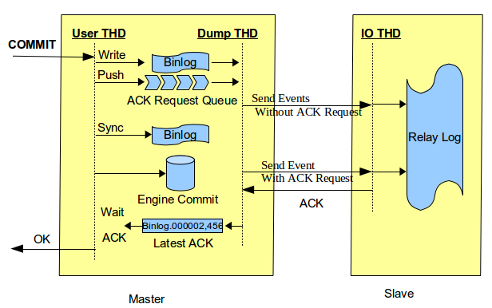
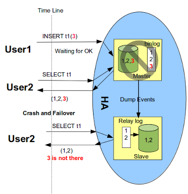
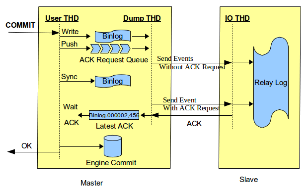
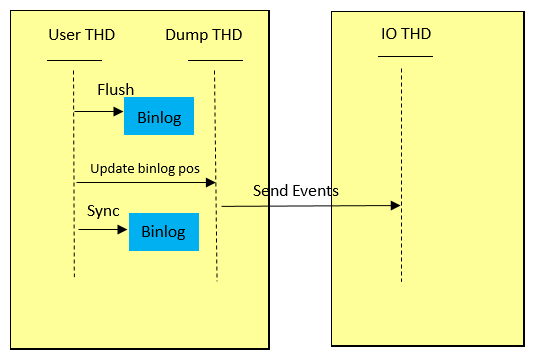
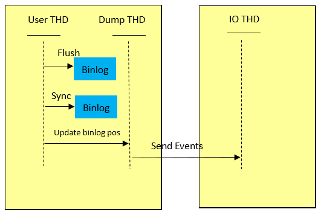
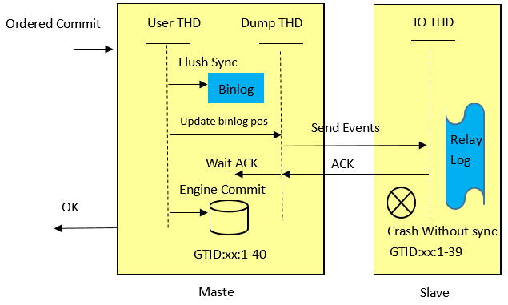
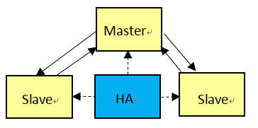

# MySQL · 源码分析 · MySQL 半同步复制数据一致性分析

**Date:** 2017/04
**Source:** http://mysql.taobao.org/monthly/2017/04/01/
**Images:** 9 images downloaded

---

数据库内核月报

 [
 # 数据库内核月报 － 2017 / 04
 ](/monthly/2017/04)

 * 当期文章

 MySQL · 源码分析 · MySQL 半同步复制数据一致性分析
* MYSQL · 新特性 · MySQL 8.0对Parser所做的改进
* MySQL · 引擎介绍 · Sphinx源码剖析（二）
* PgSQL · 特性分析 · checkpoint机制浅析
* MySQL · 特性分析 · common table expression
* PgSQL · 应用案例 · 逻辑订阅给业务架构带来了什么？
* MSSQL · 应用案例 · 基于内存优化表的列存储索引分析Web Access Log
* TokuDB · 捉虫动态 · MRR 导致查询失败
* HybridDB · 稳定性 · HybridDB如何优雅的处理Out Of Memery问题
* MySQL · 捉虫动态 · 5.7 mysql_upgrade 元数据锁等待

 ## MySQL · 源码分析 · MySQL 半同步复制数据一致性分析 
 Author: mianren 

 ## 简介

MySQL Replication为MySQL用户提供了高可用性和可扩展性解决方案。本文介绍了MySQL Replication的主要发展历程，然后通过三个参数rpl_semi_sync_master_wait_point、sync_binlog、sync_relay_log的配置简要分析了MySQL半同步的数据一致性。

## MySQL Replication的发展

在2000年，MySQL 3.23.15版本引入了Replication。Replication作为一种准实时同步方式，得到广泛应用。

这个时候的Replicaton的实现涉及到两个线程，一个在Master，一个在Slave。Slave的I/O和SQL功能是作为一个线程，从Master获取到event后直接apply，没有relay log。这种方式使得读取event的速度会被Slave replay速度拖慢，当主备存在较大延迟时候，会导致大量binary log没有备份到Slave端。

在2002年，MySQL 4.0.2版本将Slave端event读取和执行独立成两个线程（IO线程和SQL线程），同时引入了relay log。IO线程读取event后写入relay log，SQL线程从relay log中读取event然后执行。这样即使SQL线程执行慢，Master的binary log也会尽可能的同步到Slave。当Master宕机，切换到Slave，不会出现大量数据丢失。

MySQL在2010年5.5版本之前，一直采用的是异步复制。主库的事务执行不会管备库的同步进度，如果备库落后，主库不幸crash，那么就会导致数据丢失。

MySQL在5.5中引入了半同步复制，主库在应答客户端提交的事务前需要保证至少一个从库接收并写到relay log中。那么半同步复制是否可以做到不丢失数据呢。

在2016年，MySQL在5.7.17中引入了Group Replication。

## MySQL 半同步复制的数据一致性

### 源码剖析
以下源码版本均为官方MySQL 5.7。
MySQL semi-sync是以插件方式引入，在plugin/semisync目录下。这里以semi-sync主要的函数调用为入口，学习semi-sync源码。

`plugin/semisync/semisync_master.cc
403 /*******************************************************************************
404 *
405 * <ReplSemiSyncMaster> class: the basic code layer for sync-replication master.
406 * <ReplSemiSyncSlave> class: the basic code layer for sync-replication slave.
407 *
408 * The most important functions during semi-syn replication listed:
409 *
410 * Master:
 //实际由Ack_receiver线程调用，处理semi-sync复制状态，获取备库最新binlog位点，唤醒对应线程
411 * . reportReplyBinlog(): called by the binlog dump thread when it receives
412 * the slave's status information.
 //根据semi-sync运行状态设置数据包头semi-sync标记
413 * . updateSyncHeader(): based on transaction waiting information, decide
414 * whether to request the slave to reply.
 //存储当前binlog 文件名和偏移量，更新当前最大的事务 binlog 位置
415 * . writeTranxInBinlog(): called by the transaction thread when it finishes
416 * writing all transaction events in binlog.
 //实现客户端同步等待逻辑
417 * . commitTrx(): transaction thread wait for the slave reply.
418 *
419 * Slave:
 //确认网络包头是否有semi-sync标记
420 * . slaveReadSyncHeader(): read the semi-sync header from the master, get the
421 * sync status and get the payload for events.
 //给Master发送ACK报文
422 * . slaveReply(): reply to the master about the replication progress.
423 *
424 ******************************************************************************/

`

```
Ack_receiver线程，不断遍历slave，通过select监听slave网络包，处理semi-sync复制状态，唤醒等待线程。
plugin/semisync/semisync_master_ack_receiver.cc Ack_receiver::run()
->plugin/semisync/semisync_master.cc ReplSemiSyncMaster::reportReplyPacket
 ->plugin/semisync/semisync_master.cc ReplSemiSyncMaster::reportReplyBinlog

binlog Dump线程。如果slave是semi-slave，通过add_slave将slave添加到监听队列，在发送网络包时根据semi-sync运行状态设置包头的semi-sync标记。
sql/rpl_binlog_sender.cc Binlog_sender::run()
->sql/rpl_binlog_sender.cc Binlog_sender::send_binlog
 ->sql/rpl_binlog_sender.cc Binlog_sender::send_events
 ->sql/rpl_binlog_sender.cc Binlog_sender::before_send_hook
 ->plugin/semisync/semisync_master_plugin.cc repl_semi_before_send_event
 ->plugin/semisync/semisync_master.cc ReplSemiSyncMaster::updateSyncHeader

事务提交阶段，在flush binlog后，存储当前binlog 文件名和偏移量，更新当前最大的事务 binlog 位置。
sql/binlog.cc MYSQL_BIN_LOG::ordered_commit
 ->plugin/semisync/semisync_master_plugin.cc repl_semi_report_binlog_update//after_flush
 ->plugin/semisync/semisync_master.cc repl_semisync.writeTranxInBinlog

事务提交阶段，客户端等待处理逻辑，分为after_sync和after_commit两种情况
sql/binlog.cc MYSQL_BIN_LOG::ordered_commit
 ->sql/binlog.cc process_after_commit_stage_queue || call_after_sync_hook
 ->plugin/semisync/semisync_master_plugin.cc repl_semi_report_commit || repl_semi_report_binlog_sync
 ->plugin/semisync/semisync_master.cc ReplSemiSyncMaster::commitTrx

Slave IO线程，读取数据后后检查包头是否有semi-sync标记。
sql/rpl_slave.cc handle_slave_io
 ->plugin/semisync/semisync_slave_plugin.cc repl_semi_slave_read_event
 ->plugin/semisync/semisync_slave.cc ReplSemiSyncSlave::slaveReadSyncHeader

Slave IO线程，在queue event后，在需要回复Master ACK报文的时候，回复Master ACK报文。
sql/rpl_slave.cc handle_slave_io
 ->plugin/semisync/semisync_slave_plugin.cc repl_semi_slave_queue_event
 ->plugin/semisync/semisync_slave.cc ReplSemiSyncSlave::slaveReply

```

首先半同步方式，主库在等待备库ack时候，如果超时会退化为异步，这就可能导致数据丢失。在接下来分析中，先假设rpl_semi_sync_master_timeout足够大，不会退化为异步方式。

这里通过三个参数rpl_semi_sync_master_wait_point、sync_binlog、sync_relay_log的配置来对semi-sync做数据一致性的分析。

### rpl_semi_sync_master_wait_point的配置

#### 源码剖析：
`plugin/semisync/semisync_master_plugin.cc

68 int repl_semi_report_binlog_sync(Binlog_storage_param *param,
69 const char *log_file,
70 my_off_t log_pos)
71 {
72 if (rpl_semi_sync_master_wait_point == WAIT_AFTER_SYNC)
73 return repl_semisync.commitTrx(log_file, log_pos);
74 return 0;
75 }

97 int repl_semi_report_commit(Trans_param *param)
 ...
102 if (rpl_semi_sync_master_wait_point == WAIT_AFTER_COMMIT &&
106 return repl_semisync.commitTrx(binlog_name, param->log_pos);

`

#### 配置为WAIT_AFTER_COMMIT


当rpl_semi_sync_master_wait_point为WAIT_AFTER_COMMIT时，commitTrx的调用在engine层commit之后（在ordered_commit函数中process_after_commit_stage_queue调用），如上图所示。即在等待Slave ACK时候，虽然没有返回当前客户端，但事务已经提交，其他客户端会读取到已提交事务。如果Slave端还没有读到该事务的events，同时主库发生了crash，然后切换到备库。那么之前读到的事务就不见了，出现了幻读，如下图所示。图片引自[Loss-less Semi-Synchronous Replication on MySQL 5.7.2](http://my-replication-life.blogspot.com/2013/09/loss-less-semi-synchronous-replication.html) 。



#### 配置为WAIT_AFTER_SYNC

MySQL针对上述问题，在5.7.2引入了Loss-less Semi-Synchronous，在调用binlog sync之后，engine层commit之前等待Slave ACK。这样只有在确认Slave收到事务events后，事务才会提交。在commit之前等待Slave ACK，同时可以堆积事务，利于group commit，有利于提升性能。如下图所示，图片引自[Loss-less Semi-Synchronous Replication on MySQL 5.7.2](http://my-replication-life.blogspot.com/2013/09/loss-less-semi-synchronous-replication.html) ：



其实上图流程中存在着会导致主备数据不一致，使主备同步失败的情形。见下面sync_binlog配置的分析。

### sync_binlog的配置

#### 源码剖析：
`sql/binlog.cc ordered_commit
 //当sync_period(sync_binlog)为1时，在sync之后update binlog end pos
9002 update_binlog_end_pos_after_sync= (get_sync_period() == 1);
 ...
9021 if (!update_binlog_end_pos_after_sync)
 //更新binlog end position,dump线程会发送更新后的events
9022 update_binlog_end_pos();
 ...
 //
9057 std::pair<bool, bool> result= sync_binlog_file(false);
 ...
9061 if (update_binlog_end_pos_after_sync)
9062 {
 ...
9068 update_binlog_end_pos(tmp_thd->get_trans_pos());
9069 }

sql/binlog.cc sync_binlog_file
8618 std::pair<bool, bool>
8619 MYSQL_BIN_LOG::sync_binlog_file(bool force)
8620 {
8621 bool synced= false;
8622 unsigned int sync_period= get_sync_period();//sync_binlog值
 //sync_period为0不做sync操作，其他值为达到sync调用次数后sync
8623 if (force || (sync_period && ++sync_counter >= sync_period))
8624 {

`

#### 配置分析

当sync_binlog为0的时候，binlog sync磁盘由操作系统负责。当不为0的时候，其数值为定期sync磁盘的binlog commit group数。当sync_binlog值大于1的时候，sync binlog操作可能并没有使binlog落盘。如果没有落盘，事务在提交前，Master掉电，然后恢复，那么这个时候该事务被回滚。但是Slave上可能已经收到了该事务的events并且执行，这个时候就会出现Slave事务比Master多的情况，主备同步会失败。所以如果要保持主备一致，需要设置sync_binlog为1。

WAIT_AFTER_SYNC和WAIT_AFTER_COMMIT两图中Send Events的位置，也可能导致主备数据不一致，出现同步失败的情形。实际在rpl_semi_sync_master_wait_point分析的图中是sync binlog大于1的情况。根据上面源码，流程如下图所示。Master依次执行flush binlog， update binlog position， sync binlog。如果Master在update binlog position后，sync binlog前掉电，Master再次启动后原事务就会被回滚。但可能出现Slave获取到Events，这也会导致Slave数据比Master多，主备同步失败。



由于上面的原因，sync_binlog设置为1的时候，MySQL会update binlog end pos after sync。流程如下图所示。这时候，对于每一个事务都需要sync binlog，同时sync binlog和网络发送events会是一个串行的过程，性能下降明显。



### sync_relay_log的配置

#### 源码剖析

`sql/rpl_slave.cc handle_slave_io

5764 if (queue_event(mi, event_buf, event_len))
 ...
5771 if (RUN_HOOK(binlog_relay_io, after_queue_event,
5772 (thd, mi, event_buf, event_len, synced)))

after_queue_event
->plugin/semisync/semisync_slave_plugin.cc repl_semi_slave_queue_event
->plugin/semisync/semisync_slave.cc ReplSemiSyncSlave::slaveReply

queue_event
->sql/binlog.cc MYSQL_BIN_LOG::append_buffer(const char* buf, uint len, Master_info *mi)
->sql/binlog.cc after_append_to_relay_log(mi);
->sql/binlog.cc flush_and_sync(0)
->sql/binlog.cc sync_binlog_file(force)
`

#### 配置分析

在Slave的IO线程中get_sync_period获得的是sync_relay_log的值，与sync_binlog对sync控制一样。当sync_relay_log不是1的时候，semisync返回给Master的position可能没有sync到磁盘。在gtid_mode下，在保证前面两个配置正确的情况下，sync_relay_log不是1的时候，仅发生Master或Slave的一次Crash并不会发生数据丢失或者主备同步失败情况。如果发生Slave没有sync relay log，Master端事务提交，客户端观察到事务提交，然后Slave端Crash。这样Slave端就会丢失掉已经回复Master ACK的事务events。



但当Slave再次启动，如果没有来得及从Master端同步丢失的事务Events，Master就Crash。这个时候，用户访问Slave就会发现数据丢失。


通过上面这个Case，MySQL semisync如果要保证任意时刻发生一台机器宕机都不丢失数据，需要同时设置sync_relay_log为1。对relay log的sync操作是在queue_event中，对每个event都要sync，所以sync_relay_log设置为1的时候，事务响应时间会受到影响，对于涉及数据比较多的事务延迟会增加很多。

## MySQL 三节点
在一主一从的主备semisync的数据一致性分析中放弃了高可用，当主备之间网络抖动或者一台宕机的情况下停止提供服务。要做到高可用，很自然我们可以想到一主两从，这样解决某一网络抖动或一台宕机时候的可用性问题。但是，前文叙述要保证数据一致性配置要求依然存在，即正常情况下的性能不会有改善。同时需要解决Master宕机时候，如何选取新主机的问题，如何避免多主的情形。



选取新主机时一定要读取两个从机，看哪一个从机有最新的日志，否则可能导致数据丢失。这样的三节点方案就类似分布式Quorum机制，写的时候需要保证写成功三节点中的法定集合，确定新主的时候需要读取法定集合。利用分布式一致性协议Paxos/Raft可以解决数据一致性问题，选主问题和多主问题，因此近些年，国内数据库团队大多实现了基于Paxos/Raft的三节点方案。近来MySQL官方也以插件形式引入了支持多主集群的Group Replication方案。

## 总结

可以看到从replication功能引入后，官方MySQL一直在不停的完善，前进。同时我们可以发现当前原生的MySQL主备复制实现实际上很难在满足数据一致性的前提下做到高可用、高性能。

 阅读： - 

[](http://creativecommons.org/licenses/by-nc-sa/3.0/)
本作品采用[知识共享署名-非商业性使用-相同方式共享 3.0 未本地化版本许可协议](http://creativecommons.org/licenses/by-nc-sa/3.0/)进行许可。

 [

 ](#0)