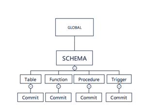

# MySQL · 特性分析 · 利用gdb跟踪MDL加锁过程

**Date:** 2017/09
**Source:** http://mysql.taobao.org/monthly/2017/09/06/
**Images:** 2 images downloaded

---

数据库内核月报

 [
 # 数据库内核月报 － 2017 / 09
 ](/monthly/2017/09)

 * 当期文章

 POLARDB · 新品介绍 · 深入了解阿里云新一代产品 POLARDB
* HybridDB · 最佳实践 · 阿里云数据库PetaData
* MySQL · 捉虫动态 · show binary logs 灵异事件
* MySQL · myrocks · myrocks之Bloom filter
* MySQL · 特性分析 · 浅谈 MySQL 5.7 XA 事务改进
* MySQL · 特性分析 · 利用gdb跟踪MDL加锁过程
* MySQL · 源码分析 · Innodb 引擎Redo日志存储格式简介
* MSSQL · 应用案例 · 日志表设计优化与实现
* PgSQL · 应用案例 · 海量用户实时定位和圈人-团圆社会公益系统
* MySQL · 源码分析 · 一条insert语句的执行过程

 ## MySQL · 特性分析 · 利用gdb跟踪MDL加锁过程 
 Author: 勋臣 

 ## MDL(Meta Data LocK)的作用

在MySQL5.1及之前的版本中，如果有未提交的事务trx，当执行DROP/RENAME/ALTER TABLE RENAME操作时，不会被其他事务阻塞住。这会导致如下问题(MySQL bug#989)

master：
未提交的事务，但SQL已经完成(binlog也准备好了)，表schema发生更改，在commit的时候不会被察觉到.

slave：
在binlog里是以事务提交顺序记录的，DDL隐式提交，因此在备库先执行DDL，后执行事务trx，由于trx作用的表已经发生了改变，因此trx会执行失败。
在DDL时的主库DML压力越大，这个问题触发的可能性就越高

在5.5引入了MDL（meta data lock）锁来解决在这个问题

## MDL锁的类型
metadata lock也是一种锁。每个metadata lock都会定义锁住的对象，锁的持有时间和锁的类型

 属性
 范围
 作用

 GLOBAL
 全局锁
 主要作用是防止DDL和写操作的过程中执行 set golbal_read_only =on 或flush tables with read lock;

 commit
 提交保护锁
 主要作用是执行flush tables with read lock后，防止已经开始在执行的写事务提交

 SCHEMA
 库锁
 对象

 TABLE
 表锁
 对象

 FUNCTION
 函数锁
 对象

 PROCEDURE
 存储过程锁
 对象

 TRIGGER
 触发器锁
 对象

 EVENT
 事件锁
 对象

这些锁具有以下层级关系

## MDL锁的简单示例
在实际工作中，最常见的MDL冲突就DDL的操作被没用提交的事务所阻塞。 我们下面通过一个具体的实例来演示DDL加MDL锁的过程。在这个实例中，利用gdb来跟踪DDL申请MDL锁的过程。

会话1:

`mysql> create table ti(id int primary key, c1 int, key(c1)) engine=InnoDB 
stats_auto_recalc=default;
Query OK, 0 rows affected (0.03 sec)

mysql> insert into ti values (1,1), (2,2);
Query OK, 2 rows affected (0.03 sec)
Records: 2 Duplicates: 0 Warnings: 0

mysql> start transaction;
Query OK, 0 rows affected (0.00 sec)

mysql> select * from ti;
+----+------+
| id | c1 |
+----+------+
| 1 | 1 |
| 2 | 2 |
+----+------+
2 rows in set (0.00 sec)

`
再开启第二个会话,利用gdb来跟踪mysql加MDL的过程
会话2：

`[root@localhost mysql]# ps -ef|grep mysql
root 3336 2390 0 06:33 pts/2 00:00:01 /u02/mysql/bin/mysqld --basedir=/u02/mysql/ --datadir=/u02/mysql/data 
--plugin-dir=/u02/mysql//lib/plugin --user=root 
--log-error=/u02/mysql/tmp/error1.log --open-files-limit=10240 
--pid-file=/u02/mysql/tmp/mysql.pid 
--socket=/u02/mysql/tmp/mysql.sock --port=3306

[root@localhost mysql]# gdb -p 3336
----在GDB设置以下断点
(gdb) b MDL_context::acquire_lock
Breakpoint 1 at 0x730cab: file /u02/mysql-server-5.6/sql/mdl.cc, line 2187.
(gdb) b lock_rec_lock
Breakpoint 2 at 0xb5ef50: file /u02/mysql-server-5.6/storage/innobase/lock/lock0lock.cc, line 2296.

(gdb) c
Continuing.....
`

开启第三个会话

`mysql> alter table ti stats_auto_recalc=1;
这个操作被hang住
`

在会话2中执行下面的操作

`(gdb) p mdl_request
$1 = (MDL_request *) 0x7f697d1c3bd0
(gdb) p *mdl_request
$2 = {
type = MDL_INTENTION_EXCLUSIVE, duration = MDL_STATEMENT, next_in_list = 0x7f697002a560, prev_in_list = 0x7f697d1c3df8, ticket = 0x0, key = {m_length = 3, m_db_name_length = 0,
 m_ptr = '\000' <repeats 20 times>, "0|\002p\000\000\001\000\060<\034}i\177\000\000>\240\344\000\000\000\000\000\000\t\000pi\177\000\000\000\t\000pi\177\000\000`>\034}i\177\000\000V\312\344\000\000\000\000\000\240>\034}i\177\000\000\333\361\254\000b\001\000\000\a?\000\001", '\000' <repeats 20 times>, "0|\002p\000\000\001\000\220<\034}i\177\000\000>\240\344\000\000\000\000\000\340\236\002pi\177\000\000\333\361\254\000\000\000\000\000\a?\000\001", '\000' <repeats 12 times>"\340, >\034}i\177\000\000\060|\002p\000\000\001\000\350\062\220\003\000\000\000\000\333\361\254\000\000\000\000\000$\226\363", '\000' <repeats 14 times>,
"?\034}i\177\000\000\060|\002p\000\000\001\000\000=\034}i\177\000\000>\240\344\000\000\000\000\000\000"...,
static m_namespace_to_wait_state_name = {
{m_key = 101,
 m_name = 0xf125a2 "Waiting for global read lock", m_flags = 0}, 
{m_key = 102, 
 m_name = 0xf125c0 "Waiting for schema metadata lock", m_flags = 0}, 
{m_key = 103,
 m_name = 0xf125e8 "Waiting for table metadata lock", m_flags = 0}, 
{m_key = 104, 
 m_name = 0xf12608 "Waiting for stored function metadata lock", m_flags = 0}, 
{m_key = 105,
 m_name = 0xf12638 "Waiting for stored procedure metadata lock", m_flags = 0}, 
{m_key = 106, 
 m_name = 0xf12668 "Waiting for trigger metadata lock", m_flags = 0}, 
{m_key = 107,
 m_name = 0xf12690 "Waiting for event metadata lock", m_flags = 0}, 
{m_key = 108, 
 m_name = 0xf126b0 "Waiting for commit lock", m_flags = 0}}}}
(gdb)
`

从上面的输出中，我只能看到申请了一个语句级别的MDL_INTENTION_EXCLUSIVE。并没有看到什么其他有意义的信息。我们继续gdb跟踪

`(gdb) p *(mdl_request->next_in_list)
$3 = {type = MDL_INTENTION_EXCLUSIVE, duration = MDL_TRANSACTION, next_in_list = 0x7f697002a388, prev_in_list = 0x7f697d1c3bd8, ticket = 0x0, key = {m_length = 7, m_db_name_length = 4,
 m_ptr = "\001test\000\000\217\217\217\217\217\217\217\217\217\217\217\217\217\217\217\217\217\217\217\217\217\217\217\217\217\217\217\217\217\217\217\217\217\217\217\217\217\217\217\217\217\217\217\217\217\217\217\217\217\217\217\217\217\217\217\217\217\217\217\217\217\217\217\217\217\217\217\217\217\217\217\217\217\217\217\217\217\217\217\217\217\217\217\217\217\217\217\217\217\217\217\217\217\217\217\217\217\217\217\217\217\217\217\217\217\217\217\217\217\217\217\217\217\217\217\217\217\217\217\217\217\217\217\217\217\217\217\217\217\217\217\217\217\217\217\217\217\217\217\217\217\217\217\217\217\217\217\217\217\217\217\217\217\217\217\217\217\217\217\217\217\217\217\217\217\217\217\217\217\217\217\217\217\217\217\217\217\217\217\217\217\217\217\217\217\217\217\217\217\217\217\217\217\217\217\217\217\217\217\217\217\217\217\217\217\217\217\217\217\217\217\217\217\217\217\217\217\217\217\217\217\217\217\217\217\217\217\217\217\217\217\217\217\217\217\217\217\217\217\217\217\217\217\217\217\217\217\217\217\217\217\217\217\217\217\217\217\217\217\217\217\217\217\217\217\217\217\217\217\217\217\217\217\217\217\217\217\217\217\217\217\217\217\217\217\217\217\217\217\217\217\217\217\217\217\217\217\217\217\217\217\217\217\217\217\217\217\217\217\217\217\217\217\217\217\217\217\217\217\217\217\217\217\217\217\217\217\217\217\217\217\217\217\217\217\217\217\217\217\217\217\217\217\217\217\217\217\217\217\217\217\217\217\217\217\217\217\217\217\217\217\217\217\217\217\217\217\217\217\217\217\217\217\217\217\217\217\217\217\217", 
static m_namespace_to_wait_state_name = {
{m_key = 101,
 m_name = 0xf125a2 "Waiting for global read lock", m_flags = 0}, 
{m_key = 102, 
 m_name = 0xf125c0 "Waiting for schema metadata lock", m_flags = 0}, 
{m_key = 103,
 m_name = 0xf125e8 "Waiting for table metadata lock", m_flags = 0}, 
{m_key = 104, 
 m_name = 0xf12608 "Waiting for stored function metadata lock", m_flags = 0}, 
{m_key = 105,
 m_name = 0xf12638 "Waiting for stored procedure metadata lock", m_flags = 0}, 
{m_key = 106, 
 m_name = 0xf12668 "Waiting for trigger metadata lock", m_flags = 0}, 
{m_key = 107,
 m_name = 0xf12690 "Waiting for event metadata lock", m_flags = 0}, 
{m_key = 108, 
 m_name = 0xf126b0 "Waiting for commit lock", m_flags = 0}}}} 
`
从上面的输出中，我们看到了需要在test（见输出中的 m_ptr = “\001test）数据库上加一把事务级的MDL_INTENTION_EXCLUSIVE锁。它并没有告诉我们最终的MDL会落在哪个对象上。我们继续跟踪

`$4 = {type = MDL_SHARED_UPGRADABLE, duration = MDL_TRANSACTION, next_in_list = 0x0, prev_in_list = 0x7f697002a568, ticket = 0x0, key = {m_length = 9, m_db_name_length = 4,
 m_ptr = "\002test\000ti", '\000' <repeats 378 times>, 
static m_namespace_to_wait_state_name = {
{m_key = 101, 
 m_name = 0xf125a2 "Waiting for global read lock", m_flags = 0}, 
{m_key = 102,
 m_name = 0xf125c0 "Waiting for schema metadata lock", m_flags = 0}, 
{m_key = 103, 
 m_name = 0xf125e8 "Waiting for table metadata lock", m_flags = 0}, 
{m_key = 104,
 m_name = 0xf12608 "Waiting for stored function metadata lock", m_flags = 0}, 
{m_key = 105, 
 m_name = 0xf12638 "Waiting for stored procedure metadata lock", m_flags = 0}, 
{m_key = 106,
 m_name = 0xf12668 "Waiting for trigger metadata lock", m_flags = 0}, 
{m_key = 107, 
 m_name = 0xf12690 "Waiting for event metadata lock", m_flags = 0}, 
{m_key = 108,
 m_name = 0xf126b0 "Waiting for commit lock", m_flags = 0}}}}
`
从上面的输出中，我们可以看出最终是要在test数据库的ti对象上加一把MDL_SHARED_UPGRADABLE锁。在做DDL时会先加MDL_SHARED_UPGRADABLE锁，然后升级到MDL_EXCLUSIVE锁

我来执行下面的过程
会话1

`mysql> commit;
Query OK, 0 rows affected (5.51 sec)

`

会话2

`(gdb) p *mdl_request
$5 = {type = MDL_EXCLUSIVE, duration = MDL_TRANSACTION, next_in_list = 0x20302000000, prev_in_list = 0x200000001, ticket = 0x0, key = {m_length = 9, m_db_name_length = 4,
 m_ptr = "\002test\000ti\000\000\000\000@\031\220\003\000\000\000\000\333\361\254\000\000\000\000\000\260<\034}i\177\000\000\302\362\254\000\000\000\000\000\300<\034}i\177\000\000\060|\002pi\177\000\000\320<\034}i\177\000\000\360\236\344\000\000\000\000\000\000\t\000pi\177\000\000(}\002pi\177\000\000\360<\034}i\177\000\000\234\312\344\000\000\000\000\000H\245\002pi\177\000\000\333\361\254\000\000\000\000\000\023\360\000\001", '\000' <repeats 12 times>, "`S\005pi\177\000\000\060|\002p\000\000\001\000\060=\034}i\177\000\000>\240\344\000\000\000\000\000\000\t\000pi\177\000\000\000\t\000pi\177\000\000\200=\034}i\177\000\000\231\310\344\000\000\000\000\000\240=\034}i\177\000\000l-d0t\b\000\000H\344\000\001\000\000\000\000\023\360\000\001\000\000\000\000\226"..., 
static m_namespace_to_wait_state_name = {
{m_key = 101, 
 m_name = 0xf125a2 "Waiting for global read lock", m_flags = 0}, 
{m_key = 102, 
 m_name = 0xf125c0 "Waiting for schema metadata lock", m_flags = 0}, 
{m_key = 103,
 m_name = 0xf125e8 "Waiting for table metadata lock", m_flags = 0}, 
{m_key = 104, 
 m_name = 0xf12608 "Waiting for stored function metadata lock", m_flags = 0}, 
{m_key = 105,
 m_name = 0xf12638 "Waiting for stored procedure metadata lock", m_flags = 0}, 
{m_key = 106, 
 m_name = 0xf12668 "Waiting for trigger metadata lock", m_flags = 0}, 
{m_key = 107,
 m_name = 0xf12690 "Waiting for event metadata lock", m_flags = 0}, 
{m_key = 108, 
 m_name = 0xf126b0 "Waiting for commit lock", m_flags = 0}}}} 
`
从上面的输出中，我们看到了最终是在test.ti上申请了事务级别的MDL_EXCLUSIVE锁。

会话3

`mysql> alter table ti stats_auto_recalc=1;
Query OK, 0 rows affected (22 min 58.99 sec)
Records: 0 Duplicates: 0 Warnings: 0
`

## 小结
本例只是简单的演示了，在同一个事务的不同时期加的不同的MDL的锁。MYSQL中DDL的操作不属于事务操作的范围。这就给mysql主备基于语句级别同步带来了困难。mysql主备在同步的过程中，为了保证主备结构一致性，而引入了MDL机制。为了尽可能的降低MDL带来的影响。请在业务低谷的时候，执行DDL操作。

 阅读： - 

本作品采用[知识共享署名-非商业性使用-相同方式共享 3.0 未本地化版本许可协议](http://creativecommons.org/licenses/by-nc-sa/3.0/)进行许可。

 