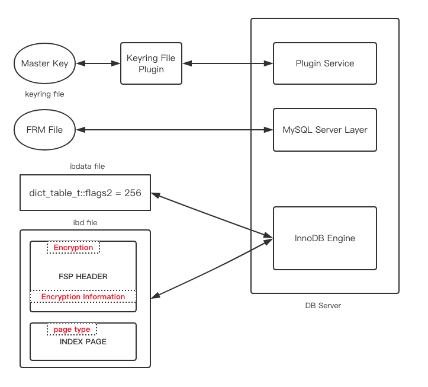
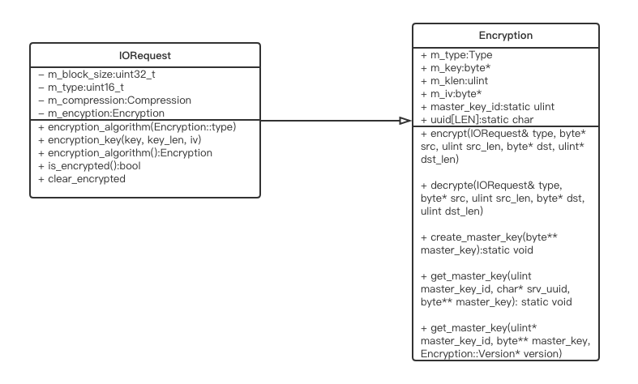

# MySQL · 引擎特性 · InnoDB 表空间加密

**Date:** 2018/04
**Source:** http://mysql.taobao.org/monthly/2018/04/01/
**Images:** 3 images downloaded

---

数据库内核月报

 [
 # 数据库内核月报 － 2018 / 04
 ](/monthly/2018/04)

 * 当期文章

 MySQL · 引擎特性 · InnoDB 表空间加密
* MongoDB · myrocks · mongorocks 引擎原理解析
* MySQL · 引擎特性 · InnoDB 数据页解析
* MySQL · MyRocks · TTL特性介绍
* MySQL · 源码分析 · 协议模块浅析
* MSSQL · 最佳实践 · 如何监控备份还原进度
* MySQL · 特性分析 · MySQL的预编译功能
* MySQL · 特性分析 · (deleted) 临时空间
* MySQL · RocksDB · WAL(WriteAheadLog)介绍
* PgSQL · 应用案例 · 相似文本识别与去重

 ## MySQL · 引擎特性 · InnoDB 表空间加密 
 Author: zhuyan 

 ## 背景简介

InnoDB 表空间加密是在引擎内部数据页级别的加密手段，在数据页写入文件系统时加密，从文件读到内存中时解密，目前广泛使用的是 YaSSL/OpenSSL 提供的 [AES](https://en.wikipedia.org/wiki/Advanced_Encryption_Standard) 加密算法，加密前后数据页大小不变，因此也称为透明加密。表空间加密相对于文件系统加密更加灵活，用户可以控制加密重要的表，防止被拖库导致的数据丢失。MySQL 官方在 [5.7.11](https://dev.mysql.com/doc/relnotes/mysql/5.7/en/news-5-7-11.html) 中发布了表空间加密功能，Aliyun RDS 差不多在同时支持了 RDS MySQL 版的表空间加密，通过了[“等保三级”](https://www.aliyun.com/product/rds/mysql?spm=5176.8142029.388261.312.e9396d3eOfI3U5) 的认证，随后 MariaDB 在 10.1 支持了功能增强版的“表空间加密”，除了表空间，还可以对 Redo log 和 Binlog 进行加密，参考[这篇](https://mariadb.com/resources/blog/table-and-tablespace-encryption-mariadb-101)详细介绍。本文将详细介绍官方的实现方式。

## Keyring Plugin

Keyring Plugin 是用来保存敏感信息的插件，目前官方支持了四种插件: [keyring_file](https://dev.mysql.com/doc/refman/5.7/en/keyring-file-plugin.html), [keyring_encrypted_file](https://dev.mysql.com/doc/refman/5.7/en/keyring-encrypted-file-plugin.html), [keyring_okv](https://dev.mysql.com/doc/refman/5.7/en/keyring-okv-plugin.html), [keyring_aws](https://dev.mysql.com/doc/refman/5.7/en/keyring-aws-plugin.html), 社区版目前只支持 keyring_file 类型，本文基于此类型介绍。

如果要使用表空间加密功能，keyring_file 必须在 MySQL 实例初始化之前初始化(使用 –early-plugin-load 参数)，因为 keyring_file 里面保存了解密需要的 master_key。我们可以把这个插件理解成一个 K-V 表，可以根据 key 查找到对应的数据。在源码内部提供了以下几个接口：

`/* 根据 key_id 查找秘钥 */
STRING keyring_key_fetch(STRING key_id);

/* 以 key_id 生成加密类型为 key_type 长度为 key_length 的秘钥，并存储到文件中 */
STRING keyring_key_generate(STRING key_id, STRING key_type, INTEGER key_length);

/* 返回秘钥长度 */
INTEGER keyring_key_length_fetch(STRING key_id);

/* 移除秘钥 */
INTEGER keyring_key_remove(STRING key_id);

/* 混淆并且存储秘钥 */
INTEGER keyring_key_store(STRING key_id, STRING key_type, STRING key);

/* 返回秘钥加密类型 */
STRING keyring_key_type_fetch(STRING key_id);
`

用户可以创建 UDF(User Deifined Function) 在 SQL 语句中使用上述接口，作为独立于表空间加密的功能使用，具体使用方式可以参考：[General-Purpose Keyring Key_Management Functions](https://dev.mysql.com/doc/refman/5.7/en/keyring-udfs-general-purpose.html)。把 keyring_file 放到本地文件显然是不安全的，建议放到类似U盘的地方，启动实例的时候挂载到文件系统，启动之后移除，大概就像原来银行的优盾 ：）

## 流程分析

### 整体架构

为了支持 key rotation，官方的加密用到了两个秘钥，一个是从 kering 生成的 master_key，另一个是用来加密每个表空间的 tablespace_key，master_key 仅仅用来加密解密 tablespace_key。tablespace_key 加密后保存在每个 ibd 文件 page 0 页的尾部，对应图中 Encryption Information 部分，除了 tablespace_key, 还有用来索引 master_key 的 master_key_id 信息，以及 magicnum 和循环冗余校验的数据。关于 InnoDB ibd 文件的页面组织可以参考月报[InnoDB 文件系统之文件物理结构](http://mysql.taobao.org/monthly/2016/02/01/),首个页空间利用并不满。

在 server 层，创建一个加密的表后，加密的信息会保存在 frm 文件中，主要作用是 show create table 时可以打印出加密部分的语句。

InnoDB 层除了 Encryption Information，还会在 ibdata 的字典表中的 flags2 字段标识对应的表示加密表，具体存储在 SYS_TABLES 表 MIX_LEN 列中，关于 InnoDB 字典表结构可以参考[这篇文章](https://twindb.com/innodb-dictionary/)。在 ibd 文件中会在 page 0 页头部 FSP 的 FLAG 标识这个 File Space 是加密表空间，具体位置在 FSP_FLAGS_POS_ENCRYPTION，如图中 Encryption 所示位置。还会在每个 Index page 的 page type 位置标识这个页是加密的，对应图中 page type 位置。

 Note: 在 ibdata 中的系统表空间，比如 redo，undo 等是默认不加密的，ibd 文件 page 0 也是不加密的，Index page 只会对数据部分加密，Page Header 不会被加密。

上述部分是整体架构和物理文件页面有哪些变化，相对于 MySQL 5.6 使用了一些预留的标记为空间，迁移的话保证对应的位置不会冲突。

### 代码分析

#### 基础类介绍
MySQL 5.7 的代码相对于 5.6 版本有了较大的重构，主要是把之前面向过程的代码更多的用类结构封装。表空间加密主要交互是在和文件的 IO 交互，页写入文件之前加密，从文件读出第一时间解密。还有一个 Encryption 类，负责调用 keyring plugin 来维护 master_key, 保存 tablespace key 加密的时候用，还提供页面的加密解密函数等。代码重构后 IO 部分使用类 IORequest 类来控制具体 IO 的行为，比如是 READ 还是 WRITE，是否是对 LOG 的 IO, 是否加密，是否压缩等等。如下类图所示，Encryption 类注入到 IORequest 中。

下面首先介绍一下 master_key 的维护，Encryption 类中有两个静态成员变量，master_key_id 是一个递增的值，每次生成新的 master_key 都会更新，uuid 是当前的 server_uuid。 前面介绍了 keyring plugin 提供的接口函数，在 create_master_key, get_master_key * 2, 三个静态函数中调用。对应 keyring plugin 的 key_id 参数，是 [ENCRYPTION_MASTER_KEY_PRIFIX+uuid+master_key_id] 的字符串组合，用变量 key_name 表示。create_master_key 获得一个新的 master_key:

`create_master_key
 |
 ---- my_key_generate(key_name, "AES", ENCRYPTION_KEY_LEN)
 |
 ---- my_key_fetch(key_name, &keytype, NULL, master_key, key_len)
`

get_master_key 是一个重载函数，因为历史原因，为了兼容 5.7.11 版本最初设计的加密格式，需要 uuid 作为一个检索的参数，图中第一个 get_master_key 函数根据传入的参数调用 my_key_fetch 查找，第二个函数的参数都是指针类型，返回之后都会被赋值，如果发现当前的 Encryption::master_key_id 为 0，说明还没有产生过 master_key ，就执行类似 create_master_key 的逻辑创建。

接下来看加密和解密的函数，参数类似，就是传入一个 src 页，然后加密好放到 dst 页中，数据页加密使用的加密算法是 [my_aes_256_cbc](https://en.wikipedia.org/wiki/Block_cipher_mode_of_operation),这种加密算法要求每个加密块大小是 128 bit(16 Byte)，也就是说数据页的大小必须是这个值得整数倍，InnoDB 的页默认大小是 16K，传入整个页进行加密是完全可行的。但是官方选择了最小加密原则，仅仅只对页面中用户数据部分加密，页面头保持明文存储。所以无论是加密还是解密都分成了两次调用，一次对 main_len 大小数据加密，另外一次对 remain_len 加密：

`data_len = src_len - FIL_PAGE_DATA;
main_Len = (data_len / MY_AES_BLOCK_SIZE) * MY_AES_BLOCK_SIZE;
remain_len = data_len - main_len;
`
加密部分会修改页面的 page type 字段，从 src 页固定位置取出当前的页类型，如果是加密过的，就报错，加密结束之后根据原有的页面类型，修改为对应的加密页类型：

`if (page_type == FIL_PAGE_COMPRESSED) {
 mach_write_to_2(dst + FIL_PAGE_TYPE,
 FIL_PAGE_COMPRESSED_AND_ENCRYPTED);
 } else if (page_type == FIL_PAGE_RTREE) {
 /* If the page is R-tree page, we need to save original
 type. */
 mach_write_to_2(dst + FIL_PAGE_TYPE, FIL_PAGE_ENCRYPTED_RTREE);
 } else{
 mach_write_to_2(dst + FIL_PAGE_TYPE, FIL_PAGE_ENCRYPTED);
 mach_write_to_2(dst + FIL_PAGE_ORIGINAL_TYPE_V1, page_type);
 }
`

其中 R-tree 是 MySQL 为了支持 GIS 引入的数据类型。[WL#6968](https://dev.mysql.com/worklog/task/?id=6968).解密开始会判断 page type 是否是压缩类型，需要修改src_len 的大小。

#### Tablespace key 初始化和读取
Tablespace key 是真正用来加密用户页面数据的，就是上节介绍的 Encryption 类的 m_key，tablespace key 会在 create 一个加密表或者 alter 一个表变为加密表时创建，以 create table 流程为例，因为只支持独立表空间，所以需要递增的产生一个 space id，然后创建一个 ibd 文件，并且初始化为默认的 page 数量大小，把 space id 和 fsp flags 写入第一个页的头部（fsp flags 对应整体架构图中 Encryption 部分，标记一个表空间为加密表空间，flags 由 dict_table_t 结构的 flag 转化而来，而 dict_table_t 的 flag 是从 server 层的 TABLE_SHARE 中获得，源头就是用户执行的 create table 语句语法）， 创建 file_space_t，初始化 file_node(虽然表空间只有一个 ibd 文件)，接着调用 fil_set_encryption 函数生成 tablespace key，并且保存在刚刚创建的 fil_space_t 中。最终会在 fsp_head_init 函数中把 tablespace key 相关信息写入页面中，对应整体架构图中 Encryption Infomation 部分。函数调用栈：

`dict_build_tablespace
 |
 --- fil_ibd_create
 | |
 | --- os_fil_create
 | |
 | --- os_file_set_size
 | |
 | --- fsp_header_init_fields
 | |
 | --- os_file_write
 | |
 | --- file_space_create
 | |
 | --- fil_set_encryption(space_id, Encryption::AES, NULL, NULL)
 |
 --- fsp_header_init
 |
 --- fsp_header_fill_encryption_info
 |
 --- mlog_write_string
`

重点看一下 fil_set_encryption 是怎么生成 tablespace key 的，还有具体保存在页面中都有哪些东西。上图调用栈最后两个参数为 NULL，对应的就是需要生成的 tablespace key 和加密向量 iv，因为是表空间刚刚创建，NULL 表示需要生成。首先判断是不是系统表空间 is_system_tablespace(space_id) 对于系统表空间不进行加密处理，如果 key 和 iv 为 NULL， 就调用 Encryption::random_value 产生一个随机的值，对于 key 和 iv 都一样，Encryption::random_value 最终会调用 YaSSL/OpenSSL 的 RAND_bytes 函数产生随机值，如果 key 和 iv 不为 NULL，就不必产生，最终赋值到 fil_space_t 中变量即可返回。

真正把 tablespace 加密并且写入到页中的是函数 fsp_header_fill_encryption_info, 从 Encryption::get_master_key 拿到加密的 master_key，从 fil_space_t 中拿到明文的 tablespace key 和 iv，使用 my_aes_256_ecb 加密算法进行加密，ecb 加密算法相对于 cbc 具有更高的安全度，当前开销也更大，看来官方也意识到把 tablespace key 放到文件里存在一定的安全隐患。存储的格式分为两种，是高版本为了向下兼容：

* ENCRYPTION_INFO_V1: magic number + master_key_id + key + iv + checksum
* ENCRYPTION_INFO_V1: magic number + master_key_id + key + iv + server_uuid + checksum

上述除了 key + iv 之外都是明文存储，checksum 是 key+iv 的明文使用[32位循环冗余校验](https://en.wikipedia.org/wiki/Cyclic_redundancy_check)得到的。

接下来介绍打开一张已经加密的表，tablespace key/iv 是如何初始化的，直接来看下调用堆栈:

` fil_ibd_open
 |
 --- Datafile.validate_to_add
 | |
 | --- Datafile::validate_first_page
 | |
 | --- fsp_header_get_encryption_key
 | |
 | --- fsp_header_get_encryption_offset
 | |
 | --- fsp_header_decode_encryption_info
 |
 --- fil_space_create
 |
 --- fil_set_encryption
`

正常打开一张表首先会根据表名去 ibdata 的字典表里查找元数据信息，例如文件路径，dict_table_t 的 flags/flags2 等等，接下来就是调用 fil_ibd_open 打开文件， 并且做一系列的校验，Datafile 是用来维护文件信息的类，在 validate_first_page 中会根据 flag 判断是否加密表空间，如果是的话，就读出第一个页，传给 fsp_header_get_encryption_key 函数，在函数里首先计算偏移，然后交给 fsp_header_decode_encryption_info 对 key/iv 进行解密。fsp_header_decode_encryption_info 首先校验 magic number，然后读出 master_key_id 和 server_uuid，用来查找 master_key, 然后用 master_key 解密 tablespace key 得到明文，最后一步是用明文再做一次循环冗余校验，和保存的 checksum 对比，值是否相同。至此已经得到了正确的 tablespace key。接着创建 fil_space_t 然后把明文的 key/iv 放进去，以备后面 IO 使用。

#### IO 路径解析
InnoDB 的 IO 分为同步 IO 和 异步 IO，同步 IO 调用操作系统的 pwrite/pread 函数，异步 IO 又分为 simulate IO 和 Linux native aio， 关于 IO 的详细介绍可以参考 [InnoDB 文件系统之 IO 系统和内存管理](http://mysql.taobao.org/monthly/2016/02/02/)， [InnoDB IO 子系统](http://mysql.taobao.org/monthly/2017/03/01/)， [InnoDB 异步 IO 工作流程](http://mysql.taobao.org/monthly/2017/07/10/) 三篇月报。这里介绍一些加密是在哪里 IO 路径中的，首先是同步 IO 路径, 以 write 为例，read 类似。在 fil_io 中初始化 IORequest 类中的 encryption 相关信息，根据要读写的 page id, fil_space。

`fil_io
 |
 --- fil_io_set_encryption
 |
 --- os_file_write
 | |
 | --- os_file_write_pfs
 | |
 | --- os_file_write_func
 | |
 | --- os_file_write_page
 | |
 | --- os_file_pwrite
 | |
 | --- os_file_io
 | |
 | --- os_file_encrypt_page
 | |
 --- os_file_read --- Encryption::encrypt
 |
 --- ......
 |
 --- os_file_io
 |
 --- os_file_io_complete
 |
 --- Encryption::decrypt
`

异步 IO 无论是 simulate IO 还是 native aio， 都是把请求放到一个 slot 里，由后台异步线程去刷盘, 发起 IO 请求的入口函数是 os_aio_func, 对于同步读写请求（OS_AIO_SYNC），发起请求的线程直接调用os_file_read_func 或者os_file_write_func 去读写文件，然后返回。对于异步请求，用户线程从对应操作类型的任务队列（AIO::select_slot_array）中选取一个slot，将需要读写的信息存储于其中（AIO::reserve_slot）, 对于 write 操作，此时把需要写入的数据进行加密。对于Native AIO（使用linux自带的LIBAIO库），调用函数AIO::linux_dispatch，将IO请求分发给kernel层。

`fil_io
 |
 --- fil_io_set_encryption
 |
 ---os_aio
 |
 --- os_aio_func
 |
 --- AIO::reserve_slot
 | |
 | --- os_file_encrypt_page
 | |
 | --- Encryption::encrypt
 |
 --- linux_dispatch(slot)
`
处理异步 IO 请求的入口函数是 fil_aio_wait, 对于 Native AIO，调用函数os_aio_linux_handle 获取读写请求。IO线程会反复以500ms（OS_AIO_REAP_TIMEOUT）的超时时间通过io_getevents确认是否有任务已经完成了（LinuxAIOHandler::collect()），如果有读写任务完成，找到已完成任务的slot后，释放对应的槽位,写请求已经加密过，直接写入即可，读请求需要进行解密，调用堆栈如下。

`fil_aio_wait
 |
 --- os_aio_linux_handle
 |
 --- LinuxAIOHandler::collect
 |
 --- io_complete
 |
 --- os_file_io_complete
 |
 --- Encryption::decrypt
`

#### Master key rotation
Master_key 对于整个实例加密非常重要，官方加密方法最重要的一个特性就是可以更新 master_key, 因为 tablespace_key 的明文不会变，更新 master_key 之后只需要把 tablespace_key 重新加密写入第一个页中即可。入口是 server 层一个类 Rotate_innodb_master_key::execute 函数，这个类继承 Alter_instance 类，execute 函数会调用 innobase_encryption_key_rotation , 这个函数在引擎初始化（innobase_init）的时候注册到 innobase_hton 中。接着创建一个新的 master_key ，由于明文的 tablesapce key 保存在 fil_space_t 中，无需用原来的 master_key 进行解密。然后 fil_encryption_rotate 遍历 fil_system 中的每一个 fil_space_t ，调用 fsp_header_rotate_encrytion 加密 tablespace_key 并存储。

`Rotate_innodb_master_key::execute
 |
 --- innobase_encryption_key_rotation
 |
 --- Encryption::create_master_key
 |
 --- fil_encryption_rotate
 |
 --- fsp_header_rotate_encryption
 |
 --- fsp_header_fill_encryption_info
 |
 --- mlog_write_string
`

#### Export/ Import
为了支持 Export/Import 加密表，引入了 transfer_key，在 export 的时候随机生成一个 transfer_key， 把现有的 tablespace_key 用 transfer_key 加密，并将两者同时写入 table_name.cfp 的文件中，注意这里 transfer_key 保存的是明文。Import 会读取 transfer_key 用来解密，然后执行正常的 import 操作即可，一旦 import 完成，table_name.cfg 文件会被立刻删除。写 transfer_key 调用栈:

`row_quiesce_write_cfp
 |
 --- row_quiesce_write_transafer_key
 |
 --- Encryption::random_value(transfer_key)
 |
 --- my_aes_encrypt(my_aes_256_ecp)
`

import 调用栈：

`row_import_for_mysql
 |
 --- row_import_read_cfg
 | |
 | --- row_import_read_encryption_data
 | |
 | --- fread(table_name.cfp)
 | |
 | --- my_aes_decrypt
 |
 --- fil_tablespace_iterate
 |
 --- fil_iterator
 |
 --- IORequest::encryption_key
 |
 --- os_file_read
 |
 --- os_file_write 
`

#### 崩溃恢复
在数据库进行崩溃恢复的时候 InnoDB 是无法从字典表取得数据的，也就是说正常判断一个表是不是加密表的路径（Dict_table_t::flags2 -> fil_space_t）是行不通的，所以需要在 ibd 文件的头部标记加密，读取 ibd 就知道表空间类型。对于官方的加密方法，因为有 tablespace_key 的相关信息持久化在页面上，受 redo 保护，所以在崩溃恢复的时候需要能够从 redo 中正确解析，需要增加处理逻辑。对于崩溃恢复的详细介绍可以参考早期月报 [Innodb 崩溃恢复过程](http://mysql.taobao.org/monthly/2015/06/01/)。这部分相关修改并不多，首先需要构建 recv_sys , 在 recv_sys 结构中增加了一个 encryption_list, 保存需要回复的加密表空间信息, 初始化在 recv_parse_or_apply_log_rec_body 中，如果是 page = 0 的页，并且不是系统表空间，就调用 fil_write_encryption_parse -> fsp_header_decode_encryption_info 进行解析，拿到 master_id, 查找 keyring plugin 得到 master_key, 然后解析 tablespace_key，如果是未加载的表空间，就放到 recv_sys->encryption_list 里面。

在构建 recv_spaces 的时候，会调用 fil_name_parse->fil_name_process->fil_ibd_load ， 如果是加密表空间，并且在 recv_sys->encryption_list 中，就从 recv_sys->encryption_list 里找到对应的 space id 初始化加密信息，后面应用 redo 日志就可以先对页面进行加解密处理。

### 总结
官方的这种加密方式优点和缺点都相当明显，优点是 master_key 可以经常更新，能够满足一定的用户需求，并且每个表都可以拥有不同的秘钥 tablespace_key ，即使一张表被破解，其它表也不会立刻丢失数据。缺点也在 tablesapce_key 的存放上，所有的人都知道加密的秘钥保存在哪里，甚至知道明文的 checksum 是什么，对于高安全的用户来说，秘钥不落地是非常重要的，显然官方的这种加密方式无法满足。另外一个很危险的就是 export/import ， 虽然重新生成了一个 transfer_key，但是竟然是明文保存在文件里，即使用完就会删除，但是这个时间间隙被利用就相当危险了。

 阅读： - 

本作品采用[知识共享署名-非商业性使用-相同方式共享 3.0 未本地化版本许可协议](http://creativecommons.org/licenses/by-nc-sa/3.0/)进行许可。

 