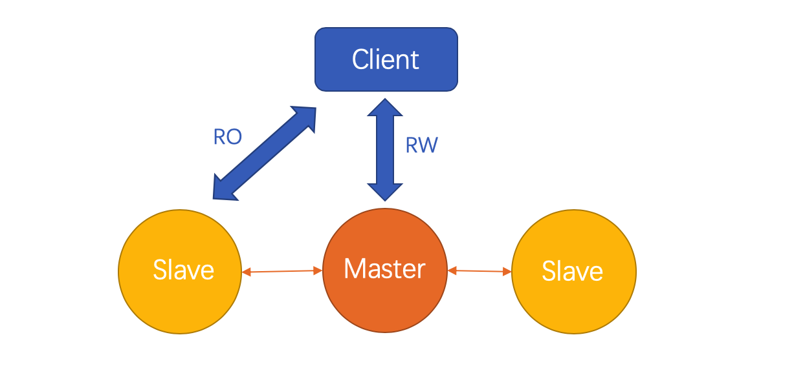
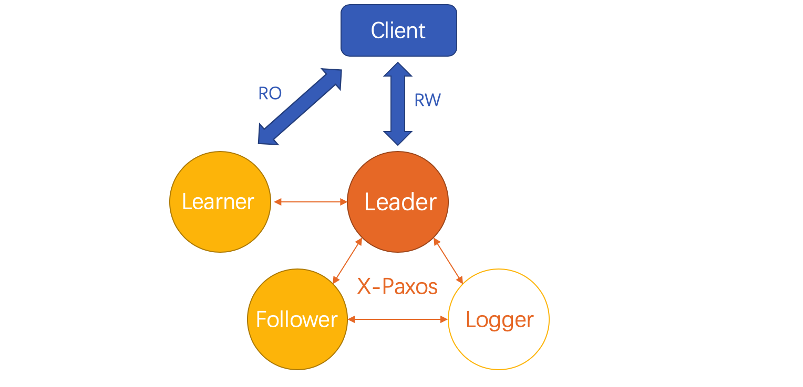
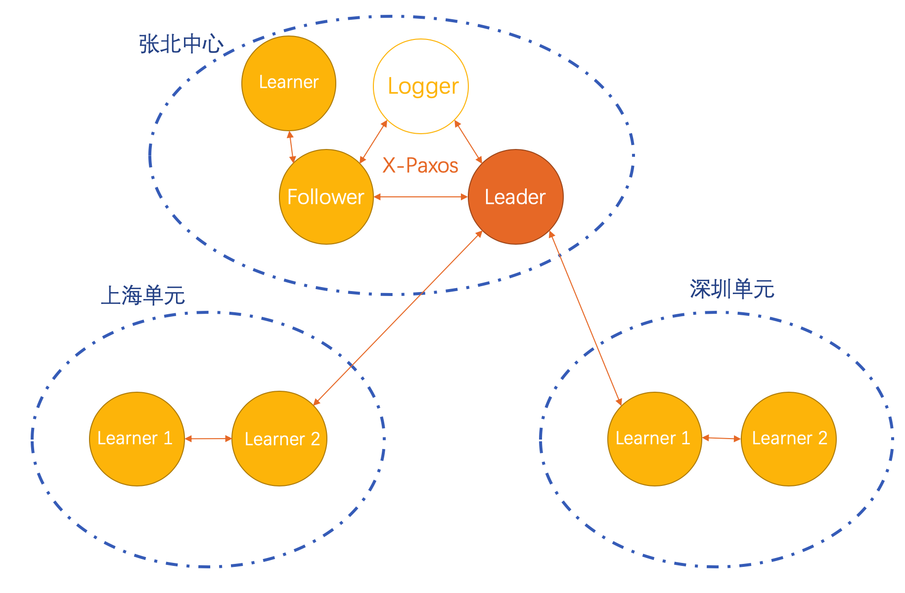
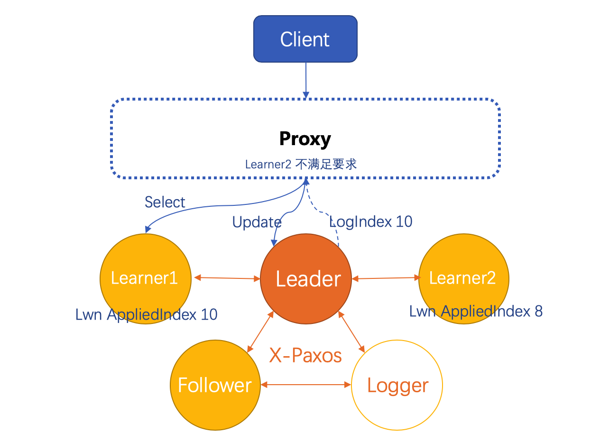

# MySQL · 引擎特性 · RDS三节点企业版 Learner 只读实例

**Date:** 2019/11
**Source:** http://mysql.taobao.org/monthly/2019/11/07/
**Images:** 5 images downloaded

---

数据库内核月报

 [
 # 数据库内核月报 － 2019 / 11
 ](/monthly/2019/11)

 * 当期文章

 MySQL · 最佳实践 · 今天你并行了吗？---洞察PolarDB 8.0之并行查询
* MySQL · 新特征 · MySQL 哈希连接实现介绍
* MySQL · 最佳实践 · 性能分析的大杀器—Optimizer trace
* PgSQL · 未来特性调研 · TDE
* Database · 理论基础 · Multi-ART
* MySQL · 引擎特性 · RDS三节点企业版 一致性协议
* MySQL · 引擎特性 · RDS三节点企业版 Learner 只读实例

 ## MySQL · 引擎特性 · RDS三节点企业版 Learner 只读实例 
 Author: 甄平 

 本文介绍三节点企业版只读实例的相关功能和技术实现。

## 背景介绍

读写分离是数据库常见的使用模式。类似MySQL proxy这样的中间件把写入和更新流量发送到主节点，把查询流量转发到只读节点，可以释放主节点的CPU和IO资源，提升数据库整体的可用性。在《RDS三节点企业版 · 一致性协议》文章中，我们介绍了三节点企业版借助X-Paxos的Learner角色，实现了只读实例的功能。

## Learner特性

三节点企业版通过新加Learner的方式实现只读实例的功能。Learner从Leader接收已经提交的日志存储到consensus log中，由Slave线程读取并分发给worker线程，最终并行回放到状态机。对于外部客户端来说，Learner节点是只读状态的。

实际上用过MySQL云产品的人，对只读节点的概念并不陌生。在双节点高可用版本中，初始状态会生产两个实例。一个作为Master，是提供读写的主节点。另一个作为Slave，是处于read only状态的备节点，不过该节点不暴露给客户，也不对外提供读服务。如果需要增加只读实例支持读写分离，控制台后台会通过备份新建一个Slave节点，挂载在Master上。当该节点追平Master最新的数据后，即Second_Behind_Master追到0，对外开启读服务。部署模式如下：

三节点企业版的只读节点十分类似，首先通过备份创建一个新的Learner节点，并挂载在Leader上，挂载后Learner开始接收增量的consensus log并开始回放。当Learner节点的日志回放追平后，对外开启读服务。部署模式如下：

相比高可用版本的只读节点，Learner的优势在于接入到X-Paxos的体系中，保证了主节点（Leader/Master）和灾备节点（Follower/Slave）无论如何容灾切换，Learner都会保持和三节点集群一致的数据。考虑这样一个场景：双节点高可用场景下，主库把x=1更新成x=2，同步给了只读节点但还未同步给备库，之后主库故障。备库会切换成新的主库，只读节点也会指向这个备实例。这个时刻新主库和只读节点的数据就出现了不一致，新主库x=1，只读节点x=2。如果此时业务或DBA检测到数据库的不一致问题，执行数据回补，在新的备库重新执行把x=1更新成x=2。当这个事务binary log同步到只读节点，就会造成只读节点的SQL线程报错退出，需要人工介入处理。假设这个回补的数据量很大，在人工运维上就完全没有可操作性了，只能基于新主库的备份重搭只读节点，导致只读节点一段时间的不可用。在三节点企业版中，就完全不会发生这样的问题。

## Learner的孵化

三节点企业版使用特殊版本的Xtrabackup进行实例备份和恢复。我们基于X-Paxos的snapshot接口改进了Xtrabackup，支持创建带有一致性位点的物理备份快照，可以十分快捷的孵化一个全新的Learner节点，并加入到集群中提供读能力的扩展。在即将推出的RDS 8.0三节点版本中，我们还会整合官方8.0新出的Clone Plugin功能，推出基于Clone Plugin的一致性位点快照，Learner节点孵化功能运维会更简单，速度也会更快。

Clone Plugin相关资料可以参考：

[https://mysqlserverteam.com/clone-create-mysql-instance-replica](https://mysqlserverteam.com/clone-create-mysql-instance-replica)

[http://mysql.taobao.org/monthly/2019/08/05/](http://mysql.taobao.org/monthly/2019/08/05/)

## 自定义数据源

三节点企业版的只读节点借助X-Paxos的LearnerSource功能，通过自定义数据源，轻松实现了灵活的复制拓扑。三节点的复制拓扑配置都是通过Leader上的Membership Change相关管控SQL命令完成的。通过中心化配置管理，保证集群维度一致。自定义数据源的好处是当只读节点数量较多时，可以分流Leader日志发送的压力，打散网络传输的数据量，减小日志同步的延迟。

三节点企业版的自定义数据源还支持基于region的load balance和LearnerSource的自动容灾。具体来说，支持通过load balance功能一键将每个region的只读节点自动挂载到同region的Follower/Learner节点上。如果同region数据源出现故障，能够将数据源短暂退化到Leader节点直到恢复。该拓扑保证了各自region的只读节点从同region的节点同步数据，通过这样的级联部署，极大地减少了跨region的网络带宽占用，避免了带宽瓶颈造成的跨region延迟。

以下是阿里巴巴集团内部的一个部署样例：

当然传统的MySQL也可以构造一系列Master-Slave-Slave这样的拓扑，逐个实例通过change master配置复制关系，不过这种方式容错性差，管理成本和运维成本都很高。同时随着只读节点数量的规模上升，主备容灾后，数据不一致的风险会被放大。

## 会话读一致性

只读节点接收日志并回放，接受外部查询请求，这里存在一个问题，Learner的日志同步和回放是异步的，虽然大部分场景延迟在5s以内，也不能保证每次查询的数据一定是最新的。特别是主库执行了大表DDL或者大事务，会造成只读节点出现明显的延迟。为了解决这个问题，三节点企业版引入了MaxScale作为读写分离的代理，并在MaxScale中实现了会话读一致性，即在同一个Session内部，保证后续的读取可以读到之前同Session写入的数据，但不保证可以读到其他Session最新版本的数据。

X-Paxos的每一条日志都有一个LogIndex，对应Multi-Paxos概念中的Instance number。同时，只读节点在多线程乱序回放日志到状态机的过程中，会维护日志并发回放的窗口，通过该窗口可以计算出一个已回放的Logindex的低水位线（Lwm AppliedIndex）。在Lwm AppliedIndex之前的所有日志，都已经回放到状态机，之后的日志，依然存在空洞。三节点企业版读写分离层的代理，会跟踪缓存各个只读节点的Lwm AppliedIndex，同时每个Leader的更新，都会记录当前事务的Logindex。当有新请求到来时代理层会比较Session最新的Logindex和当前各个只读节点的Lwm AppliedIndex，仅将请求发往Lwm AppliedIndex >= Session Logindex的节点，从而保证了会话一致性。在读多写少的场景下，该机制可以起到非常好的读写分离效果。

## 总结

通过X-Paxos的Learner角色，支持创建只读实例，实现读取能力的弹性扩展，分担主数据库压力。利用只读实例满足大量的数据库读取需求，增加应用的吞吐量。目前阿里云官网已经开放了RDS 5.7三节点企业版只读实例的创建和使用，欢迎试用。

 阅读： - 

本作品采用[知识共享署名-非商业性使用-相同方式共享 3.0 未本地化版本许可协议](http://creativecommons.org/licenses/by-nc-sa/3.0/)进行许可。

 