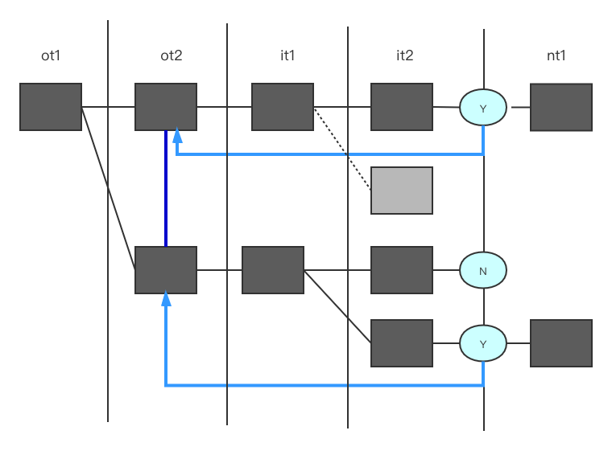
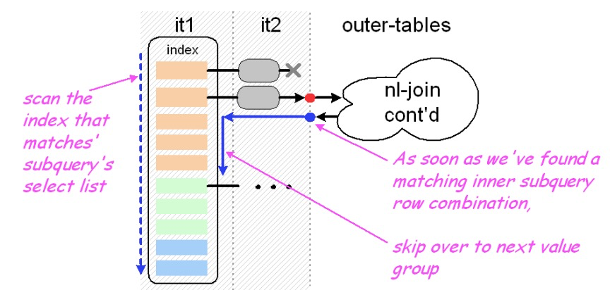
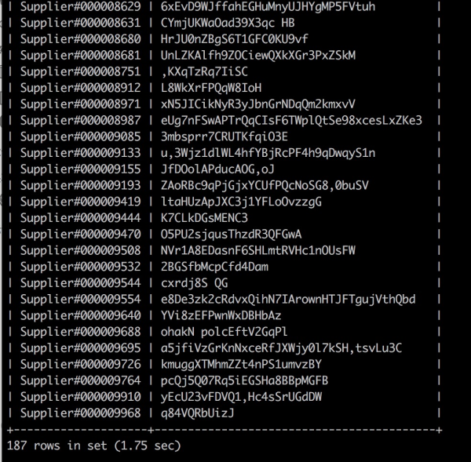
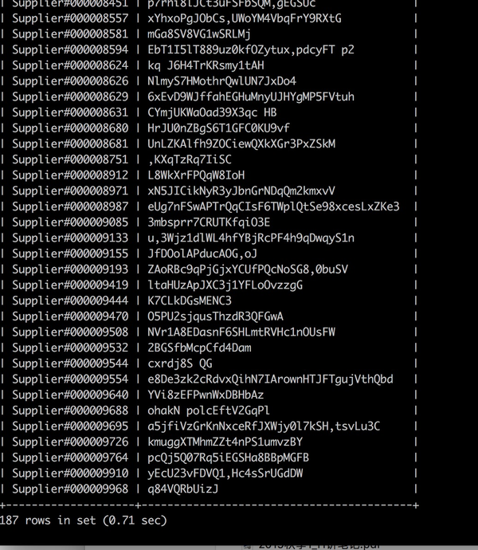

# MySQL · 内核特性 · semi-join四个执行strategy

**Date:** 2020/07
**Source:** http://mysql.taobao.org/monthly/2020/07/04/
**Images:** 13 images downloaded

---

数据库内核月报

 [
 # 数据库内核月报 － 2020 / 07
 ](/monthly/2020/07)

 * 当期文章

 MySQL · 内核特性 · 8.0 新的火山模型执行器
* MongoDB · 内核特性 · wiredtiger page逐出
* AliSQL · 内核特性 · 快速 DDL
* MySQL · 内核特性 · semi-join四个执行strategy
* MySQL · 引擎特性 · InnoDB redo log thread cpu usage
* PgSQL · 引擎特性 · SQL防火墙使用说明与内核浅析

 ## MySQL · 内核特性 · semi-join四个执行strategy 
 Author: 马苗 

 ## 一 semi-join介绍
所谓的semi-join就是一个子查询，它主要用于去重，当外表查找在内表满足条件的records时，返回外表的records，也就是说它只返回存在内表中的外表的记录，如下图所示：


**对应的语法：**

`SELECT ... From Outer_tables WHERE expr in (SELECT ... From Inner_tables ...) And ...
`
```
SELECT ... From Outer_tables WHERE expr exist (SELECT ... From Inner_tables ...) And ...

```

**语法的特征
**

* semi-join子查询必须EXSIT和IN语句组成的布尔表达式，并且在外层查询的WHERE或者ON子句中出现。
* 外层查询也可以有其他的搜索条件，只不过和IN子查询的搜索条件必须使用AND连接起来。
* semi-join子查询必须是一个单一的查询，不能是由若干查询由UNION连接起来的形式。
* semi-join子查询不能包含GROUP BY或者HAVING语句或者聚集函数。

## 二 semi-join的策略
这里以mysql8.0.13为例，讲一下semi-join的几个执行策略：

### DuplicateWeedout strategy
使用tmp_table, 按照join order, 选择记录qep_tab table的rowid作为唯一key进行去重，为了更好的理解，举一个例子：
SQL：

`SELECT Country.Name
FROM Country
WHERE Code IN
 (SELECT CountryCode
 FROM City
 WHERE Population > 1M)
`
Duplicateweedout示意图：


**处理过程：**

1. 找到duplicate weedout的qep_tab range

`/*找到sj的一个tab, 即第一个non-constant table*/
QEP_TAB *const first_sj_tab = qep_array + first_table;
/*这里由于last duplicate weedout table是outer join中的一个inner tables,
 这里遍历找到last_sj_tab*/
if (last_sj_tab->first_inner() != NO_PLAN_IDX &&
 first_sj_tab->first_inner() != last_sj_tab->first_inner()) {
 QEP_TAB *tab2 = &qep_array[last_sj_tab->first_inner()]; 
 
 while (tab2->first_upper() != NO_PLAN_IDX &&
 tab2->first_upper() != first_sj_tab->first_inner())
 tab2 = qep_array + tab2->first_upper();
 if (qep_array[tab2->first_inner()].last_inner() > last_sj_tab->idx())
 last_sj_tab =
 &qep_array[qep_array[tab2->first_inner()].last_inner()];
 }
`

1. 记录需要记录rowid的qep_tab和jt_rowid_offset(duplicate_weedout_tmp_table的column长度)
 ```
for (QEP_TAB *tab_in_range = qep_array + first_table;
 tab_in_range <= last_sj_tab; tab_in_range++) {
 if (sj_table_is_included(join, join->best_ref[tab_in_range->idx()])) {
 ...
 jt_rowid_offset += tab_in_range->table()->file->ref_length;
 ...
 tab_in_range->keep_current_rowid = true;
 }
}

```
2. 当发现需要记录jt_rowid_offset > 0时：
 * 如果jt_rowid_offset + null_bytes为长度 > 512，就创建名为的Field_longlong做为tmp_table的hash_field来去重
* 如果jt_rowid_offset + null_bytes为长度 <= 512，就创建名为rowids的Field_varstring作为weedout_key的tmp_table来去重
3. 执行是在do_sj_dups_weedout函数中会将需要记录rowid的qep_tab->table的h->ref(rowid存在这里)写入tmp_table中的visible_field_ptr()[0]中，在ha_write_row的时候会根据record是否与上一条record重复来决定是否写入，外层调用会对返回值判断来查看是否是需要写入的记录，从而达到去重的目的

**执行计划**
**start temporary 和 end temporary表示duplicateweedout的qep_tab range区间**


### Firstmatch Strategy
只扫描外表同样结果的一条记录用于匹配内表，其好处就是避免单条记录匹配内表多条记录而产生的重复的记录，也是一种去重的方式，其示意图如下：


**处理流程：**

1. 找到sj range的跳转的qep_tab和记录比较qep_tab
 `plan_idx jump_to = tab->idx() - 1;
for (QEP_TAB *tab_in_range = tab; tab_in_range <= last_sj_tab;
 tab_in_range++) {
 if (!join->best_ref[tab_in_range->idx()]->emb_sj_nest) {
 jump_to = tab_in_range->idx();
 } else {
 if (tab_in_range == last_sj_tab ||
 !join->best_ref[tab_in_range->idx() + 1]->emb_sj_nest) {
 /*记录match后跳转的qep_tap*/
 tab_in_range->firstmatch_return = jump_to;
 /*记录比较的位置*/
 tab_in_range->match_tab = last_sj_tab->idx();
 }
 }
}
`
2. 执行期间匹配到满足的记录就直接跳到last outer table(ot2)
 ```
if(table condition satisfied) {
 do join with next tables;
 jump out to the jump_to;
} else {
 discard row combination;
 continue current table scan;
}

```
 
 **执行计划**
last semijoin table的qep_tab记录firstmatch标记
****

### Loosescan Strategy

inner table 基于index进行分组, 分组后与outer table join, 进行condition的匹配，如果匹配到了的记录，提取outer table的记录，inner table 选取下一个分组继续进行计算。
Query:

`SELECT ...
FROM ot1, ...
WHERE outer_expr IN
 (SELECT it1.key
 FROM it1,
 it2
 WHERE cond(it1, it2))
`


**处理过程**

1. 选择loosescan_parts作为内表的index
2. 计算 loosescan parts的长度 loosescan_key_len
3. alloc loosescan_buf挂在执行loosescan的qep_tab上
4. 执行过程中如果发现有匹配的记录，则key_copy copy key_info到loosescan_buf上，后续用key_cmp对loosescan_buf进行比较来做分组的过滤

**执行计划**
与firstmatch相同在last semijoin table的qep_tab记录looseScan标记
****
###

### Materialize scan/Materialize lookup Strategy
将inner tables物化成temp table，通过扫描物化表或者对物化表查找的方式来避免重复record
!

**处理过程**

1. setup_semijoin_materialized_table创建一个tmp table放在qep_tab的sjm_exec->table
2. 在prepare_scan的join_materialize_semijoin(materialize钩子函数)物化semijoin nested table
 ` /*semijoin 第一个内层物化table所在的qep_tab*/
 QEP_TAB *const first = tab->join()->qep_tab + sjm->inner_table_index;
 /*semijoin 最后一个内层物化table所在的qep_tab*/
 QEP_TAB *const last = first + (sjm->table_count - 1);
 last->next_select = end_sj_materialize;
 last->set_sj_mat_exec(sjm); // TODO: This violates comment for sj_mat_exec!
 if (tab->table()->hash_field) tab->table()->file->ha_index_init(0, 0);
 int rc;
 /*物化过程*/
 if ((rc = sub_select(tab->join(), first, false)) < 0) DBUG_RETURN(rc);
 if ((rc = sub_select(tab->join(), first, true)) < 0) DBUG_RETURN(rc);
 if (tab->table()->hash_field) tab->table()->file->ha_index_or_rnd_end();
`
3. end_sj_materialize 将物化结果写入sjm->table中

 Materialization-scan与Materialization-lookup的区别：

* Materialization-Scan:

        temporary table–> outer tabl

* Materialization-lookup

         outer table–>temporary table

**执行计划**
MATERIALIZED代表使用了物化策略 
****

## 三 如何使用semi-join的策略

* optimizer_switch

 optimizer_switch 可以对semi-join使用的策略进行，其配置参数有：
 semijoin : on/off
     materialization : on/off
 firstmatch : on/off
 loosescan : on/off 
 duplicateweedout : on/off
* Optimizer Hints

 Optimizer Hints 可以支持在SQL中hint方式指定semi-join使用的策略, 如：
 指定TPCH Q20 使用duplicateweedout策略:

 `SELECT /*+ JOIN_PREFIX(nation) */ s_name,
 s_address
FROM supplier,
 nation
WHERE s_suppkey IN
 (SELECT /*+ SEMIJOIN(DUPSWEEDOUT) */ ps_suppkey
 FROM partsupp
 WHERE ps_partkey IN
 (SELECT p_partkey
 FROM part
 WHERE p_name LIKE 'peru%' )
 AND ps_availqty >
 (SELECT 0.5 * sum(l_quantity)
 FROM lineitem
 WHERE l_partkey = ps_partkey
 AND l_suppkey = ps_suppkey
 AND l_shipdate >= '1993-01-01'
 AND l_shipdate < date_add('1993-01-01' ,interval '1' YEAR) ) )
AND s_nationkey = n_nationkey
AND n_name = 'PERU'
ORDER BY s_name;
`

## 四 并行执行中的semi-join
对于选择semi-join策略的查询，PolarDB产品对semi-join所有策略实现了并行加速，根据代价评估，通过拆分semi-join的任务，多线程模型并行运行任务集，加速去重，使查询性能得到了显著的提升，以Q20为例

`select
s_name,
s_address
from
supplier, nation
where
s_suppkey in (
select
ps_suppkey
from
partsupp
where
ps_partkey in (
select
p_partkey
from
part
where
p_name like '[COLOR]%'
)
and ps_availqty > (
select
0.5 * sum(l_quantity)
from
lineitem
where
l_partkey = ps_partkey
and l_suppkey = ps_suppkey
and l_shipdate >= date('[DATE]’)
and l_shipdate < date('[DATE]’) + interval ‘1’ year
)
)
and s_nationkey = n_nationkey
and n_name = '[NATION]'
order by
s_name;
`
我们将物化处理提前，并且达到了32个worker的并行处理能力，后续的处理通过共享之前的物化表，同样充分发挥CPU的处理能力，启动32个worker将主查询的并行能力最大化，如下图的执行计划所示，在数据量1S，开启并行后，双重并行处理能力：

在1s数据情况下，串行的执行时间：

并行开启情况下的执行时间：

以如下自定义SQL为例， 该SQL并行使用了semi-join下推的并行方式，在max_parallel_degree=32的情况下，并行使用32个worker执行，执行时间从2.59s减少到0.34s：

```
mysql> SELECT c1,d1 FROM t1 WHERE c1 IN ( SELECT t2.c1 FROM t2 WHERE t2.c1 = 'f' OR t2.c2 < 'y' ) and t1.c1 and d1 > '1900-1-1' like "R1%" ORDER BY t1.c1 DESC, t1.d1 DESC;
Empty set, 1024 warnings (0.34 sec)
mysql> set max_parallel_degree=0;
Query OK, 0 rows affected (0.00 sec)
mysql> SELECT c1,d1 FROM t1 WHERE c1 IN ( SELECT t2.c1 FROM t2 WHERE t2.c1 = 'f' OR t2.c2 < 'y' ) and t1.c1 and d1 > '1900-1-1' like "R1%" ORDER BY t1.c1 DESC, t1.d1 DESC;
Empty set, 65535 warnings (2.69 sec)
mysql> explain SELECT c1,d1 FROM t1 WHERE c1 IN ( SELECT t2.c1 FROM t2 WHERE t2.c1 = 'f' OR t2.c2 < 'y' ) and t1.c1 and d1 > '1900-1-1' like "R1%" ORDER BY t1.c1 DESC, t1.d1 DESC;
+----+--------------+-------------+------------+--------+---------------+------------+---------+----------+--------+----------+---------------------------------------------------------+
| id | select_type | table | partitions | type | possible_keys | key | key_len | ref | rows | filtered | Extra |
+----+--------------+-------------+------------+--------+---------------+------------+---------+----------+--------+----------+---------------------------------------------------------+
| 1 | SIMPLE | <gather1> | NULL | ALL | NULL | NULL | NULL | NULL | 33464 | 100.00 | Merge sort |
| 1 | SIMPLE | t1 | NULL | ALL | NULL | NULL | NULL | NULL | 62802 | 30.00 | Parallel scan (32 workers); Using where; Using filesort |
| 1 | SIMPLE | <subquery2> | NULL | eq_ref | <auto_key> | <auto_key> | 103 | sj.t1.c1 | 1 | 100.00 | NULL |
| 2 | MATERIALIZED | t2 | p0,p1 | ALL | c1,c2 | NULL | NULL | NULL | 100401 | 33.33 | Using where |
+----+--------------+-------------+------------+--------+---------------+------------+------

```

 阅读： - 

[](http://creativecommons.org/licenses/by-nc-sa/3.0/)
本作品采用[知识共享署名-非商业性使用-相同方式共享 3.0 未本地化版本许可协议](http://creativecommons.org/licenses/by-nc-sa/3.0/)进行许可。

 [

 ](#0)