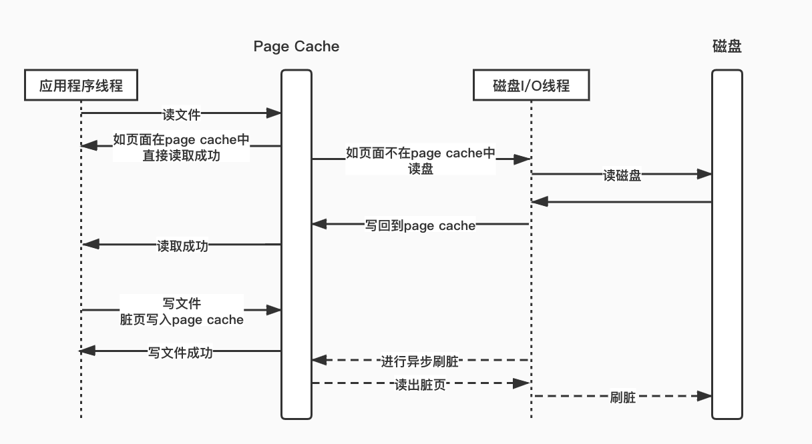
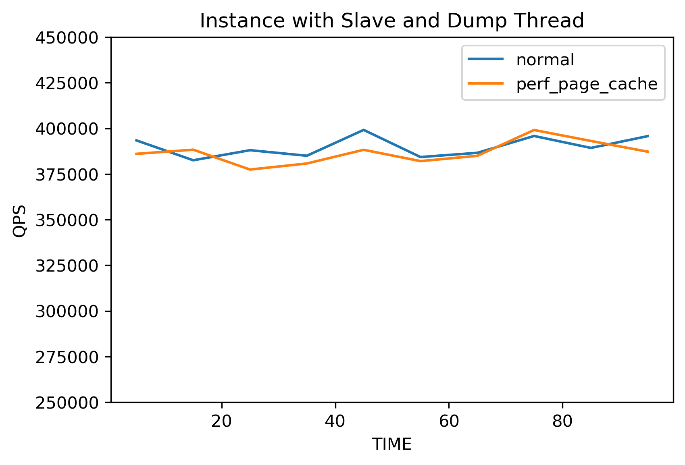

# MySQL · 性能优化 · PageCache优化管理

**Date:** 2020/09
**Source:** http://mysql.taobao.org/monthly/2020/09/01/
**Images:** 9 images downloaded

---

数据库内核月报

 [
 # 数据库内核月报 － 2020 / 09
 ](/monthly/2020/09)

 * 当期文章

 MySQL · 性能优化 · PageCache优化管理
* MySQL · 分布式系统 · 一致性协议under the hood
* X-Engine · 性能优化 · Parallel WAL Recovery for X-Engine
* MySQL · 源码阅读 · InnoDB伙伴内存分配系统实现分析
* PgSQL · 新特性探索 · 浅谈postgresql分区表实现并发创建索引
* MySQL · 引擎特性 · InnoDB隐式锁功能解析
* MySQL · Optimizer · Optimizer Hints
* Database · 新特性 · 映射队列

 ## MySQL · 性能优化 · PageCache优化管理 
 Author: 子堪 

 ## 背景
监控线上实例时，曾出现可用内存不足，性能发生抖动的情况。研究后发现是日志文件的page cache占用了大量的内存（200G+），导致系统可立即分配的内存不足，影响了系统性能。

查看linux内核文档发现，操作系统在内存的使用未超过上限时，不会主动释放page cache，以求达到最高的文件访问效率；当遇到较大的内存需求，操作系统会当场淘汰一些page cache以满足需求。由于page cache的释放较为费时，新的进程不能及时得到内存资源，发生了阻塞。

据此，考虑能否设计一个优化，在page cache占据大量内存前，使用linux内核中提供的`posix_fadvise`等缓存管理方法，由Mysql主动释放掉无用的page cache，来缓解内存压力。本文先介绍文件的page cache机制，并介绍应用程序级的管理方法，最后介绍针对Mysql日志文件的内存优化。

## Page Cache机制

页面缓存（Page Cache）是Linux内核中针对文件I/O的一项优化，Linux从内存中划出了一块区域来缓存文件页，如果要访问外部磁盘上的文件页，首先将这些页面拷贝到内存中，再进行读写。由于硬件结构限制，磁盘的I/O速度比内存慢很多，因此使用Page cache能够大大加速文件的读写速度。

Page Cache的机制如上图所示，具体来说，当应用程序读文件时，系统先检查读取的文件页是否在缓存中；如果在，直接读出即可；如果不在，就将其从磁盘中读入缓存，再读出。此时如果内存有足够的内存空间，该页可以在page cache中驻留，其他进程再访问该部分数据时，就不需要访问磁盘了。

同样，在写文件之前，系统先检查对应的页是否已经在缓存中；如果在，就直接将数据写入page cache，使其成为脏页（drity page）等待刷盘；如果不在，就在缓存中新增一个页面并写入数据（这一页面也是脏页）。真正的磁盘I/O会由操作系统调用fsync等方法来实现，这一调用可以是异步的，保证磁盘I/O不影响文件读写的效率。 在Mysql中，我们说的写文件（write）通常是指将数据写入page cache中，而刷盘或落盘（fsync）才真正将数据写入磁盘中的文件。

程序将数据写入page cache后，可以主动进行刷脏（如调用fsync），也可以放手不管，等待内核帮忙刷脏。在linux内核中，有关自动刷脏的参数如下。

`dirty_background_ratio
// 触发文件系统异步刷脏的脏页占总可用内存的最高百分比，当脏页占总可用内存的比例超过该值，后台回写进程被触发进行异步刷脏。

dirty_ratio
// 触发文件系统同步刷脏的脏页占总可用内存的最高百分比，当脏页占总可用内存的比例超过该值，生成新的写文件操作的进程会先执行刷脏。

dirty_background_bytes & dirty_bytes
// 上述两种刷脏条件还可通过设置最高字节数而非比例触发。如果设置bytes版本，则ratio版本将变为0，反之亦然。

dirty_expire_centisecs
// 这个参数指定了脏页多长时间后会被周期性刷脏。下次周期性刷脏时，脏页存活时间超过该值的页面都将被刷入磁盘。

dirty_writeback_centisecs 
// 这个参数指定了多长时间唤醒一次刷脏进程，检查缓存并刷下所有可以刷脏的页面。该参数设为零内核会暂停周期性刷脏。
`

Page Cache默认由系统调度分配，当free的内存高于内核的低水位线（`watermark[WMARK_MIN]`）时，系统会尽量让用户充分使用缓存，因为它认为这样内存的利用效率最高；当低于低水位线时，就按照LRU的顺序回收page cache。正是这种策略，使得内存的free的部分越来越小，cache的部分越来越大，造成了文章开头提到的问题。

实际上，Mysql中许多文件有着固定的访问模式，它们的页面不会被短时间内多次访问，例如redo log和binlog文件。在实例正常运行的状态下，Redo log只是持久化每次操作的物理日志，写入文件后就没有读操作；binlog文件在写入后，也只会被dump线程所访问。

## Page Cache监控与管理

### vmtouch

vmtouch工具可以用来查看指定文件page cache使用情况，也可以手动将文件换入或换出缓存。下面是其常用功能的使用方法

`# 显示文件的page cache使用情况
$ vmtouch -v [filename]

# 换出文件的page cache
# 即使换出成功，内核也可能在vmtouch命令完成时将页面分页回内存。
$ vmtouch -ve [filename]

# 换入文件的page cache
# 保证文件的page cache都换入内存，但是在vmtouch命令完成时，该页面可能被内核逐出
$ vmtouch -vt [filename]
`

### posix_fadvise

`posix_fadvise`是linux上控制页面缓存的系统函数，应用程序可以使用它来告知操作系统，将以何种模式访问文件数据，从而允许内核执行适当的优化。其中一些建议可以只针对文件的指定范围，文件的其他部分不生效。
这一函数对内核提交的是建议，在特殊情况下也可能不会被内核所采纳。

函数在内核的`mm/fadvise.c`中实现，函数的声明如下：

`SYSCALL_DEFINE(fadvise64_64)(int fd, loff_t offset, loff_t len, int advice)
`
其中`fd`是函数句柄；`offset`是建议开始生效的起始字节到文件头的偏移量；`len`是建议生效的字节长度，值为0时代表直到文件末尾；`advice`是应用程序对文件页面缓存管理的建议，共有六种合法建议。下面根据代码，对六种建议进行分析。

`switch (advice) { 
 /*
 该文件未来的读写模式位置，应用程序没有关于page cache管理的特别建议，这是advice参数的默认值
 将文件的预读窗口大小设为下层设备的默认值
 */
 case POSIX_FADV_NORMAL:
 file->f_ra.ra_pages = bdi->ra_pages;
 spin_lock(&file->f_lock);
 file->f_mode &= ~FMODE_RANDOM;
 spin_unlock(&file->f_lock);
 break;
 
 /* 该文件将要进行随机读写，禁止预读 */
 case POSIX_FADV_RANDOM:
 spin_lock(&file->f_lock);
 file->f_mode |= FMODE_RANDOM;
 spin_unlock(&file->f_lock);
 break;
 
 /*
 该文件将要进行顺序读写操作（从文件头顺序读向文件尾）
 将文件的预读窗口大小设为默认值的两倍
 */
 case POSIX_FADV_SEQUENTIAL:
 file->f_ra.ra_pages = bdi->ra_pages * 2;
 spin_lock(&file->f_lock);
 file->f_mode &= ~FMODE_RANDOM;
 spin_unlock(&file->f_lock);
 break;
 
 /* 该文件只会被访问一次，收到此建议时，什么也不做 */ 
 case POSIX_FADV_NOREUSE:
 break;
 
 /* 该文件将在近期被访问，将其换入缓存中 */
 case POSIX_FADV_WILLNEED:
 ...
 ret = force_page_cache_readahead(mapping, file,
 start_index,
 nrpages);
 ...
 break;
 
 /* 该文件在近期内不会被访问，将其换出缓存 */
 case POSIX_FADV_DONTNEED:
 if (!bdi_write_congested(mapping->backing_dev_info))
 __filemap_fdatawrite_range(mapping, offset, endbyte,
 WB_SYNC_NONE);
 ...
 if (end_index >= start_index)
 invalidate_mapping_pages(mapping, start_index,
 end_index);
 break;
 default:
 ret = -EINVAL;
}

`

针对POSIX_FADV_NORMAL，POSIX_FADV_RANDOM和POSIX_FADV_SEQUENTIAL这三个建议，内核会对文件的预读窗口大小做调整，具体调整策略见代码注释。这些建议的影响范围是整个文件（无视offset和len参数），但不影响该文件的其他句柄。针对POSIX_FADV_WILLNEED和POSIX_FADV_DONTNEED，内核会尝试直接对page cache做调整，这里不是强制的换入或换出，内核会根据情况采纳建议。

当建议为POSIX_FADV_WILLNEED时，内核调非阻塞读`force_page_cache_readahead`方法，将数据页换入缓存。这里根据内存负载的情况，内核可能会减少读取的数据量。

当建议为POSIX_FADV_DONTNEED时，内核先调用`fdatawrite`将脏页刷盘。这里刷脏页用的参数是非同步的WB_SYNC_NONE。刷完脏后，会调用`invalidate_mapping_pages`清除相关页面，该函数在`mm/truncate.c`中实现，代码如下。

`unsigned long invalidate_mapping_pages(struct address_space *mapping,
 pgoff_t start, pgoff_t end)
{
 ...
 while (index <= end && pagevec_lookup(&pvec, mapping, index,
 min(end - index, (pgoff_t)PAGEVEC_SIZE - 1) + 1)) {
 mem_cgroup_uncharge_start();
 for (i = 0; i < pagevec_count(&pvec); i++) {
 ...
 ret = invalidate_inode_page(page);
 ...
 }
 ...
 }
 return count;
}

int invalidate_inode_page(struct page *page)
{
 struct address_space *mapping = page_mapping(page);
 if (!mapping)
 return 0;
 if (PageDirty(page) || PageWriteback(page))
 return 0;
 if (page_mapped(page))
 return 0;
 return invalidate_complete_page(mapping, page);
}
`
可以看到，`invalidate_mapping_pages`调用了下层函数`invalidate_inode_page`，其中的判断逻辑是，如果页脏或页正在写回，则什么也不做；如果没有映射关系或页不再缓存中，则什么也不做。所以这里内核只会尽力而为，清除掉自己能清除的缓存，而不会等待刷脏完成后再清除文件的全部缓存。

因此，在使用POSIX_FADV_DONTNEED参数清除page cahce时，应当先执行fsync将数据落盘，这样才能确保page cache全部释放成功。`posix_fadvise`函数包含于头文件`fcntl.h`中，清除一个文件的page cache的方法如下：

`#include <fcntl.h>
#include <unistd.h>
...
fsync(fd);
int error = posix_fadvise(fd, 0, 0, POSIX_FADV_DONTNEED);
...
`
`posix_fadvise`成功时会返回0，失败时可能返回的error共有三种，分别是

`EBADF // 参数fd（文件句柄）不合法，值为9

EINVAL // 参数advise不是六种合法建议之一，值为22

ESPIPE // 输入的文件描述符指向了管道或FIFO，值为29
`
## Mysql日志优化策略
Mysql中不同文件有着不同的访问行为，日志文件是一种顺序读写占绝大多数的文件，因此我们可以为binlog和redo log设计相应的管理策略，来清除暂时不会使用的page cache。

Page cache是系统资源，不属于某个进程管理，因此无法通过进程内存使用的情况来观察优化效果。我们可以使用vmtouch工具来查看page cache的使用情况。

### Redo log
在Innodb层，Redo log的主要职责是数据持久化，实现先写日志再写数据的WAL机制。Redo log文件大小和个数固定，由innodb_log_file_size和innodb_log_files_in_group参数控制，这些文件连在一起，被Innodb当成一个整体循环使用。

Redo log写page cache和刷盘分别由线程log_writer和log_flusher异步执行，8.0版本中还实现了写log buffer的无锁化，其具体可参见往期月报：[http://mysql.taobao.org/monthly/2019/02/05/](http://mysql.taobao.org/monthly/2019/02/05/)。

在正常运行的实例中，redo log只有写操作。在写入某个文件的某页后，需要较长的一段时间log_flusher才会再次推进到该页，因此无需保留page cache。

Redo Log的刷盘由log_flusher线程异步执行，因此可以将page cache的释放操作放在log_flusher线程上，每次flush刷脏后执行。这样每次需要释放的page cache较少，耗时较短；

### Binlog
在mysql实例正常运行过程中，binlog主要用来做主从复制。Binlog文件的大小由参数max_binlog_size指定，数量没有限制。Binlog的刷盘由参数sync_binlog控制，当sync_binlog为0的时候，刷盘由操作系统负责，异步执行；当不为0的时候，其数值为定期sync磁盘的binlog commit group数，由主线程同步执行刷盘。

没有从库挂载时，binlog只有写操作，保留page cache意义不大。sync_binlog大于0时，刷盘操作以事务为单位，在主线程中拿LOCK_log锁同步执行，如果在每次刷盘后进行fadvise，会阻塞较多的主线程。

因此，将page cache的释放延后到rotate执行，即在关闭旧文件并且成功开启新文件，放掉LOCK_log锁后，释放旧文件的page cache。这样，fadvise操作只会阻塞负责rotate的线程，不会影响到其他线程（因为其他线程都在新的binlog文件中操作）。Rotate执行过程中会调用sync方法刷脏，因此在rotate后释放page cache无需提前刷脏。

有从库挂载时，每次binlog刷盘后，会有dump线程来读取binlog文件的更新，并将更新内容发送到从库。当binlog文件的最后写入位置与dump线程的读取位置比较近（如相距3个文件以内）时，在dump线程读完binlog后再释放page cache效率较高，因为dump可以从page cache中读到更新内容，无需磁盘I/O。这种情况下，将page cache的释放延后到dump线程rotate成功后执行。Dump线程切换binlog时，旧文件已被主线程刷脏，而dump线程只会做读操作，因此不会产生脏页，释放page cache前无需再次刷脏。

### 测试
测试机规格：96core，750GB memory
设置binlog的大小为1GB，redo log的大小为1GB，数量为10个；设置innodb_flush_log_at_trx_commit和sync_binlog为双1。使用sysbench工具进行压测，线程数为128，模式为OLTP_read_write，结果如下图所示。

上面两个图分别是有从库挂载和没有从库挂载时的性能测试结果，蓝色曲线是不加page cache优化时的QPS折线图，橙色曲线是加page cache优化时的QPS折线图。可以发现，释放page cache的优化基本不会导致性能的下降。使用write only模式sysbench压测也无明显性能损失，这里不再展开叙述。

使用vmtouch工具测试page cache释放的速度，如上图所示。在测试机上清理实例写满的1GB的redo log file的page cache约耗时0.28秒。

上面两个图是无从库挂载，无page cache优化时，压测300s后data文件夹的cache使用情况和系统的内存使用情况统计。使用vmtouch命令查看实例的data文件夹，可以看到不使用优化时，cache激增到20G。使用free命令查看系统内存的使用情况，发现大部分的内存被cache占用，比free的部分多6.8倍。

上面两个图是有page cache优化时，压测300s后内存的使用情况。可以看到，使用优化后，实例的data文件夹使用cache的大小显著减小。使用free命令，发现减少的cache全部计入了free中，可以被自由使用。

挂载从库进行同样的测试，可得到相同的结论。

## 总结
系统对page cache的管理，在一些情况下可能有所欠缺，我们可以通过内核提供的`posix_fadvise`予以干预。在几乎不损失性能的前提下，可以通过主动释放Mysql日志文件的page cache的方法，达到减缓内存压力的目的。对于极端内存需求的场景，这一优化能够很好的预防性能抖动的发生。

 阅读： - 

本作品采用[知识共享署名-非商业性使用-相同方式共享 3.0 未本地化版本许可协议](http://creativecommons.org/licenses/by-nc-sa/3.0/)进行许可。

 