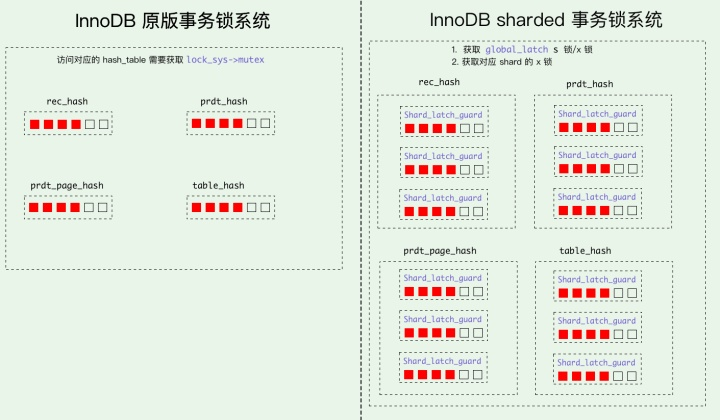

# MySQL · 性能优化 · InnoDB 事务 sharded 锁系统优化

**Date:** 2021/02
**Source:** http://mysql.taobao.org/monthly/2021/02/04/
**Images:** 2 images downloaded

---

数据库内核月报

 [
 # 数据库内核月报 － 2021 / 02
 ](/monthly/2021/02)

 * 当期文章

 PolarDB · 特性分析 · Explain Format Tree 详解
* MySQL · 源码阅读 · InnoDB Export/Import Tablespace解析
* MySQL · 源码解析 · MySQL 8.0.23 Hypergraph Join Optimizer代码详解
* MySQL · 性能优化 · InnoDB 事务 sharded 锁系统优化
* DataBase · 社区动态 · 数据库中的表达式
* MySQL · 源码分析 · Group by优化逻辑代码分析
* MySQL · 源码阅读 · X-plugin的传输协议
* MySQL · 源码阅读 · MySQL8.0 innodb锁相关
* PolarDB · 优化改进 · 使用窗口聚合函数来将子查询解关联

 ## MySQL · 性能优化 · InnoDB 事务 sharded 锁系统优化 
 Author: 破明 

 ## 背景

* latch
数据库中的 latch 和我们通常代码编程中保证并发多线程操作操作临界资源的锁意义一样，通过 latch 的中文翻译“闩”就可以理解，这是为了维护一段临界区域.
* lock
而 lock 则是数据库 MySQL 中在事务使用的”锁”, 锁定的对象是表或者行.

数据库内核月报[ InnoDB 事务锁系统简介](http://mysql.taobao.org/monthly/2016/01/01/)对 InnoDB 的事务锁系统: record lock 和 table lock 做了具体的介绍, 其中对于 record 和 table 会将所有`GRANTED`或者`WAITING`插入对应的 hash table.

在官方 MySQL 实现中, 事务锁系统由`lock_sys_t *lock_sys`统一管理, 当事务尝试申请一个 lock 时，会首先尝试获取`lock_sys->mutex`, 在 lock 创建成功后，会插入对应类型的 hash table, 下面是官方MySQL实现中的 hash table:

`/** The lock system struct */
struct lock_sys_t {
 LockMutex mutex; /*!< Mutex protecting the
 locks */
 hash_table_t *rec_hash; /*!< hash table of the record
 locks */
 hash_table_t *prdt_hash; /*!< hash table of the predicate
 lock */
 hash_table_t *prdt_page_hash; /*!< hash table of the page
 lock */
 /* ... */
}
`

通过上面的简述可以理解当每一个事务需要尝试申请一个 lock 时，都需要获取这个`lock_sys->mutex`全局的 latch, 这对于高并发的事务处理来说是一个瓶颈. MySQL 官方在 8.0.21 版本针对这个问题使用分区 latch 来解决: [worklog #10314](https://dev.mysql.com/worklog/task/?id=10314).

## lock_sys

在 8.0.21 之前的版本申请 record lock 时需要获取全局的`lock_sys->mutex`, 以 record lock 为例:

`dberr_t lock_clust_rec_modify_check_and_lock() {
 /* ... */

 /* 获取全局的 lock_sys->mutex. */
 lock_mutex_enter();

 ut_ad(lock_table_has(thr_get_trx(thr), index->table, LOCK_IX));

 /* 尝试获取 record lock. */
 err = lock_rec_lock(true, SELECT_ORDINARY, LOCK_X | LOCK_REC_NOT_GAP, block,
 heap_no, index, thr);

 MONITOR_INC(MONITOR_NUM_RECLOCK_REQ);

 /* 放锁. */
 lock_mutex_exit();

 /* ... */
}
`

尤其当高并发事务处理，`lock_sys->mutex`的瓶颈会凸显. 为此官方将`lock_sys->mutex`的进行拆分, 引入了 3 个类型的 latch, 一个全局的`global latch`, 512 组`table latches`和 512 组`page latches`:

* `global latch (lock_sys->latches.global_latch)`: 一个全局读写锁, 当`lock_sys`全局操作时, 直接对`global_latch`上 X 锁, 其他操作仅需要 S 锁.
* `table shard latches (lock_sys->latches.table_shards.mutexes)`: 512 个 table latches, 用来分片 table lock.
* `page shard latches (lock_sys->latches.page_shards.mutexes)`: 512 个 page latches, 用来分片 record lock.

` [ global latch ]
 |
 v
 [table shard 1] ... [table shard 512] [page shard 1] ... [page shard 512]

`

* `Shard_latch_guard`: 针对 global latch 使用 s-latch 并对单个 shard mutex 上锁.
* `Shard_latches_guard`: 针对 global latch 使用 s-latch 并对两个 shard mutex 上锁.
* `Global_exclusive_latch_guard`: 针对 global latch 使用 x-latch.

`/* global_latch X 锁. */
class Global_exclusive_latch_guard : private ut::Non_copyable {
 public:
 Global_exclusive_latch_guard();
 ~Global_exclusive_latch_guard();
};

/* global_latch S 锁. */
class Global_shared_latch_guard : private ut::Non_copyable {
 public:
 Global_shared_latch_guard();
 ~Global_shared_latch_guard();
};

/* 单个 shard mutex. */
class Shard_latch_guard {
 Global_shared_latch_guard m_global_shared_latch_guard;
 Shard_naked_latch_guard m_shard_naked_latch_guard;

 public:
 explicit Shard_latch_guard(const dict_table_t &table)
 : m_global_shared_latch_guard{}, m_shard_naked_latch_guard{table} {}

 explicit Shard_latch_guard(const page_id_t &page_id)
 : m_global_shared_latch_guard{}, m_shard_naked_latch_guard{page_id} {}
};

/* 两个 shard mutex, 用于两个 Page 的 record lock 处理, 例如页迁移. */
class Shard_latches_guard {
 public:
 explicit Shard_latches_guard(const buf_block_t &block_a,
 const buf_block_t &block_b)
 : m_global_shared_latch_guard{},
 m_shard_naked_latches_guard{block_a, block_b} {}

 private:
 Global_shared_latch_guard m_global_shared_latch_guard;
 Shard_naked_latches_guard m_shard_naked_latches_guard;
};

/* Shard_naked_latches_guard 并不直接使用, 由 Shard_latch_guard 或 Shard_latches_guard
包装 global_latch 联合使用. */
class Shard_naked_latches_guard {
 explicit Shard_naked_latches_guard(Lock_mutex &shard_mutex_a,
 Lock_mutex &shard_mutex_b);

 public:
 explicit Shard_naked_latches_guard(const buf_block_t &block_a,
 const buf_block_t &block_b);

 ~Shard_naked_latches_guard();

 private:
 /** The "smallest" of the two shards' mutexes in the latching order */
 Lock_mutex &m_shard_mutex_1;
 /** The "largest" of the two shards' mutexes in the latching order */
 Lock_mutex &m_shard_mutex_2;
 /** The ordering on shard mutexes used to avoid deadlocks */
 static constexpr std::less<Lock_mutex *> MUTEX_ORDER{};
};
`

在使用 shard lock 后, 申请 record lock 只需要获取对应 Page 的`lock_rec_hash(page_id) % SHARDS_COUNT`槽位的 mutex 即可:

`dberr_t lock_clust_rec_modify_check_and_lock() {
 /* ... */
 {
 /* 1. global_latch 2. 对应 page_id 的 Shard_latch_guard. */
 locksys::Shard_latch_guard guard{block->get_page_id()};
 ut_ad(lock_table_has(thr_get_trx(thr), index->table, LOCK_IX));

 /* 申请锁. */
 err = lock_rec_lock(true, SELECT_ORDINARY, LOCK_X | LOCK_REC_NOT_GAP, block,
 heap_no, index, thr);

 MONITOR_INC(MONITOR_NUM_RECLOCK_REQ);
 /* RAII 模式, 作用域结束即释放. */
 }

 ut_d(locksys::rec_queue_latch_and_validate(block, rec, index, offsets));
 /* ... */
}
`
上述代码是以 record lock 举例，使用 shard lock 后 record 申请的流程为:

* 针对 global_latch 使用 s-latch
* 获取对应 page_id 在 lock_sys 中 page_shards 的 latch:
 `lock_sys->latches.page_shards.get_mutex(page_id)
`
* 对 latch 上锁: `mutex_enter(&m_shard_mutex)`.

Shard_latch_guard 等实现均为 RAII 模式, 离开作用域后自动析构.

## 死锁检测

官方在 8.0.18 版本对死锁检测进行了优化, 将原先的死锁检测机制[ MySQL 死锁检测源码分析
](https://leviathan.vip/2020/02/02/mysql-deadlock-check/) 交给了 background thread 来处理, 具体的 patch 链接: [mysql-8.0.18 死锁检测优化](https://github.com/mysql/mysql-server/commit/3859219875b62154b921e8c6078c751198071b9c). 具体的思路是将当前事务系统的 lock 信息打一份快照, 由这份快照判断是否存在回环, 假如存在死锁即唤醒等待事务.

使用 shard lock 优化后, 因为存在多个 thread 并发更新当前 trx 的锁操作, 所以死锁检测使用`Global_exclusive_latch_guard`来互斥当前的 lock 操作.

## 总结

MySQL 官方针对 lock_sys 的 mutex 瓶颈使用了 sharded lock 的方法进行优化，这依然延续了系统设计的优化思路, 将一个 bottleneck 的全局锁拆分为 sharded, 这也符合当前多核设计下, 充分利用硬件特性以此提高并行处理能力的趋势.

 阅读： - 

本作品采用[知识共享署名-非商业性使用-相同方式共享 3.0 未本地化版本许可协议](http://creativecommons.org/licenses/by-nc-sa/3.0/)进行许可。

 