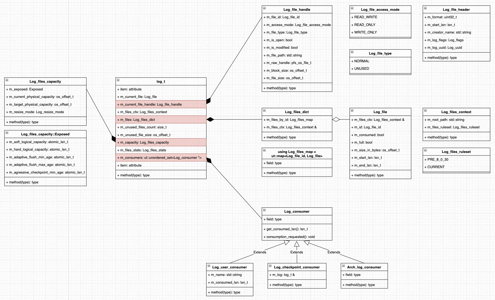

# 源码分析 · InnoDB Redo Log 重构

**Date:** 2022/09
**Source:** http://mysql.taobao.org/monthly/2022/09/03/
**Images:** 3 images downloaded

---

数据库内核月报

 [
 # 数据库内核月报 － 2022 / 09
 ](/monthly/2022/09)

 * 当期文章

 MySQL · 源码分析 · innodb-BLOB演进与实现
* PolarDB MySQL · 多主架构 · 全局 Binlog 介绍
* 源码分析 · InnoDB Redo Log 重构
* PolarDB MySQL · PolarTrans事务系统介绍(一)

 ## 源码分析 · InnoDB Redo Log 重构 
 Author: 翊云 

 ## 背景介绍
Redo Log 是 MySQL InnoDB 引擎中的 WAL，所有的数据修改都需要通过 Redo Log 进行保护，当 MySQL 发生异常重启时，需要通过 Redo Log 来恢复数据，这也是 MySQL 数据库实现 ACID 中 D(durability) 的基本保障。长期以来，MySQL InnoDB 中的 Redo Log 采用了循环覆盖写的结构，以社区默认配置为例，MySQL 在启动时会默认创建两个日志文件：ib_logfile0 和 ib_logfile1，两个日志文件会进行交替的写入，通过 checkpoint 机制来保证写入的安全性。

MySQL 提供了两个参数 `innodb_log_files_in_group` 和 `innodb_log_file_size` 分别控制日志文件的个数和单个日志文件的大小，但是不支持动态的进行修改，这也是 MySQL 一直比较欠缺的能力。一个线上的典型场景是：大量的写入操作造成系统 IO 压力很大，Redo Log 写满触发同步刷脏，导致数据库写入跌 0。

MySQL 在最新的 8.0.30 小版本中对 Redo Log 进行了重构，引入了一个新的参数 `innodb_redo_log_capacity` ，这个参数定义了 Redo Log 的总量，支持动态调整。当设置了 `innodb_redo_log_capacity` 时，`innodb_log_files_in_group` 和 `innodb_log_file_size` 会被自动忽略。本文主要从使用和源码两个角度对这一特性进行介绍。

## 使用方式
使用默认的参数初始化 & 启动 MySQL，发现在数据目录下会有一个新的子目录 #innodb_redo：

`-rw-r----- 1 mysql mysql 56 Oct 2 12:58 auto.cnf
-rw-r----- 1 mysql mysql 157 Oct 2 13:09 binlog.000001
-rw-r----- 1 mysql mysql 157 Oct 2 13:09 binlog.000002
-rw-r----- 1 mysql mysql 32 Oct 2 13:09 binlog.index
-rw------- 1 mysql mysql 1680 Oct 2 12:58 ca-key.pem
-rw-r--r-- 1 mysql mysql 1112 Oct 2 12:58 ca.pem
-rw-r--r-- 1 mysql mysql 1112 Oct 2 12:58 client-cert.pem
-rw------- 1 mysql mysql 1680 Oct 2 12:58 client-key.pem
-rw-r----- 1 mysql mysql 589824 Oct 2 13:09 #ib_16384_0.dblwr
-rw-r----- 1 mysql mysql 8978432 Oct 2 13:04 #ib_16384_1.dblwr
-rw-r----- 1 mysql mysql 6111 Oct 2 12:58 ib_buffer_pool
-rw-r----- 1 mysql mysql 12582912 Oct 2 13:09 ibdata1
-rw-r----- 1 mysql mysql 12582912 Oct 2 13:09 ibtmp1
drwxr-x--- 2 mysql mysql 4096 Oct 2 13:09 #innodb_redo
drwxr-x--- 2 mysql mysql 4096 Oct 2 13:09 #innodb_temp
-rw-r----- 1 mysql mysql 6 Oct 2 13:09 j66f07398.sqa.pid
-rw-r----- 1 mysql mysql 19853 Oct 2 13:09 log.err
drwxr-x--- 2 mysql mysql 4096 Oct 2 12:58 mysql
-rw-r----- 1 mysql mysql 28311552 Oct 2 13:09 mysql.ibd
drwxr-x--- 2 mysql mysql 4096 Oct 2 12:58 performance_schema
-rw------- 1 mysql mysql 1680 Oct 2 12:58 private_key.pem
-rw-r--r-- 1 mysql mysql 452 Oct 2 12:58 public_key.pem
-rw-r--r-- 1 mysql mysql 1112 Oct 2 12:58 server-cert.pem
-rw------- 1 mysql mysql 1680 Oct 2 12:58 server-key.pem
drwxr-x--- 2 mysql mysql 4096 Oct 2 12:58 sys
-rw-r----- 1 mysql mysql 16777216 Oct 2 13:09 undo_001
-rw-r----- 1 mysql mysql 16777216 Oct 2 13:09 undo_002
`

进入到子目录内，发现有多个文件：

`-rw-r----- 1 mysql mysql 6553600 Oct 2 13:19 #ib_redo10_tmp
-rw-r----- 1 mysql mysql 6553600 Oct 2 13:19 #ib_redo11_tmp
-rw-r----- 1 mysql mysql 6553600 Oct 2 13:19 #ib_redo12_tmp
-rw-r----- 1 mysql mysql 6553600 Oct 2 13:19 #ib_redo13_tmp
-rw-r----- 1 mysql mysql 6553600 Oct 2 13:19 #ib_redo14_tmp
-rw-r----- 1 mysql mysql 6553600 Oct 2 13:19 #ib_redo15_tmp
-rw-r----- 1 mysql mysql 6553600 Oct 2 13:19 #ib_redo16_tmp
-rw-r----- 1 mysql mysql 6553600 Oct 2 13:19 #ib_redo17_tmp
-rw-r----- 1 mysql mysql 6553600 Oct 2 13:19 #ib_redo18_tmp
-rw-r----- 1 mysql mysql 6553600 Oct 2 13:19 #ib_redo19_tmp
-rw-r----- 1 mysql mysql 6553600 Oct 2 13:19 #ib_redo20_tmp
-rw-r----- 1 mysql mysql 6553600 Oct 2 13:19 #ib_redo21_tmp
-rw-r----- 1 mysql mysql 6553600 Oct 2 13:19 #ib_redo22_tmp
-rw-r----- 1 mysql mysql 6553600 Oct 2 13:19 #ib_redo23_tmp
-rw-r----- 1 mysql mysql 6553600 Oct 2 13:19 #ib_redo24_tmp
-rw-r----- 1 mysql mysql 6553600 Oct 2 13:19 #ib_redo25_tmp
-rw-r----- 1 mysql mysql 6553600 Oct 2 13:19 #ib_redo26_tmp
-rw-r----- 1 mysql mysql 6553600 Oct 2 13:19 #ib_redo27_tmp
-rw-r----- 1 mysql mysql 6553600 Oct 2 13:19 #ib_redo28_tmp
-rw-r----- 1 mysql mysql 6553600 Oct 2 13:19 #ib_redo29_tmp
-rw-r----- 1 mysql mysql 6553600 Oct 2 13:19 #ib_redo30_tmp
-rw-r----- 1 mysql mysql 6553600 Oct 2 13:19 #ib_redo31_tmp
-rw-r----- 1 mysql mysql 6553600 Oct 2 13:19 #ib_redo32_tmp
-rw-r----- 1 mysql mysql 6553600 Oct 2 13:19 #ib_redo33_tmp
-rw-r----- 1 mysql mysql 6553600 Oct 2 13:19 #ib_redo34_tmp
-rw-r----- 1 mysql mysql 6553600 Oct 2 13:19 #ib_redo35_tmp
-rw-r----- 1 mysql mysql 6553600 Oct 2 13:19 #ib_redo36_tmp
-rw-r----- 1 mysql mysql 3276800 Oct 2 13:18 #ib_redo5
-rw-r----- 1 mysql mysql 6553600 Oct 2 13:19 #ib_redo6_tmp
-rw-r----- 1 mysql mysql 6553600 Oct 2 13:19 #ib_redo7_tmp
-rw-r----- 1 mysql mysql 6553600 Oct 2 13:19 #ib_redo8_tmp
-rw-r----- 1 mysql mysql 6553600 Oct 2 13:19 #ib_redo9_tmp
`

登录到 MySQL，查看相关参数：

`# 之前的参数还是继续保留了
MySQL [(none)]> show variables like "%innodb_log_file%";
+---------------------------+------------+
| Variable_name | Value |
+---------------------------+------------+
| innodb_log_file_size | 8589934592 |
| innodb_log_files_in_group | 2 |
+---------------------------+------------+
2 rows in set (0.00 sec)

MySQL [(none)]> show variables like "%innodb_redo_log%";
+------------------------------+-----------+
| Variable_name | Value |
+------------------------------+-----------+
| innodb_redo_log_archive_dirs | |
| innodb_redo_log_capacity | 104857600 |
| innodb_redo_log_encrypt | OFF |
+------------------------------+-----------+
3 rows in set (0.00 sec)
`

performance_schema 下提供了一张表，查看当前 Redo Log 的使用情况：

`MySQL [(none)]> select * from performance_schema.innodb_redo_log_files;
+---------+--------------------------+-----------+----------+---------------+---------+----------------+
| FILE_ID | FILE_NAME | START_LSN | END_LSN | SIZE_IN_BYTES | IS_FULL | CONSUMER_LEVEL |
+---------+--------------------------+-----------+----------+---------------+---------+----------------+
| 5 | ./#innodb_redo/#ib_redo5 | 16381952 | 19656704 | 3276800 | 0 | 0 |
+---------+--------------------------+-----------+----------+---------------+---------+----------------+
1 row in set (0.00 sec)
`

动态修改 `innodb_redo_log_capacity`：

`MySQL [(none)]> set global innodb_redo_log_capacity = 104857600 * 2;
Query OK, 0 rows affected (0.01 sec)

MySQL [(none)]> show global status like 'Innodb_redo_log_resize_status';
+-------------------------------+-------+
| Variable_name | Value |
+-------------------------------+-------+
| Innodb_redo_log_resize_status | OK |
+-------------------------------+-------+
1 row in set (0.00 sec)

MySQL [(none)]> show variables like "%innodb_redo_log%";
+------------------------------+-----------+
| Variable_name | Value |
+------------------------------+-----------+
| innodb_redo_log_archive_dirs | |
| innodb_redo_log_capacity | 209715200 |
| innodb_redo_log_encrypt | OFF |
+------------------------------+-----------+
3 rows in set (0.01 sec)
`

## 源码分析
在前面的使用过程中可以看到，8.0.30 版本中支持了 Redo Log 的动态修改，但是留下了三个疑问：

1. 在新引入的 #innodb_redo 的目录下，为什么会有多个文件，并且命名也不一样？
2. InnoDB 是如何实现 `innodb_redo_log_capacity` 的动态修改的？
3. 修改 `innodb_redo_log_capacity` 之后是不是立即生效？

下面结合源码对上述问题进行分析。

### 数据结构

在进入源码细节之前，整理 Redo Log 相关的一些数据结构的修改情况：



为了支持 Redo Log 的动态修改，对 log_t 的数据结构进行了调整，新增了以下三个属性，后续会结合具体的源码进行展开：

* m_current_file_handle：当前正在使用的文件
* m_files：使用过的文件列表
* m_consumers：消费者列表

### 源码分析

#### 初始化过程

`// log_sys 初始化
|--> log_sys_init
| |--> log_sys_check_directory // 检查日志目录
| |--> log_sys_create // 初始化内存结构
| | |--> log_consumer_register // consumer 注册
| |
| |--> log_files_create // 初始化 db，创建 redo 文件
| | |--> log_files_initialize_on_empty_redo
| | |--> log_list_existing_files // 检查目录下是否已经存在文件
| | |--> log_files_create_file // 创建 redo 文件
| | | |--> log_files_prepare_unused_file // 准备一个 unused 文件
| | | | |--> log_files_next_file_size // 计算下一个 redo 文件的大小
| | | | |--> log_resize_unused_file // 如果存在 unused 文件，直接修改文件大小
| | | | |--> log_create_unused_file // 如果不存在 unused 文件，创建一个 unused 文件
| | | | |--> log_files_prepare_header // 准备文件头，并写入文件
| | | | |--> log_file_header_write
| | | |--> log_mark_file_as_in_use // 将文件标记为正在使用的文件
| | | |--> log.m_files.add // 将文件添加到 m_files 列表中
| |
| |--> log_files_find_and_analyze // 正常启动，扫描已有的 redo 文件
| | |--> log_collect_existing_files // 扫描并收集目录下所有存在的文件
| | | |--> log_list_existing_files
| | |--> // loop
| | | |--> Log_file::open & log_file_header_read // 打开文件，并读取文件头
| | |--> // end loop
| | |--> // loop
| | | |--> files.add // 将文件添加到 m_files 列表中
| | |--> // end loop

// log_sys 启动
|--> log_start
| |--> log_files_start
| | |--> log_files_update_current_file_low
| | | |--> log_files_newest_needed_lsn & log.m_files.find // 根据最新的 lsn，找到对应的 redo 文件，并将 m_current_file_handle 指向文件
| | |
| | |--> log_files_mark_consumed_files
| | | |--> log_files_oldest_needed_lsn // 根据注册的 consumer，获取最老的 oldest_lsn
| | | | |--> log_consumer_get_oldest
| | | |--> // loop
| | | |--> log_files_mark_consumed_file // 将早于 oldest_lsn 的文件标记为 counsumed
| | | |--> // end loop
| | |
| | |--> log_files_initialize_on_existing_redo
| | |
| | |--> log_files_remove_from_future
| | | |--> log_files_newest_needed_lsn // 获取接下来将要写入的 newest_lsn
| | | |--> // loop
| | | |--> log_files_remove_file // 删除晚于 newest_lsn 的文件
| | | |--> // end loop
| | |
| | |--> log_files_process_consumed_files // 处理已经标记 counsumed 的文件

// log_sys 后台线程启动
|--> log_start_background_threads
| |--> log_files_governor
`

#### 写日志过程

```
// log_writer 线程写入过程
|--> log_writer_write_buffer
| |--> log_writer_wait_on_checkpoint // 等待 checkpoint 推进
| |--> log_writer_wait_on_archiver // 等到归档
| |--> log_writer_wait_on_consumers // 等待 consumer
| | |--> // loop
| | |--> log_consumer_get_oldest & std::this_thread::sleep_for
| | |--> // end loop
| |
| |--> log_write_buffer // 写入文件
| | |--> compute_how_much_to_write
| | |--> start_next_file // 切换到下一个文件
| | | |--> log_files_produce_file
| | | | |--> log_files_create_file // 创建 redo 文件
| | | | | |--> log_files_prepare_unused_file // 准备一个 unused 文件
| | | | | |--> log_mark_file_as_in_use // 将文件标记为正在使用的文件
| | | | | |--> log.m_files.add // 将文件添加到 m_files 列表中
| | | | |--> log_files_mark_current_file_as_full // 将当前文件标记写满
| | | | |--> log_files_update_current_file_low // 将 m_current_file_handle 指向新文件
| | |--> prepare_full_blocks
| | |--> write_blocks

```

#### 后台线程

```
// log_sys 后台线程
|--> log_files_governor
| |--> // loop
| |--> log_files_governor_iteration
| | |--> log_files_governor_iteration_low
| | | |--> log_files_update_capacity_limits // 调整 redo_log_capacity 限制
| | | | |--> log_files_logical_size_and_checkpoint_age
| | | | |--> log.m_capacity.update
| | | | | |--> update_target // 调整目标 redo_log_capacity
| | | | | |--> update_if_target_reached // 缩小时，check 当前已有的文件是否已经达到目标值
| | | | | |--> get_suggested_hard_logical_capacity // 计算建议的限制值
| | | | | |--> update_exposed
| | | | | |--> update_status_variables
| | | | |--> log_update_limits_low
| | | |
| | | |--> log_files_adjust_unused_files_sizes // 调整 unused 文件大小
| | | | |--> log_remove_unused_files
| | | |
| | | |--> log_files_mark_consumed_files // 标记 counsumed 文件
| | | |--> log_files_process_consumed_files // 处理已经标记 counsumed 的文件
| | | | |--> // loop
| | | | |--> log_files_process_consumed_file
| | | | | |--> might_recycle_file // 判断是否能够回收使用
| | | | | |--> log_files_recycle_file // 文件回收使用
| | | | | | |--> log_mark_file_as_unused
| | | | | | |--> log_rename_unused_file
| | | | | | |--> log_resize_unused_file
| | | | | |--> log_files_remove_consumed_file // 无法回收，直接移除
| | | | | | |--> log_files_remove_file
| | | | |--> // end loop
| | | | |--> log_files_update_capacity_limits // 调整 redo_log_capacity 限制
| | | |
| | | |--> log_consumer_get_oldest & consumption_requested
| | | |
| | | |--> log_files_create_next_as_unused_if_needed // 创建新的 unused 文件
| | | | |--> might_create_unused_file
| | | | | |--> number_of_files_allows_to_create
| | | | | |--> physical_capacity_allows_to_create
| | | | |--> log_create_unused_file
| |--> // end loop

```

### 三个疑问
回到前面使用过程中提出的三个疑问。

**1. 在新引入的 #innodb_redo 的目录下，为什么会有多个文件，并且命名还不一样？**


如图所示，8.0.30 版本对原来的循环覆盖写的结构进行了改造，不再以 redo 文件个数和单个 redo 文件的大小来进行限制，而是通过 `innodb_redo_log_capacity` 来指定整个 redo 空间的大小。整个 redo 空间会被切成 32 个文件（固定个数），文件按照 ib_redo$SEQ 的方式进行编号，$SEQ 是一个递增的序列号。在文件管理上，所有的文件会被分成两类：

* normal redo 文件，命名为 ib_redo$SEQ，正常的 redo 文件，和以前一样，任意时刻只会有一个 redo 文件进行写入；
* unused redo 文件，命名为 ib_redo$SEQ_tmp，未被使用的 redo 文件在被使用时，会被重命名为正常文件；

后台的 log_files_governor 线程会负责处理已经写完成的文件，在满足回收条件时，会重新变成 unused redo 文件。

**2. InnoDB 是如何实现 `innodb_redo_log_capacity` 的动态修改的？**

当 `innodb_redo_log_capacity` 发生变化时，已经使用过的和正在使用过的 redo 文件并不会发生改变，仅需要调整 unused redo 文件。结合前面的代码，当用户修改 `innodb_redo_log_capacity` 时，会唤醒后台的 log_files_governor 线程，后台线程首先会重新计算当前的 redo_log_capacity，然后根据变化的类型：

* 如果是空间放大，直接根据放大后的大小，重新生成新的 unused redo 文件；
* 如果是空间缩小，需要计算当前已使用的空间数能否满足目标值，如果满足，那么缩小过程和放大过程一样，直接重新生成新的 ununsed redo 文件即可；如果不能，还需要在更新 redo_log_capacity 之后，通过调整暴露给 log_writer 和 page_cleaner 线程的 lsn 信息，来加速空间回收；

unused redo 文件的引入，类似于引入了缓存区的机制，因为 unused redo 文件不是正在使用的 redo 文件，所以可以直接进行重建，从而满足 `innodb_redo_log_capacity` 的设置。

**3. 修改 `innodb_redo_log_capacity` 之后是不是立即生效？**

对于这个问题，社区文档上的说法是：

`When set at runtime, the configuration change occurs immediately but it may take some time for the new limit to be fully implemented. If the redo log files occupy less space than the specified value, dirty pages are flushed from the buffer pool to tablespace data files less aggressively, eventually increasing the disk space occupied by the redo log files. If the redo log files occupy more space than the specified value, dirty pages pages are flushed more aggressively, eventually decreasing the disk space occupied by redo log files.
`

简单点说就是：参数的修改是立即生效的，但是整个 redo 文件的变更过程需要花费一点时间。结合问题 1 和问题 2 比较容易理解，如果是空间放大，基本上是立即生效的；如果是空间缩小，可能需要依赖于后台刷脏线程的推进，来异步回收已经使用的空间。

### 总结
本文主要是从使用的角度介绍了动态修改 `innodb_redo_log_capacity` 的特性，并结合源码对部分实现进行了分析。整个实现的过程还包含了很多的细节，本文都没有进行展开，包括 checkpoint 的写入，sn 与 lsn 的转换，redo_log_capacity 的详细调整过程等，后续有机会再展开介绍。

## 展望
在前面的源码分析中可以看到，社区引入了 Log_consumer 的概念，类似于生产者-消费者模型，不管是 checkpointer 还是 archiver 都注册了相应的 consumer（但是现在并没有完全切到这个逻辑上）。按照社区的设计，通过 consumer 机制可以实现对 Redo Log 的任意消费。另一方面，ib_redo$SEQ 这种 redo 文件的组织方式，本身也满足了直接归档的需求。对于 Redo Log 的重构，期待社区能有更多的改造。

 阅读： - 

[](http://creativecommons.org/licenses/by-nc-sa/3.0/)
本作品采用[知识共享署名-非商业性使用-相同方式共享 3.0 未本地化版本许可协议](http://creativecommons.org/licenses/by-nc-sa/3.0/)进行许可。

 [

 ](#0)