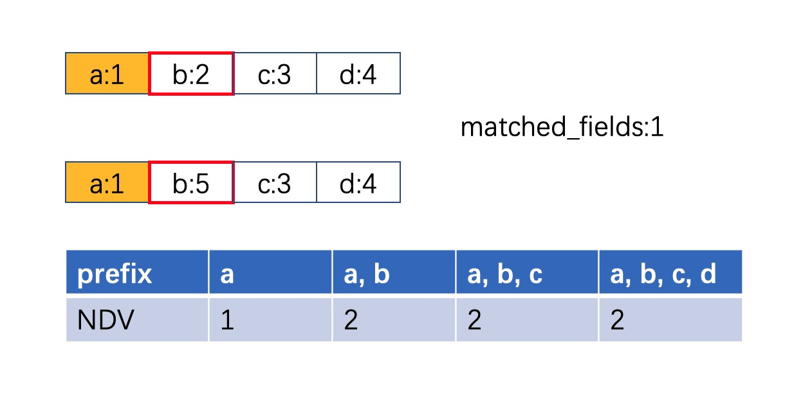

# MySQL 深潜 - 统计信息采集

**Date:** 2022/10
**Source:** http://mysql.taobao.org/monthly/2022/10/05/
**Images:** 6 images downloaded

---

数据库内核月报

 [
 # 数据库内核月报 － 2022 / 10
 ](/monthly/2022/10)

 * 当期文章

 PolarDB · 功能特性 · 非阻塞DDL
* MySQL · UNDO LOG的演进与现状
* 源码分析 · MySQL Event 源码分析
* B+树数据库故障恢复概述
* MySQL 深潜 - 统计信息采集
* PolarDB · 功能特性 · 嵌套子查询优化的性能分析

 ## MySQL 深潜 - 统计信息采集 
 Author: 原宇 

 在值班的时候，经常会有慢SQL的工单需要帮客户分析，选择了错误的执行计划是导致慢SQL的一个常见原因。MySQL数据库是基于cost来做优化，cost要基于统计信息来计算得出，所以执行计划的选择很大程度上受统计信息影响。很多场景下，统计信息不准确，都是统计信息更新不及时或者采样页数太少导致的。

## **简介**
总的来说，统计信息采集是基于已有的索引，通过特定的采样方式来选择一定的采样页，以此来估算整个索引的统计信息。

### **相关参数**
| 参数 | 取值范围 | 含义 |
| — | — | — |
| innodb_stats_persistent | [ON | OFF] | 是否使用persistent采样 |
| innodb_stats_persistent_sample_pages | [0~ULLONG_MAX] | persistent采样的采样页数 |
| innodb_stats_transient_sample_pages | [0~ULLONG_MAX] | transient采样的采样页数 |

其中innodb_stats_persistent_sample_pages和innodb_stats_transient_sample_pages这两个参数可以修改采样的页数，他们的默认值分别是20和8。对于很多线上实例来说，默认的采样页数相较于索引的大小相差甚远，往往会有较大的误差，这也是我们文章开头提到的导致统计信息不准确的其中一个因素。
MySQL数据库中，统计信息的采集有transient和persistent两种方式，innodb_stats_persistent参数可以控制是否使用persistent采样，默认是ON。

1. Transient采样

根据字面意思就可以知道，这种采样方式是不对统计信息做持久化的，采集到的统计信息暂时保存在内存中，这意味着缓存失效的话就需要重新采集统计信息。但同时，这种采样方式采用完全随机的方式来选择采样页，采样速度也相对更快。

1. Persistent采样

这个采样方式会将采集到的统计信息持久化到mysql.innodb_table_stats和mysql,innodb_index_stats这两个系统表中，用户表重新开表时，从这两个系统表中读取对应索引的统计信息恢复到内存中即可。
实际上，采样方式、采样页数还可以通过table_option来控制，这种方式的控制粒度是表级别的，并且优先级更高，本文主要关注采样的过程，所以这里不再具体介绍了。

### **触发方式**
有两种方式可以触发统计信息的采集：一种是手动执行，通过执行SQL：ANALYZE TABLE table_list来采集统计信息；另一种是系统自动执行。
系统自动收集统计信息的策略是，当表中更新的记录数超过一个阈值，（例如Persistent采样默认的阈值是总记录数的10%），就会将当前table加入统计信息采集的任务队列中，由后台线程来完成采集。

## **统计信息采集**
Transient采样过程相对比较简单，所以本文重点介绍Persistent采样的实现。
无论是Transient采样还是Persistent采样，采集到的统计信息都会缓存在内存中。在Innodb层，每个表都有一个对应的内存结构dict_table_t来保存表的部分元信息，同样的，每个索引也有对应的内存结构dict_index_t来保存索引的信息。表级统计信息（例如stat_n_rows、stat_clustered_index_size、stat_sum_of_other_index_sizes）保存在dict_table_t中，索引统计信息（例如stat_n_diff_key_vals、stat_n_sample_sizes）保存在dict_index_t中。
Server层通过handler层提供的采样接口handler::info()，来对Innodb引擎层的数据进行采样。采样的入口函数是dict_stats_update_persistent()，这个函数会对参数指定的dict_table_t进行采样。
首先会通过dict_table_stats_lock(table, RW_X_LATCH)来获取stats_latch的X锁，保护当前table统计信息的采集过程，然后遍历所有的index，依次采集每个index的统计信息，都是通过dict_stats_analyze_index()来完成的。
MySQL支持无锁访问内存中的统计信息，所以重新采集统计信息时会clone出一个新的dict_index_t结构，来暂存所有的中间结果，最后再拷贝回去完成更新，避免其他线程访问到错误的统计信息。
官方有给出一个伪算法来描述采样的流程，如下所示。

`let N = N_SAMPLE_PAGES(index)

dict_stats_analyze_index()
 for each n_prefix
 search for good enough level:
 dict_stats_analyze_index_level() // only called if level has <= N pages
 // full scan of the level in one mtr
 collect statistics about the given level
 if we are not satisfied with the level, search next lower level
 we have found a good enough level here
 dict_stats_analyze_index_for_n_prefix(that level, stats collected above)
 // full scan of the level in one mtr
 dive below some records and analyze the leaf page there:
 dict_stats_analyze_index_below_cur()
`
MySQL索引有最左匹配的原则，优化器也是针对匹配的索引前缀来计算cost，所以对于联合索引，每个索引前缀都会有单独的统计信息。例如，对于索引idx(a, b, c, d)，索引前缀a, b和索引前缀a, b, c都会有各自的cardinality和sample_size。从算法中可以看出，每个n_prefix是单独处理的。
从算法中还可以看出，采样的过程包含两个阶段。第一个阶段是从index上选择一个满足一定条件的中间采样层，将每个采样page的选择范围缩小到一个区间内；第二个阶段是根据确定的采样层，随机遍历到叶子节点，也就是找到一个leaf page，计算这个page上的NDV（number of different values）。
如果一个index数据不够多，可以满足以下两个条件时，可以直接遍历所有的leaf page，来计算出NDV。这两个条件分别是：

1. root_level == 0，也就是index只有一层，只有一个root page。
2. N_SAMPLE_PAGES(index) * n_uniq > idx->stat_n_leaf_pages，用户设定的采样页数乘以索引的字段个数大于索引的叶子结点数。

这里第二个条件之所以要乘以索引的字段数，是因为用户设定的采样页数，针对的是每个索引前缀，每个索引前缀的采样过程中，采样页数不能超出这个限制。所以对于一个index，总的采样页数实际上是N_SAMPLE_PAGES(index) * n_uniq。

### **确定索引的采样层**
下图可以帮助理解一下index tree上page之间的关系。除了leaf page之外，其余page（包括root page）中的每个rec都对应着下一层的一个page，每一层的page之间都是通过指针连接的。

之所以要选择一个采样层，是因为要确保最终选取的所有采样页，每一页都不相同。这里不得不提一下Transient采样，这个采样算法是完全随机，先从root_page随机找一个rec，然后在这个rec对应的page上再随机找一个rec，直到找到leaf page。相比较之下，Persistent采样在选择采样层时，可以为每个采样页划分出单独的范围，保证相互之间不会重复，这样可以减小误差。
确定采样层的依据是某一层所有rec的NDV以及rec的数量达到一定的阈值，因此需要从左到右依次遍历当前层的所有page，对其中所有的相邻rec两两比较。比较两个rec时，只需要依次比较每个field，找到第一个不相同的field即可。如下图所示，第二个field不同，索引前缀a,b（prefix1）就是不同的，那么所有以a,b为前缀的都是不相同的，即prefix3..prefixN这几个索引前缀都是不同的，因此，得到matched_fields就可以停止比较。

这里会用一个数组n_diff_on_level来记录每个索引前缀在当前层的NDV，每当两个rec的数据不完全相同时，就可以根据matched_fields的值更新数组中的值，n_diff_on_level数组中下标越大其对应的索引前缀越长，由此可见，n_diff_on_level数组中下标大的值永远不小于下标小于它的值（n_diff_on_level[prefixN >= n_diff_on_level[prefixN-1]]）。同时，对于这两个不同的rec，会将前一个的offset记录到另一数组n_diff_boundaries中，方便下一个阶段来划分采样范围。
这里的offset指的是rec在当前这一层所有rec中的位置，顺序遍历所有的rec时，根据offset可以找到对应的rec。数组n_diff_boundaries是一个二维数组，每个索引前缀有对应的一个数组来存放offset，这里同样可以利用matched_fields，将offset添加到n_diff_boundaries数组中所有下标大于matched_fields的二维数组中，这样n_diff_on_level数组中每个索引前缀的值都和n_diff_boundaries中对应的offset个数相同。这就是dict_stats_analyze_index_level()函数的实现逻辑，最主要的是得到这两个数组。
为了减少page扫描的数量，这里会自顶向下来扫描每一层，直到确定一个合适的采样层。由于每个索引前缀在每层的数据分布不尽相同，所以每个索引前缀的采样层是单独来确定的。为prefixN确定采样层的条件有三个：

1. 当前层扫描得到的n_diff_on_level[prefixN]的值大于N_DIFF_REQUIRED(index)，这个值是N_SAMPLE_PAGES(index)*10。
2. 在第一个条件不满足的前提下，当前层的rec数量大于N_SAMPLE_PAGES(index)，这个条件是为了避免出现每一层都不符合第一个条件的情况。
3. 在不满足前两个条件的前提下，当前层是叶子层的上一层（也就是level为1，叶子层的level为0）就选择当前层为采样层，这个条件是为了避免扫描叶子层的所有page。

对于每个索引前缀的处理顺序，这里有一个小的优化，先确定最长索引前缀的采样层，然后依次确定次长的索引前缀，最后确定最短的索引前缀。这样做的好处是，当prefixN确定采样层之后，其在这一层的NDV的值一定是大于等于predixN-1的，所以prefixN-1具有合适的NDV的采样层的要么同样是当前层，要么是level小于当前层的，也就是更加靠近叶子层。当处理prefixN-1时，直接利用当前层的采样结果n_diff_on_level数组的值，如果同样满足条件可以减少重复的采样，如果当前层不满足条件，只需要继续向下层遍历即可，对于prefixN-2…prefix0是类似的，这样可以减少对中间层的重复采样。
确定当前索引前缀的采样层，是第一个阶段的工作。下一个阶段会根据n_diff_boundaries数组的值来划分采样范围，选取最终的采样页。

### **采样叶子结点**
确定采样层之后，需要通过dict_stats_analyze_index_for_n_prefix()函数来完成第二阶段的采样。
对于一个索引前缀prefixN，根据设置的采样页数N_SAMPLE_PAGES(index)将n_diff_boundaries[prefixN]中的所有offset划分成N_SAMPLE_PAGES(index)个区间。如下图所示，假设N_SAMPLE_PAGES(index)为4，会划分成4个区间，在每个区间内随机取一个rec，根据这个rec向下层遍历，直到找到一个leaf page，然后对该采样页内所有的rec计算出NDV值。

因为划分了采样区间，对于每个区间内确定的采样页，任意两个页面间，通常其内部的rec是完全不同的，最后将所有采样页的NDV值相加就可以得到所有采样页里数据的NDV值，由于这是部分采样，所以需要根据采样数据占总数据的比例，估算出整个索引的NDV值。当然也是有特殊情况的，例如整个索引的数据几乎都相同，那么采样层划分出的几个区间会是相同的，最后确定的采样页里的值也可能是相同的。
对于这种情况，必然会有一定的误差出现，但是这里也有做一个调整，从采样层向下遍历找采样页时，会遍历每一个page，依次比较两个相邻的rec，直到遇见不同的rec，才会根据这个rec继续向下访问下一层的child page，如果遍历完一个page，发现所有数据都相同，那么这个采样区间的采样就中止，并且认为当前采样区间的NDV为1。以此来减少数据分布不均匀导致的误差。
对每个索引前缀都完成采样之后，当前索引的采样也就完成了，然后会继续对当前table的下一个索引进行统计信息的采集，当所有的索引都采集完成后，会汇总所有索引的统计信息得到表级的统计信息。

## **统计信息获取**
对于Persistent采样，采集到的统计信息是需要持久化的。表级的统计信息和索引统计信息分别保存在mysql.innodb_table_stats和mysql.innodb_index_stats两个系统表中。

统计信息持久化的好处就是，每次开表的时候不需要重新采集统计信息，直接从磁盘读取对应表的统计信息到dict_table_t以及dict_index_t中。

## **总结**
统计信息会影响SQL执行计划的选择，所以线上默认使用的是Persistent采样，通常这个采样方式比Transient采样更准确。对于数据均匀分布的场景，使用默认的采样页数采集到的统计信息相对比较准确，但是对于数据倾斜的场景，就需要手动调整采样页数，增加采样页数通常可以降低误差。

 阅读： - 

本作品采用[知识共享署名-非商业性使用-相同方式共享 3.0 未本地化版本许可协议](http://creativecommons.org/licenses/by-nc-sa/3.0/)进行许可。

 