# MySQL内存分配与管理（1）

**Date:** 2022/11
**Source:** http://mysql.taobao.org/monthly/2022/11/02/
**Images:** 17 images downloaded

---

数据库内核月报

 [
 # 数据库内核月报 － 2022 / 11
 ](/monthly/2022/11)

 * 当期文章

 PolarDB MySQL 大表实践-分区表篇
* MySQL内存分配与管理（1）

 ## MySQL内存分配与管理（1） 
 Author: 桦雄 

 MySQL的内存分配、使用、管理的模块较多，本篇文章主要针对InnoDB的内存管理、SQL层内存分配管理器MEM_ROOT和8028内存限制的新特性进行分析，同时对现阶段存在的部分问题和优化方案进行简单的描述。代码版本主要基于8025，第四部分内存限制新特性基于8028。

## 一、InnoDB基础内存申请

### 1.1 ut_allocator

在非UNIV_PFS_MEMORY模式下，UT_NEW等都是调用原始的new、delete、malloc、free等接口进行内存的申请和释放，在UNIV_PFS_MEMORY编译模式下，采用内部封装的ut_allocator分配器进行管理，加入了内存追踪等信息，可以通过PFS表进行展示。

ut_allocator可以作为std容器的内存分配（如std::map<K, V, CMP, ut_allocator>），让容器内部的内存通过innodb提供的**内存可追踪**的方式进行分配。下面分别就ut_allocator提供的不同内存分配方式作进一步介绍。

`#ifdef UNIV_PFS_MEMORY
#define UT_NEW(expr, key) ::new (ut_allocator<decltype(expr)>(key).allocate(1, NULL, key, false, false)) expr
...
#define ut_malloc(n_bytes, key) static_cast<void *>(ut_allocator<byte>(key).allocate(n_bytes, NULL, UT_NEW_THIS_FILE_PSI_KEY, false, false))
...

#else /* UNIV_PFS_MEMORY */
#define UT_NEW(expr, key) ::new (std::nothrow) expr
...
#define ut_malloc(n_bytes, key) ::malloc(n_bytes)
...
#endif
`
#### 1.1.1 单块内存分配

**allocate**

* 内存申请时**多分配了一块ut_new_pfx_t数据**（开启PFS_MEMORY），其中保存了key、size、owner等信息
 `// 比实际申请多出一块pfx的内存
total_bytes+=sizeof(ut_new_pfx_t)
// 申请内存
...
// 返回实际内存开始的地址
return (reinterpret_cast<pointer>(pfx + 1));
`
* 加入了内存分配**重试机制**​

```
for (size_t retries = 1;; retries++) {
 // 内存分配malloc/calloc
 malloc(); // calloc()...
 if (ptr != nullptr || retries >= alloc_max_retries) break;
 std::this_thread::sleep_for(std::chrono::seconds(1));
}

```

**deallocate**

* 先释放pfx、再释放实际内存数据

`deallocate_trace(pfx);
free(pfx);
`
**reallocate**

* 类似allocate，重新计算size、**换入新**的ut_new_pfx_t（pfx_old–pfx_new）

#### 1.1.2 large内存分配

**allocate_large**

* 申请**大块内存**（used in buf_chunk_init()）、添加pfx信息
* mmap的方式没有消耗实际的物理内存，该部分的内存无法通过jemalloc等方式追踪

`pointer ptr = reinterpret_cast<pointer>(os_mem_alloc_large(&n_bytes));
 |->mmap()/shmget()、shmat()、shmctl()
...
allocate_trace(n_bytes, PSI_NOT_INSTRUMENTED, pfx);
`
**deallocate_large**

* 释放pfx指针，释放large内存
 `deallocate_trace(pfx);
os_mem_free_large(ptr, pfx->m_size);
 |->munmap()/shmdt()
`
 #### 1.1.3 aligned_memory分配

在代码中实际上aligned_memory系列（aligned_pointer、aligned_array_pointer、）是做了单独的封装的，但其底层依旧是ut_alloc和ut_free，此处就不展开了。例如在log_t结构的构建中采用此方法，对齐的内存方式在IO写操作时能够和sector size匹配，提高IO效率。

### 1.2 mem_heap_allocator

类似ut_allocator，mem_heap_allocator也可以作为stl的allocator来使用。但要要注意的是，该类型的分配器只提供mem_heap_alloc函数进行内存的申请，**没有内存的释放、复用和合并**等操作。

`class mem_heap_allocator {
...
 pointer allocate(size_type n, const_pointer hint = nullptr) {
 return (reinterpret_cast<pointer>(mem_heap_alloc(m_heap, n * sizeof(T)))); // 内存申请调用mem_heap_alloc
 }
 void deallocate(pointer p, size_type n) {}; // 内存释放等为空操作
...
}
`
#### 1.2.1 mem_heap_t

**数据结构**

该结构结构是一个非空的**内存块链表**，由一个个的**大小不一的mem_block_t线性连接**。重点关注free_block和buf_block，某种程度上来说，这两个指针定义了实际**数据存放的位置**。根据申请类型的不同，数据存放在两者之一指向的内存。利用mem_heap_t进行内存分配的方式可以将多次的内存分配合并为单次进行，之后的内存请求就可以在InnoDB引擎内部进行，从而**减小了频繁调用函数malloc和free带来的时间与性能的开销**。

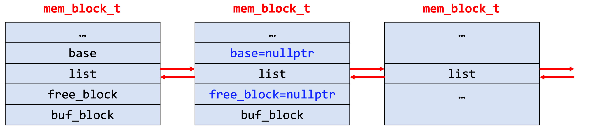

`typedef struct mem_block_info_t mem_block_t;
typedef mem_block_t mem_heap_t;

...
/** The info structure stored at the beginning of a heap block */
struct mem_block_info_t {
...
 UT_LIST_BASE_NODE_T(mem_block_t) base; /* 链表基节点，只在第一个block定义 */
 UT_LIST_NODE_T(mem_block_t) list; /* block链表 */
 ulint len; /*!< 当前block大小 */
 ulint total_size; /*!< 所有block总大小 */
 ulint type; /*!< 分配类型 */
 ulint free; /*!< 当前block的可用位置 */
 ulint start; /*!< block构建时free的起始位置（没看到较多的用途） */
 void *free_block; /* 包含有 MEM_HEAP_BTR_SEARCH 类型的heap中,
 heap root挂着free_block用以申请更多的空间，其他类型该指针为空 */
 void *buf_block; /* 内存从buffer pool申请，保存buf_block_t指针，否则为空 */
};
`
**内存类型**

根据申请的内存来源，mem_heap_t可以分为下面几种类型：

`#define MEM_HEAP_DYNAMIC 0 /* 原始申请，调用innodb内存申请ut_allocator相关 */
#define MEM_HEAP_BUFFER 1 /* 从buffer_pool获取内存 */
#define MEM_HEAP_BTR_SEARCH 2/* 使用free_block中的内存 */ 
`
在此基础上，组合定义了更多的分配方式，让内存的分配更加灵活。

`/** Different type of heaps in terms of which data structure is using them */
#define MEM_HEAP_FOR_BTR_SEARCH (MEM_HEAP_BTR_SEARCH | MEM_HEAP_BUFFER)
#define MEM_HEAP_FOR_PAGE_HASH (MEM_HEAP_DYNAMIC)
#define MEM_HEAP_FOR_RECV_SYS (MEM_HEAP_BUFFER)
#define MEM_HEAP_FOR_LOCK_HEAP (MEM_HEAP_BUFFER)
`
#### 1.2.2 mem_heap_t的构建：mem_heap_create_func

根据传入的size和heap类型，构建一个memory heap结构，size最小为64。实际上在内部的构建逻辑中可以知道单个mem_block最大的size和定义的page_size相同（一般为16K）。

创建mem_heap_t首先需要构建一个root节点，即前文所提到的链表根节点。通过控制block创建函数    mem_heap_create_block传入的第一个参数heap=nullptr，表明该block为mem_heap_t中的第一个节点。在type包含MEM_HEAP_BTR_SEARCH操作位的情况下，可能会出现构建失败的情况，详细的逻辑和失败原因会在后文提出。

创建完第一个block后，将其置为base节点，同时更新链表信息，完成mem_heap_t （根结点）的创建。

`mem_heap_t *mem_heap_create_func(ulint size, ulint type) {
 mem_block_t *block;

 if (!size) {
 size = MEM_BLOCK_START_SIZE;
 }
 // 创建mem_heap的第一个block，传入的第一个参数是nullptr
 block = mem_heap_create_block(nullptr, size, type, file_name, line);
 // 在MEM_HEAP_BTR_SEARCH模式下，存在构建失败的可能性，返回空指针
 if (block == nullptr) {
 return (nullptr);
 }

 // 由于BP resize的可能性，因此第一个block不能从BP中获取
 ut_ad(block->buf_block == nullptr);

 // 初始化链表基节点（base不为空，标志该节点为基节点）
 UT_LIST_INIT(block->base, &mem_block_t::list);
 UT_LIST_ADD_FIRST(block->base, block);
 
 return (block);
}
`
#### 1.2.3 mem_heap_t的释放：mem_heap_free

前文提及，若type包含MEM_HEAP_BTR_SEARCH的操作位，则数据有可能保存在free_block对应的内存单元中。此时需要单独释放创建的free_block，然后由后往前，逐个释放mem_heap_t链表上的各个block。

`void mem_heap_free(mem_heap_t *heap) {
 ...
// 获取链表中最后一个节点
 block = UT_LIST_GET_LAST(heap->base);
 
// 释放free_block节点（MEM_HEAP_BTR_SEARCH模式创建）
 if (heap->free_block) {
 mem_heap_free_block_free(heap);
 }
 
// 由后往前逐个释放block
 while (block != nullptr) {
 /* Store the contents of info before freeing current block
 (it is erased in freeing) */
 prev_block = UT_LIST_GET_PREV(list, block);
 mem_heap_block_free(heap, block);
 block = prev_block;
 }
}
`
#### 1.2.4 block的构建：mem_heap_create_block

**1. block的申请**

这个函数是整个mem_heap_t内存分配的核心，针对不同的type，实现了不同策略的内存分配。具体为：

* case 1 - MEM_HEAP_DYNAMIC或是size较小时：使用ut_malloc_nokey
* case 2 - 包含MEM_HEAP_BTR_SEARCH且当前block不为根block，从free_block指向的内存块分配
* case 3 - 其他情况：使用buf_block，由buf_block_alloc从buffer pool中分配

`// case 1
if (type == MEM_HEAP_DYNAMIC || len < UNIV_PAGE_SIZE / 2) {
 ut_ad(type == MEM_HEAP_DYNAMIC || n <= MEM_MAX_ALLOC_IN_BUF);

 block = static_cast<mem_block_t *>(ut_malloc_nokey(len));
} else {
 len = UNIV_PAGE_SIZE;
 
 // case 2
 if ((type & MEM_HEAP_BTR_SEARCH) && heap) {
 // 从heap root的free_block获取内存
 buf_block = static_cast<buf_block_t *>(heap->free_block);
 heap->free_block = nullptr;

 if (UNIV_UNLIKELY(!buf_block)) {
 return (nullptr);
 }
 } else {
 // case 3
 buf_block = buf_block_alloc(nullptr);
 }

 block = (mem_block_t *)buf_block->frame;
}
`
这段代码做了以下几件事：

* 控制了单个block的上限值UNIV_PAGE_SIZE
* heap->free_block = nullptr确保root节点的free_block不会再次被使用，同时也解释了为什么在type存在MEM_HEAP_BTR_SEARCH位的时候可能引起内存分配的失败，原因有两个：

 当前block类型和mem_heap_t->base的类型不兼容：原始的根结点申请时若不包含MEM_HEAP_BTR_SEARCH位，则构建时free_block是nullptr，在line 12就会获得空指针而直接返回；
* 当前block依托的mem_heap_t->base对应的free_block已被使用：从line 13可以看到，只要是用过一次，free_block就会被标志为空，而真正的数据转移到了buf_block上。

**2. block的初始化**

这一步主要包括block几mem_heap_t节点对象中的各个参数的设置，简单的包括len、type、free的设置，重点分析一下buf_block、和free_block的设置，同样十分精妙。

`UNIV_MEM_FREE(block, len);
UNIV_MEM_ALLOC(block, MEM_BLOCK_HEADER_SIZE);

block->buf_block = buf_block;
block->free_block = nullptr;
`
前面两句是将block对应的数据置为free状态，同时初始化头部的数据，为后面的len等数据的初始化做准备；后两句的设置分几种情况一一说明：

* case 1 - type为MEM_HEAP_DYNAMIC：此时block->buf_block=nullptr，block->free_block=nullptr符合mem_heap_t对该类型的定义，此时block的内存结构如下（头部已经被初始化）。


* case 2 - type为MEM_HEAP_BTR_SEARCH：block的内存从free_block中分配，此时free_block中的内存就转移到了buf_block中，并从buf_block构造了block所需的数据。

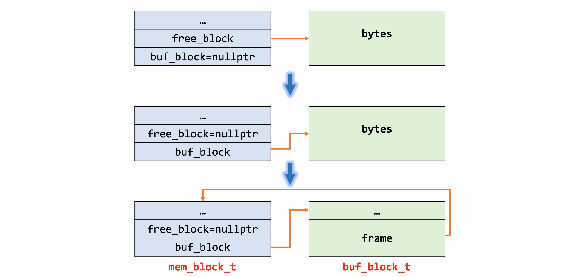

* case 3 - type为MEM_HEAP_BUFFER：内存由buf_block_alloc从buffer pool中分配。

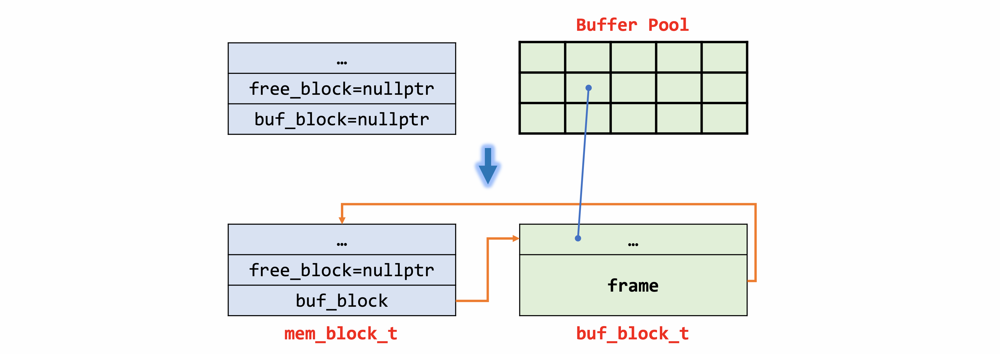

 case 2/3内存结构最终形态是一致的，区别在于case2是从free_block转换得到buf_block，而case3是从BP中直接申请得到。其中free_block一般在构建mem_heap_t时由外部指定。

**可以看到无论是case1、case2、case3或是多种case的组合，buf_block和free_block的修改都能达到正确设置数据的目的。**

#### 1.2.5 block的释放：mem_heap_block_free

* 获取buf_block（alloc方式获取的将会是nullptr）
* 从mem_heap_t链表移除、修改total_size
* ut_alloc方式申请的block，则调用ut_free方式释放**block**；否则初始化block数据（因为在从bP/free_block获取之后，block除头部之外的部分可能是是free的状态）并用buf_block_free方式释放，使之成为BP中直接可用的free page。

#### 1.2.6 从mem_heap_t申请内存：mem_heap_alloc

* 获取最后一个block，从最后一个block分配
* 申请给定大小的内存区域，不够则调用mem_heap_add_block添加新的block，MEM_HEAP_BTR_SEARCH下可能会失败，原因同上
* 更新free值（申请后可用空间变小了），初始化内存区域并返回数据指针buf（block+free偏移）

#### 1.2.7 block添加策略：mem_heap_add_block

* 每次新添加的block size是上一个block的2倍，到达上限则保持不变
* 调用mem_heap_create_block并添加新的block到链表尾部
* 最后返回新的block

### 1.3 小结

* ut_allocator在最新的80版本中已经删去，对应的内存申请和释放代码修改为模版函数。
* ut_allocator在开启PFS_MEMORY下会引入多的内存，但可以控制该部分内存的使用，取决于监控这部分内存与否。
* mem_heap_t有效减少了内存碎片，比较适用于短周期多次分配小内存的场景。但其在使用过程中不会free内存，当单个block出现空闲较大的情况时，会有一定程度的内存浪费。

## 二、InnnDB内存结构

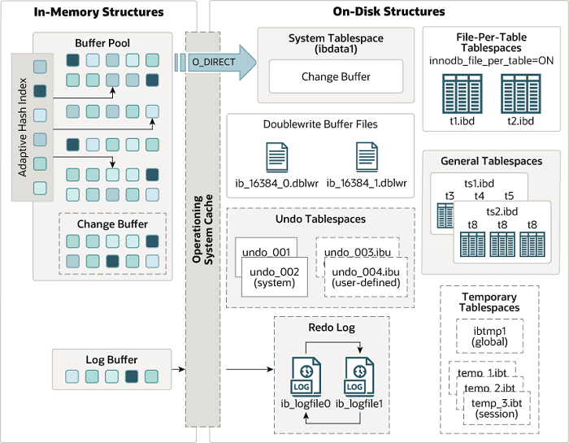

图源：[https://dev.mysql.com/doc/refman/8.0/en/innodb-architecture.html](https://dev.mysql.com/doc/refman/8.0/en/innodb-architecture.html)

### 2.1 Buffer Pool

Buffer Pool（BP）简单来说就是innodb主内存中的一块区域，主要用于缓存数据页和索引页，也包括undo页、自适应哈希索引、锁信息等。读取数据时，若数据存在BP中则可以直接读取，避免IO而提升性能；数据页面修改时，也是先修改BP中的数据页，再使用一定的频率进行刷脏。

一般来说，BP size会配置成机器可用物理内存的 50% 到 75%，数据库再启动时就会提前分配好这部分的虚拟内存，真正的物理内存映射会在实际使用中进行。BP的内存在数据库关闭时统一释放。

#### 2.1.1 数据结构

在BP中主要的数据结构包括buf_pool_t、buf_chunk_t、buf_block_t等，各结构之间的主要关系如下图所示。一个BP可以设置多个buf_pool_t实例，即BP instance，减少缓冲池内部的资源竞争以提高引擎整体的性能；每个BP instance包含了一个以上的chunk，每个chunk在初始化时会划分出数据页控制体buf_block_t和实际的数据页帧frame。数据页由LRU、free、flush等链表进行管理。

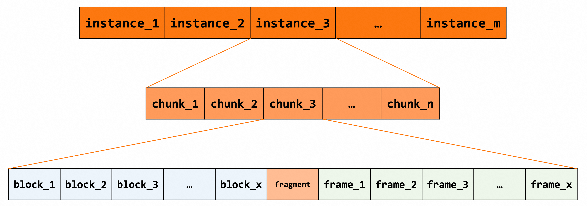

**buf_pool_t**

该结构中包含了诸多的信息，如实例号、size、chunk列表、各个链表（free、LRU、flush）及其互斥锁、哈希表及其互斥锁等，还包括了zip_free这个链表数组，用于伙伴系统的内存分配。通过buf_pool_t可以直接获取各个链表的根结点。

此外，buf_pool_t中还包含了ut_alloctor，用于为chunks分配内存；xxx_old用来记录resize前的旧数据；风险指针用于标记链表位置。

`struct buf_pool_t {
 ...
 ulint instance_no; // 缓冲池实例编号
 ulint curr_pool_size; // 缓冲池实例大小
 buf_chunk_t *chunks; // 缓冲池实例的物理块列表
 hash_table_t *page_hash; // 页哈希表
 hash_table_t *zip_hash; // 伙伴系统分配frame对应的block哈希表
 UT_LIST_BASE_NODE_T(buf_page_t) free; // 空闲链表
 UT_LIST_BASE_NODE_T(buf_page_t) LRU; // LRU 链表
 UT_LIST_BASE_NODE_T(buf_page_t) flush_list; // Flush 链表
 UT_LIST_BASE_NODE_T(buf_buddy_free_t) zip_free[BUF_BUDDY_SIZES_MAX]; //伙伴分配系统空闲链表
 BufListMutex free_list_mutex; // 空闲链表的互斥锁
 BufListMutex LRU_list_mutex; // LRU 链表的互斥锁
 BufListMutex flush_state_mutex; // Flush 链表的互斥锁
 BufListMutex zip_free_mutex; // 伙伴分配互斥锁
 BufListMutex zip_hash_mutex;
 BufListMutex chunks_mutex; // chunk mutex链表
 ...
}
`
**buf_chunk_t**

chunk是物理内存分配的基本单位，instance由一块一块的chunk组成。每个chunk被切分成block串和frame串，block串在前，frame串在后，两者之间可能存在不圆整的内存碎片。

`struct buf_chunk_t {
 ulint size; /*!< frames[]/blocks[]的数量 */
 unsigned char *mem; /*!< frame内存区域指针 */
 ut_new_pfx_t mem_pfx; /*!< 监控信息 */
 buf_block_t *blocks; /*!< 控制块数组 */
 uint32_t chunk_no; /*! chunk号 */
 UT_LIST_BASE_NODE_T(buf_page_t) chunk_page_list; /*!< chunk list根结点 */
 ...
};
`
**buf_block_t**

控制块，主要的数据包括buf_page_t格式的page，该数据必须为第一个字段以便进行指针的强转（例如buf_pool->page_hash可以访问到block/page信息）；还包括实际的数据帧frame，大小为UNIV_PAGE_SIZE；还有frame和block的mutex，需要注意的是，buf_page_t中的部分数据也是由block中的这个mutex进行保护的。

`struct buf_block_t {
 buf_page_t page; //放在第一个位置，以便于block和page进行强制转换
 BPageLock lock; //frame的读写锁
 byte *frame; //实际数据
 ...
 BPageMutex mutex; // block锁：state、io_fix、buf_fix_count、accessed
};
`
**buf_page_t**

page包含了id、size、lsn等信息，io_fix和buf_fix_count用于控制并发状态，判断该page是否处于被访问的状态。此外，page中还包含了很多bool变量，主要用于判断该page是否处于对应链表或哈希表中。

`struct buf_page_t {
 ...
 page_id_t id; // page id
 page_size_t size; // page 大小
 ib_uint32_t buf_fix_count; // 用于并发控制
 buf_io_fix io_fix; // 用于并发控制
 buf_page_state state; // 页状态
 lsn_t newest_modification; // 最新 lsn，即最近修改的 lsn
 lsn_t oldest_modification; // 最老 lsn，即第一条修改 lsn
 ...
}
`
#### 2.1.2 初始化过程

**step-1 buf_pool_init()：**

这个过程主要做三件事，一是bp instance指针数组的初始化（没有分配实际的内存）；二是多线程并发使用buf_pool_create去构建实际的内存空间；三是在bp初始化完成后开启AHI的初始化。

`// 构建bp instance指针数组
buf_pool_ptr =
 (buf_pool_t *)ut_zalloc_nokey(n_instances * sizeof *buf_pool_ptr);

// 多线程并发初始化
for (ulint id = i; id < n; ++id) {
 threads.emplace_back(std::thread(buf_pool_create, &buf_pool_ptr[id], size,
 id, &m, std::ref(errs[id]))); }
// AHI的初始化
btr_search_sys_create(buf_pool_get_curr_size() / sizeof(void *) / 64);
`
在buf_pool_create函数中主要做了几件事：

* 初始化各个锁：包括chunks mutex链表、LRU链表锁、free链表锁、zip_free链表锁、哈希表锁等等
* 计算chunks数量，申请chunk指针数组
* 初始化上述的链表
* 调用buf_chunk_init初始化chunk
* 设置instances相关的参数（size、instance_no等）
* 构建哈希表和相关的锁
* 初始化flush相关数据，如hp指针、链表包含关系等

`static void buf_pool_create(buf_pool_t *buf_pool, ulint buf_pool_size,
 ulint instance_no, std::mutex *mutex,
 dberr_t &err) {
 ...
 mutex_create(LATCH_ID_BUF_POOL_CHUNKS, &buf_pool->chunks_mutex);
 mutex_create(LATCH_ID_BUF_POOL_LRU_LIST, &buf_pool->LRU_list_mutex);
 ...

 ...
 buf_pool->n_chunks = buf_pool_size / srv_buf_pool_chunk_unit;
 chunk_size = srv_buf_pool_chunk_unit;
 buf_pool->chunks = reinterpret_cast<buf_chunk_t *>(
 ut_zalloc_nokey(buf_pool->n_chunks * sizeof(*chunk)));
 ...
 
 ...
 UT_LIST_INIT(buf_pool->LRU, &buf_page_t::LRU);
 UT_LIST_INIT(buf_pool->free, &buf_page_t::list)
 UT_LIST_INIT(buf_pool->flush_list, &buf_page_t::list);
 ...

 ...
 do {
 if (!buf_chunk_init(buf_pool, chunk, chunk_size, mutex)) {
 ...
 } while (++chunk < buf_pool->chunks + buf_pool->n_chunks);
 ...

 ...
 buf_pool->instance_no = instance_no;
 buf_pool->curr_pool_size = buf_pool->curr_size * UNIV_PAGE_SIZE;
 ...

 ...
 srv_n_page_hash_locks =
 static_cast<ulong>(ut_2_power_up(srv_n_page_hash_locks));
 buf_pool->page_hash =
 ib_create(2 * buf_pool->curr_size, LATCH_ID_HASH_TABLE_RW_LOCK,
 srv_n_page_hash_locks, MEM_HEAP_FOR_PAGE_HASH);
 buf_pool->zip_hash = hash_create(2 * buf_pool->curr_size);
 ...
 
 ...
 for (i = BUF_FLUSH_LRU; i < BUF_FLUSH_N_TYPES; i++) {
 buf_pool->no_flush[i] = os_event_create();
 }
 ...
 new (&buf_pool->flush_hp) FlushHp(buf_pool, &buf_pool->flush_list_mutex);
 ...
}
`
**step-2 buf_chunk_init**

该函数主要做了以下几件事：

* alloc chunk需要的内存（通过large的方式）
* 分割chunk，将其分为blocks和frames
* 调用buf_block_init初始化block（初始化block/page中的变量，如state、chunk_no还有是否处于链表的各个标志位等，构建mutex和rwlock）并将其加入free链表
* 注册chunk

`static buf_chunk_t *buf_chunk_init(...) 
{
// 1
...
 if (!buf_pool->allocate_chunk(mem_size, chunk)) {
 return (nullptr);
 }
...
// 2
...
 chunk->blocks = (buf_block_t *)chunk->mem;
 frame = (byte *)ut_align(chunk->mem, UNIV_PAGE_SIZE);
 chunk->size = chunk->mem_pfx.m_size / UNIV_PAGE_SIZE - (frame != chunk->mem);
 {
 ulint size = chunk->size;
 while (frame < (byte *)(chunk->blocks + size)) {
 frame += UNIV_PAGE_SIZE;
 size--;
 }
 chunk->size = size;
 }
...
// 3 
...
 for () {
 buf_block_init(buf_pool, block, frame, chunk, sync_init_nolock);
 UT_LIST_ADD_LAST(buf_pool->free, &block->page);
 }
// 4
...
 buf_pool_register_chunk(chunk);
...
}
`
**step-3 page_hash初始化**

` buf_pool->page_hash =
 ib_create(2 * buf_pool->curr_size, LATCH_ID_HASH_TABLE_RW_LOCK,
 srv_n_page_hash_locks, MEM_HEAP_FOR_PAGE_HASH);

 buf_pool->page_hash_old = nullptr;

 buf_pool->zip_hash = hash_create(2 * buf_pool->curr_size);
`
这里可以看到page_hash和zip_hash的构建方式有所差异，page_hash在完成create后还对heap结构和对应的锁进行了初始化（ib_create函数相比hash_create还做了heaps和锁初始化的工作）。

#### 2.1.3 页面管理链表

每个链表都是双向链表，节点都是buf_block_t，基节点中保存了首尾节点信息和链表长度等。buffer pool中的页面使用情况和双向链表结构如下所示。

#### 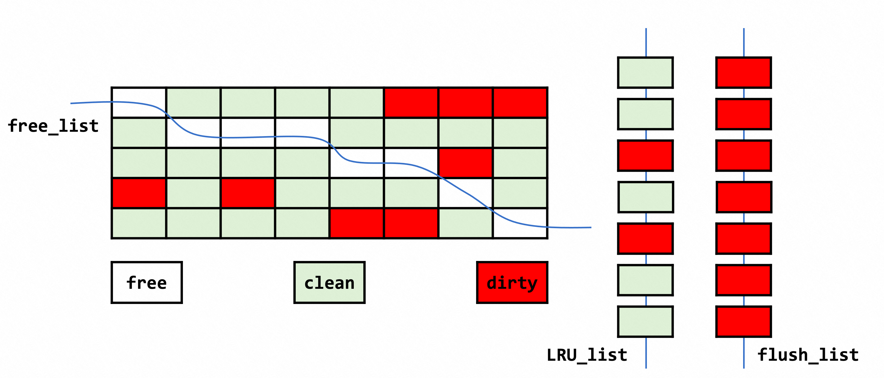

#### 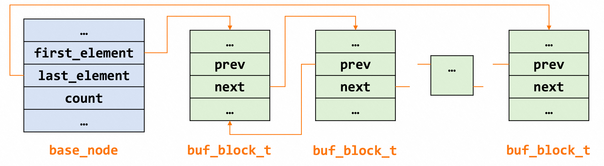

**free list**

block初始化后会直接加入到free链表。缓冲池中如果需要使用数据页，直接从空闲链表中获取。当空闲节点不足时，将采用一定的策略从 LRU List 和 Flush List 中淘汰一定量的节点以补充库存。

**LRU list**

LRU List 是缓冲池中最重要的数据结构，基本所有读入的数据页都缓冲于其上。LRU 链表顾名思义根据最近最少使用算法 Least Recently Used 对节点进行淘汰。InnoDB对 LRU 算法进行了以下优化，解决“预读失效”与“缓冲池污染”的问题。

* LRU优化

LRU分为了Old Sublist和New Sublist两段，加载数据首先会加载到Old位置，只有当满足一定的条件时，数据才会从Old段转移到New段。当发生类似全表扫描的操作时，LRU的淘汰就不会影响到真正的热点数据，从而保证缓存的热度。

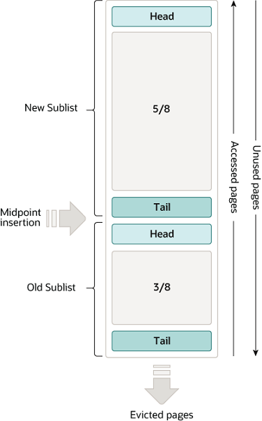

图源：[https://dev.mysql.com/doc/refman/8.0/en/innodb-buffer-pool.html](https://dev.mysql.com/doc/refman/8.0/en/innodb-buffer-pool.html)

* 响应时间优化

先设定一个间隔时间innodb_old_blocks_time，然后将old区域数据页的第一次访问时间在其对应的控制块中记录下来。

* 如果后续的访问时间与第一次访问的时间小于innodb_old_blocks_time，则不将该缓存页从 Old区域移动到 New 区域。
* 如果后续的访问时间与第一次访问的时间大于innodb_old_blocks_time，才会将该缓存页移动到 New 区域的头部。

**Flush List**

缓冲池中所有脏页都会挂载在 Flush List 中，以等待数据落盘。在数据更改被刷入磁盘前，数据很有可能会被修改多次，在数据页控制体中记录了最新修改的 lsn（newset_modification） 和最老修改的 lsn（newest_modification）。进入 Flush list 的节点按照进入的顺序进行排序，最新加入的数据页放在链表头部，刷数据时从链表尾开始写入。

**zip_free**

是由 5 个链表构成的二维数组，分别是 1K、2K、4K、8K 和 16K 的碎片链表，专门用于存储从磁盘读入的压缩页，引擎使用 Buddy 伙伴系统专门管理该结构。

### 2.2 Change buffer

change buffer是一颗通用B+树，当页面不在buffer pool中时将其对应的修改缓存在change buffer中可有效地减少磁盘的随机访问。索引页大小16k，内存使用buffer pool，可以通过参数来设置最大的大小占比（innodb_change_buffer_max_size），默认25%，最多50%。

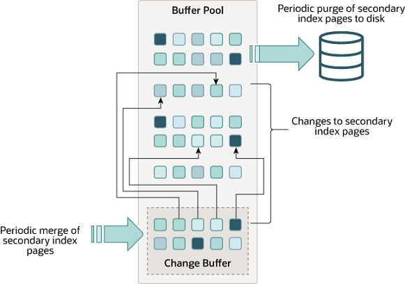

图源：[https://dev.mysql.com/doc/refman/8.0/en/innodb-change-buffer.html](https://dev.mysql.com/doc/refman/8.0/en/innodb-change-buffer.html)

其结构为ibuf_t，内包含的都是基本的size、max_size、free_list_len、merge操作次数等信息，全局只有一个ibuf_t结构体，在数据库启动的时候构建。

change buffer创建和初始化过程在ibuf_init_at_db_start完成，主要包括：

* 相关互斥量的构建
* ibuf参数的初始化，包括max_size、index等相关的数据
* root的获取

`void ibuf_init_at_db_start(void) {
 ...
 // 1.互斥量操作
 mutex_create(LATCH_ID_IBUF, &ibuf_mutex);
 ...
 
 // 2.构建root
 {
 buf_block_t *block;
 // IBUF_SPACE_ID = 0 FSP_IBUF_TREE_ROOT_PAGE_NO = 4
 block = buf_page_get(page_id_t(IBUF_SPACE_ID, FSP_IBUF_TREE_ROOT_PAGE_NO),
 univ_page_size, RW_X_LATCH, &mtr);
 buf_block_dbg_add_level(block, SYNC_IBUF_TREE_NODE);
 // 对应的frame作为change buffer B+树的root
 root = buf_block_get_frame(block);
 }
 ...
 // 3. 参数设置
 // CHANGE_BUFFER_DEFAULT_SIZE默认是25
 ibuf->max_size = ((buf_pool_get_curr_size() / UNIV_PAGE_SIZE) *
 CHANGE_BUFFER_DEFAULT_SIZE) /
 100;
 ibuf->index =
 dict_mem_index_create("innodb_change_buffer", "CLUST_IND", IBUF_SPACE_ID,
 DICT_CLUSTERED | DICT_IBUF, 1);
 ibuf->index->id = DICT_IBUF_ID_MIN + IBUF_SPACE_ID;
 ibuf->index->table = dict_mem_table_create("innodb_change_buffer",
 IBUF_SPACE_ID, 1, 0, 0, 0, 0);
 ...
}
`
ibuf_insert操作底层调用了ibuf_insert_low，主要做了以下几件事：

* 根据数据构建，在数据记录的基础上增加page.no等信息
* 选择合适的block插入（数据插入在rec中，而block则包含有rec的数据）
* 视情况进行merge

`static MY_ATTRIBUTE((warn_unused_result)) dberr_t
 ibuf_insert_low(ulint mode, ibuf_op_t op, ibool no_counter,
 const dtuple_t *entry, ulint entry_size,
 dict_index_t *index, const page_id_t &page_id,
 const page_size_t &page_size, que_thr_t *thr) {
 ...
 // 1. 构建entry
 ibuf_entry =
 ibuf_entry_build(op, index, entry, page_id.space(), page_id.page_no(),
 no_counter ? ULINT_UNDEFINED : 0xFFFF, heap);
 ...
 // 初始化游标
 btr_pcur_open(ibuf->index, ibuf_entry, PAGE_CUR_LE, mode, &pcur, &mtr);
 ...
 
 // 2. 插入操作
 err = btr_cur_optimistic_insert(...);// 也可能是btr_cur_pessimistic_insert
 block = btr_cur_get_block(cursor);
 ...
 // pcur收尾工作，包括rec、block的清空等
 btr_pcur_close(&pcur);
 
 // 3. 视情况进行merge
}
`
change buffer本身没有很多额外的内存申请，依赖buffer pool中的block进行操作。大部分都是申请了一些临时的heap，使用完毕后立即释放，不会在内存中长时间驻留。

### 2.3 AHI

innodb的索引组织结构为btree，当查询的时候会根据条件一直索引到叶子节点，为了减少寻路的开销，AHI使用索引键的前缀建立了一个哈希索引表，在实现上就是多个hash_tables(分片)。哈希索引是为那些频繁被访问的索引页而建立的，可以理解为btree上的索引。初始创建的数组大小为**buf_pool_get_curr_size**() / **sizeof**(**void** *) / 64，使用malloc分配。数组大小最终对应了hash_table的cell/bucket总数，这个数量实际上还要进行一个质数化的处理。

#### 2.3.1 数据结构

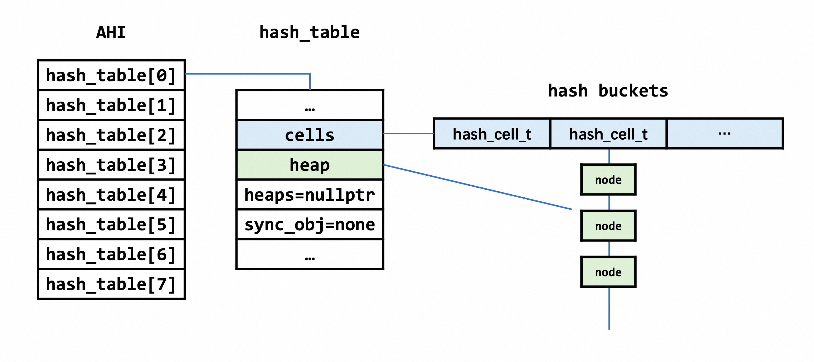

`struct hash_cell_t {
 void *node; /*!< 哈希链 */
};

/* The hash table structure */
struct hash_table_t {
 enum hash_table_sync_t type; /*!< MUTEX/RW_LOCK/NONE. */
 ibool adaptive; 
 ulint n_cells; /* 哈希桶数量 */
 hash_cell_t *cells; /*!< bucket数组 */
 ulint n_sync_obj; /* 互斥量、锁的数量 */
 union {
 ib_mutex_t *mutexes; 
 rw_lock_t *rw_locks; 
 } sync_obj;

 mem_heap_t **heaps; // 多个part时，用于分配哈希链的内存数组，个数和n_sync_obj相关，如在page_hash中用到
 mem_heap_t *heap; // 分配哈希链的内存堆
};
`
#### 2.3.2 内存初始化

在AHI构建的时候，分成了8个part，每个part负责不同的bucket，拥有各自部分的锁。构建和初始化主要分为以下几个步骤：

* 锁的初始化，锁的数量和part数量挂钩
* hash_table的初始化，底层调用ib_create，注意这里传入的type是MEM_HEAP_FOR_BTR_SEARCH，这直接决定了hash_table中heap的类型，即其后内存的来源。其中table->type在这里是HASH_TABLE_SYNC_NONE。

`void btr_search_sys_create(ulint hash_size) {
 /* Step-1: Allocate latches (1 per part). */
 btr_search_latches = reinterpret_cast<rw_lock_t **>(
 ut_malloc(sizeof(rw_lock_t *) * btr_ahi_parts, mem_key_ahi));

 for (ulint i = 0; i < btr_ahi_parts; ++i) {
 btr_search_latches[i] = reinterpret_cast<rw_lock_t *>(
 ut_malloc(sizeof(rw_lock_t), mem_key_ahi));
 rw_lock_create(btr_search_latch_key, btr_search_latches[i],
 SYNC_SEARCH_SYS);
 }

 /* Step-2: Allocate hash tablees. */
 btr_search_sys = reinterpret_cast<btr_search_sys_t *>(
 ut_malloc(sizeof(btr_search_sys_t), mem_key_ahi));

 btr_search_sys->hash_tables = reinterpret_cast<hash_table_t **>(
 ut_malloc(sizeof(hash_table_t *) * btr_ahi_parts, mem_key_ahi));

 for (ulint i = 0; i < btr_ahi_parts; ++i) {
 btr_search_sys->hash_tables[i] =
 ib_create((hash_size / btr_ahi_parts), LATCH_ID_HASH_TABLE_MUTEX, 0,
 MEM_HEAP_FOR_BTR_SEARCH);
 ...
}
`
进一步地，ib_create中主要做2件事：

* 调用hash_create创建hash_table

hash_table函数主要做的事将大部分hash table结构中的参数初始化为0/nullptr，最最重要的是构建hash_table->cells，即哈希桶。哈希桶通过malloc & memset方式进行构建，这也是AHI耗时最久的步骤。

* 初始化table->heap

这里初始化type选择MEM_HEAP_FOR_BTR_SEARCH类型，heap的构建为后续的哈希桶指向的哈希链的内存分配做准备。

### 2.5 log buffer

log buffer是日志未写到磁盘的缓存，大小由参数innodb_log_buffer_size指定，一般来说这块内存都比较小，默认是16M，有max和min的限制。

log buffer的内存申请/释放底层调用的是ut_allocate/ut_free，参数srv_log_buffer_size就是所需的大小。

`// 内存申请
static void log_allocate_buffer(log_t &log) {
 ...
 log.buf.create(srv_log_buffer_size);
}
//内存释放
static void log_deallocate_buffer(log_t &log) { log.buf.destroy(); }
`
### 2.6 table cache

MySQL中对内存中打开表的数量和表结构数量做了限制。open_table的过程涉及到sever层和引擎层，这里针对innodb中涉及的动作。

InnoDB层的开表动作从函数ha_innobase::open开始，主要包括了dict_table_t的构建和row_prebuilt_t这个结构的建立。ib_table的获取顺序是session_cache、dict_sys->hash_table、dd_open_table

`int ha_innobase::open(const char *name, int, uint open_flags,
 const dd::Table *table_def) {
 ...
 ib_table = thd_to_innodb_session(thd)->lookup_table_handler(norm_name);
 
 ...
 ib_table = dict_table_check_if_in_cache_low(norm_name);
 
 ... 
 ib_table = dd_open_table(client, table, norm_name, table_def, thd);
 
 ...
 m_prebuilt = row_create_prebuilt(ib_table, table->s->reclength);

 ...
}
`
下面分别就ib_table的来源内存进行说明

* session_table_cache

每个THD内部保存了thread_local的数据，通过该数据可以获取session下的m_open_tables映射表。该表的插入删除查找都是基于std::map进行。

`class innodb_session_t {
 table_cache_t m_open_tables;
 ...
};
`
* dict_sys->table_hash

dicy_sys中table_hash的构造实际上是在数据字典初始化的时候完成的，主要包括：lock的构建、table_LRU链表的构建、table_hash的构建，也是通过hash_create这个结构进行构建，这部分内存是在dict_init中完成分配的。

`void dict_init(void) {
 ...
 dict_sys->table_hash = hash_create(
 buf_pool_get_curr_size() / (DICT_POOL_PER_TABLE_HASH * UNIV_WORD_SIZE));
 dict_sys->table_id_hash = hash_create(
 buf_pool_get_curr_size() / (DICT_POOL_PER_TABLE_HASH * UNIV_WORD_SIZE));
 ...
}
`
* dd_open_table

在试图获取缓存表失败后，最终会通过dd_open_table接口构造dict_table_t，底层的调用是dict_mem_table_create，通过heap的方式对dict_table_t的所有结构进行构造，构造完成后，会把最新的table保存在dict的hash_table中。

`dd_open_table
 |->dd_open_table_one
 | |->dd_fill_dict_table //create dict_table_t
 | |->dict_mem_table_create // create
 | {
 | // dict_table_t和内部的col、locks等内存都从这个heap上面分配，DICT_HEAP_SIZE=100
 | heap = mem_heap_create(DICT_HEAP_SIZE);
 | ...
 | table = static_cast<dict_table_t *>(mem_heap_zalloc(heap, sizeof(*table)));
 | ...
 | table->heap = heap
 | table->cols = static_cast<dict_col_t *>(
 | mem_heap_alloc(heap, table->n_cols * sizeof(dict_col_t)));
 | table->v_cols = static_cast<dict_v_col_t *>(
 | mem_heap_alloc(heap, n_v_cols * sizeof(*table->v_cols)));
 | table->autoinc_lock =
 | static_cast<ib_lock_t *>(mem_heap_alloc(heap, lock_get_size()));
 | ...
 | }
 |->dict_table_add_to_cache(m_table, TRUE, heap);
`

 server层中的总的table cache和打开表数量、字段长度都有关系，每个table cache占据的内存从几十k ～ 几百k不等，可以参考[这篇文章](https://askdba.alibaba-inc.com/libary/control/getArticle.do?articleId=68521)。

### 2.7 lock_sys_t

锁系统也是在innodb start/create的时候构建的，主要的数据内容包括行锁哈希表、Predicate Locks哈希表、predicate page locks哈希表等，主要的构建和销毁操作如下。

`void lock_sys_create(ulint n_cells)
{
 ...
 lock_sys->rec_hash = hash_create(n_cells);
 lock_sys->prdt_hash = hash_create(n_cells);
 lock_sys->prdt_page_hash = hash_create(n_cells);
 ...
}

void lock_sys_close(void) {
 ...
 hash_table_free(lock_sys->rec_hash);
 hash_table_free(lock_sys->prdt_hash);
 hash_table_free(lock_sys->prdt_page_hash);
 ...
}
`
主要的内存消耗都是在三个hash_table的构造上，并且是“裸”构造，没有涉及heap/heaps的初始化，所有的内存都是通过malloc的方式去构造。各个hash_table的需要的内存和srv_lock_table_size相关，其值在innodb启动时被指定（srv_lock_table_size = 5 * (srv_buf_pool_size / UNIV_PAGE_SIZE)）。

### 2.8 os_event_t

大多数锁、互斥量的构建和初始化最终都会相应到os_event_t的构造，但是零散的、临时的mutex等并不会造成很大的内存压力。在前文提到的在buf_block_t的初始化中就有mutex和rw_lock的初始化，其生命周期和bp相当，数量和buf_block_t相等，会占据很大一部分内存。

* buf_block_init：

`/** Initializes a buffer control block when the buf_pool is created. */
static void buf_block_init(
 buf_pool_t *buf_pool, /*!< in: buffer pool instance */
 buf_block_t *block, /*!< in: pointer to control block */
 byte *frame, /*!< in: pointer to buffer frame */
 buf_chunk_t *chunk, /*!< in: pointer to chunk */
 bool sync_init_nolock)
{
 ...
 mutex_create(LATCH_ID_BUF_BLOCK_MUTEX, &block->mutex); // or mutex_create_nolock
 ...
 rw_lock_create(PFS_NOT_INSTRUMENTED, &block->lock, SYNC_LEVEL_VARYING); // or rw_lock_create_nolock
 ...
}
`
* mutex_create

```
mutex_create()
 |->mutex_init()
 |->TTASEventMutex::init()
 |->os_event_create()

```

* rw_lock_create

```
rw_lock_create()
 |->pfs_rw_lock_create_func()
 |->rw_lock_create_func()
 |->os_event_create()

```

os_event_create的底层实现是调用了malloc的方式，最终由系统分配这部分的内存。

`os_event_t os_event_create() {
 os_event_t ret = (UT_NEW_NOKEY(os_event()));
 return ret;
}
`
### 2.9 内存占用

 **对象**
 **来源**
 **详细**
 **大小**
 **分配方式**

 Buffer Pool
 buf_pool_create
 chunk
 BP + BP/16k * 440 (round)
 ut_allocator.allocate_large

 buf_pool_create
 page_hash
 2 * BP/16k * 8 (prime)
 ut_allocator.allocate

 buf_pool_create
 zip_hash
 2 * BP/16k * 8 (prime)
 ut_allocator.allocate

 AHI
 buf_pool_init
 hash_tables
 BP / 8 / 64 * 8 (prime)
 ut_allocator.allocate mem_heap_allocator (from BP)

 log buffer
 log_allocate_buffer
 buf
 srv_log_buffer_size
 ut_allocator.allocate

 DD cache
 dict_init
 table_hash
 BP / 4096 * 8 (prime)
 ut_allocator.allocate

 table_id_hash
 BP / 4096 * 8 (prime)
 ut_allocator.allocate

 lock system
 lock_sys_create
 rec_hash
 5 *  BP / 16k * 8 (prime)
 ut_allocator.allocate

 rec_hash
 5 *  BP / 16k * 8 (prime)
 ut_allocator.allocate

 rec_hash
 5 *  BP / 16k * 8 (prime)
 ut_allocator.allocate

 osevent
 buf_block_init
 mutex
 112 * BP / 16k (round)
 ut_allocator.allocate

 rw_lock
 2 * 112 * BP / 16k (round)
 ut_allocator.allocate

 round代表分配的大小需要做圆整对齐处理、prime代表需要做质数化处理。

### 2.10 小结

* bp指定的size最终体现了chunk的内存中，实际内存和指定的size可能存在差异。
* AHI结构中采用malloc的方式申请了cells，但实际的数据都保存在heap中，该部分内存从bp中获取。在AHI中存在多个hash_table，目前是采用loop方式构建，可以考虑并行初始化；减少哈希冲突进而减少mem_heap的内存使用。
* 很多内存结构都和hash_table相关，hash_table实际的内存占用需要做质数化处理。
* 绝大多数的os_event_t在buf_block_t的初始化中产生，该部分的内存占用也是比较大的。
* 在实际的内存分配中，除了指定的bp大小之外，系统还会产生额外的内存，本节只是列举了一部分。Oracle的分配内存的方式对用户更加友好，指定固定的内存，具体的分配在内部完成，可以很好控制内存总量。

## 三、SQL层内存分配管理器MEM_ROOT

sql层的内存分配管理除了基础的alloc/free的形式外，**主要应用了MEM_ROOT这一结构，降低了内存操作的时间和资源的损耗**。本文中主要针对MEM_ROOT的相关内容进行介绍。

MEM_ROOT作为一种通用的内存管理对象，大量使用于sql层，如在THD、TABLE_SHARE等结构中都包含了其作为内存分配器。事实上，MEM_ROOT只是负责管理内存，实际分配的内存来源是其结构成员Block，**MEM_ROOT中只包含一块Block且只对当前唯一的Block负责**，Block则是含有指向前一Block节点的指针，串成一条链表。

 和1.2.1小结提到的mem_heap_t不同，MEM_ROOT主要负责sql层相关的内存分配，mem_heap_t在innodb中单独实现，负责innodb相关的内存分配，但两者的结构和实现模式上是类似的。

### 3.1 MEM_ROOT数据结构

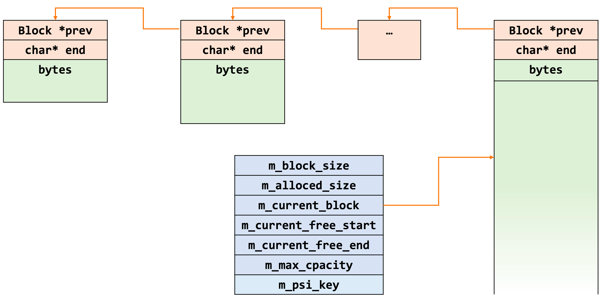

* **Block是其核心结构**，所有的内存分配都源自于此。Block中包含了指向前1Block的指针prev，同时保留了end作为地址范围的标志，表明Block所管理的内存范围。
* m_block_size记录了MEM_ROOT下一次要分配和管理的Block内存块的总大小，当申请新的Block块时，该值都会更新为原值的**1.5倍**。
* m_allocated_size记录了MEM_ROOT从OS分配出的内存总量，每次分配新的Block时该值也会进行更新。
* m_current_block、m_current_free_start、m_current_free_end分别记录了**当前管理block**的起始地址、空闲地址和结束地址。
* m_max_capacity定义了MEM_ROOT的管理的最大内存，m_error_for_capacity_exceeded是内存超出最大限制的控制开关，m_error_handler是内存超出的错误处理函数指针；m_psi_key是PFS内存监测点。

### 3.2 MEM_ROOT关键接口

#### 3.2.1 构造函数 && 赋值操作

MEM_ROOT的原始构造方式内容很简单，只对m_block_size、m_orig_block和m_psi_key进行赋值，同时MEM_ROOT采用了移动构造和移动赋值的方式，对持有的MEM_ROOT进行接管，主要逻辑如下：

`// 移动构造函数
MEM_ROOT(MEM_ROOT &&other)
 noexcept
 : m_xxx(other.m_cxxx),
 ...{
 other.m_xxx = nullptr/0/origin_value;
 ...
 }
// 移动赋值
MEM_ROOT &operator=(MEM_ROOT &&other) noexcept {
 Clear();
 ::new (this) MEM_ROOT(std::move(other));
 return *this;
 }
`
#### 3.2.2 Alloc

该函数是根据传入的所需内存空间大小从当前所管理的、已有的Block块上返回一块新的起始地址，同时对内存使用信息进行更新。当MEM_ROOT所管理的Block大小不满足要求时，则会调用[AllocSlow](#T28Th)函数进行新Block的分配和管理。同时需要注意的是，返回的地址总是8-aligned。

#### 3.2.3 AllocSlow

该函数用于申请新的Block，根据使用场景的差异，底层调用了两种分配模式，返回的内存地址同样是对齐的。

* 当所需的内存很大时或是有独占一块内存的需求时，在申请完新的内存块后，并不会将新生请的Block置为当前所管理的Block（除非是MEM_ROOT首次申请），而是将其置为链表中的**倒数第2块**（即current_block的前一节点）。设计者不希望大内存申请和独占内存的形式对后续的内存分配造成干扰，**大内存的申请会导致后续分配Block时x1.5的基数变大，难以控制内存申请量的增长；同时，若后续的内存分配和有独占内存需求的内存块相接，会导致内存的控制复杂**。通过**保持原有的current_block**的方式，能够很好地避免上述问题的发生。
* 在非上述的情况下，优先使用**追加内存块到current_block尾部并更新**current_block的方式进行分配。

`void *MEM_ROOT::AllocSlow(size_t length) {
 // 本次申请的内存很大或是要求是独占一块内存的形式
 if (length >= m_block_size || MEM_ROOT_SINGLE_CHUNKS) {
 Block *new_block =
 AllocBlock(/*wanted_length=*/length, /*minimum_length=*/length);
 if (new_block == nullptr) return nullptr;
 if (m_current_block == nullptr) {
 new_block->prev = nullptr;
 m_current_block = new_block;
 m_current_free_end = new_block->end;
 m_current_free_start = m_current_free_end;
 } else {
 // Insert the new block in the second-to-last position.
 new_block->prev = m_current_block->prev;
 m_current_block->prev = new_block;
 }
 return pointer_cast<char *>(new_block) + ALIGN_SIZE(sizeof(*new_block));
 } else { // 常规情况
 if (ForceNewBlock(/*minimum_length=*/length)) {
 return nullptr;
 }
 char *new_mem = m_current_free_start;
 m_current_free_start += length;
 return new_mem;
 }
}
`
#### 3.2.4 AllocBlock

该函数是Block分配的基础函数，底层是调用my_malloc函数进行内存的申请，根据PSI的信息和PFS开关等会对数据进行统计。my_malloc和my_free函数在后续会做简单的介绍，此处不再赘述。

在设置了内存超出限制的错误标志下，大内存的申请可能会导致失败。同时AllocBlock支持传入wanted_length和minium_length参数，在某些情况下能够分配出minium_length的内存大小。在每次分配完毕后，**m_block_size都会调整为当前的1.5倍**，避免后续频繁的调用alloc。

#### 3.2.5 ForceNewBlock

该函数对应上文[AllocSlow](#T28Th)的第二种内存分配方式，直接调用AllockBlock进行内存块的申请，然后将其挂在Block链表的尾部，并设置其为MEM_ROOT所管理的当前Block。

#### 3.2.6 Clear

Clear函数执行的逻辑较为简单，主要做了两件事：

* 将MEM_ROOT的所有状态置为初始状态
* 遍历Block链表节点并释放

#### 3.2.7 ClearForReuse

当此前使用的内存不再需要试图释放，但又不想再MEM_ROOT再次被使用时重新走一遍Alloc…的流程时，ClearForReuse起了很大的作用。和Clear函数free所有Block不同，ClearForReuse会保持当前的Block，，而释放其他节点。换言之，**经过ClearForReuse操作后，Block链表中只留下了最后的节点**。但是在独占内存的场景下，代码逻辑依旧会走到Clear()。

#### 3.2.8 其他

MEM_ROOT的内存分配方式都是字节对齐的，处理方式是在上层的Alloc等接口中对所需要的内存length进行圆整操作。但同时MEM_ROOT提供了“非标”操作的接口，提供了Peek、RawCommit等函数，支持直接对底层的Block进行操作，需要注意的是，这类操作的发生频率不高，并且下一次使用Alloc等操作时，会重新将内存做圆整处理。

### 3.3 MEM_ROOT在THD中的应用

MEM_ROOT在sql层的使用十分频繁，常用在THD、THD::transactions、Prepared_statement:、TABLE_SHARE、sp_head、sp_head、table_mapping等结构中，下面以最常见的使用场景THD为例，简要介绍MEM_ROOT在sql层中的应用。

THD中包括了三个MEM_ROOT（包括对象和指针），main_mem_root，user_var_events_alloc和mem_root。

#### 3.3.1 main_mem_root

MEM_ROOT对象，随THD结构析构，主要用于执行sql过程中涉及的解析、运行时数据的存储。

 This memory root is used for two purposes: - for conventional queries, to allocate structures stored in main_lex during parsing, and allocate runtime data (execution plan, etc.) during execution. - for prepared queries, only to allocate runtime data. The parsed tree itself is reused between executions and thus is stored elsewhere.

 `THD::THD(bool enable_plugins)
 : Query_arena(&main_mem_root, STMT_REGULAR_EXECUTION),
 ...
 lex_returning(new im::Lex_returning(false, &main_mem_root)),
 ... {
 main_lex->reset();
 set_psi(nullptr);
 mdl_context.init(this);
 init_sql_alloc(key_memory_thd_main_mem_root, &main_mem_root,
 global_system_variables.query_alloc_block_size,
 global_system_variables.query_prealloc_size);
 ...
 }
`
 #### 3.3.2 mem_root

当前mem_root的指针，在THD初始化时指向main_mem_root，但**在实际应用时会发生变化，通过临时改变mem_root指向的方式使用其他对象的MEM_ROOT来申请内存，使用完毕后再将mem_root指向初始内存地址(main_mem_root)。**

 **问：为什么要把mem_root设计成可变动的对象？为什么要把mem_root的内存指针嵌入到THD？**

 答：方便控制内存大小，若thd->mem_root始终指向main_mem_root，相应的内存会一直存在直到THD析构，改变mem_root指向可以更好地控制内存生存周期，让临时的内存占用得以释放，和长期存在的内存分离。嵌入到THD（实际上是其父类Query_arena）中，可以让THD占用的内存统计信息更清晰、管理过程更简洁，即尽管该部分内存不是直接由THD产生，而是在执行语句的过程中产生的，同样需要把“责任”归属在THD上。简化函数传参，减少一个MEM_ROOT的参数，传入THD即可。
```CPP
THD::THD(bool enable_plugins)
 : Query_arena(&main_mem_root, STMT_REGULAR_EXECUTION),
 …

MEM_ROOT* old_mem_root = thd->mem_root; // 保存原来的mem_root(main_mem_root)
thd->mem_root = xxx_mem_root; // mem_root大多是临时性的MEM_ROOT
// do something using memory
…
thd->mem_root = old_mem_root; // 恢复成原来的mem_root(main_mem_root)

`mem_root临时置换的操作发生在以下的几个位置，但由于MEM_ROOT本身的设计（移动构造等），会让内存资源的统计继续使用之前的PSI_MEMORY_KEY而不至于造成统计数据的复杂和混乱。
```CPP
// sql/dd_table_share.cc
open_table_def() 

// sql/sp_head.cc
sp_parser_data::start_parsing_sp_body() &&
sp_parser_data::finish_parsing_sp_body()

// sql/sp_instr.cc PSI_NOT_INSTRUMENTED
LEX *sp_lex_instr::parse_expr() 

// sql/sql_cursor.cc
Query_result_materialize::start_execution()

// sql/sql_table.cc
rm_table_do_discovery_and_lock_fk_tables()
drop_base_table()
lock_check_constraint_names()

// sql/thd_raii.h 该类及其调用之处(sql/auth/sql_auth_cache.cc:grant_load())
class Swap_mem_root_guard; 

// sql/auth/sql_authorization.cc
mysql_table_grant() // 存储表级、行级权限
mysql_routine_grant() // 存储routine级权限

/* sql/dd/upgrade_57/global.h storage/ndb/pligin/ndb_dd_upgrade_table.cc 
 该类及其调用之处 */
class Thd_mem_root_guard
`
#### 3.3.3 user_var_events_alloc

memroot指针，用于分配THD中的Binlog_user_var_event数组元素，通常和thd->mem_root指向相同。

### 3.4 小结

MEM_ROOT是MySQL-sql层中使用最多的内存分配器，类似mem_heap_t，其同样存在Block碎片问题，但其在设计时提供了ClearForReuse这样的接口，可以及时释放前面所占用的内存；此外，MEM_ROOT在设计中考虑了独占内存和大内存的场景，降低了一次后续申请的内存大小。同时在THD结构中，MEM_ROOT指针的灵活使用给内存的运用提供了新的思路，值得借鉴。

## 四、8028新特性 - Global and session memory allocation limits

### 4.1 功能改动

 [8028引入](https://gitlab.alibaba-inc.com/mysql-server/mysql-server/commit/dfdd36ceb897dd865c31c522442155b6457bfe4c?force_show_diff=true)，该WL主要对session和global级别的内存申请做了限制，降低出现OOM的风险。

#### 4.1.1 添加variables

| **variable_name** | **含义** |
| — | — |
| global_connection_memory_limit | 全局connection的内存限制 [1, 18446744073709551615] |
| connection_memory_limit | 单个connection的内存限制 [1, 18446744073709551615] |
| connection_memory_chunk_size | 内存统计的最小变更单位，用于控制更新频率  [1, 1024*1024*512]，默认8912 |
| global_connection_memory_tracking | 开关，用于控制全局内存计数器的启用和追踪 |

`MySQL [(none)]> show variables where variable_name in ('global_connection_memory_limit', 'connection_memory_limit', 'connection_memory_chunk_size', 'global_connection_memory_tracking');
+-----------------------------------+----------------------+
| Variable_name | Value |
+-----------------------------------+----------------------+
| connection_memory_chunk_size | 8912 |
| connection_memory_limit | 18446744073709551615 |
| global_connection_memory_limit | 18446744073709551615 |
| global_connection_memory_tracking | OFF |
+-----------------------------------+----------------------+

MySQL [(none)]> show status like "Global_connection_memory";
+--------------------------+-------+
| Variable_name | Value |
+--------------------------+-------+
| Global_connection_memory | 0 |
 +--------------------------+-------+
`
#### 4.1.2 修改PFS_thread、PSI_thread_service_v5、THD
```
class PFS_thread {
...
+ THD *m_cnt_thd // 用于更新内存计数器的THD
...
};

// ------------------------------------------------------------- //

struct PSI_thread_service_v5 {
...
+ set_mem_cnt_THD_v1_t set_mem_cnt_THD;
};
typedef void (*set_mem_cnt_THD_v1_t)(THD *thd, THD **backup_thd);

// ------------------------------------------------------------- //

class THD {
...
+ Thd_mem_cnt *mem_cnt; // 内存计数器对象
+ bool enable_mem_cnt(); // 启用内存计数器
+ void disable_mem_cnt(); // 关闭内存计数器
...
};

```

* m_cnt_thd是负责更新内存计数信息的THD，在组提交等操作中会存在THD转换的问题，该成员可以确保转换时内存统计信息的正确性。
* 接口set_mem_cnt_THD是协助完成THD转换的函数，分别对m_thd和m_cnt_thd进行设置，大部分情况下两者是相同的。
* THD结构中新增的mem_cnt在初始化时为Thd_mem_cnt_noop（空操作计数器），在connnection的prepare阶段通过调用enable_mem_cnt创建为Thd_mem_cnt_conn（真正具备计数功能）；在THD析构阶段调用disable_mem_cnt释放该计数器。

`// Thd_mem_cnt_conn创建
thd_prepare_connection()
| thd->enable_mem_cnt() {
| | Thd_mem_cnt *tmp_mem_cnt = new Thd_mem_cnt_conn(this);
| | mem_cnt = tmp_mem_cnt;
| }
// Thd_mem_cnt_conn释放
～THD()
| THD::release_resources()
| | disable_mem_cnt() {
| | | mem_cnt->flush(); // 清空当前THD的内存计数信息并扣除对应的gloabl数据
| | | delete mem_cnt;
| | }
`
#### 4.1.3 添加class Thd_mem_cnt_conn

**数据结构**

在介绍类之前，首先需要知道引入的计数模式，通过位运算可以实现多种模式的组合。

`enum enum_mem_cnt_mode {
 MEM_CNT_DEFAULT = 0U, // 不计数
 MEM_CNT_UPDATE_GLOBAL_COUNTER = (1U << 0), //更新global信息
 MEM_CNT_GENERATE_ERROR = (1U << 1), // 产生OOM错误信息
 MEM_CNT_GENERATE_LOG_ERROR = (1U << 2) // 产生OOM错误信息写入日志
};
`
  Thd_mem_cnt_conn的关键数据结构如下:


mem_count、max_conn_mem、glob_mem_counter分别对应已申请的内存、最大内存（该值并不是一个指定值，会随mem_count变化）和传递给global计数的值。

 **问：为什么还需要一个glob_mem_counter呢，直接将当前的mem_count累加到全局内存计数器不可以吗?**

 答：每次对全局计数器进行操作会影响并发度。还记得参数connection_memory_chunk_size吗，这个参数的意义是每次汇总到总内存计数的size是chunk_size的整数倍，也就是说glob_mem_counter = connection_memory_chunk_size * n。提前汇总足够多数量的内存计数到global中可以避免每次增加零散内存数量带来的全局数据的频繁改动，只有mem_count > glob_mem_counter时才对global数据进行写入，同时将glob_mem_counter加上m * connection_memory_chunk_size。因此说，**connection_memory_chunk_size能够控制全局计数器更新的频率。同时，这个操作也会引发提前OOM的发生，因此connection_memory_chunk_size不宜设置的太大。**

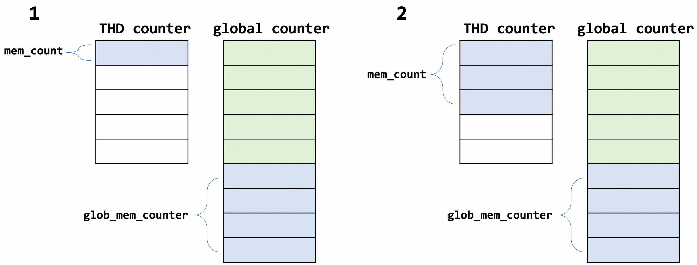

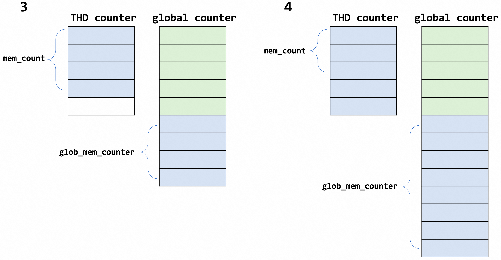

mode参数枚举类型enum_mem_cnt_mode中的组合，例如SUPER用户在连接建立时的mode是MEM_CNT_UPDATE_GLOBAL_COUNTER，而普通的用户的mode则是MEM_CNT_UPDATE_GLOBAL_COUNTER ｜ MEM_CNT_GENERATE_ERROR ｜ MEM_CNT_GENERATE_LOG_ERROR。在进行内存计数时会使用这个判断位，决定是否产生错误并kill connection。换言之，**SUPER用户在执行查询等操作时是不会受到limit参数的限制的，而普通用户则会收到varibales的影响**。

`static void prepare_new_connection_state(THD *thd) {
 ...
 thd->mem_cnt->set_orig_mode(is_admin_conn ? MEM_CNT_UPDATE_GLOBAL_COUNTER
 : (MEM_CNT_UPDATE_GLOBAL_COUNTER |
 MEM_CNT_GENERATE_ERROR |
 MEM_CNT_GENERATE_LOG_ERROR));
 ...
}
`

**关键接口**

* **alloc_cnt**

该函数的功能是对thd和global级别的内存计数信息进行更新。主要做了以下几件事：

* 修改mem_counter、max_conn_mem、glob_mem_counter，这里可以看出max值是随mem_counter更新的，glob_mem_counter也是lazy添加到全局内存计数器中的，只有满足（max_conn_mem > glob_mem_counter）才会重新插值delta到全局计数器。由于访问全局计数器需要加锁，因此这样的操作可以避免每次的访问都加锁。
* 产生错误信息，包括connection级别的和global级别的错误信息。generate_error会报错传入的错误信息给thd赋予 THD::KILL_CONNECTION，随后连接会因此而killed

`bool Thd_mem_cnt_conn::alloc_cnt(size_t size) {
 mem_counter += size;
 max_conn_mem = std::max(max_conn_mem, mem_counter);

 // connection级别的报错
 if (mem_counter > m_thd->variables.conn_mem_limit) {
 (void)generate_error(ER_DA_CONN_LIMIT, m_thd->variables.conn_mem_limit,
 mem_counter);
 }
 // 三个条件分别指代：开启全局更新、开启内存追踪、存量大于提前量
 if ((curr_mode & MEM_CNT_UPDATE_GLOBAL_COUNTER) &&
 m_thd->variables.conn_global_mem_tracking &&
 max_conn_mem > glob_mem_counter) {
 // 控制全局计数器更新频率
 const ulonglong curr_mem =
 (max_conn_mem / m_thd->variables.conn_mem_chunk_size + 1) *
 m_thd->variables.conn_mem_chunk_size;
 ulonglong delta = curr_mem - glob_mem_counter;
 ulonglong global_conn_mem_counter_save;
 ulonglong global_conn_mem_limit_save;
 {
 MUTEX_LOCK(lock, &LOCK_global_conn_mem_limit);
 global_conn_mem_counter += delta;
 global_conn_mem_counter_save = global_conn_mem_counter;
 global_conn_mem_limit_save = global_conn_mem_limit;
 }
 glob_mem_counter = curr_mem;
 max_conn_mem = std::max(max_conn_mem, glob_mem_counter);
 
 // global级别的报错
 if (global_conn_mem_counter_save > global_conn_mem_limit_save) {
 (void)generate_error(ER_DA_GLOBAL_CONN_LIMIT, global_conn_mem_limit_save,
 global_conn_mem_counter_save);
 }
 }
 return true;
}
`
* **free_cnt**

该函数的功能单一，**只对connection级别的mem_counter做减法**，全局数据的修改在reset函数中完成，目的同样是为了减少全局资源的竞用。

`void Thd_mem_cnt_conn::free_cnt(size_t size) {
 mem_counter -= size;
}
`
* **reset**

free_cnt操作只是减去了thd级别的内存计数，**全局的计数数据更新在reset函数中完成**，该函数保证了当前的thd和global处于最新的状态。主要做了以下几件事：

* 重置mode，此前的一些操作可能会将计数器的mode进行修改（例如在prepare connection阶段），这里要确保更新前counter处于正确的模式，避免出现不同权限操作出错（如此前的super和普通用户等）。
* 更新三个计数数据，当glob_mem_counter > mem_counter时，表明此前有free_cnt操作减少了mem_counter，此处对glob_mem_counter和全局数据进行更新；反之表明存在未加入全局内存的thd级别内存，也需要将差值补全。在reset过程中也可能出现内存不足的情况，同样需要调用错误产生函数对错误信息进行报告，设置kill标志。

`int Thd_mem_cnt_conn::reset() {
 // 重置mode
 restore_mode();
 max_conn_mem = mem_counter;

 // 更新计数数据信息
 if (m_thd->variables.conn_global_mem_tracking &&
 (curr_mode & MEM_CNT_UPDATE_GLOBAL_COUNTER)) {
 ulonglong delta;
 ulonglong global_conn_mem_counter_save;
 ulonglong global_conn_mem_limit_save;
 if (glob_mem_counter > mem_counter) {
 delta = glob_mem_counter - mem_counter;
 MUTEX_LOCK(lock, &LOCK_global_conn_mem_limit);
 assert(global_conn_mem_counter >= delta);
 global_conn_mem_counter -= delta;
 global_conn_mem_counter_save = global_conn_mem_counter;
 global_conn_mem_limit_save = global_conn_mem_limit;
 } else {
 delta = mem_counter - glob_mem_counter;
 MUTEX_LOCK(lock, &LOCK_global_conn_mem_limit);
 global_conn_mem_counter += delta;
 global_conn_mem_counter_save = global_conn_mem_counter;
 global_conn_mem_limit_save = global_conn_mem_limit;
 }
 glob_mem_counter = mem_counter;
 if (is_connection_stage &&
 (global_conn_mem_counter_save > global_conn_mem_limit_save))
 return generate_error(ER_DA_GLOBAL_CONN_LIMIT, global_conn_mem_limit_save,
 global_conn_mem_counter_save);
 }
 if (is_connection_stage && (mem_counter > m_thd->variables.conn_mem_limit))
 return generate_error(ER_DA_CONN_LIMIT, m_thd->variables.conn_mem_limit,
 mem_counter);
 is_connection_stage = false;
 return 0;
}
`
* **flush**

该函数清空当前连接的内存计数，同时扣除全局的内存计数。在删除计数器对象前，必须要先调用此函数，确保计数正确。

`void Thd_mem_cnt_conn::flush() {
 max_conn_mem = mem_counter = 0;
 if (glob_mem_counter > 0) {
 MUTEX_LOCK(lock, &LOCK_global_conn_mem_limit);
 global_conn_mem_counter -= glob_mem_counter;
 }
 glob_mem_counter = 0;
}
`
### 4.2 内存限制过程

#### 4.2.1 执行流程

以最简单的handle_connection为例（非线程池模型），连接建立到执行语句到连接关闭过程对应的内存限制操作如下图所示：

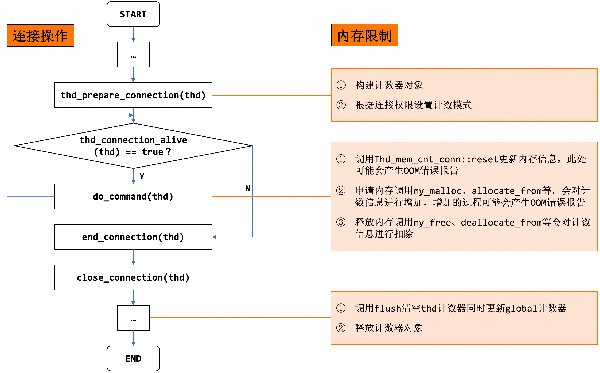

`...
if (thd_prepare_connection(thd))
 handler_manager->inc_aborted_connects();
else {
 while (thd_connection_alive(thd)) {
 if (do_command(thd)) break;
 }
 end_connection(thd);
}
close_connection(thd, 0, false, false);
...
`

#### 4.2.2 关键函数

计数器的构建、销毁、计数信息的加减更新等操作在3.1中做了说明，此处针对内存申请时添加计数器的处理逻辑进行说明。

在connection建立和query执行的过程涉及的内存基本通过my_malloc（结构数据、sort buffer等）和allocate_from（临时表）这两个接口进行，对应的释放函数为my_free和deallocate_from。两种内存申请方式中对于计数器的处理是相同的逻辑，这里以my_malloc/my_free为例对其中涉及的计数器操作逻辑做进一步说明。

**my_malloc**

my_malloc中主要做了两件事：

* 构建内存块头部，其中保存了size、magic、psi_memory_key等信息
* 调用PSI_thread_service_v5服务中的pfs_memory_alloc_vc接口对key进行赋值，实际的计数器更新就在这个接口中进行。

`void *my_malloc(PSI_memory_key key, size_t size, myf flags) {
 // malloc出一块包含header信息的内存块
 my_memory_header *mh;
 size_t raw_size;
 raw_size = PSI_HEADER_SIZE + size;
 mh = (my_memory_header *)my_raw_malloc(raw_size, flags);

 // 对header数据结构初始化，调用pfs_memory_alloc_vc对head->key进行赋值
 if (likely(mh != nullptr)) {
 void *user_ptr;
 mh->m_magic = PSI_MEMORY_MAGIC;
 mh->m_size = size;
 // 调用服务
 mh->m_key = PSI_MEMORY_CALL(memory_alloc)(key, raw_size, &mh->m_owner);
 user_ptr = HEADER_TO_USER(mh);
 MEM_MALLOCLIKE_BLOCK(user_ptr, size, 0, (flags & MY_ZEROFILL));
 return user_ptr;
 }
 return nullptr;
}
`
**pfs_memory_alloc_vc**

这个函数是计数数据增加的入口，主要工作如下：

* 根据key找到对应的PFS_memory_class
* 获取PFS_thread，在启用了计数器的情况下，对统计数据进行更新。PFS_memory_key类型只要执行了注册memory_class逻辑（register_memory_class），就会启用计数器对象。
* 返回key值，若启用计数器，此时的key值是经过PSI_MEM_CNT_BIT（1 « 31）标记的。

`PSI_memory_key pfs_memory_alloc_vc(PSI_memory_key key, size_t size,
 PSI_thread **owner) {
 // 获取key对应的PFS_memory_class
 PSI_memory_key result_key = key;
 ...
 PFS_memory_class *klass = find_memory_class(key);

 // 启动thread监控维度、非全局监控模式
 if (flag_thread_instrumentation && !klass->is_global()) {
 PFS_thread *pfs_thread = my_thread_get_THR_PFS();
 // 判断是否启用计数器，在PFS_memory_class初始化阶段
 if (klass->has_memory_cnt()) {
 if (pfs_thread->m_cnt_thd != nullptr && pfs_thread->mem_cnt_alloc(size))
 // 标志位，标记key是否经过计数器的处理
 result_key |= PSI_MEM_CNT_BIT;
 }
 // 统计信息更新
 ...
 *owner_thread = pfs_thread;
 } else {
 // 统计信息更新
 ...
 *owner_thread = nullptr;
 }
 return result_key;
}
`
**my_free && pfs_memory_free_vc**

和上述的两个函数功能相反，my_free中首先调用pfs_memory_free_vc对key进行释放，包括了计数器的信息的扣除更新等，然后对包含header在内的整块内存区域进行释放。

 **问：那些内存会被计数器进行统计呢？**

 答：在psi_memory_key.cc中，新特性引入的PSI_FLAG_MEM_COLLECT标志位，对all_server_memory数组中需要进行限制的内存打上了标签。

### 4.3 简单测试

#### 4.3.1 测试准备

* 创建普通用户RDS_test
* 构建大数据记录
* 设置较小的connection_memory_limit

`create user RDS_test identified by 'RDS_test';
grant select on test.* to RDS_test;

use test;
create table t(id int primary key, c longtext);
insert t values (1, lpad('RDS', 6000000, 'test'));

set global connection_memory_limit=1024 * 1024 * 2;
set connection_memory_limit=1024 * 1024 * 2;
`
#### 4.3.2 测试

* 普通用户执行

```
# $mysql -uRDS_test -h127.0.0.1 -P3017 -p
MySQL [test]> show variables like "connection_memory_limit";
+-------------------------+---------+
| Variable_name | Value |
+-------------------------+---------+
| connection_memory_limit | 2097152 |
+-------------------------+---------+

MySQL [test]> select count(c) from t group by c;
ERROR 4082 (HY000): Connection closed. Connection memory limit 2097152 bytes exceeded. Consumed 7079568 bytes.

```

* SUPER用户执行

```
MySQL [test]> show variables like "connection_memory_limit";
+-------------------------+---------+
| Variable_name | Value |
+-------------------------+---------+
| connection_memory_limit | 2097152 |
+-------------------------+---------+

MySQL [test]> select count(c) from t group by c;
+----------+
| count(c) |
+----------+
| 1 |
+----------+

```

#### 4.3.3 测试结果

引入了这个功能后，对普通用户的内存使用被限制，直接被kill，但super用户还是不受限制的。

### 4.4 小结

* 对于SUPER用户和普通用户，内存限制有差别，前者不做限制。
* connection_memory_chunk_size的引入能够控制全局计数器的更新频率，减少锁的争用，但在该变量值设置的较大的情况下，容易提前报告OOM错误导致connection被kill。
* 计数器数据操作中session和global数据减少是分离的，global数据的更新总是滞后于session，这同样也可以减少锁的争用，但存在单个do_command操作多次的alloc_cnt和free_cnt导致提前报告OOM错误的可能性（只执行free_cnt，但没有其他session做reset操作）。
* OOM仍旧有可能在connnecion操作中产生，my_malloc/allocate_from阶段提前映射很小部分的物理内存，也可能刚好触发OOM。此外，super用户的操作没有做内存限制，可能也会引发OOM。
* 内存统计和限制操作依赖于PFS_thread，计数器数据的更新首先通过该对象传递。

## 五、总结展望

MySQL/InnoDB在内存的分配、使用、管理上做了很多工作和优化，各模块单独抽离出来也是一套内存分配管理系统，其设计方式和使用策略都有值得学习的地方。

不难发现，在InnoDB中内存实际上还是基本可控的，因为大多数的内存都由指定的size进行控制，额外产生的内存也能粗略的推断出。在MySQL服务工作工程中，特别是在sql层，还有许多无法准确估量的内存损耗，如果没有很好地对其进行控制，可能就会引发OOM。官方引入的connection/global的内存使用限制对这个情况进行了优化，降低了实例发生OOM的风险，但与此同时，OOM的问题还无法完全避免，有待进一步优化。

sql层中其它内存的使用如net_buffer、join_buffer、sort_buffer等也会在运行中占据不小内存，同时在Server启动的阶段也会产生许多临时性的内存如recovery、初始化等所需的内存等等，相关的内容会在后续的文章中介绍。

## 参考

1. https://dev.mysql.com/doc/refman/8.0/en/innodb-architecture.html
2. https://dev.mysql.com/doc/refman/8.0/en/innodb-buffer-pool.html
3. http://mysql.taobao.org/monthly/2021/01/06/
4. https://www.leviathan.vip/2018/12/18/InnoDB%E7%9A%84BufferPool%E5%88%86%E6%9E%90/
5. https://juejin.cn/post/7109811386091307039
6. https://juejin.cn/post/6882298660965580814
7. https://juejin.cn/post/6974389300884570149
8. https://dev.mysql.com/doc/refman/8.0/en/innodb-change-buffer.html
9. 《MySQL内核：InnoDB存储引擎 》Chapter 11
10. https://juejin.cn/post/6892659139794157575
11. https://dev.mysql.com/doc/refman/8.0/en/innodb-adaptive-hash.html
12. https://dev.mysql.com/doc/refman/8.0/en/innodb-redo-log-buffer.html
13. https://dev.mysql.com/doc/refman/8.0/en/memory-use.html
14. https://segmentfault.com/a/1190000041506588

 阅读： - 

[](http://creativecommons.org/licenses/by-nc-sa/3.0/)
本作品采用[知识共享署名-非商业性使用-相同方式共享 3.0 未本地化版本许可协议](http://creativecommons.org/licenses/by-nc-sa/3.0/)进行许可。

 [

 ](#0)