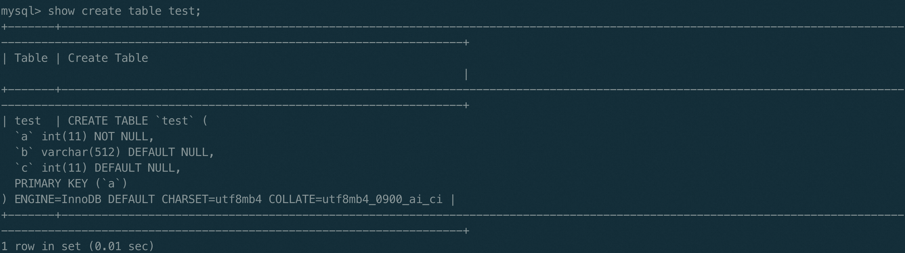
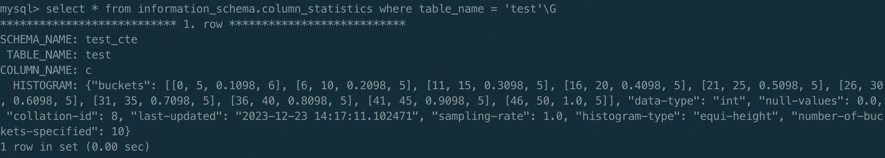
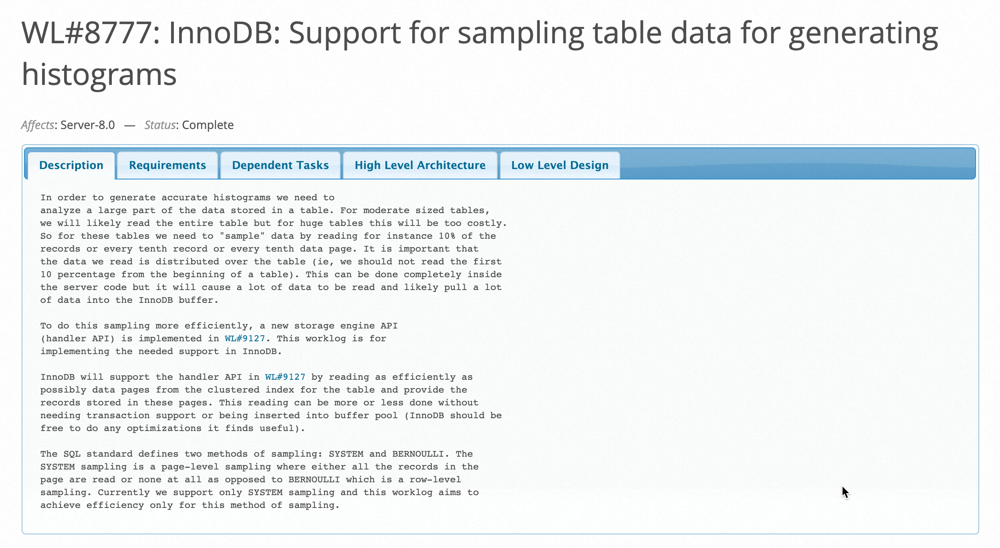

# MySQL 深潜 - 直方图采样优化

**Date:** 2024/01
**Source:** http://mysql.taobao.org/monthly/2024/01/03/
**Images:** 4 images downloaded

---

数据库内核月报

 [
 # 数据库内核月报 － 2024 / 01
 ](/monthly/2024/01)

 * 当期文章

 PolarDB子查询改写系列（三）子查询折叠
* MySQL 权限管理
* MySQL 深潜 - 直方图采样优化

 ## MySQL 深潜 - 直方图采样优化 
 Author: 原宇 

 之前有篇文章《[MySQL 深潜 - 统计信息采集](http://mysql.taobao.org/monthly/2022/10/05/)》介绍过MySQL索引统计信息的采样过程，这篇文章主要关注的是索引统计信息cardinality的采集以及计算过程，优化器对该统计信息的使用需要满足索引前缀的规则，通俗地讲就是查询中的条件需要满足部分或全部匹配某个索引上的索引列，而且必须是自左向右的匹配顺序，这也就意味着只有索引列才能利用上该统计信息。

## 直方图介绍
对于非索引列或者无法使用索引统计信息的列，MySQL是通过直方图来采集统计信息的。

### 直方图使用方式
直方图是MySQL 8.0版本的一个新特性，通过统计采样列的值的频率来得出该列的数据分布情况，这有助于优化器评估一个字段的选择率，从而选择更优的执行计划。
MySQL目前只支持等高直方图，可以理解成会将指定列的值划分到多个区间，每个区间内值的总频率是一样的。
直方图的使用方式比较简单，示例如下所示。

假设有一张表test，通过如下SQL为表test的c列创建直方图。
analyze table test update histogram on c with 10 buckets;
如果不指定buckets数量，默认是创建100个bucket，每个bucket代表一个数据分布区间。
创建好的直方图可以通过information_schema中的视图来查看。

可以看到，test表的c列值被划分到10个buckets，每个buckets中包含4个值，分别表示这个区间的左边界、右边界、区间中值的累计出现频率以及区间中不同值的个数。

## 直方图采样方式
前面基于用户角度简单介绍了直方图的使用方式，本文主要介绍MySQL官方直方图采样方式的变化。

### 8.0.19版本以前的采样方式
无论是索引统计信息还是直方图统计信息，都面临着同样的问题，就是需要在采样率和准确度之间做一个衡量，因为对于大表，对全表数据进行采样是非常耗时的。所以最初的直方图采样会通过概率计算的方式来随机过滤掉部分数据，既可以保证采样的数据均匀分区，又可以达到一个特定的采样率。
我们通常会将MySQL内核代码大致划分为server层和引擎层，最初这个版本的直方图采样以及数据处理都是通过server层代码来实现的，整个过程是这样的。

1. 计算采样率。因为直方图的采集过程中需要记录所有值，这些值的处理都是在内存中完成的，所以代码中是通过buffer的大小来限制采样率的，参数histogram_generation_max_mem_size表示直方图采样使用的buffer大小，采样率是由histogram_generation_max_mem_size以及用户指定的采样列共同决定的，根据用户SQL指定的采样列的总长度可以计算出buffer最大可以承载的行数，这个行数跟当前采样表的总行数的比值就是最终的采样率。
2. 读取数据。通过rnd_next接口从引擎层读取一行数据给server层。
3. 决定是否采样当前行的数据。这里是server层通过伪随机数生成算法，随机生成一个[0，1]之间的小数，如果这个随机数小于等于采样率就采样当前行中指定列的数据，将数据放入map中做统计，如果不是则丢弃当前行。
4. 继续读下一条数据，知道读完表中所有的数据。

从这个采样过程，我们可以很明显的发现，虽然采样按照给定的采样率在进行，可以保证内存使用不超出histogram_generation_max_mem_size的限制，但是表中所有数据都被访问过，对于大表来说，数据读取的开销远大于数据处理的开销，磁盘的IO并没有减少，采集的开销几乎没有什么节省。

### 8.0.19版本的采样方式
于是，官方在8.0.19版本引进了一种新的采样方式，可以让引擎层更多的参与进来，直接从引擎层过滤采样数据，避免全表扫描，参见[WL#8777](https://dev.mysql.com/worklog/task/?id=8777)。

目前只有InnoDB引擎实现了该采样方式，所以以下算法都是基于聚簇索引来实现。首先我们要知道，InnoDB的聚簇索引通常使用的是Btree，Btree索引是树状组织结构，每个节点对应着一个page，叶子节点（leaf page）保存着表中的数据，一个page中保存着一定数量的行记录，叶子节点是level 0，非叶子节点保存的是索引记录，level大于0，根节点的level取决于树的高度（height-1）。
算法思想：

1. 扫描所有level 1的page，按照采样比率，随机挑选要采样的leaf page，其它的leaf page直接跳过。
2. 避免扫描所有的leaf page，但会扫描所有level 1的page中的所有记录。
3. 采样最小单位是page。
4. 依赖WL#11720引入的并行扫描框架，利用并行扫描框架，自顶向下将聚簇索引的level 1的page划分成多个range，然后创建worker线程来扫描所有的range。

新的采样算法只是利用[WL#11720](https://dev.mysql.com/worklog/task/?id=11720)引入的并行扫描框架来分片以及遍历level 1的page，这个不是本文的重点，后面可以单独写一个文章来介绍这个框架。
[WL#8777](https://dev.mysql.com/worklog/task/?id=8777)引入的采样方式依旧是分为三个阶段：

1. 初始化阶段，传入采样率到引擎层，初始化使用并行扫描框架所需的结构，并绑定回调函数（这个回调函数是用来决定扫描page的过程中每个记录该如何处理），利用并行扫描框架将level 1的page划分成多个扫描区间（每个区间通过指向区间起始的两个page的cursor来遍历），然后创建一个worker线程来扫描每个区间。这里WL#8777做了一个小的改动，之前主线程会等待worker线程执行结束才会返回，现在增加了worker的异步处理逻辑，主线程启动worker后可以立即返回，这样采样的主线程可以回到server层处理worker线程采样到的数据。
2. 数据处理阶段，worker线程会顺序遍历level 1所有的page，由于level 1的page中每条记录可以索引到一个leaf page，worker线程读取到level 1的page中的一条记录后，会调用回调函数，回调函数中处理这条记录的方式是，根据伪随机数生成算法产生一个随机数（跟旧的采样方式中生成随机数的方法一样），来跟采样率比较决定是否采样当前记录对应的leaf page中的数据，如果不需要就跳过，不需要将leaf page读取到buffer pool，如果需要的话，就会顺序遍历整个leaf page，每读取一条记录，就会交给主线程来处理，由于主线程和worker线程只使用了一个buffer（record[0]）来传递数据，这里又引入了两个信号量，来实现线程间的同步。整个过程是worker线程读取一条数据到buffer中，等待主线程处理，主线程处理完（主线程处理数据的方式跟原来一样）会通知worker线程继续读区下一条记录，此时主线程会等待worker线程读取数据到buffer中。这里worker线程和主线程通过一个共享的变量来处理异常，保证任意一方执行遇到非预期的错误，另一方可以正常退出。
3. 结束阶段，主线程会等待worker线程执行结束，然后销毁之前创建的一些结构，返回结果给客户端。

可以看到，整个过程中虽然使用了并行扫描的框架，但是实际上只有一个worker线程在扫描数据，我理解目前的实现是可以最大程度上复用现有代码的，主线程的处理流程没有变化，同样是调用引擎的接口来获取一条数据然后处理，引擎内部的行为发生了变化，但是改动也不算多，并行扫描的使用只需要增加一个回调函数，然后多了一个生产者-消费者的处理关系。

## 总结
[WL#8777](https://dev.mysql.com/worklog/task/?id=8777)这个优化的效果还是很明显的，毕竟原来无论采样率是多少都需要做全表扫描，现在可以减少很多leaf page的扫描。但是经过测试可以发现，对一张大表（TPCH 100G的lineitem表）创建直方图，在采样率低的时候，性能提升十分显著，采样率比较高的时候，性能反而不如原先的采样方式，这里的性能瓶颈在于主线程和worker线程之间相互等待的开销，采样数据越多这个开销相对整体开销的占比越高，所以才会有采样率越高性能越差的现象。不过通常使用直方图时采样率不会很高，所以整体来说是有优化的。
还有一个点比较有趣，之前采样过滤数据的粒度是行记录，现在的采样过滤数据的粒度是page，这一定程度上会导致样本的随机性变差，但是现在采样效率变高，可以通过增加采样率来弥补这一不足。
从代码中可以看到很多可以优化的点：

1. 批量处理数据，减少等待时间。初步的优化可以通过双buffer来处理，worker线程不用等待主线程处理完才去继续采集，进一步优化可以通过环形缓冲区来处理。
2. 采样并行化，多个worker来扫描并各自处理数据。

 阅读： - 

本作品采用[知识共享署名-非商业性使用-相同方式共享 3.0 未本地化版本许可协议](http://creativecommons.org/licenses/by-nc-sa/3.0/)进行许可。

 