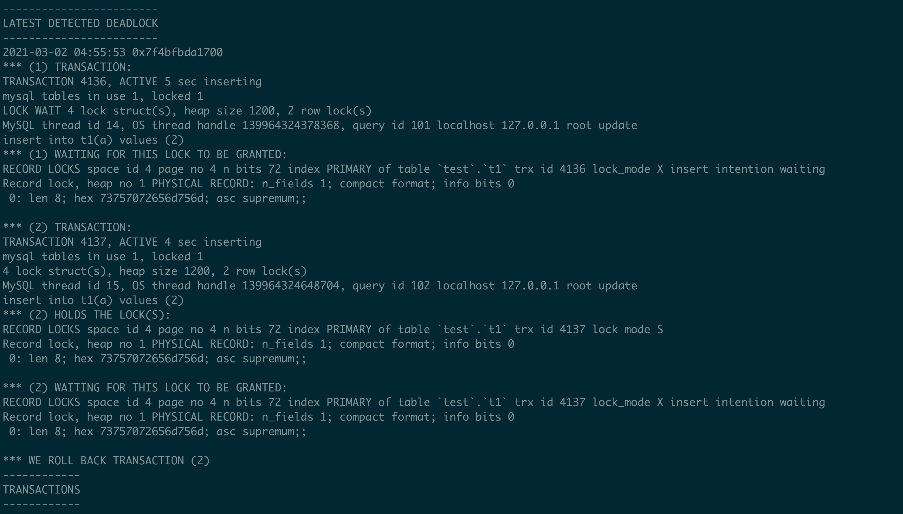
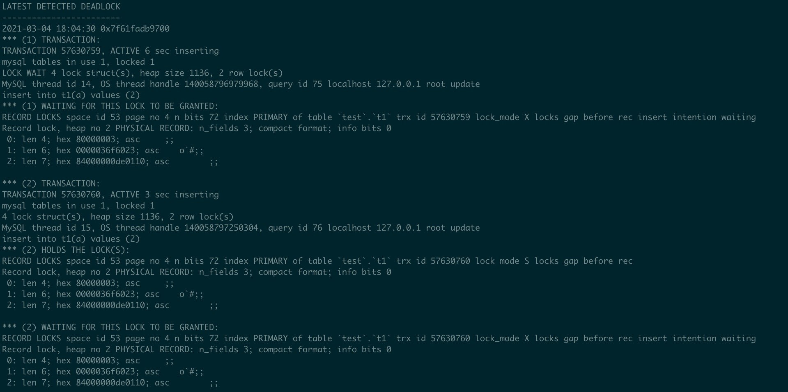
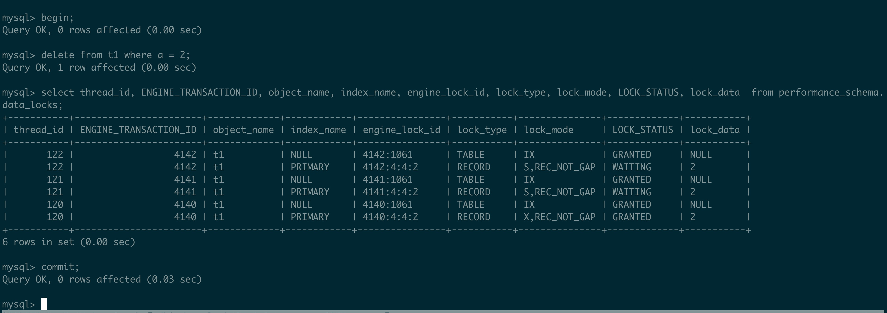
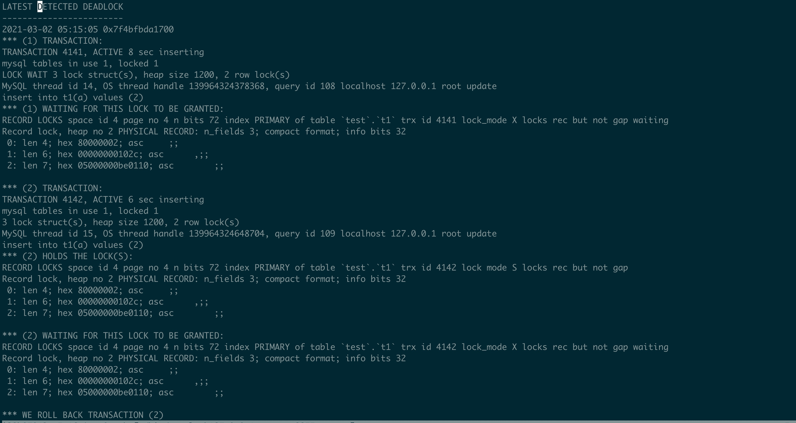

# MySQL · 死锁场景 · 并发插入相同主键场景

**Date:** 2024/03
**Source:** http://mysql.taobao.org/monthly/2024/03/01/
**Images:** 8 images downloaded

---

数据库内核月报

 [
 # 数据库内核月报 － 2024 / 03
 ](/monthly/2024/03)

 * 当期文章

 MySQL · 死锁场景 · 并发插入相同主键场景
* MySQL · 源码分析 · MySQL deadlock cause by lock inherit
* PolarDB 单实例多租户模式介绍

 ## MySQL · 死锁场景 · 并发插入相同主键场景 
 Author: baotiao 

 在之前的[文章](https://baotiao.github.io/2023/06/11/innodb-replace-into.html)介绍了由于二级索引 unique key 导致的 deadlock, 其实主键也是 unique 的, 那么同样其实主键的 unique key check 一样会导致死锁.

主键 unique 的判断在

row_ins_clust_index_entry_low

这里有一个判断

if (!index->allow_duplicates && n_uniq &&
 (cursor->up_match >= n_uniq || cursor->low_match >= n_uniq))

这里判断的意思是:

如果当前 index 是 unique index, (cursor->up_match >= n_uniq || cursor->low_match >= n_uniq) cursor 找到和插入的 record 一样的 record 了. 那么就需要走 row_ins_duplicate_error_in_clust. 对于普通的INSERT操作, 当需要检查primary key unique时, 加 S record lock. 而对于Replace into 或者 INSERT ON DUPLICATE操作, 则加X record lock

否则就是当前index 没有插入过这个 record, 也就是第一次 insert primary key, 那么就不需要走 duplicate check 的逻辑. 也就不需要加锁了.

**例子 1**

`create table t1 (a int primary key);

# 然后有三个不 session:

session1: begin; insert into t1(a) values (2);

session2: insert into t1(a) values (2);

session3: insert into t1(a) values (2);

session1: rollback;

`

**rollback 之前:**

这个时候 session2/session3 会wait 在这里2 等待s record lock, 因为session1 执行delete 时候会执行row_update_for_mysql => lock_clust_rec_modify_check_and_lock

这里会给要修改的record 加x record lock

insert 的时候其实也给record 加 x record lock, 只不过大部分时候先加implicit lock, 等真正有冲突的时候触发隐式锁的转换才会加上x lock

问题1: 这里为什么granted lock 里面 record 2 上面有x record lock 和 s record lock?

在session1 执行 rollback 以后, session2/session3 获得了s record lock, 在insert commit 时候发现死锁, rollback 其中一个事务, 另外一个提交, 死锁信息如下

这里看到 trx1 想要 x insert intention lock.

但是trx2 持有s next-key lock 和 trx1 x insert intention lock 冲突.

同时trx 也在等待 x insert intention lock, 这里从上面的持有Lock 可以看到 肯定在等待trx1 s next-key lock

问题: 等待的时候是 S gap lock, 但是死锁的时候发现是 S next-key lock. 什么时候进行的升级?

这里问题的原因是这个 table 里面只有record 2, 所以这里认真看, 死锁的时候是等待在 supremum 上的, 因为supremum 的特殊性, supremum 没有gap lock, 只有 next-key lock

0: len 8; hex 73757072656d756d: asc supremum; // 这个是等在supremum 记录

在 2 后面插入一个 3 以后, 就可以看到在record 3 上面是有s gap lock 并不是next-key lock, 如下图:

那么这个 gap lock 是哪来的?

这里gap lock 是在 record 3 上的. 这个record 3 的s lock 从哪里来? session2/3 等待在record 2 上的s record lock 又到哪里去了?

这几涉及到锁升级, 锁升级主要有两种场景

1. insert record, 被next-record 那边继承锁. 具体代码 lock_update_insert
2. delete record(注意这里不是delete mark, 必须是purge 的物理delete), 需要将该record 上面的lock, 赠给next record上, 具体代码 lock_update_delete

 并且由于delete 的时候, 将该record 删除, 如果有等待在该record 上面的record lock, 也需要迁移到next-key 上, 比如这个例子wait 在record 2 上面的 s record lock

 另外对于wait 在被删除的record 上的trx, 则通过 lock_rec_reset_and_release_wait(block, heap_no); 将这些trx 唤醒

 具体看 InnoDB Trx lock

总结:

2 个trx trx2/trx3 都等待在primary key 上, 锁被另外一个 trx1 持有. trx1 回滚以后, trx2 和 trx3 同时持有了该 record 的 s lock, 通过锁升级又升级成下一个 record 的 GAP lock. 然后两个 trx 同时插入的时候都需要获得insert_intention lock(LOCK_X | LOCK_GAP | LOCK_INSERT_INTENTION); 就变成都想持有insert_intention lock, 被卡在对方持有 GAP S lock 上了.

**例子 2**

`mysql> select * from t1;
+---+
| a |
+---+
| 2 |
| 3 |
+---+
`

然后有三个不同 session:

`session1: begin; delete from t1 where a = 2;

session2: insert into t1(a) values (2);

session3: insert into t1(a) values (2);

session1: commit;
`

**commit之前**

这个时候session2/3 都在等待s record 2 lock, 等待时间是 [`innodb_lock_wait_timeout`](https://dev.mysql.com/doc/refman/5.7/en/innodb-parameters.html#sysvar_innodb_lock_wait_timeout),

**commit 之后**

在session1 执行 commit 以后, session2/session3 获得到正在waiting的 s record lock, 在commit 的时候, 发现死锁, rollback 其中一个事务, 另外一个提交, 死锁信息如下

trx1 等待x record lock, trx2 持有s record lock(这个是在session1 commit, session2/3 都获得了s record lock)

不过这样发现和上面例子不一样的地方, 这里的record 都lock 在record 2 上, 而不是record 3, 这是为什么?

本质原因是这里的delete 操作是 delete mark, 并没有从 btree 上物理删除该record, 因此还可以保留事务的lock 在record 2 上, 如果进行了物理删除操作, 那么这些record lock 都有迁移到next record 了

问题: 这里insert 操作为什么不是 insert intention lock?

比如如果是sk insert 操作就是 insert intention lock. 而这里是 s record lock?

这里delete record 2 以后, 由于record 是 delete mark, 记录还在, 因此insert 的时候会将delete mark record改成要写入的这个record(这里不是可选择优化, 而是btree 唯一性, 必须这么做). 因此插入就变成 row_ins_clust_index_entry_by_modify

所以不是insert 操作, 因此就没有 insert intention lock.

而sk insert 的时候是不允许将delete mark record 复用的, 因为delete mark record 可能会被别的readview 读取到.

通过GDB + call srv_debug_loop() 可以让GDB 将进程停留在 session1 提交, 但是session2/3 还没有进入死锁之前, 这个时候查询performance_schema 可以看到session2/3 获得了record 10 s lock. 这个lock 怎么获得的呢?

这个和上述的例子一样, 这里因为等的比较久了, 所以发生了purge, 因为record 2 被物理删除了. 因此发生了锁升级, record 2 上面的record 会转给next-record, 这里next-record 是10,

总结:

和上一个例子基本类似.

2 个trx trx2/trx3 都等待在primary key 上的唯一性检查上, 锁被另外一个 trx1 持有. trx1 commit 以后, trx2 和 trx3 同时持有了该 record 的 s record lock, 然后由于 delete mark record 的存在, insert 操作变成 modify 操作, 因此就变成都想持有X record lock, 被卡在对方持有 S recordlock 上了.

 阅读： - 

本作品采用[知识共享署名-非商业性使用-相同方式共享 3.0 未本地化版本许可协议](http://creativecommons.org/licenses/by-nc-sa/3.0/)进行许可。

 