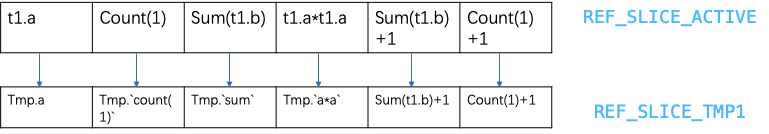
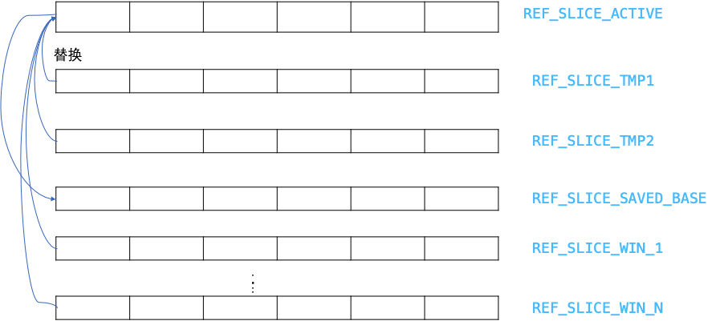

# Mysql None-SPJ算子执行流程

**Date:** 2024/09
**Source:** http://mysql.taobao.org/monthly/2024/09/03/
**Images:** 4 images downloaded

---

数据库内核月报

 [
 # 数据库内核月报 － 2024 / 09
 ](/monthly/2024/09)

 * 当期文章

 PostgreSQL 事件触发器 tag 原理简析
* MySQL 单表大数据量下的 B-tree 高度问题
* Mysql None-SPJ算子执行流程
* MySQL Index-Merge代价估算原理

 ## Mysql None-SPJ算子执行流程 
 Author: 陈江 

 # 背景
作者在polardb下一个版本开发中修复了大量带groupby+rollup集合结果不正确的bug， 顺带抽象总结一下None SPJ算子执行流程，不理解思想的话，单纯通过代码逆向反推逻辑会耗费大量精力，希望本篇文章对于入坑mysql同学有帮助。代码基于版本是mysql 8.4.2。
先抛出一个问题，我们查看一个常见groupby+order by sql执行计划时，是什么？为什么一定要加一张临时表？

`CREATE TABLE t1 (a INT, b INT);
INSERT INTO t1 (a, b) VALUES (1,1), (1,2), (1,3);
INSERT INTO t1 SELECT a + 1, b FROM t1;

mysql> desc format=tree SELECT a*a, sum(b)+1, count(1)+1 as cnt FROM t1 GROUP BY a ORDER BY cnt DESC;
+----------------------------------------------------------------------------------------------------------------------------------------------------+
| EXPLAIN |
+----------------------------------------------------------------------------------------------------------------------------------------------------+
| -> Sort: cnt DESC
 -> Table scan on <temporary>
 -> Aggregate using temporary table
 -> Table scan on t1 (cost=0.85 rows=6)
 |
+----------------------------------------------------------------------------------------------------------------------------------------------------+
`

# 关系代数算子执行顺序
1. FROM, including JOINs
2. WHERE
3. GROUP BY + ROLLUP
4. HAVING
5. WINDOW functions
6. DISTINCT
7. ORDER BY
8. LIMIT and OFFSET
9. Projection

我们复习一下关系代数，上游算子执行结果作为下游算子输入，执行完下游算子再继续传递输出给下下游算子，可以简单理解为多个阶段执行
关键none-spj算子在mysql执行方式介绍

* GROUP BY实现方式
 
 filesort算子 + （Agg算子）AggregateIterator
先对输入进行排序，顺序scan到不同排序key值可以发现是否是新分组，同步的更新聚合函数value，值得注意的是聚合函数的值存放在group buffer中，没有跟server中的TABLE对象进行映射。
* tmptable grouping，对应算子TemptableAggregateIterator
使用临时表进行聚合，为groupby建立索引列，每读上一行数据，groupby列作为KEY值在索引中查找，如能找到更新聚合函数值到临时表中，聚合函数值是存放在临时表中的，这个过程中是会写磁盘/内存 文件的。

 Groupby+ROLLUP，因为带有rollup，rollup实现的特点是groupby列排好序，读上一个新行，很容易判断跟上一行有哪几列不一样，然后进行rollup，所以这个算子在mysql中只能选择filesort+AGG方式执行，逻辑也在AggregateIterator
 HAVING：就是filter，比较简单，不在讨论范畴内
 WINDOW：需要上游算子保证输出数据流在一张表里面，每个window算子自己会把结果写到一张临时表，输出绑定到Table对象上，算子复杂暂不讨论。
 DISTINCT
 * 物化表+ deduplication实现，把上一算子结果物化到临时表的时候，加上去重逻辑，思路也是将可见列建立唯一二级索引，写临时表失败代表tuple重复了
* filesort+ deduplication, 排好序后去重读结果

 ORDER BY
采用filesort算子，外排，多个chunk排好序后，两两做merge sort. 在mysql实现中构造filesort需要传递Tables，要求它的上游算子输出的tuple必须是跟TABLE对象绑定好的。
 `Filesort(THD *thd, Mem_root_array<TABLE *> tables, bool keep_buffers,
 ORDER *order, ha_rows limit_arg, bool remove_duplicates,
 bool force_sort_rowids, bool unwrap_rollup);
` 
 比较奇葩的是在8.018版本中构造filesort传递的是单Table对象，需要上游算子保证输出数据流在一张表里面。在8.018里面一个简单的join+sort会额外转临时表一次

 `mysql> desc format=tree select * from t1,t2 order by a;
+---------------------------------------------------------------------------------------------------------------------------------------------------------------------------------------------------------------------------------------------+
| EXPLAIN |
+---------------------------------------------------------------------------------------------------------------------------------------------------------------------------------------------------------------------------------------------+
| -> Sort: <temporary>.a
 -> Stream results
 -> Inner hash join (no condition) (cost=0.80 rows=2)
 -> Table scan on t1 (cost=0.45 rows=2)
 -> Hash
 -> Table scan on t2 (cost=0.35 rows=1)
` 
 8.4.2 Hyper优化器中没这问题， 但旧优化器社区基本没重构，仍是原版本行为

 `set optimizer_switch='hypergraph_optimizer=on';
mysql> desc format=tree select * from t1,t2 order by t1.a,t2.a;
+-------------------------------------------------------------------------------------------------------------------------------------------------------------------------------------------------------------------------+
| EXPLAIN |
+-------------------------------------------------------------------------------------------------------------------------------------------------------------------------------------------------------------------------+
| -> Sort: t1.a, t2.a (cost=10.3..10.3 rows=18)
 -> Nested loop inner join (cost=0.0556..1 rows=18)
 -> Table scan on t2 (cost=0.0833..0.25 rows=3)
 -> Table scan on t1 (cost=0.0417..0.25 rows=6)
` 

# 为什么需要临时表？
mysql有两种场景需要临时表

* 用临时表来实现算子，如GB, distinct, derived table, cte，集合操作
临时表可以帮实现一些算子，比如groupby，distinct，建立唯一键约束，达到去重的效果，临时表可以写磁盘，突破内存容量的限制。
* 作为桥接算子，单纯因为mysql实现方式
因为mysql上述算子自身的限制，当算子对于上游输出有要求后，上游又不能满足要求会增加streaming/materialize算子作为桥接[1]。
注[1]：mysql streaming算子是流式的，不会中断pipeline。作用是把上游算子输出拷贝临时表自定义字段上，作为下游算子输入, 参考StreamingIterator::Read

所以举个常见的Groupby+sort的例子，假定GB使用filesort+AGG实现，算子树就是

`FileSort 
 |->Agg //到这实现了Groupby
 |->Filesort
 |->Scan table
`
因为Filesort必须绑定table限制，以及Agg算子输出没有绑定table对象[2]，它们需要一张临时表做下转换。这个时候会在AGG算子上添加streaming算子，转成临时表，这样就满足了filesort对输入数据要求。如果filesort上游算子本身就提供了临时表，是不需要添加额外的桥接算子的， 如window + sort，window自身提供tmptable，sort就不再需要额外临时表。

[2]):参考AggregateIterator::Read, 聚合函数的结果是写到单独的group buff中，不在扫描的table record0中

`mysql> desc format=tree select c, count(1) as cnt from t2 force index(idx_c) group by c order by cnt ;
+----------------------------------------------------------------------------------------------------------------------------------------------------------------------------------------------+
| EXPLAIN |
+----------------------------------------------------------------------------------------------------------------------------------------------------------------------------------------------+
| -> Sort: cnt
 -> Stream results (cost=1.6 rows=1.73) //添加streaming算子，新加的临时表
 -> Group aggregate: count(1) (cost=1.6 rows=1.73)
 -> Covering index scan on t2 using idx_c (cost=1.3 rows=3) //索引提供了order序，就不用filesort了
`

# 桥接算子介绍
上面我们介绍了None-SPJ所有算子的执行方式，这章我们介绍一下桥接算子

## 功能
用于将上一算子输出绑定到Table对象上，供下游算子使用，表象是写到一张新临时表里

## 包含具体算子
### stream算子
代码StreamingIterator，具体实现就是一表达式求值写入新tuple buff

* 创建一张临时表
* 基于上一算子输出列，构建拷贝任务，求值写入到临时表的列
* 流式的读上游一行，填充临时表一行，传递给下游算子用
 ### materialize算子
 代码MaterializeIterator，跟stream差不多，不过它的临时表数据需要落盘，不是流式的。
比如后面的filesort需要blob列进行排序，桥接算子会变成materialize

# 优化阶段
跟none-spj执行流程关系不大，我们只是记录一下前置内存状态。我们拿如下sql调试举例

`mysql> desc format=tree SELECT a*a, sum(b)+1, count(1)+1 as cnt FROM t1
 -> GROUP BY a ORDER BY cnt DESC;
+----------------------------------------------------------------------------------------------------------------------------------------------------+
| EXPLAIN |
+----------------------------------------------------------------------------------------------------------------------------------------------------+
| -> Sort: cnt DESC
 -> Table scan on <temporary>
 -> Aggregate using temporary table
 -> Table scan on t1 (cost=0.85 rows=6)
`
经过optimize groupby/optimize order后，queryblocks的fields及base_ref_items内存状态是这样的

gdb打印fields每个item对象， orderby， groupby的item是二级指针，指向base_ref_items的槽位。当前base_ref_items存放的fields就是初始slice0

``--$m1 (Query_block *) 0x7fdf0817f398 tables: ($n0)t1 t1 <-
(gdb) p $m1->fields
$11 = mem_root_deque<Item*> = {$o0 = (Item *) 0x7fdf081897d0, $o1 = (Item *) 0x7fdf08180760, $o2 = (Item *) 0x7fdf08180118, $o3 = (Item *) 0x7fdf0817f928, $o4 = (Item *) 0x7fdf081803f0, $o5 = (Item *) 0x7fdf08180990}
(gdb) my e $o0
$p0 (Item_field *) 0x7fdf081897d0 field = t1.a
(gdb) my e $o1
$q0 (Item_sum_count *) 0x7fdf08180760
`--$q1 (Item_int *) 0x7fdf081805d8 value = 1
(gdb) my e $o2
$r0 (Item_sum_sum *) 0x7fdf08180118
`--$r1 (Item_field *) 0x7fdf081887a0 field = t1.b
(gdb) my e $o3
$s0 (Item_func_mul *) 0x7fdf0817f928
|--$s1 (Item_field *) 0x7fdf081884b0 field = t1.a
`--$s2 (Item_field *) 0x7fdf08188620 field = t1.a
(gdb) my e $o4
$t0 (Item_func_plus *) 0x7fdf081803f0
|--$t1 (Item_aggregate_ref *) 0x7fdf0818ac48 field =
| `--$t2 (Item_sum_sum *) 0x7fdf08180118
| `--$t3 (Item_field *) 0x7fdf081887a0 field = t1.b
`--$t4 (Item_int *) 0x7fdf08180328 value = 1
(gdb) my e $o5
$u0 (Item_func_plus *) 0x7fdf08180990
|--$u1 (Item_aggregate_ref *) 0x7fdf0818ad68 field =
| `--$u2 (Item_sum_count *) 0x7fdf08180760
| `--$u3 (Item_int *) 0x7fdf081805d8 value = 1
`--$u4 (Item_int *) 0x7fdf081808c8 value = 1

//groupby
(gdb) my e $v1->group_list.first->item
$x0 (Item_field *) 0x7fdf081897d0 field = t1.a
//orderby
(gdb) my e * $v1->order_list.first->item
$y0 (Item_func_plus *) 0x7fdf08180990
|--$y1 (Item_aggregate_ref *) 0x7fdf0818ad68 field =
| `--$y2 (Item_sum_count *) 0x7fdf08180760
| `--$y3 (Item_int *) 0x7fdf081805d8 value = 1
`--$y4 (Item_int *) 0x7fdf081808c8 value = 1
`

# 生成预执行数据结构
## 添加新临时表思想
因为filesort算子对于输入数据的要求(绑定table对象）及streaming AGG算子输出数据的限制（聚合值没绑定到Table上），我们视情况添加临时表进行桥接。BTW，mysql原生的make_tmp_tables_info代码逻辑乱的令人发指，完全背离低耦合，高内聚编程思想，想要逆向推导作者设计思想非常难，完全是一坨屎山代码。

* ApplyGroupBy:
 
 如果输入流满足group by列要求的order，比如扫描索引了，这个时候直接Apply AGG算子完成GroupBY，直接AGG就是最优的
* 如果不满足
 
 其实可以添加filesort + AGG实现，这其实是当前的hyper优化器路径。
* 当前生产版本会使用tmp table grouping方式完成GB，对应代码算子是TemptableAggregateIterator，集合函数结果都存放在临时表内，需要生成新临时表

 ApplyHaving: 在上一stage结果上添加filter算子，执行过滤
 pre-ApplyWindow算子：如果有window算子
如果当前输入流是streamingAgg这种没绑定table对象tuples，需要添加stream算子，会创建新的临时表。如果是tmp table grouping，输入已经绑定到了临时表上就不需要。
 * 没有blob列（!need_rowid) 创建streaming算子
* 否则：创建Materialize算子，会创建新临时表，上一stage结果物化下来

 ApplyWindows: 每个win窗口函数会创建一个新临时表，如果window算子参数是blob_field，每次结果都要物化保存下来。
 ApplyDistinct: 也是filesort + deduplication思路，如果前序流输出没绑定到table对象，则
需要额外的streaming临时表，否则不需要。例如前序算子是window，filesort可以直接使用windows算子的临时表
 ApplyOrderBy: filesort算子，如果前序流输出没绑定到table对象，则
需要额外的streaming临时表，否则不需要。例如前面算子有streaming group&没有window算子 ，会创建额外streaming用的临时表。 如果有windows算子，filesort可以直接用windows算子的临时表

## 对比成熟商业数据库
这种桥接算子越少越好，mysql目前最多添加1-2张额外临时表，会带来如下消耗

* 额外增加了一层虚函数调用
* streaming算子还算轻量，额外增加一次内存拷贝操作
* materialize算子比较重，会物化临时表，写盘
特意找了些bad case， 原生的优化器对于None-SPJ算子执行选择远不是最优
 `mysql> desc format=tree select distinct sum(b) from t2 group by a with rollup having count(1)+1 > 10;
+-------------------------------------------------------------------------------------------------------------------------------------------------------------------------------------------------------------------------------------------------------------------------------------------------------------------------------------------------------------------------------------------------------------------------------------------------------------------------------------------------------------------------------------+
| EXPLAIN |
+-------------------------------------------------------------------------------------------------------------------------------------------------------------------------------------------------------------------------------------------------------------------------------------------------------------------------------------------------------------------------------------------------------------------------------------------------------------------------------------------------------------------------------------+
| -> Table scan on <temporary> (cost=5..5 rows=0)
 -> Temporary table with deduplication (cost=2.5..2.5 rows=0) #物化去重实现distinct
 -> Table scan on <temporary> (cost=2.5..2.5 rows=0)
 -> Temporary table (cost=0..0 rows=0) #桥接物化，绑定到Table对象上
 -> Filter: ((rollup_sum_switcher(count(1)) + 1) > 10)
 -> Group aggregate with rollup: count(1), sum(t2.b) (cost=0.85 rows=2.73)
 -> Sort: a (cost=0.55 rows=3)
 -> Table scan on t2 (cost=0.55 rows=3)
` 
 对比之下hyper：添加streaming算子，避免物化写盘，实际执行效率也是优于原生

 `mysql> set optimizer_switch='hypergraph_optimizer=on';
Query OK, 0 rows affected, 1 warning (0.00 sec)
mysql> desc select distinct sum(b) from t2 group by a with rollup having count(1)+1 > 10;
+---------------------------------------------------------------------------------------------------------------------------------------------------------------------------------------------------------------------------------------------------------------------------------------------------------------------------------------------------------------------------------------------+
| EXPLAIN |
+---------------------------------------------------------------------------------------------------------------------------------------------------------------------------------------------------------------------------------------------------------------------------------------------------------------------------------------------------------------------------------------------+
| -> Sort with duplicate removal: `sum(b)` (cost=2.24..2.24 rows=1.65)#filesort实现distinct
 -> Stream results (cost=0.576..1.57 rows=2.73) #streaming桥接，绑定到Table对象上
 -> Filter: ((rollup_sum_switcher(count(1)) + 1) > 10) (cost=0.576..1.57 rows=2.73)
 -> Group aggregate with rollup: count(1), sum(t2.b) (cost=0.476..1.3 rows=2.73)
 -> Index scan on t2 using idx_a (cost=0.333..1 rows=3)
` 
 理想的执行plan，只需一次去重物化实现distinct，魔改mysql是可以做到

 `+-------------------------------------------------------------------------------------------------------------------------------------------------------------------------------------------------------------------------------------------------------------------------------------------------------------------------------------------------------------------------------------------------------------------------------------------------------------------------------------------------------------------------------------+
| EXPLAIN |
+-------------------------------------------------------------------------------------------------------------------------------------------------------------------------------------------------------------------------------------------------------------------------------------------------------------------------------------------------------------------------------------------------------------------------------------------------------------------------------------------------------------------------------------+
| -> Table scan on <temporary> (cost=5..5 rows=0)
 -> Temporary table with deduplication (cost=2.5..2.5 rows=0) #物化去重实现distinct，groupbuff中的聚合结果直接物化
 -> Filter: ((rollup_sum_switcher(count(1)) + 1) > 10)
 -> Group aggregate with rollup: count(1), sum(t2.b) (cost=0.85 rows=2.73)
 -> Index scan on t2 using idx_a (cost=0.333..1 rows=3)
`

# 创建临时表及slice
示例SQL groupby算子选择了tmptable grouping，orderby算子物理实现是filesort。 tmptable grouping会额外创建一张临时表，每张临时表代表一个新stage，会额外新申请一个slice,存放该阶段的fields，例子中是REF_SLICE_TMP1(第一张临时表) slice存放的item都是临时表的fields以及上一stage没计算的算子。
例子中REF_SLICE_TMP1 内存状态如下图：（Tmp是临时表）

REF_SLICE_ACTIVE永远指向base_ref_items数组，当前就是上面GDB打印的fields. REF_SLICE_TMP1 slice是从上一stage构建而来的。这一张临时表会完成聚合函数运算，存储t1.a, count(1), sum(t1.b), t1.a*t1.a到临时表
构建REF_SLICE_TMP1遵循如下规则

* Item_field, Item_sum, 不含聚合函数的Item_func都能完成计算，在临时表Tmp有field存着，会推入REF_SLICE_TMP1 slice.使用临时表的field代替。
 
 这些item从slice_active写到临时表tuple buff（mysql中的record0) 是通过Temp_table_param.items_to_copy实现，可以简单理解为一次内存拷贝

 包含聚合函数的Item_func在groupby算子没计算的，原样写入REF_SLICE_TMP1 slice
 新建的Table对象会记录slice_no， 这样groupby算子做完，切换到tmptable记录的slice_no，后续算子使用新stage中的表达式。例子里的order by stage直接使用REF_SLICE_TMP1 slice中的表达式就好了。

每新生成一个临时表就是一个新stage，join算子是stage0，也就是初始的fields，一开始就会暂存到 REF_SLICE_SAVED_BASE。 none-SPJ算子会构建多张临时表，所以stage构建出下图：

* 构建时
 
 上图按TMP1->TMP2->WIN_1 …->WIN_N顺序构建slice，每个新slice都是以上一个slice为模板构建，slice的临时表Temp_table_param.items_to_copy会记录这种求值-写入目标关系。

 执行时候
 * 先切到saved_base slice，记录的是初始的fields。比如groupby的item是指向active slice槽位的二级指针，就能读到基表的列值。
* 运算到None SPJ算子，先将输入slice_no对应的items替换掉Active， 因为Item_ref引用的永远都是Active slice里面的槽位，替换了才能保证Item_ref读到上一stage的输出，才能正确求值
* 运算当前None SPJ算子， 执行完切换到当前临时表的slice_no，将临时表的slice写回active slice。 后续算子就能读到这个stage的输出了

 tmptable打上标记
 * OT_AGGREGATE_INTO_TMP_TABLE： groupby的temptable grouping执行方式
* OT_AGGREGATE_THEN_MATERIALIZE： groupby的AGG+ streaming/materialize执行方式，输入流肯定是能保证GB需要的order的
* OT_WINDOWING_FUNCTION：window算子+物化算子，算子执行物化下来
* OT_MATERIALIZE：物化算子，上stage表达式求值写到临时表tuple buff，物化下来

# 生成执行器
在JOIN::create_root_access_path_for_join中

1. 先生成spj的AccessPath, 主要是各种tablescan+join
2. 生成none-spj AccessPath，遍历每张临时表的QEP_TAB，看标记类型
 * OT_AGGREGATE_INTO_TMP_TABLE->生成TEMPTABLE_AGGREGATE AccessPath->生成TemptableAggregateIterator
* OT_AGGREGATE_THEN_MATERIALIZE： AGG+Streaming/Materialize算子

 * AGG：->生成AGGREGATE AccessPath->生成AggregateIterator
* Streaming或者Materialize, 如果后面的filesort有blob排序列或后面有distinct算子，或没有filesort，使用Streaming算子，否则使用Materialize算子.
* Streaming->生成STREAM AccessPath->生成StreamingIterator
* Materialize->生成MATERIALIZE AccessPath->生成MaterializeIterator
 * OT_MATERIALIZE：物化算子，上面介绍过了

# 执行阶段
上面生成新slice也介绍了怎么把上一stage数据写入当前临时表tuple buff，以及写完切slice，作为下一stage的读取，下一stage就能看到正确的表达式了。下面我们结合例子看下调试信息
TemptableAggregateIterator：输入slice是saved，也就是原始的fields，输出slice是1

## TemptableAggregateIterator::Init， 大致逻辑:
* 从底层算子读上一条数据，调用copy_field，上一slice的Item_field数据拷贝到临时表对应的field，groupby算子可以准备求值了。
* groupby每列算子求值，得到检索值，在tmptable按索引查找
 
 如找到：旧组，更新聚合值，写回tmptable中
* 未找到：新组，调用copy_funcs，会求值Item_fields&Item_func并写入tmp table的field，带上聚合函数初始值写入tmptable中
 `(gdb) p *param->items_to_copy
$205 = Func_ptr_array = {$ih0 = (Func_ptr) {m_func = 0x7fdef80c6028, m_result_field = 0x7fdef80cc130, m_result_item = 0x0, m_func_bits = 33}, $ih1 = (Func_ptr) {m_func = 0x7fdef80c9028, m_result_field = 0x7fdef80cbe68, m_result_item = 0x0, m_func_bits = 289}}
(gdb) my e $ih0.m_func
$ii0 (Item_func_mul *) 0x7fdef80c6028
|--$ii1 (Item_field *) 0x7fdef80c7d08 field = t1.a
`--$ii2 (Item_field *) 0x7fdef80c7e78 field = t1.a
(gdb) my e $ih0.m_result_field
$ik0 (Field_longlong *) 0x7fdef80cc130 field = <temporary>.a*a // a*a 写入 tmp."a*a" 中
(gdb) my e $ih1.m_func
$il0 (Item_field *) 0x7fdef80c9028 field = t1.a
(gdb) my e $ih1.m_result_field
$ij0 (Field_long *) 0x7fdef80cbe68 field = <temporary>.a // t1.a 写入 tmp.a 中
`

## TemptableAggregateIterator::Read
因为是火山模型，从临时表读一条数据，并切换到当前slice，未执行的表达式可以准备求值了

`int TemptableAggregateIterator<Profiler>::Read() {
 /*
 Enable the items which one should use if one wants to evaluate
 anything (e.g. functions in WHERE, HAVING) involving columns of this
 table.
 */
 if (m_join != nullptr && m_ref_slice != -1) {
 if (!m_join->ref_items[m_ref_slice].is_null()) {
 m_join->set_ref_item_slice(m_ref_slice);
 }
 }
 int err = m_table_iterator->Read();
}

(gdb) p m_join->current_ref_item_slice
$210 = 1 //当前slice=1
(gdb) my e m_join->ref_items[m_ref_slice].m_array[1]
$jc0 (Item_func_plus *) 0x7fdef80c6af0 //可以看到这个未求值expr变为<temporary>.`sum(t1.b)`+1
|--$jc1 (Item_aggregate_ref *) 0x7fdef80ca6c8 field =
| `--$jc2 (Item_field *) 0x7fdef80ccd08 field = <temporary>.sum(t1.b)
`--$jc3 (Item_int *) 0x7fdef80c6a28 value = 1
(gdb) my e m_join->ref_items[m_ref_slice].m_array[2] //可以看到这个未求值expr变为<temporary>.`count(1)`+1
$jd0 (Item_func_plus *) 0x7fdef80c7090
|--$jd1 (Item_aggregate_ref *) 0x7fdef80ca7e8 field =
| `--$jd2 (Item_field *) 0x7fdef80ccb98 field = <temporary>.count(1)
`--$jd3 (Item_int *) 0x7fdef80c6fc8 value = 1
执行到filesort算子时，可以cnt表达式的值了
$jm0 (Item_func_plus *) 0x7fdef80c7090
|--$jm1 (Item_aggregate_ref *) 0x7fdef80ca7e8 field =
| `--$jm2 (Item_field *) 0x7fdef80ccb98 field = <temporary>.count(1)
`--$jm3 (Item_int *) 0x7fdef80c6fc8 value = 1
(gdb) p item->val_int()
$215 = 4
(gdb) f
#0 (anonymous namespace)::make_sortkey_from_item (item=0x7fdef80c7090, result_type=INT_RESULT, dst_length=std::optional<unsigned long> = {...}, tmp_buffer=0x7fdef80cd088, to=0x7fdef80d0d80 '\217' <repeats 200 times>...,
 to_end=0x7fdef80d8d80 "\217\217\217\217\217\217\217\217\021\210", maybe_null=0x7fdfe45f0347, hash=0x7fdfe45f0348) at /home/jacob.cj/mysql-bld/sql/filesort.cc:1314
`

# groupby using filesort+agg
受限于本文篇幅，就不再展开介绍了，读者可以根据提供的sql自行调试，mysql GB+rollup一定是流式聚集的，保序才能Rollup

`mysql> desc format=tree SELECT a*a, sum(b)+1, count(1)+1 as cnt FROM t1 GROUP BY a with rollup ORDER BY cnt DESC;

| -> Sort: cnt DESC
 -> Stream results (cost=1.45 rows=3.45)
 -> Group aggregate with rollup: count(1), sum(t1.b) (cost=1.45 rows=3.45)
 -> Sort: a (cost=0.85 rows=6)
 -> Table scan on t1 (cost=0.85 rows=6)
`

# 总结
本文聚集于None-SPJ算子执行流程，涉及到JOIN::optimize里面辅助结构构建，Iterator构建，以及算子具体实现。覆盖的代码非常多，模块之间耦合度非常大，需要通盘整体看下来，只看部分模块逻辑非常容易困惑，只见数据不见森林。了解整体思想后，非常有助于源码理解。PolarDB-mysql对于这些复杂算子也是支持多阶段并行的，能大大加速查询，欢迎使用。

 阅读： - 

本作品采用[知识共享署名-非商业性使用-相同方式共享 3.0 未本地化版本许可协议](http://creativecommons.org/licenses/by-nc-sa/3.0/)进行许可。

 